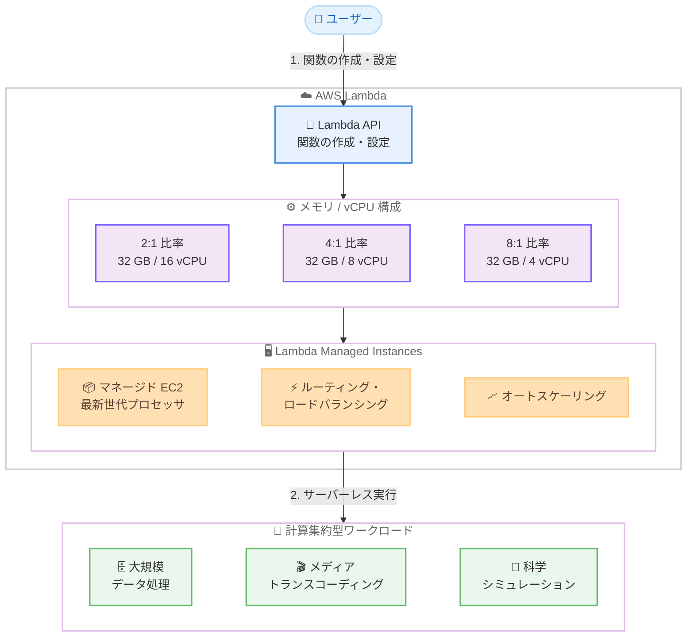

# AWS Lambda - Managed Instances で最大 32 GB メモリと 16 vCPU をサポート

**リリース日**: 2026 年 3 月 27 日
**サービス**: AWS Lambda
**機能**: Lambda Managed Instances の最大 32 GB メモリ / 16 vCPU サポート

📊 [このアップデートのインフォグラフィックを見る](https://takech9203.github.io/aws-news-summary/20260327-lambda-32-gb-memory-16-vcpus.html)

## 概要

AWS Lambda が、Lambda Managed Instances 上で動作する関数に対して、最大 32 GB のメモリと 16 vCPU のサポートを開始しました。これにより、大規模データ処理、メディアトランスコーディング、科学シミュレーションなどの計算集約型ワークロードを、インフラストラクチャを管理することなく Lambda 上で実行できるようになります。

Lambda Managed Instances は、マネージドな Amazon EC2 インスタンス上で Lambda 関数を実行するサービスで、ルーティング、ロードバランシング、オートスケーリングが組み込まれています。最新世代のプロセッサや高帯域幅ネットワーキングを含む特殊なコンピューティング構成にアクセスでき、運用上のオーバーヘッドは発生しません。さらに、メモリと vCPU の比率を 2:1、4:1、8:1 から選択して構成でき、ワークロードのリソースプロファイルに最適な設定が可能です。

**アップデート前の課題**

- Lambda の関数実行環境は最大 10 GB のメモリと約 6 vCPU に制限されていた
- 計算集約型ワークロードでは Lambda のリソース上限が不十分であり、EC2 や ECS などの別サービスへの移行が必要だった
- メモリと vCPU の比率を柔軟に調整できず、ワークロードに最適なリソース構成を選択できなかった

**アップデート後の改善**

- 最大 32 GB のメモリと 16 vCPU が利用可能になり、従来の約 3.2 倍のメモリと約 2.7 倍の vCPU を使用できるようになった
- メモリと vCPU の比率を 2:1、4:1、8:1 から選択できるようになり、ワークロード特性に応じた最適な構成が可能になった
- サーバーレスの運用モデルを維持しながら、計算集約型ワークロードを Lambda 上で処理できるようになった

## アーキテクチャ図



Lambda Managed Instances では、マネージドな EC2 インスタンス上で Lambda 関数が実行されます。ユーザーはメモリと vCPU の比率を 3 種類から選択でき、最大 32 GB / 16 vCPU の構成で計算集約型ワークロードをサーバーレスに処理できます。

## サービスアップデートの詳細

### 主要機能

1. **メモリ上限の拡張**
   - 従来の最大 10 GB から 32 GB に拡張された
   - 大規模データセットのインメモリ処理や、メモリ集約型のワークロードに対応可能
   - 約 3.2 倍のメモリ容量により、これまで Lambda では処理が困難だったワークロードも実行可能に

2. **vCPU 上限の拡張**
   - 従来の約 6 vCPU から最大 16 vCPU に拡張された
   - マルチスレッド処理やパラレルコンピューティングの性能が大幅に向上
   - CPU バウンドなワークロードの処理時間を短縮

3. **メモリ対 vCPU 比率の構成**
   - 2:1、4:1、8:1 の 3 つの比率から選択可能
   - 2:1 比率: CPU 集約型ワークロード向け (例: 32 GB メモリ / 16 vCPU)
   - 4:1 比率: バランス型ワークロード向け (例: 32 GB メモリ / 8 vCPU)
   - 8:1 比率: メモリ集約型ワークロード向け (例: 32 GB メモリ / 4 vCPU)

4. **Lambda Managed Instances の統合機能**
   - ルーティング、ロードバランシング、オートスケーリングが組み込まれている
   - 最新世代プロセッサと高帯域幅ネットワーキングを利用可能
   - インフラストラクチャ管理が不要なサーバーレスモデルを維持

## 技術仕様

### リソース上限の比較

| 項目 | 従来の Lambda | Lambda Managed Instances |
|------|--------------|------------------------|
| 最大メモリ | 10 GB | 32 GB |
| 最大 vCPU | 約 6 vCPU | 16 vCPU |
| メモリ / vCPU 比率 | 固定 | 2:1、4:1、8:1 から選択可能 |
| 実行環境 | Lambda 標準 | マネージド EC2 インスタンス |
| オートスケーリング | 組み込み | 組み込み |
| ネットワーク | 標準 | 高帯域幅 |

### メモリ対 vCPU 比率の構成例

| 比率 | メモリ | vCPU | 推奨ワークロード |
|------|--------|------|-----------------|
| 2:1 | 32 GB | 16 vCPU | CPU 集約型の並列処理 |
| 2:1 | 16 GB | 8 vCPU | 中規模 CPU 集約型処理 |
| 4:1 | 32 GB | 8 vCPU | バランス型処理 |
| 8:1 | 32 GB | 4 vCPU | メモリ集約型処理 |

### API 設定

Lambda 関数のメモリサイズと vCPU 比率を設定する例です。

```json
{
  "FunctionName": "my-compute-intensive-function",
  "Runtime": "python3.12",
  "MemorySize": 32768,
  "Architectures": ["x86_64"],
  "ComputeConfig": {
    "MemoryToVcpuRatio": "2:1"
  }
}
```

## 設定方法

### 前提条件

1. AWS アカウントで Lambda Managed Instances が利用可能なリージョンを使用している
2. Lambda 関数の作成・更新に必要な IAM 権限が付与されている
3. AWS CLI v2 が最新バージョンにアップデートされている

### 手順

#### ステップ 1: Lambda 関数の作成

```bash
# 32 GB メモリ、2:1 比率で Lambda 関数を作成
aws lambda create-function \
  --function-name my-compute-function \
  --runtime python3.12 \
  --role arn:aws:iam::123456789012:role/lambda-execution-role \
  --handler app.handler \
  --zip-file fileb://function.zip \
  --memory-size 32768 \
  --timeout 900
```

Lambda 関数を最大 32 GB (32768 MB) のメモリで作成します。Managed Instances 上で実行される場合、設定したメモリサイズに応じた vCPU が割り当てられます。

#### ステップ 2: メモリと vCPU 比率の構成

```bash
# メモリ対 vCPU 比率を設定
aws lambda update-function-configuration \
  --function-name my-compute-function \
  --memory-size 32768 \
  --compute-config '{"MemoryToVcpuRatio": "2:1"}'
```

メモリ対 vCPU 比率を指定して関数の構成を更新します。2:1 比率の場合、32 GB メモリに対して 16 vCPU が割り当てられます。

#### ステップ 3: 関数の設定確認

```bash
# 関数の設定を確認
aws lambda get-function-configuration \
  --function-name my-compute-function \
  --query '{MemorySize: MemorySize, ComputeConfig: ComputeConfig}'
```

関数の設定を確認し、メモリサイズと vCPU 比率が正しく構成されていることを検証します。

## メリット

### ビジネス面

- **インフラ管理コストの削減**: 計算集約型ワークロードを EC2 や ECS から Lambda に移行することで、インフラストラクチャの管理・運用コストを削減できる
- **スケーラビリティの向上**: サーバーレスの自動スケーリングにより、需要の変動に応じて自動的にリソースが調整され、過剰プロビジョニングのコストを削減できる
- **市場投入時間の短縮**: インフラストラクチャの構築・管理にかかる時間を削減し、アプリケーション開発に集中できる

### 技術面

- **リソース柔軟性の向上**: 3 種類のメモリ対 vCPU 比率により、ワークロードの特性に最適なリソース構成を選択できる
- **高性能コンピューティング**: 最新世代プロセッサと高帯域幅ネットワーキングにより、従来の Lambda 環境を超える処理性能を実現できる
- **運用の簡素化**: ルーティング、ロードバランシング、オートスケーリングが自動化されており、運用の複雑さが大幅に軽減される

## デメリット・制約事項

### 制限事項

- Lambda Managed Instances が一般提供されているリージョンでのみ利用可能であり、すべての AWS リージョンでは利用できない可能性がある
- 32 GB メモリ / 16 vCPU の構成はすべてのワークロードに適しているわけではなく、過剰なリソース割り当てはコスト増加につながる
- 従来の Lambda 関数と Lambda Managed Instances では料金体系が異なる可能性があるため、コスト比較が必要

### 考慮すべき点

- メモリ対 vCPU 比率の選択がパフォーマンスとコストに大きく影響するため、ワークロードのプロファイリングを事前に実施することが推奨される
- Lambda の最大タイムアウト (15 分) は変更されていないため、長時間実行が必要なワークロードには引き続き制約がある
- 既存の Lambda 関数を Managed Instances に移行する場合、動作検証とパフォーマンステストが必要

## ユースケース

### ユースケース 1: 大規模データ処理パイプライン

**シナリオ**: 数十 GB のデータファイルを Lambda 関数内でインメモリ処理し、ETL パイプラインの一部として変換・集約を行いたい。

**実装例**:
```python
import pandas as pd

def handler(event, context):
    # 32 GB メモリを活用して大規模データセットをインメモリ処理
    df = pd.read_parquet(f"s3://{event['bucket']}/{event['key']}")

    # 複数の vCPU を活用した並列処理
    result = df.groupby('category').agg({
        'amount': ['sum', 'mean', 'count'],
        'timestamp': ['min', 'max']
    })

    result.to_parquet(f"s3://{event['output_bucket']}/processed/{event['key']}")
    return {'status': 'completed', 'records': len(df)}
```

**効果**: 従来は 10 GB メモリの制限によりデータを分割して処理する必要があったが、32 GB メモリにより一括処理が可能になり、パイプラインの複雑さとレイテンシが大幅に削減される。

### ユースケース 2: メディアトランスコーディング

**シナリオ**: 高解像度動画ファイルのトランスコーディングを、サーバーレスアーキテクチャで処理したい。

**実装例**:
```python
import subprocess

def handler(event, context):
    input_path = f"/tmp/{event['input_file']}"
    output_path = f"/tmp/{event['output_file']}"

    # 16 vCPU を活用した FFmpeg による並列トランスコーディング
    subprocess.run([
        'ffmpeg', '-i', input_path,
        '-threads', '16',
        '-c:v', 'libx264', '-preset', 'fast',
        '-c:a', 'aac',
        output_path
    ], check=True)

    return {'status': 'transcoded', 'output': output_path}
```

**効果**: 16 vCPU のマルチスレッド処理により、トランスコーディング時間が大幅に短縮される。EC2 インスタンスの管理が不要で、需要に応じた自動スケーリングが可能。

### ユースケース 3: 科学シミュレーションとモンテカルロ法

**シナリオ**: 金融リスク分析やモンテカルロシミュレーションを、サーバーレスでバースト的に実行したい。

**実装例**:
```python
import numpy as np
from concurrent.futures import ProcessPoolExecutor

def run_simulation(params):
    np.random.seed(params['seed'])
    # モンテカルロシミュレーションの実行
    simulations = np.random.normal(
        params['mean'], params['std'], params['num_paths']
    )
    return np.percentile(simulations, [1, 5, 50, 95, 99])

def handler(event, context):
    params_list = event['simulation_params']

    # 16 vCPU を活用した並列シミュレーション実行
    with ProcessPoolExecutor(max_workers=16) as executor:
        results = list(executor.map(run_simulation, params_list))

    return {'results': [r.tolist() for r in results]}
```

**効果**: 16 vCPU による並列実行で、数千回のシミュレーションを短時間で処理可能。バースト的な計算需要に対してサーバーレスの柔軟なスケーリングが活用でき、アイドル時のコストが発生しない。

## 料金

Lambda Managed Instances の料金は、割り当てたメモリサイズと実行時間に基づいて課金されます。メモリサイズの増加に伴いコストも増加するため、ワークロードに適したリソース構成を選択することが重要です。

詳細については [AWS Lambda 料金ページ](https://aws.amazon.com/lambda/pricing/) を参照してください。

### 料金例

| 構成 | 月額料金 (概算) |
|------|-----------------|
| 32 GB / 16 vCPU、月 100 万リクエスト、平均 60 秒 | 公式料金ページを参照 |
| 16 GB / 8 vCPU、月 100 万リクエスト、平均 30 秒 | 公式料金ページを参照 |

## 利用可能リージョン

Lambda Managed Instances が一般提供されているすべての AWS リージョンで利用可能です。詳細なリージョンリストは [AWS リージョンとサービス](https://aws.amazon.com/about-aws/global-infrastructure/regional-product-services/) を参照してください。

## 関連サービス・機能

- **Lambda Managed Instances**: マネージドな EC2 インスタンス上で Lambda 関数を実行するサービスで、今回のメモリ / vCPU 拡張の基盤となる機能
- **Amazon EC2**: Lambda Managed Instances の基盤として使用されるコンピューティングサービス。より高度なカスタマイズが必要な場合は EC2 の直接利用を検討
- **AWS Step Functions**: 複数の Lambda 関数をオーケストレーションし、大規模な処理パイプラインを構築するためのサービス

## 参考リンク

- 📊 [インフォグラフィック](https://takech9203.github.io/aws-news-summary/20260327-lambda-32-gb-memory-16-vcpus.html)
- [公式発表 (What's New)](https://aws.amazon.com/about-aws/whats-new/2026/03/lambda-32-gb-memory-16-vcpus/)
- [ドキュメント - AWS Lambda 設定](https://docs.aws.amazon.com/lambda/latest/dg/configuration-function-common.html)
- [AWS Lambda 料金ページ](https://aws.amazon.com/lambda/pricing/)

## まとめ

AWS Lambda Managed Instances の最大 32 GB メモリ / 16 vCPU サポートは、サーバーレスコンピューティングの適用範囲を大幅に拡大するアップデートです。メモリ対 vCPU 比率の柔軟な構成により、大規模データ処理、メディアトランスコーディング、科学シミュレーションなどの計算集約型ワークロードを、インフラストラクチャ管理なしで Lambda 上で実行できるようになります。従来 EC2 や ECS で実行していた計算集約型ワークロードを Lambda に移行することで、運用の簡素化とコスト最適化を実現できるか検討することを推奨します。
