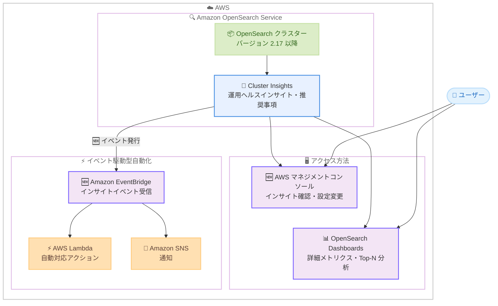

# Amazon OpenSearch Service - Cluster Insights の AWS マネジメントコンソールおよび Amazon EventBridge 対応

**リリース日**: 2026 年 3 月 30 日
**サービス**: Amazon OpenSearch Service
**機能**: Cluster Insights の AWS マネジメントコンソールアクセスおよび Amazon EventBridge イベント連携

📊 [このアップデートのインフォグラフィックを見る](https://takech9203.github.io/aws-news-summary/20260330-access-cluster-insights-opensearch.html)

## 概要

Amazon OpenSearch Service の Cluster Insights が、AWS マネジメントコンソールから直接アクセス可能になりました。これまで OpenSearch Dashboards UI でのみ利用可能だった Cluster Insights が、AWS マネジメントコンソール上でもパフォーマンスやレジリエンスに関する推奨事項を確認し、必要な設定変更を同一コンソール内で実行できるようになりました。さらに、Cluster Insights が Amazon EventBridge にイベントを発行する機能も追加され、インサイトの自動監視やアクション実行が可能になりました。

Cluster Insights は、クラスターの運用ヘルスに関するキュレーションされたインサイトと、問題がクラスターの安定性やパフォーマンスに影響を与える前に予防するためのアクション可能な推奨事項を提供する機能です。OpenSearch バージョン 2.17 以降で追加コストなしに利用できます。

**アップデート前の課題**

- Cluster Insights を確認するには OpenSearch Dashboards UI にアクセスする必要があり、AWS マネジメントコンソールとの間で画面の切り替えが発生していた
- インサイトに基づく設定変更を行う際、OpenSearch Dashboards で推奨事項を確認した後、別途 AWS マネジメントコンソールや API で設定を変更する必要があった
- Cluster Insights の通知を自動的に検知して対応するためのイベント駆動型ワークフローを構築できなかった

**アップデート後の改善**

- AWS マネジメントコンソール上で Cluster Insights の確認と設定変更をワンストップで実行可能になった
- Amazon EventBridge との統合により、インサイトの発生をトリガーとした自動化ワークフローを構築可能になった
- OpenSearch Dashboards UI では引き続きインデックス・シャードレベルのメトリクスや Top-N クエリ分析などの詳細情報を確認可能

## アーキテクチャ図



Cluster Insights のインサイトが AWS マネジメントコンソールと Amazon EventBridge の両方からアクセス可能になり、運用監視と自動化の選択肢が広がりました。

## サービスアップデートの詳細

### 主要機能

1. **AWS マネジメントコンソールでの Cluster Insights アクセス**
   - OpenSearch Service コンソール上で直接 Cluster Insights を確認可能
   - パフォーマンスおよびレジリエンスに関する推奨事項を表示
   - 推奨された設定変更を同一コンソール内で即座に実行可能
   - OpenSearch Dashboards UI への切り替えが不要

2. **Amazon EventBridge イベント連携**
   - Cluster Insights が検出したインサイトを Amazon EventBridge にイベントとして発行
   - EventBridge ルールを使用してインサイトに基づく自動化ワークフローを構築可能
   - Lambda 関数や SNS 通知などと連携した自動対応が可能

3. **新規 API の追加**
   - `ListInsights`: クラスターのインサイト一覧を取得する API
   - `DescribeInsightDetails`: 特定のインサイトの詳細情報を取得する API

### Cluster Insights が提供するインサイトの種類

| インサイトタイプ | 説明 |
|-----------------|------|
| EVENT | クラスターで発生したイベントに関するインサイト |
| RECOMMENDATION | クラスター設定に関する推奨事項 |

### インサイトの優先度

| 優先度 | 説明 |
|--------|------|
| CRITICAL | クラスターの安定性に即座に影響する可能性がある |
| HIGH | 早急な対応が推奨される |
| MEDIUM | 計画的な対応が推奨される |
| LOW | 改善の余地がある |

## 技術仕様

### API 変更履歴

| 日付 | サービス | 変更内容 |
|------|----------|----------|
| 2026/03/30 | [Amazon OpenSearch Service](https://awsapichanges.com/archive/changes/99ac86-es.html) | 2 new methods - Cluster Insights API を OpenSearch Service SDK に追加 |

### 新規 API: ListInsights

```python
client.list_insights(
    Entity={
        'Type': 'Account' | 'DomainName',
        'Value': 'string'
    },
    TimeRange={
        'From': 123,
        'To': 123
    },
    SortOrder='ASC' | 'DESC',
    MaxResults=123,
    NextToken='string'
)
```

**レスポンス:**

```json
{
    "Insights": [
        {
            "InsightId": "string",
            "DisplayName": "string",
            "Type": "EVENT | RECOMMENDATION",
            "Priority": "CRITICAL | HIGH | MEDIUM | LOW",
            "Status": "ACTIVE | RESOLVED | DISMISSED",
            "CreationTime": "datetime",
            "UpdateTime": "datetime",
            "IsExperimental": true
        }
    ],
    "NextToken": "string"
}
```

### 新規 API: DescribeInsightDetails

```python
client.describe_insight_details(
    Entity={
        'Type': 'Account' | 'DomainName',
        'Value': 'string'
    },
    InsightId='string',
    ShowHtmlContent=True | False
)
```

**レスポンス:**

```json
{
    "Fields": [
        {
            "Name": "string",
            "Type": "text | metric",
            "Value": "string"
        }
    ]
}
```

### Entity パラメータ

| フィールド | 説明 |
|-----------|------|
| Type | `Account` または `DomainName` を指定。アカウントレベルまたはドメインレベルでインサイトを取得 |
| Value | アカウント ID またはドメイン名の文字列 |

## 設定方法

### 前提条件

1. OpenSearch Service ドメインが OpenSearch バージョン 2.17 以降で稼働していること
2. AWS マネジメントコンソールへの適切な IAM アクセス権限
3. EventBridge 連携を使用する場合は EventBridge のルール作成権限

### 手順

#### ステップ 1: AWS マネジメントコンソールでの Cluster Insights 確認

1. AWS マネジメントコンソールにサインイン
2. Amazon OpenSearch Service コンソールを開く
3. 対象のドメインを選択
4. Cluster Insights セクションでインサイトと推奨事項を確認
5. 必要に応じて推奨された設定変更を実行

#### ステップ 2: AWS CLI でのインサイト一覧取得

```bash
aws opensearch list-insights \
  --entity Type=DomainName,Value=my-domain \
  --time-range From=$(date -d '7 days ago' +%s),To=$(date +%s) \
  --sort-order DESC \
  --max-results 10
```

特定のドメインに対するインサイトの一覧を直近 7 日間分取得します。

#### ステップ 3: 特定のインサイトの詳細取得

```bash
aws opensearch describe-insight-details \
  --entity Type=DomainName,Value=my-domain \
  --insight-id "insight-12345"
```

特定のインサイト ID を指定して、推奨事項の詳細情報を取得します。

#### ステップ 4: EventBridge ルールの設定

```bash
aws events put-rule \
  --name "opensearch-cluster-insights" \
  --event-pattern '{
    "source": ["aws.es"],
    "detail-type": ["OpenSearch Service Cluster Insight"]
  }' \
  --state ENABLED
```

OpenSearch Service の Cluster Insights イベントを受信する EventBridge ルールを作成します。

#### ステップ 5: EventBridge ターゲットの設定

```bash
aws events put-targets \
  --rule "opensearch-cluster-insights" \
  --targets "Id"="sns-target","Arn"="arn:aws:sns:us-east-1:123456789012:opensearch-alerts"
```

インサイトイベントの通知先として SNS トピックを設定します。Lambda 関数をターゲットにすることで自動対応も可能です。

## メリット

### ビジネス面

- **運用効率の向上**: AWS マネジメントコンソール上でインサイトの確認と設定変更をワンストップで行えるため、運用チームの作業効率が向上
- **問題の早期検知**: EventBridge 連携により、クラスターの問題を自動的に検知し、ダウンタイムによるビジネス影響を最小化
- **運用コストの削減**: 自動化ワークフローにより、手動での監視・対応に要する人的コストを削減

### 技術面

- **統合的な管理体験**: AWS マネジメントコンソールから離れることなくクラスターのヘルス管理が可能
- **イベント駆動型アーキテクチャ**: EventBridge を介した自動化により、インサイトに対するリアクティブな対応を実現
- **プログラマティックアクセス**: 新規 API により、インサイト情報をアプリケーションやスクリプトから取得・活用可能
- **きめ細かなフィルタリング**: 優先度、ステータス、時間範囲によるインサイトのフィルタリングが可能

## デメリット・制約事項

### 制限事項

- OpenSearch バージョン 2.17 以降のドメインでのみ利用可能。それ以前のバージョンではアップグレードが必要
- インデックス・シャードレベルの詳細メトリクスや Top-N クエリ分析は引き続き OpenSearch Dashboards UI でのみ確認可能
- EventBridge イベントのスキーマや詳細な内容は公式ドキュメントで確認が必要

### 考慮すべき点

- EventBridge ルールやターゲットの設定には追加の IAM 権限が必要
- 大量のインサイトが発生する環境では、EventBridge ルールのフィルタリングを適切に設定し、通知のノイズを軽減する必要がある
- `IsExperimental` フラグが `true` のインサイトは実験的なものであり、本番運用の判断には慎重な評価が必要

## ユースケース

### ユースケース 1: 統合コンソールでのクラスター運用管理

**シナリオ**: インフラチームが複数の OpenSearch ドメインを管理しており、各ドメインのヘルス状態を効率的に確認したい。

**実装例**:
```bash
# アカウントレベルで全ドメインのアクティブなインサイトを取得
aws opensearch list-insights \
  --entity Type=Account,Value=123456789012 \
  --sort-order DESC \
  --max-results 20
```

**効果**: AWS マネジメントコンソールで全ドメインのインサイトを一元的に確認し、推奨事項に基づく設定変更を同一画面から実行できるため、運用効率が大幅に向上する。

### ユースケース 2: EventBridge による自動通知と対応

**シナリオ**: クリティカルな本番環境の OpenSearch クラスターで、重要度の高いインサイトが検出された際に即座にオンコールチームに通知し、可能な場合は自動修復を実行したい。

**実装例**:
```json
{
  "source": ["aws.es"],
  "detail-type": ["OpenSearch Service Cluster Insight"],
  "detail": {
    "priority": ["CRITICAL", "HIGH"]
  }
}
```

**効果**: CRITICAL および HIGH 優先度のインサイトのみをフィルタリングして通知することで、重要な問題への迅速な対応が可能になる。

### ユースケース 3: 定期的なヘルスレポートの自動生成

**シナリオ**: 毎週のクラスターヘルスレポートを自動生成し、チームに共有したい。

**実装例**:
```python
import boto3
from datetime import datetime, timedelta

client = boto3.client('opensearch')

response = client.list_insights(
    Entity={'Type': 'DomainName', 'Value': 'production-cluster'},
    TimeRange={
        'From': int((datetime.now() - timedelta(days=7)).timestamp()),
        'To': int(datetime.now().timestamp())
    },
    SortOrder='DESC'
)

for insight in response['Insights']:
    details = client.describe_insight_details(
        Entity={'Type': 'DomainName', 'Value': 'production-cluster'},
        InsightId=insight['InsightId']
    )
    # レポートに追記
```

**効果**: API を活用してインサイト情報をプログラマティックに取得し、カスタムレポートの自動生成や社内ダッシュボードとの連携が可能になる。

## 料金

Cluster Insights は追加コストなしで利用可能です。OpenSearch バージョン 2.17 以降のドメインで自動的に有効になります。

| 項目 | 料金 |
|------|------|
| Cluster Insights | 無料 |
| AWS マネジメントコンソールでのアクセス | 無料 |
| EventBridge イベント | EventBridge の標準料金が適用 |

※ EventBridge のイベント配信には EventBridge の料金が適用されます。詳細は [Amazon EventBridge の料金ページ](https://aws.amazon.com/eventbridge/pricing/)を参照してください。

## 利用可能リージョン

OpenSearch Service が提供されているすべての AWS リージョンで利用可能です。OpenSearch バージョン 2.17 以降を使用しているドメインが対象です。

## 関連サービス・機能

- **Amazon OpenSearch Service**: フルマネージドの検索・分析サービス。Cluster Insights はこのサービスの運用ヘルス監視機能
- **Amazon EventBridge**: サーバーレスイベントバスサービス。Cluster Insights のイベントを受信し、自動化ワークフローを構築可能
- **OpenSearch Dashboards**: OpenSearch の可視化・分析 UI。インデックス・シャードレベルの詳細メトリクスや Top-N クエリ分析を提供
- **Amazon CloudWatch**: AWS の監視サービス。OpenSearch Service のメトリクスやアラームと組み合わせた包括的な監視が可能

## 参考リンク

- 📊 [インフォグラフィック](https://takech9203.github.io/aws-news-summary/20260330-access-cluster-insights-opensearch.html)
- [公式発表 (What's New)](https://aws.amazon.com/about-aws/whats-new/2026/03/access-cluster-insights-opensearch/)
- [API 変更情報](https://awsapichanges.com/archive/changes/99ac86-es.html)
- [Amazon OpenSearch Service ドキュメント](https://docs.aws.amazon.com/opensearch-service/latest/developerguide/)
- [Amazon EventBridge ドキュメント](https://docs.aws.amazon.com/eventbridge/latest/userguide/)
- [OpenSearch Service 料金ページ](https://aws.amazon.com/opensearch-service/pricing/)

## まとめ

今回のアップデートにより、Amazon OpenSearch Service の Cluster Insights が AWS マネジメントコンソールから直接アクセス可能になり、さらに Amazon EventBridge へのイベント発行にも対応しました。これにより、クラスターの運用ヘルスの確認と推奨事項に基づく設定変更をワンストップで実行できるようになり、EventBridge との連携による自動化ワークフローの構築も可能になりました。加えて、新規 API として `ListInsights` と `DescribeInsightDetails` が追加され、プログラマティックなインサイト管理も実現しています。OpenSearch バージョン 2.17 以降を使用しているドメインでは追加コストなしに利用できるため、クラスターの安定運用に向けて積極的に活用することを推奨します。
