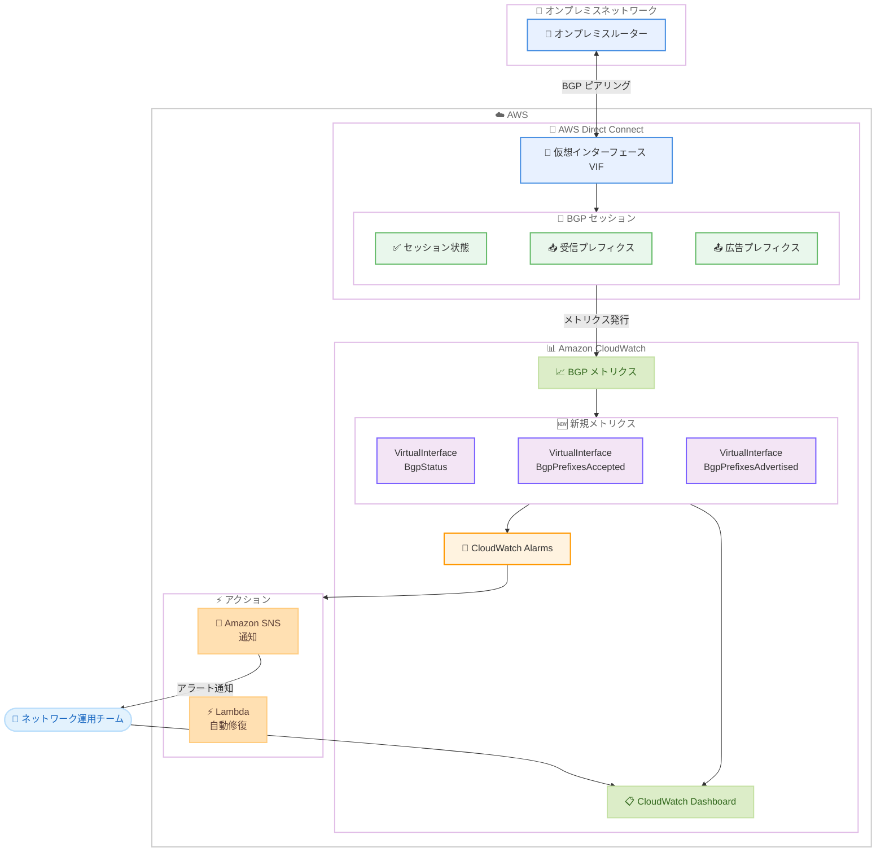

# AWS Direct Connect - CloudWatch BGP モニタリングメトリクス

**リリース日**: 2026 年 3 月 30 日
**サービス**: AWS Direct Connect
**機能**: 仮想インターフェース (VIF) 向け BGP セッションモニタリング用 CloudWatch メトリクス

📊 [このアップデートのインフォグラフィックを見る](https://takech9203.github.io/aws-news-summary/20260330-aws-direct-connect-cloudwatch-bgp-monitoring.html)

## 概要

AWS Direct Connect において、仮想インターフェース (VIF) の Border Gateway Protocol (BGP) セッションの状態とルート数を監視するための 3 つの新しい Amazon CloudWatch メトリクスが追加されました。ネットワークエンジニアや運用チームは、カスタムソリューションを構築したり API をポーリングしたりすることなく、CloudWatch でネイティブに BGP セッションを監視できるようになります。

これまで BGP セッションの監視には、カスタム Lambda 関数やオンプレミスのネットワーク管理ツールが必要でした。今回のアップデートにより、CloudWatch のアラームやダッシュボードを活用した統合的な BGP モニタリングが可能になり、ハイブリッドクラウド接続の可視性と信頼性が大幅に向上します。

**アップデート前の課題**

- BGP セッションの状態監視にはカスタム Lambda 関数の構築や AWS API のポーリングが必要だった
- オンプレミスのネットワーク管理ツールに依存した BGP モニタリングが一般的で、AWS 側の監視と統合されていなかった
- BGP プレフィクス数の変動を検知するネイティブな手段がなく、プレフィクスリミット超過による BGP セッションの idle 状態への移行を事前に検知することが困難だった
- AWS からオンプレミスに広告されるルートのサイレントな撤回 (BGP セッションは維持されたままルートが失われる状態) を検知する仕組みがなかった

**アップデート後の改善**

- CloudWatch メトリクスで BGP セッションの状態をネイティブに監視でき、セッション障害の即座な検知が可能になった
- プレフィクス数の監視によりプレフィクスリミットへの到達を事前にアラームで通知でき、予防的な対応が可能になった
- AWS が広告するルート数の監視により、設定変更の検証やサイレントなルート撤回の検知が可能になった
- カスタム Lambda 関数やオンプレミス監視ツールへの依存を排除し、運用の簡素化とコスト削減を実現

## アーキテクチャ図



BGP セッションから発行されるメトリクスが CloudWatch に送信され、アラームやダッシュボードを通じてネットワーク運用チームが監視できるアーキテクチャを示しています。

## サービスアップデートの詳細

### 新規 CloudWatch メトリクス

今回追加された 3 つのメトリクスは、すべて `AWS/DX` 名前空間で発行されます。

1. **VirtualInterfaceBgpStatus**
   - BGP セッションの状態を報告するメトリクス
   - BGP セッションがダウンした際に即座に検知可能
   - セッションの状態変化を CloudWatch Alarms でモニタリングし、障害発生時に自動通知を設定可能

2. **VirtualInterfaceBgpPrefixesAccepted**
   - オンプレミスネットワークから受信した BGP プレフィクス (経路情報) の数を追跡するメトリクス
   - プレフィクスリミットに近づいた際にプロアクティブなアラームを設定可能
   - プレフィクスリミットを超過すると BGP セッションが idle 状態に移行するため、事前の検知が重要

3. **VirtualInterfaceBgpPrefixesAdvertised**
   - AWS からオンプレミスネットワークに広告されるルート数を監視するメトリクス
   - 設定変更後のルート広告の検証に活用可能
   - BGP セッションが維持されたまま発生するサイレントなルート撤回を検知可能

### 対応する仮想インターフェースタイプ

| VIF タイプ | サポート状況 |
|-----------|-------------|
| プライベート VIF | 対応 |
| パブリック VIF | 対応 |
| トランジット VIF | 対応 |

## 技術仕様

### メトリクス詳細

| メトリクス名 | 説明 | 用途 |
|-------------|------|------|
| VirtualInterfaceBgpStatus | BGP セッションの状態 | セッション障害の検知 |
| VirtualInterfaceBgpPrefixesAccepted | 受信プレフィクス数 | プレフィクスリミット超過の予防 |
| VirtualInterfaceBgpPrefixesAdvertised | 広告プレフィクス数 | ルート撤回の検知、設定変更の検証 |

### 従来の監視方法との比較

| 項目 | 従来の方法 | 今回のアップデート |
|------|-----------|-------------------|
| BGP セッション状態の監視 | カスタム Lambda 関数で DescribeVirtualInterfaces API をポーリング | CloudWatch メトリクスでネイティブに監視 |
| プレフィクス数の追跡 | オンプレミスネットワーク管理ツール、カスタムスクリプト | CloudWatch メトリクスとアラームで自動監視 |
| ルート撤回の検知 | 手動確認、カスタム監視ツール | CloudWatch メトリクスの変動でリアルタイム検知 |
| アラート設定 | カスタム実装が必要 | CloudWatch Alarms の標準機能で設定 |
| ダッシュボード統合 | 個別のダッシュボード構築が必要 | CloudWatch Dashboard に統合可能 |

## 設定方法

### 前提条件

1. AWS Direct Connect 接続と仮想インターフェース (VIF) が設定済みであること
2. CloudWatch メトリクスへの読み取りアクセス権限 (`cloudwatch:GetMetricData`, `cloudwatch:DescribeAlarms` 等)
3. アラームを設定する場合は Amazon SNS トピックの作成権限

### 手順

#### ステップ 1: BGP メトリクスの確認

BGP メトリクスは自動的に CloudWatch に発行されます。追加の設定は不要です。以下のコマンドで VIF の BGP メトリクスを確認できます。

```bash
aws cloudwatch list-metrics \
  --namespace "AWS/DX" \
  --metric-name "VirtualInterfaceBgpStatus"
```

VIF に関連付けられたメトリクスの一覧が返されます。`--namespace "AWS/DX"` で Direct Connect の名前空間を指定しています。

#### ステップ 2: BGP セッション状態のアラーム設定

```bash
aws cloudwatch put-metric-alarm \
  --alarm-name "dx-bgp-session-down" \
  --alarm-description "Direct Connect BGP session is down" \
  --namespace "AWS/DX" \
  --metric-name "VirtualInterfaceBgpStatus" \
  --dimensions Name=VirtualInterfaceId,Value=dxvif-xxxxxxxxx \
  --statistic Average \
  --period 60 \
  --threshold 1 \
  --comparison-operator LessThanThreshold \
  --evaluation-periods 2 \
  --alarm-actions arn:aws:sns:ap-northeast-1:123456789012:dx-alerts
```

BGP セッションがダウンした際に SNS 通知を送信するアラームを設定します。`--evaluation-periods 2` により、2 回連続でしきい値を下回った場合にアラームが発報されます。

#### ステップ 3: プレフィクス数のアラーム設定

```bash
aws cloudwatch put-metric-alarm \
  --alarm-name "dx-bgp-prefix-limit-warning" \
  --alarm-description "BGP accepted prefixes approaching limit" \
  --namespace "AWS/DX" \
  --metric-name "VirtualInterfaceBgpPrefixesAccepted" \
  --dimensions Name=VirtualInterfaceId,Value=dxvif-xxxxxxxxx \
  --statistic Maximum \
  --period 300 \
  --threshold 90 \
  --comparison-operator GreaterThanOrEqualToThreshold \
  --evaluation-periods 1 \
  --alarm-actions arn:aws:sns:ap-northeast-1:123456789012:dx-alerts
```

受信プレフィクス数がしきい値に近づいた際に通知するアラームを設定します。しきい値はプレフィクスリミットの 90% 程度に設定することを推奨します。

#### ステップ 4: CloudWatch ダッシュボードへの追加

```bash
aws cloudwatch put-dashboard \
  --dashboard-name "DirectConnect-BGP-Monitoring" \
  --dashboard-body '{
    "widgets": [
      {
        "type": "metric",
        "properties": {
          "title": "BGP Session Status",
          "metrics": [
            ["AWS/DX", "VirtualInterfaceBgpStatus", "VirtualInterfaceId", "dxvif-xxxxxxxxx"]
          ],
          "period": 60,
          "stat": "Average"
        }
      },
      {
        "type": "metric",
        "properties": {
          "title": "BGP Prefixes Accepted",
          "metrics": [
            ["AWS/DX", "VirtualInterfaceBgpPrefixesAccepted", "VirtualInterfaceId", "dxvif-xxxxxxxxx"]
          ],
          "period": 300,
          "stat": "Maximum"
        }
      },
      {
        "type": "metric",
        "properties": {
          "title": "BGP Prefixes Advertised",
          "metrics": [
            ["AWS/DX", "VirtualInterfaceBgpPrefixesAdvertised", "VirtualInterfaceId", "dxvif-xxxxxxxxx"]
          ],
          "period": 300,
          "stat": "Maximum"
        }
      }
    ]
  }'
```

3 つの BGP メトリクスを 1 つの CloudWatch ダッシュボードに統合し、BGP セッションの健全性を一元的に可視化します。

## メリット

### ビジネス面

- **運用コスト削減**: カスタム Lambda 関数やオンプレミス監視ツールの構築・維持コストを削減
- **ダウンタイムの最小化**: BGP セッション障害やルート撤回をリアルタイムで検知し、迅速な障害対応が可能
- **予防的な運用**: プレフィクスリミットへの到達を事前に検知し、サービス影響を未然に防止
- **SLA 管理の向上**: Direct Connect 接続の可用性と健全性をデータに基づいて継続的に評価可能

### 技術面

- **ネイティブ統合**: CloudWatch のアラーム、ダッシュボード、メトリクスデータ API と直接統合でき、既存の監視基盤に容易に組み込み可能
- **追加設定不要**: メトリクスは自動的に発行されるため、VIF が存在すればすぐに監視を開始可能
- **全 VIF タイプ対応**: プライベート、パブリック、トランジットの全タイプの VIF でメトリクスが利用可能
- **自動修復との統合**: CloudWatch Alarms から Lambda や Systems Manager Automation をトリガーし、自動修復ワークフローを構築可能

## デメリット・制約事項

### 制限事項

- メトリクスは VIF 単位で発行されるため、多数の VIF を持つ環境ではアラーム設定の管理が複雑になる可能性がある
- メトリクスの粒度 (発行間隔) については公式ドキュメントで確認が必要
- BGP セッションの詳細な状態遷移 (Idle、Connect、Active、OpenSent、OpenConfirm、Established 等) の区別についてはメトリクスの仕様を確認する必要がある

### 考慮すべき点

- 既存のカスタム Lambda 関数による BGP 監視ソリューションとの併用期間を設け、段階的に移行することを推奨
- CloudWatch メトリクスの保持期間に注意が必要 (1 分間隔のデータは 15 日間、5 分間隔のデータは 63 日間保持)
- オンプレミス側のルーター監視との相関分析を行う場合は、別途統合の検討が必要

## ユースケース

### ユースケース 1: ハイブリッドクラウド接続の統合監視

**シナリオ**: 複数の Direct Connect 接続を持つエンタープライズ環境で、すべての BGP セッションの健全性を一元的に監視したい。

**実装例**:
```bash
# 全 VIF の BGP ステータスを一覧表示
aws cloudwatch get-metric-data \
  --metric-data-queries '[
    {
      "Id": "bgp_status",
      "MetricStat": {
        "Metric": {
          "Namespace": "AWS/DX",
          "MetricName": "VirtualInterfaceBgpStatus",
          "Dimensions": [
            {"Name": "VirtualInterfaceId", "Value": "dxvif-xxxxxxxxx"}
          ]
        },
        "Period": 60,
        "Stat": "Average"
      }
    }
  ]' \
  --start-time $(date -u -d '1 hour ago' +%Y-%m-%dT%H:%M:%SZ) \
  --end-time $(date -u +%Y-%m-%dT%H:%M:%SZ)
```

**効果**: CloudWatch ダッシュボードで全 Direct Connect 接続の BGP 状態をリアルタイムに把握でき、障害発生時の初動対応時間を短縮できる。

### ユースケース 2: プレフィクスリミット超過の予防

**シナリオ**: オンプレミスのルーティング変更によりプレフィクス数が増加し、Direct Connect の BGP セッションが idle 状態になることを防止したい。

**実装例**:
```bash
# プレフィクス数が 80% に達した時点でアラーム発報
aws cloudwatch put-metric-alarm \
  --alarm-name "dx-prefix-80pct-warning" \
  --namespace "AWS/DX" \
  --metric-name "VirtualInterfaceBgpPrefixesAccepted" \
  --dimensions Name=VirtualInterfaceId,Value=dxvif-xxxxxxxxx \
  --statistic Maximum \
  --period 300 \
  --threshold 80 \
  --comparison-operator GreaterThanOrEqualToThreshold \
  --evaluation-periods 1 \
  --alarm-actions arn:aws:sns:ap-northeast-1:123456789012:dx-prefix-alerts
```

**効果**: プレフィクスリミット超過を事前に検知し、ルーティングポリシーの調整やプレフィクスリミットの引き上げ申請を計画的に実施できる。

### ユースケース 3: ルート変更の影響検証

**シナリオ**: AWS 側のルーティング設定変更 (VPC CIDR の追加や Transit Gateway のルート変更) が、オンプレミスへの広告ルートに正しく反映されているか検証したい。

**実装例**:
```bash
# 広告プレフィクス数の時系列変化を確認
aws cloudwatch get-metric-statistics \
  --namespace "AWS/DX" \
  --metric-name "VirtualInterfaceBgpPrefixesAdvertised" \
  --dimensions Name=VirtualInterfaceId,Value=dxvif-xxxxxxxxx \
  --start-time $(date -u -d '24 hours ago' +%Y-%m-%dT%H:%M:%SZ) \
  --end-time $(date -u +%Y-%m-%dT%H:%M:%SZ) \
  --period 300 \
  --statistics Maximum
```

**効果**: 設定変更前後の広告プレフィクス数を比較し、意図した通りにルートが広告されているか、予期しないルート撤回が発生していないかを定量的に検証できる。

## 料金

BGP モニタリングメトリクスは CloudWatch カスタムメトリクスとして課金されます。

### 料金例

| 項目 | 料金 |
|------|------|
| CloudWatch メトリクス | 最初の 10,000 メトリクスまで $0.30/メトリクス/月 |
| CloudWatch Alarms | Standard アラーム: $0.10/アラーム/月 |
| CloudWatch Dashboard | $3.00/ダッシュボード/月 |
| GetMetricData API | $0.01/1,000 メトリクスリクエスト |

※ 料金は us-east-1 リージョンの例です。Direct Connect メトリクス自体の発行に追加料金はかかりません。CloudWatch の標準料金が適用されます。最新の料金は [AWS CloudWatch 料金ページ](https://aws.amazon.com/cloudwatch/pricing/) を参照してください。

## 利用可能リージョン

これらの BGP モニタリングメトリクスは、プライベート、パブリック、トランジットの各仮想インターフェースにおいて、すべての商用 AWS リージョンで利用可能です。

## 関連サービス・機能

- **Amazon CloudWatch**: メトリクスの収集、アラーム設定、ダッシュボードによる可視化を提供する監視サービス
- **AWS Direct Connect**: オンプレミスから AWS への専用ネットワーク接続を提供するサービス。今回のアップデートの対象
- **Amazon SNS**: CloudWatch Alarms からの通知先として利用。メール、SMS、Lambda トリガーなど多様な通知チャネルに対応
- **AWS Lambda**: CloudWatch Alarms と連携した自動修復アクションの実行基盤として活用可能
- **AWS Transit Gateway**: トランジット VIF と組み合わせて複数 VPC への接続を統合。広告プレフィクスメトリクスでルート伝播を監視可能
- **AWS CloudWatch Anomaly Detection**: BGP メトリクスに異常検知を適用し、通常パターンからの逸脱を自動検出可能

## 参考リンク

- 📊 [インフォグラフィック](https://takech9203.github.io/aws-news-summary/20260330-aws-direct-connect-cloudwatch-bgp-monitoring.html)
- [公式発表 (What's New)](https://aws.amazon.com/about-aws/whats-new/2026/03/aws-direct-connect-cloudwatch-bgp-monitoring/)
- [ドキュメント - Direct Connect CloudWatch メトリクス](https://docs.aws.amazon.com/directconnect/latest/UserGuide/monitoring-cloudwatch.html)
- [ドキュメント - CloudWatch Alarms](https://docs.aws.amazon.com/AmazonCloudWatch/latest/monitoring/AlarmThatSendsEmail.html)
- [料金ページ - AWS Direct Connect](https://aws.amazon.com/directconnect/pricing/)
- [料金ページ - Amazon CloudWatch](https://aws.amazon.com/cloudwatch/pricing/)

## まとめ

今回のアップデートにより、AWS Direct Connect の仮想インターフェースに対する 3 つの新しい CloudWatch メトリクス (VirtualInterfaceBgpStatus、VirtualInterfaceBgpPrefixesAccepted、VirtualInterfaceBgpPrefixesAdvertised) が追加されました。これにより、BGP セッションの状態監視、プレフィクスリミット超過の予防、サイレントなルート撤回の検知がネイティブの CloudWatch 機能で実現可能になります。従来はカスタム Lambda 関数やオンプレミスのネットワーク管理ツールが必要だったこれらの監視要件を、CloudWatch のアラームとダッシュボードで標準化できるため、運用の簡素化とコスト削減が期待できます。Direct Connect を利用したハイブリッドクラウド接続を運用している場合は、これらのメトリクスを活用した BGP モニタリングの導入を推奨します。
