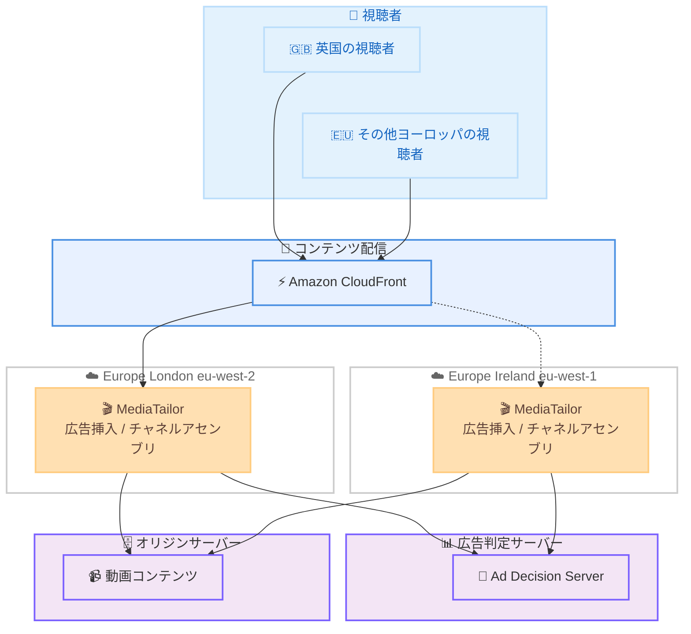

# AWS Elemental MediaTailor - Europe (London) リージョンでの提供開始

**リリース日**: 2026 年 3 月 30 日
**サービス**: AWS Elemental MediaTailor
**機能**: Europe (London) リージョンサポート

📊 [このアップデートのインフォグラフィックを見る](https://takech9203.github.io/aws-news-summary/20260330-aws-elemental-mediatailor-london-region.html)

## 概要

AWS Elemental MediaTailor が Europe (London) リージョン (eu-west-2) で利用可能になった。MediaTailor は、ライブおよびオンデマンド動画ストリームにおけるパーソナライズド広告挿入とチャネルアセンブリを提供するサービスであり、サーバーサイド広告挿入 (SSAI) およびサーバーガイド広告挿入 (SGAI) を通じて、クライアントサイド広告挿入に伴うバッファリングや広告ブロッカーの影響を受けない高品質な視聴体験を実現する。

今回のリージョン拡大により、北ヨーロッパの視聴者にサービスを提供する顧客は、視聴者により近い場所で広告挿入ワークロードを実行できるようになり、広告判定のレイテンシー削減と広告フィルレートの向上が期待できる。また、既に Europe (Ireland) で MediaTailor を使用している顧客にとっては、冗長性と容量拡大のための追加リージョンとして活用できる。

**アップデート前の課題**

- ヨーロッパで MediaTailor を利用する場合、Europe (Ireland) や Europe (Frankfurt) など限られたリージョンに依存しており、英国の視聴者向けのワークロードでは地理的な距離によるレイテンシーが発生していた
- 英国を中心とする北ヨーロッパ市場向けの広告判定処理で、最適なパフォーマンスを得ることが困難だった
- Europe (Ireland) のみでの運用では、単一リージョン障害時の冗長性が確保できなかった

**アップデート後の改善**

- Europe (London) リージョンでの MediaTailor 利用が可能になり、英国の視聴者により近い場所で広告挿入処理を実行できるようになった
- SSAI および SGAI ワークフローにおいて、ヨーロッパの視聴者向けの広告スティッチングと広告トラッキングのレイテンシーが低減された
- Europe (Ireland) との組み合わせにより、ヨーロッパにおけるマルチリージョン冗長構成が可能になった

## アーキテクチャ図



Europe (London) リージョンの追加により、英国の視聴者はより低レイテンシーで広告挿入された動画コンテンツを受信できる。Europe (Ireland) との組み合わせで冗長構成も実現可能。

## サービスアップデートの詳細

### 主要機能

1. **サーバーサイド広告挿入 (SSAI)**
   - 動画配信前にサーバー側で広告コンテンツを挿入する方式
   - クライアントデバイスごとの個別設定が不要
   - 視聴者ごとにユニークなマニフェストファイルを生成し、パーソナライズされた広告を配信
   - 広告ブロッカーの影響を受けにくい

2. **サーバーガイド広告挿入 (SGAI)**
   - サーバー側のガイダンスに基づくクライアント側での広告挿入方式
   - SSAI と同様に低レイテンシーの広告スティッチングと広告トラッキングが可能
   - Europe (London) リージョンでも完全サポート

3. **チャネルアセンブリ**
   - 既存の動画コンテンツを使用してリニア OTT チャネルを構築
   - VOD コンテンツおよびライブソースのスケジューリングに対応
   - HLS、DASH、CMAF 形式のマニフェストをサポート

## 技術仕様

### サポートされるストリーミング形式

| 項目 | 詳細 |
|------|------|
| プロトコル | HLS、DASH |
| マニフェスト形式 | CMAF 対応 |
| 広告挿入方式 | SSAI、SGAI |
| チャネルタイプ | Basic (VOD のみ)、Standard (VOD + ライブ) |
| スケーリング | 同時視聴者数に応じた自動スケーリング |
| 広告測定 | IAB 準拠のクライアントサイドおよびサーバーサイドメトリクス |

### リージョン情報

| 項目 | 詳細 |
|------|------|
| 新規対応リージョン | Europe (London) / eu-west-2 |
| 合計リージョン数 | 21 リージョン |

## 設定方法

### 前提条件

1. AWS アカウントを所有していること
2. Europe (London) リージョン (eu-west-2) へのアクセスが有効であること
3. 動画コンテンツを配信するオリジンサーバーが HTTP 経由でアクセス可能であること

### 手順

#### ステップ 1: コンソールでリージョンを選択

AWS マネジメントコンソールにサインインし、リージョンセレクターから **Europe (London)** を選択する。その後、MediaTailor コンソールに移動する。

#### ステップ 2: MediaTailor の設定を作成

```bash
aws mediatailor create-playback-configuration \
  --region eu-west-2 \
  --name my-playback-config \
  --ad-decision-server-url "https://my-ads-server.example.com/ads" \
  --video-content-source-url "https://my-origin.example.com/content"
```

上記のコマンドは、Europe (London) リージョンに新しい再生設定を作成する。広告判定サーバーの URL とコンテンツオリジンの URL を指定する必要がある。

#### ステップ 3: チャネルアセンブリの設定 (任意)

```bash
aws mediatailor create-channel \
  --region eu-west-2 \
  --channel-name my-london-channel \
  --channel-state RUNNING \
  --playback-mode LINEAR \
  --outputs '[{"ManifestName":"default","SourceGroup":"my-source-group","HlsPlaylistSettings":{"ManifestWindowSeconds":60}}]'
```

上記のコマンドは、Europe (London) リージョンにリニアチャネルを作成する。マニフェスト名、ソースグループ、HLS プレイリスト設定を指定する。

## メリット

### ビジネス面

- **広告収益の最大化**: 低レイテンシーによる広告フィルレートの向上で、広告収益の増加が期待できる
- **視聴体験の改善**: 英国の視聴者に対してバッファリングのない高品質な広告配信が可能になり、視聴者離脱率の低減に寄与する
- **コンプライアンス対応**: 英国および EU のデータ規制に対応するため、データを欧州内で処理する要件を満たしやすくなる

### 技術面

- **レイテンシー削減**: 広告判定処理が視聴者により近い場所で実行されるため、広告挿入のレイテンシーが低減される
- **冗長性の向上**: Europe (Ireland) と Europe (London) のマルチリージョン構成により、単一リージョン障害時のフェイルオーバーが可能
- **容量拡大**: 2 つのヨーロッパリージョンを活用することで、大規模イベント時の同時視聴者数増加にも対応しやすくなる

## デメリット・制約事項

### 制限事項

- Europe (London) リージョンの料金は公式料金ページで個別に確認が必要であり、他のヨーロッパリージョンと異なる場合がある
- 既存の Europe (Ireland) 環境から Europe (London) への自動移行機能は提供されていないため、手動での設定再構築が必要
- マルチリージョン構成を実現するには、DNS ベースのルーティングやフェイルオーバーの仕組みを別途構築する必要がある

### 考慮すべき点

- Europe (London) リージョンへの移行に伴い、既存の CloudFront ディストリビューションやオリジン設定の見直しが必要になる場合がある
- 広告判定サーバーとの通信経路が変わるため、ネットワーク構成の確認が推奨される

## ユースケース

### ユースケース 1: 英国の放送事業者による広告挿入最適化

**シナリオ**: 英国の放送事業者が、ライブスポーツ中継においてパーソナライズド広告を低レイテンシーで配信したい。

**実装例**:
```bash
aws mediatailor create-playback-configuration \
  --region eu-west-2 \
  --name uk-sports-live \
  --ad-decision-server-url "https://ads.uk-broadcaster.example.com/vast" \
  --video-content-source-url "https://origin.uk-broadcaster.example.com/live"
```

**効果**: 英国内の視聴者に対する広告判定レイテンシーが削減され、ライブ中継中の広告ブレイクにおけるシームレスな広告挿入が実現される。

### ユースケース 2: マルチリージョン冗長構成

**シナリオ**: ヨーロッパ全域にサービスを提供する OTT プラットフォームが、高可用性を確保するためにマルチリージョン構成を導入したい。

**実装例**:
```bash
# Europe (London) に設定を作成
aws mediatailor create-playback-configuration \
  --region eu-west-2 \
  --name eu-playback-london \
  --ad-decision-server-url "https://ads.example.com/vast" \
  --video-content-source-url "https://origin.example.com/content"

# Europe (Ireland) に設定を作成
aws mediatailor create-playback-configuration \
  --region eu-west-1 \
  --name eu-playback-ireland \
  --ad-decision-server-url "https://ads.example.com/vast" \
  --video-content-source-url "https://origin.example.com/content"
```

**効果**: Amazon Route 53 のヘルスチェックと組み合わせることで、いずれかのリージョンに障害が発生した場合でも自動的にフェイルオーバーし、サービスの継続性を確保できる。

### ユースケース 3: FAST チャネルの英国市場展開

**シナリオ**: 動画コンテンツプロバイダーが、Free Ad-Supported Streaming TV (FAST) チャネルを英国市場向けに立ち上げたい。

**実装例**:
```bash
# チャネルアセンブリで FAST チャネルを作成
aws mediatailor create-channel \
  --region eu-west-2 \
  --channel-name uk-fast-channel \
  --channel-state RUNNING \
  --playback-mode LINEAR \
  --outputs '[{"ManifestName":"default","SourceGroup":"uk-content","HlsPlaylistSettings":{"ManifestWindowSeconds":60}}]'
```

**効果**: 英国の視聴者向けに最適化されたリニアチャネルを低レイテンシーで配信し、広告収益化された FAST チャネルの運用が可能になる。

## 料金

MediaTailor の料金は、以下の要素に基づいて課金される。初期費用や最低利用料金は不要。

### 主要な料金要素

| 料金要素 | 説明 |
|----------|------|
| 広告挿入 | 1,000 回の広告挿入あたりの料金 |
| 広告トランスコード | 1,000 回の広告挿入あたり 10 件まで無料。超過分は MediaConvert の料金が適用 |
| チャネルアセンブリ | チャネル稼働時間あたりの料金 (Basic / Standard) |
| 広告配信 | インターネットまたは CDN 経由での広告配信データ転送量に基づく |
| ログ配信 | 広告挿入 1 件あたり 50 KB までのログデータ配信が無料 |

### 広告配信料金の参考 (ヨーロッパリージョン)

| 使用量 | 月額料金 (1 GB あたり) |
|--------|------------------------|
| 最初の 1 GB / 月 | $0.000 |
| 次の 9.999 TB / 月 | $0.090 |
| 次の 40 TB / 月 | $0.085 |
| 次の 100 TB / 月 | $0.070 |
| 150 TB 超 / 月 | $0.050 |

**注意**: Europe (London) リージョンの詳細な料金については、[AWS Elemental MediaTailor 料金ページ](https://aws.amazon.com/mediatailor/pricing/)を参照すること。

## 利用可能リージョン

今回のアップデートにより、MediaTailor は合計 21 の AWS リージョンで利用可能となった。公式発表で確認されている主なリージョンは以下の通り。

- **北米**: US East (N. Virginia)、US East (Ohio)、US West (Oregon)
- **ヨーロッパ**: Europe (Ireland)、Europe (Frankfurt)、**Europe (London)** (新規)
- **アフリカ**: Africa (Cape Town)
- **アジアパシフィック**: Asia Pacific (Mumbai)、Asia Pacific (Singapore)、Asia Pacific (Sydney)、Asia Pacific (Tokyo)

全リージョンの一覧は [AWS Regional Services List](https://aws.amazon.com/about-aws/global-infrastructure/regional-product-services/) を参照。

## 関連サービス・機能

- **Amazon CloudFront**: MediaTailor と組み合わせて使用する CDN。広告セグメントとコンテンツセグメントのキャッシュにより、パフォーマンス向上とコスト削減を実現
- **AWS Elemental MediaConvert**: MediaTailor の広告トランスコード機能で内部的に使用されるファイルベースの動画変換サービス
- **AWS Elemental MediaLive**: ライブ動画のエンコーディングサービス。MediaTailor のライブストリーム広告挿入と連携
- **AWS Elemental MediaPackage**: 動画のオリジネーションとパッケージングサービス。MediaTailor のコンテンツソースとして利用可能
- **Amazon Route 53**: マルチリージョン構成でのフェイルオーバーやレイテンシーベースルーティングに活用

## 参考リンク

- 📊 [インフォグラフィック](https://takech9203.github.io/aws-news-summary/20260330-aws-elemental-mediatailor-london-region.html)
- [公式発表 (What's New)](https://aws.amazon.com/about-aws/whats-new/2026/03/aws-elemental-mediatailor-london-region/)
- [AWS Elemental MediaTailor ドキュメント](https://docs.aws.amazon.com/mediatailor/latest/ug/what-is.html)
- [AWS Elemental MediaTailor 料金ページ](https://aws.amazon.com/mediatailor/pricing/)
- [AWS Elemental MediaTailor コンソール](https://console.aws.amazon.com/mediatailor/)
- [AWS Regional Services List](https://aws.amazon.com/about-aws/global-infrastructure/regional-product-services/)

## まとめ

AWS Elemental MediaTailor の Europe (London) リージョン対応により、英国および北ヨーロッパの視聴者向けの広告挿入ワークロードを最適化できるようになった。特に SSAI および SGAI を活用した低レイテンシーの広告配信と、Europe (Ireland) との組み合わせによるマルチリージョン冗長構成の実現が大きなメリットとなる。英国市場で動画配信サービスを展開している事業者は、Europe (London) リージョンでの MediaTailor 活用を検討することが推奨される。
