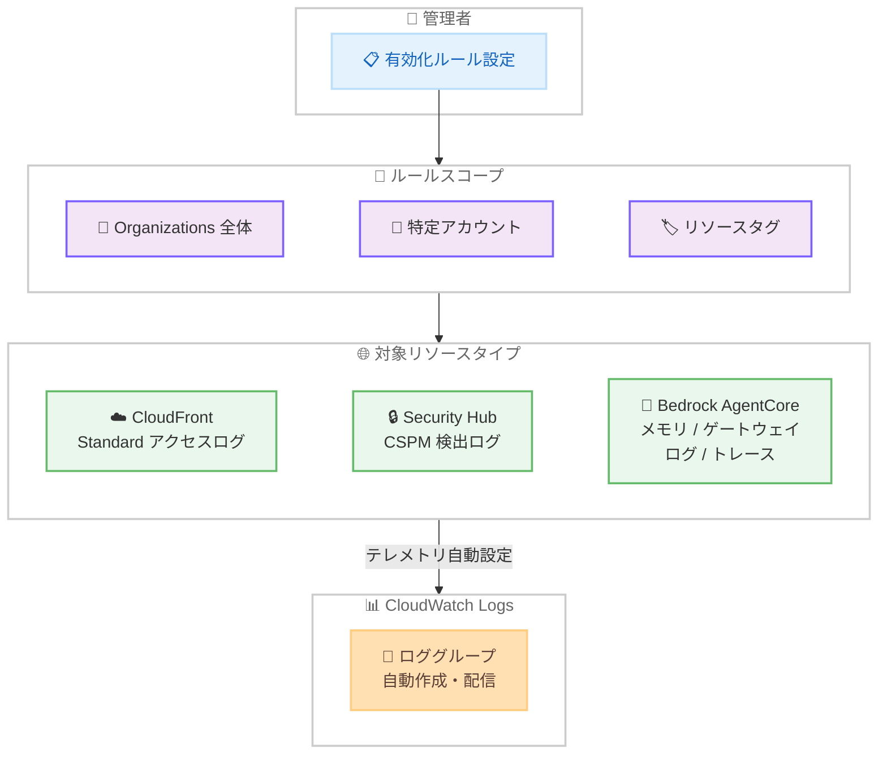

# Amazon CloudWatch - テレメトリ自動有効化の対象リソース拡大

**リリース日**: 2026 年 4 月 2 日
**サービス**: Amazon CloudWatch
**機能**: CloudFront、Security Hub、Bedrock AgentCore に対するテレメトリ自動有効化ルール

📊 [このアップデートのインフォグラフィックを見る](https://takech9203.github.io/aws-news-summary/20260402-amazon-cloudwatch-cloudfront-enablement.html)

## 概要

Amazon CloudWatch のテレメトリ自動有効化機能が拡張され、新たに Amazon CloudFront Standard アクセスログ、AWS Security Hub CSPM 検出ログ、Amazon Bedrock AgentCore のメモリおよびゲートウェイのログとトレースが対象に追加されました。

この機能により、有効化ルールを設定するだけで、既存リソースと新規作成されるリソースの両方に対してテレメトリが自動的に設定されます。手動でのログ設定が不要になり、監視カバレッジの一貫性が確保されます。有効化ルールのスコープは、AWS Organizations 全体、特定のアカウント、またはリソースタグに基づく特定のリソースに設定できます。

**アップデート前の課題**

- CloudFront ディストリビューションごとに Standard アクセスログを手動で設定する必要があった
- Security Hub CSPM の検出ログを CloudWatch Logs に送信するには個別の設定が必要だった
- Bedrock AgentCore のメモリやゲートウェイのログ、トレースを一括で自動有効化できなかった
- 新規リソース作成時にログ設定を忘れると、監視の抜け漏れが発生していた

**アップデート後の改善**

- 有効化ルールを一度設定するだけで、既存・新規リソースのテレメトリが自動構成される
- CloudFront と Security Hub は組織全体のルールに対応し、マルチアカウント環境でも一貫した監視が可能
- Bedrock AgentCore はアカウントレベルのルールで、ログとトレースを自動有効化
- リソースタグによるスコープ指定で、柔軟なルール適用が可能に

## アーキテクチャ図



管理者が有効化ルールを設定すると、スコープに応じて対象リソースのテレメトリが自動的に CloudWatch Logs へ配信されます。

## サービスアップデートの詳細

### 主要機能

1. **CloudFront Standard アクセスログの自動有効化**
   - CloudFront ディストリビューションの Standard アクセスログを CloudWatch Logs へ自動配信
   - 組織全体のルールに対応し、全アカウントの CloudFront リソースを一括管理可能
   - 新規ディストリビューション作成時にも自動でログが有効化

2. **Security Hub CSPM 検出ログの自動有効化**
   - AWS Security Hub の Cloud Security Posture Management 検出ログを CloudWatch Logs へ自動配信
   - 組織全体のルールに対応し、セキュリティ監視のカバレッジを統一
   - セキュリティ検出結果の一元的なログ管理を実現

3. **Bedrock AgentCore ログとトレースの自動有効化**
   - Bedrock AgentCore Memory のログを自動配信
   - Bedrock AgentCore Gateway のログとトレースを自動配信
   - アカウントレベルのルールに対応

4. **柔軟なスコープ設定**
   - AWS Organizations 全体: CloudFront、Security Hub が対応
   - 特定アカウント: Bedrock AgentCore が対応
   - リソースタグベース: タグ条件による選択的な適用が可能

## 技術仕様

### 対象リソースとスコープ対応表

| リソースタイプ | テレメトリタイプ | 組織ルール | アカウントルール | タグスコープ |
|------|------|------|------|------|
| AWS::CloudFront::Distribution | アクセスログ | 対応 | 対応 | 対応 |
| AWS::SecurityHub::Hub | CSPM 検出ログ | 対応 | 対応 | 対応 |
| AWS::BedrockAgentCore::Memory | ログ | - | 対応 | 対応 |
| AWS::BedrockAgentCore::Gateway | ログ / トレース | - | 対応 | 対応 |

### ログタイプ

| ログタイプ | 説明 |
|------|------|
| ACCESS_LOGS | CloudFront Standard アクセスログ |
| SECURITY_FINDING_LOGS | Security Hub CSPM 検出ログ |
| CONNECTION_LOGS | Bedrock AgentCore 接続ログ |

### API 変更履歴

| 日付 | サービス | 変更内容 |
|------|----------|----------|
| 2026/03/31 | [CloudWatch Observability Admin Service](https://awsapichanges.com/archive/changes/080f45-observabilityadmin.html) | 10 updated api methods - Bedrock AgentCore、Security Hub、CloudFront リソースタイプを追加 |
| 2026/04/02 | [Amazon CloudWatch](https://awsapichanges.com/archive/changes/d3423d-monitoring.html) | 3 new 3 updated api methods - OTel エンリッチメントと PromQL アラームをサポート |
| 2026/04/03 | [Amazon CloudWatch Logs](https://awsapichanges.com/archive/changes/da2768-logs.html) | 1 updated api method - DescribeQueries にクエリコスト情報フィールドを追加 |

### 有効化ルール設定例

```json
{
  "RuleName": "cloudfront-access-logs-rule",
  "Rule": {
    "ResourceType": "AWS::CloudFront::Distribution",
    "TelemetryType": "Logs",
    "DestinationConfiguration": {
      "DestinationType": "cloud-watch-logs",
      "DestinationPattern": "/aws/cloudfront/access-logs",
      "RetentionInDays": 90,
      "LogDeliveryParameters": {
        "LogTypes": ["ACCESS_LOGS"]
      }
    },
    "Scope": "ORGANIZATION"
  }
}
```

## 設定方法

### 前提条件

1. AWS Organizations が有効化されていること (組織ルールを使用する場合)
2. CloudWatch Observability Admin Service の IAM 権限が付与されていること
3. 対象リソース (CloudFront、Security Hub、Bedrock AgentCore) が稼働していること

### 手順

#### ステップ 1: アカウントレベルの有効化ルールを作成

```bash
aws observabilityadmin create-telemetry-rule \
  --rule-name "cloudfront-access-logs" \
  --rule '{
    "ResourceType": "AWS::CloudFront::Distribution",
    "TelemetryType": "Logs",
    "DestinationConfiguration": {
      "DestinationType": "cloud-watch-logs",
      "DestinationPattern": "/aws/cloudfront/access-logs",
      "RetentionInDays": 90,
      "LogDeliveryParameters": {
        "LogTypes": ["ACCESS_LOGS"]
      }
    }
  }'
```

`create-telemetry-rule` を使用して、CloudFront Standard アクセスログを CloudWatch Logs に自動配信するルールを作成します。

#### ステップ 2: 組織全体のルールを作成

```bash
aws observabilityadmin create-telemetry-rule-for-organization \
  --rule-name "org-security-hub-cspm-logs" \
  --rule '{
    "ResourceType": "AWS::SecurityHub::Hub",
    "TelemetryType": "Logs",
    "DestinationConfiguration": {
      "DestinationType": "cloud-watch-logs",
      "DestinationPattern": "/aws/securityhub/cspm-findings",
      "RetentionInDays": 365,
      "LogDeliveryParameters": {
        "LogTypes": ["SECURITY_FINDING_LOGS"]
      }
    },
    "Scope": "ORGANIZATION"
  }'
```

`create-telemetry-rule-for-organization` を使用して、組織全体の Security Hub CSPM 検出ログを自動有効化します。

#### ステップ 3: ルールの確認

```bash
aws observabilityadmin list-telemetry-rules \
  --rule-name-prefix "cloudfront"
```

作成したルールの一覧を確認し、正しく設定されていることを検証します。

## メリット

### ビジネス面

- **運用コスト削減**: 手動でのログ設定作業が不要になり、運用負荷が大幅に軽減
- **コンプライアンス強化**: 組織全体で一貫したログ収集が保証され、監査要件への対応が容易に
- **監視の抜け漏れ防止**: 新規リソース作成時にも自動でテレメトリが有効化され、監視ギャップを排除

### 技術面

- **一元管理**: CloudWatch Logs を中心としたテレメトリ管理で、複数サービスのログを統合
- **スケーラビリティ**: Organizations 統合により、マルチアカウント環境でも一括設定が可能
- **タグベースの柔軟性**: リソースタグによるスコープ指定で、環境別やチーム別のルール適用が実現

## デメリット・制約事項

### 制限事項

- Bedrock AgentCore は組織全体の有効化ルールに対応していない (アカウントレベルのみ)
- テレメトリの送信先は CloudWatch Logs のみ (S3 などへの直接配信は非対応)
- 有効化ルールで配信されるログは CloudWatch Logs の料金体系に従う

### 考慮すべき点

- 大量の CloudFront ディストリビューションがある場合、ログボリュームの増加によるコスト影響を事前に見積もること
- 組織ルールの適用範囲が広い場合、想定外のリソースにもログ有効化が適用される可能性がある
- 既存のログ設定との競合が発生しないか事前に確認すること

## ユースケース

### ユースケース 1: マルチアカウント環境での CloudFront 監視統一

**シナリオ**: 複数の AWS アカウントで CloudFront ディストリビューションを運用している企業が、全アカウントで一貫したアクセスログ収集を実現したい。

**実装例**:
```bash
aws observabilityadmin create-telemetry-rule-for-organization \
  --rule-name "org-cloudfront-access-logs" \
  --rule '{
    "ResourceType": "AWS::CloudFront::Distribution",
    "TelemetryType": "Logs",
    "DestinationConfiguration": {
      "DestinationType": "cloud-watch-logs",
      "DestinationPattern": "/aws/cloudfront/access-logs",
      "RetentionInDays": 90,
      "LogDeliveryParameters": {
        "LogTypes": ["ACCESS_LOGS"]
      }
    },
    "Scope": "ORGANIZATION"
  }'
```

**効果**: 新規アカウントや新規ディストリビューション作成時にもログが自動設定され、監視の抜け漏れがなくなる。

### ユースケース 2: セキュリティコンプライアンスのためのログ一元管理

**シナリオ**: セキュリティチームが Security Hub CSPM の検出結果を CloudWatch Logs に集約し、Metric Filter やアラームで即時通知したい。

**実装例**:
```bash
aws observabilityadmin create-telemetry-rule-for-organization \
  --rule-name "security-cspm-findings" \
  --rule '{
    "ResourceType": "AWS::SecurityHub::Hub",
    "TelemetryType": "Logs",
    "DestinationConfiguration": {
      "DestinationType": "cloud-watch-logs",
      "DestinationPattern": "/aws/securityhub/cspm",
      "RetentionInDays": 365,
      "LogDeliveryParameters": {
        "LogTypes": ["SECURITY_FINDING_LOGS"]
      }
    },
    "Scope": "ORGANIZATION"
  }'
```

**効果**: セキュリティ検出結果が自動的に CloudWatch Logs へ配信され、CloudWatch Alarms との連携で迅速なインシデント対応が可能になる。

### ユースケース 3: Bedrock AgentCore の運用可視化

**シナリオ**: AI エージェント基盤として Bedrock AgentCore を利用しており、ゲートウェイとメモリのログ、トレースを自動収集してデバッグやパフォーマンス分析に活用したい。

**実装例**:
```bash
aws observabilityadmin create-telemetry-rule \
  --rule-name "bedrock-agentcore-gateway-logs" \
  --rule '{
    "ResourceType": "AWS::BedrockAgentCore::Gateway",
    "TelemetryType": "Logs",
    "DestinationConfiguration": {
      "DestinationType": "cloud-watch-logs",
      "DestinationPattern": "/aws/bedrock/agentcore/gateway",
      "RetentionInDays": 30
    }
  }'
```

**効果**: AgentCore のリクエスト処理フローが可視化され、レイテンシ分析やエラー調査が効率化される。

## 料金

CloudWatch テレメトリ自動有効化ルールの作成・管理自体には追加料金は発生しません。配信されるログとトレースに対しては、CloudWatch Logs の標準料金が適用されます。

### 料金例

| 項目 | 月額料金 (概算) |
|--------|------------------|
| ログ取り込み | $0.50/GB |
| ログストレージ (アーカイブ) | $0.03/GB |
| CloudWatch Logs Insights クエリ | $0.005/GB スキャン |

## 利用可能リージョン

全ての AWS 商用リージョンで利用可能です。

## 関連サービス・機能

- **Amazon CloudFront**: CDN サービス。Standard アクセスログが今回の自動有効化対象に追加
- **AWS Security Hub**: セキュリティ状態の集約管理。CSPM 検出ログが自動有効化対象に追加
- **Amazon Bedrock AgentCore**: AI エージェント基盤。メモリとゲートウェイのログ、トレースが対象に追加
- **CloudWatch Observability Admin Service**: テレメトリ有効化ルールを管理する API サービス
- **AWS Organizations**: 組織全体の有効化ルール適用に必要

## 参考リンク

- 📊 [インフォグラフィック](https://takech9203.github.io/aws-news-summary/20260402-amazon-cloudwatch-cloudfront-enablement.html)
- [公式発表 (What's New)](https://aws.amazon.com/about-aws/whats-new/2026/04/amazon-cloudwatch-cloudfront-enablement/)
- [CloudWatch Observability Admin API リファレンス](https://docs.aws.amazon.com/cloudwatch/latest/APIReference/Welcome.html)
- [CloudWatch Logs 料金ページ](https://aws.amazon.com/cloudwatch/pricing/)

## まとめ

Amazon CloudWatch のテレメトリ自動有効化ルールが CloudFront、Security Hub、Bedrock AgentCore に拡大されたことで、マルチアカウント環境における監視カバレッジの一貫性が大幅に向上しました。特に CloudFront と Security Hub の組織全体ルール対応により、大規模環境でも手動設定なしでログ収集を統一できます。CloudWatch を中心としたオブザーバビリティ戦略を推進している組織は、まず組織全体の有効化ルールを設定し、監視の抜け漏れを解消することを推奨します。
