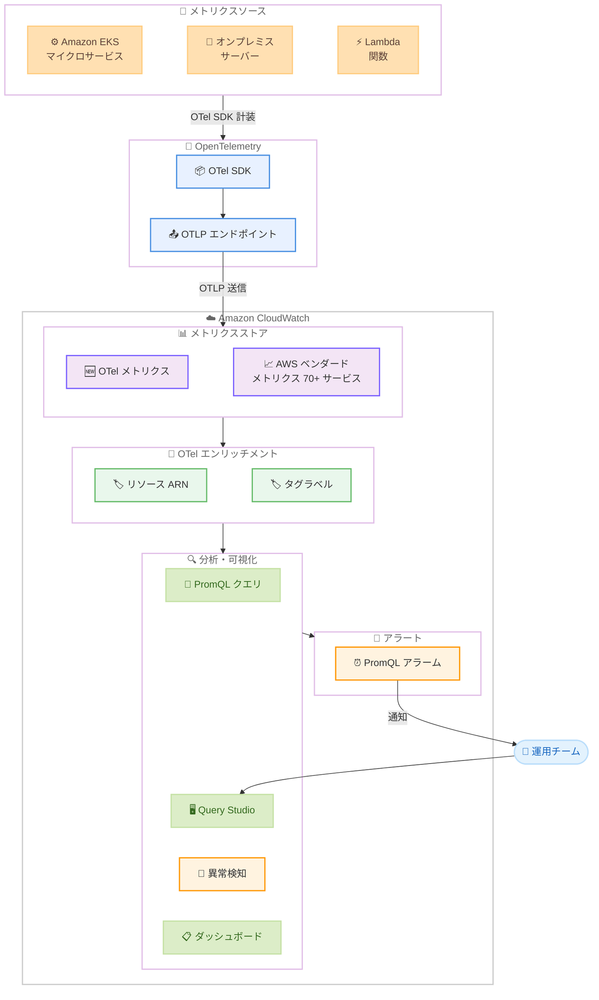

# Amazon CloudWatch - OpenTelemetry メトリクスのネイティブサポート

**リリース日**: 2026 年 4 月 2 日
**サービス**: Amazon CloudWatch
**機能**: OpenTelemetry (OTel) メトリクスのネイティブサポート (パブリックプレビュー)

📊 [このアップデートのインフォグラフィックを見る](https://takech9203.github.io/aws-news-summary/20260402-amazon-cloudwatch-opentelemetry-metrics.html)

## 概要

Amazon CloudWatch が OpenTelemetry (OTel) メトリクスをネイティブにサポートするパブリックプレビューが開始されました。OpenTelemetry Protocol (OTLP) を使用してメトリクスを直接 CloudWatch に送信でき、カスタム変換ロジックや追加のツールが不要になります。カスタム OpenTelemetry メトリクスと 70 以上の AWS サービスが提供するベンダードメトリクスを統合し、PromQL で横断的にクエリできます。

このアップデートにより、Amazon EKS やオンプレミスサーバーでマイクロサービスを運行するチームは、両方の環境から OTel メトリクスを直接 CloudWatch に送信し、アプリケーションレベルのメトリクスと EKS Pod の CPU 使用率や ALB リクエスト数などの AWS メトリクスを相関分析できるようになります。CloudWatch の異常検知は OTel メトリクスに対応し、Query Studio は PromQL 向けの新しいコンソール体験を提供します。

**アップデート前の課題**

- OpenTelemetry メトリクスを CloudWatch に送信するには、カスタム変換ロジックの実装やサードパーティのエクスポーターが必要だった
- OTel メトリクスと AWS ベンダードメトリクスを統合的にクエリする標準的な手段がなく、監視環境が分断されていた
- マルチ環境 (クラウドとオンプレミス) からのメトリクスを統一的に収集・分析するには複数の監視ツールを併用する必要があった
- PromQL を CloudWatch 上でネイティブに使用する手段が限定されていた

**アップデート後の改善**

- OTLP エンドポイントを通じて OTel メトリクスを直接 CloudWatch に送信でき、変換ロジックが不要になった
- カスタム OTel メトリクスと 70 以上の AWS サービスのベンダードメトリクスを PromQL で統合クエリ可能になった
- CloudWatch 異常検知が OTel メトリクスに対応し、機械学習ベースの異常検出を活用可能になった
- Query Studio で PromQL 向けの新しいコンソール体験が提供され、クエリの作成と可視化が容易になった

## アーキテクチャ図



アプリケーションから OTel SDK で計装されたメトリクスが OTLP エンドポイントを通じて CloudWatch に送信され、AWS ベンダードメトリクスと統合して PromQL でクエリ・分析されるフローを示しています。

## サービスアップデートの詳細

### 主要機能

1. **OTLP ネイティブ取り込み**
   - OpenTelemetry Protocol (OTLP) を使用してメトリクスを直接 CloudWatch に送信可能
   - カスタム変換ロジックや追加のエクスポーターが不要
   - 追加のエージェントやコード変更なしで利用可能

2. **AWS ベンダードメトリクスとの統合**
   - カスタム OTel メトリクスと 70 以上の AWS サービスのベンダードメトリクスを統合
   - PromQL を使用した横断的なクエリが可能
   - リソース ARN やタグラベルによるメトリクスのエンリッチメント機能

3. **PromQL サポートと Query Studio**
   - PromQL でメトリクスをクエリし、統合ダッシュボードを構築可能
   - Query Studio が PromQL 向けの新しいコンソール体験を提供
   - PromQL ベースのアラーム設定に対応 (PendingPeriod と RecoveryPeriod を指定可能)

4. **異常検知との統合**
   - CloudWatch 異常検知が OTel メトリクスに対応
   - 機械学習ベースのベースライン自動構築による異常検出

## 技術仕様

### OTel エンリッチメント API

今回のアップデートに伴い、CloudWatch API に OTel エンリッチメント関連の新規メソッドが追加されました。

| メソッド名 | 説明 |
|-----------|------|
| `StartOTelEnrichment` | OTel エンリッチメントを有効化し、AWS リソースの ARN やタグラベルで OTel メトリクスをエンリッチする |
| `StopOTelEnrichment` | OTel エンリッチメントを停止する |
| `GetOTelEnrichment` | OTel エンリッチメントの現在のステータス (Running/Stopped) を取得する |

### PromQL アラーム拡張

既存のアラーム関連 API に PromQL クエリベースのアラーム設定が追加されました。

| パラメータ | 型 | 説明 |
|-----------|-----|------|
| `EvaluationCriteria.PromQLCriteria.Query` | string | PromQL クエリ文字列 |
| `EvaluationCriteria.PromQLCriteria.PendingPeriod` | integer | アラーム状態に遷移するまでの待機期間 |
| `EvaluationCriteria.PromQLCriteria.RecoveryPeriod` | integer | 正常状態に回復するまでの期間 |
| `EvaluationInterval` | integer | 評価間隔 |

### API 変更履歴

| 日付 | サービス | 変更内容 |
|------|----------|----------|
| 2026/04/02 | [Amazon CloudWatch](https://awsapichanges.com/archive/changes/d3423d-monitoring.html) | 3 new 3 updated api methods - OTel エンリッチメント API の追加と PromQL アラーム対応 |

### サポートされるメトリクスタイプ

| OTel メトリクスタイプ | 説明 |
|---------------------|------|
| Gauge | 特定時点の値を記録 |
| Counter | 単調増加するカウンター |
| Histogram | 値の分布を記録 |
| Summary | 事前計算されたパーセンタイル |

## 設定方法

### 前提条件

1. AWS アカウントとプレビュー対応リージョンへのアクセス
2. OpenTelemetry SDK で計装されたアプリケーション
3. CloudWatch への書き込み権限 (`cloudwatch:PutMetricData` 等) と OTel エンリッチメント権限

### 手順

#### ステップ 1: OTel エンリッチメントの有効化

```bash
aws cloudwatch start-o-tel-enrichment
```

OTel エンリッチメントを有効化します。これにより、OTLP で取り込まれたメトリクスに AWS リソースの ARN やタグラベルが自動的に付与され、PromQL でリソース単位のクエリが可能になります。

#### ステップ 2: OpenTelemetry Collector の設定

```yaml
# otel-collector-config.yaml
exporters:
  otlphttp:
    endpoint: "https://xray.us-east-1.amazonaws.com/v1/traces"
    headers:
      # AWS SigV4 認証を使用
    compression: gzip

processors:
  batch:
    timeout: 60s
    send_batch_size: 1000

receivers:
  otlp:
    protocols:
      grpc:
        endpoint: "0.0.0.0:4317"
      http:
        endpoint: "0.0.0.0:4318"

service:
  pipelines:
    metrics:
      receivers: [otlp]
      processors: [batch]
      exporters: [otlphttp]
```

OpenTelemetry Collector を設定し、アプリケーションからのメトリクスを CloudWatch の OTLP エンドポイントに転送します。AWS SigV4 認証を使用してセキュアに送信します。

#### ステップ 3: PromQL でのクエリ実行

```promql
# EKS Pod の CPU 使用率と OTel カスタムメトリクスの相関分析
rate(http_server_request_duration_seconds_sum[5m])
  / rate(http_server_request_duration_seconds_count[5m])
```

Query Studio または API を通じて PromQL クエリを実行し、OTel メトリクスと AWS ベンダードメトリクスを統合的に分析します。

#### ステップ 4: PromQL ベースのアラーム設定

```bash
aws cloudwatch put-metric-alarm \
  --alarm-name "high-latency-otel" \
  --alarm-description "OTel metrics: High request latency" \
  --evaluation-criteria '{
    "PromQLCriteria": {
      "Query": "rate(http_server_request_duration_seconds_sum[5m]) / rate(http_server_request_duration_seconds_count[5m]) > 0.5",
      "PendingPeriod": 300,
      "RecoveryPeriod": 300
    }
  }' \
  --evaluation-interval 60 \
  --alarm-actions arn:aws:sns:us-east-1:123456789012:latency-alerts
```

PromQL クエリに基づいたアラームを設定します。`PendingPeriod` でアラーム発報までの待機時間、`RecoveryPeriod` で正常復帰までの時間を秒単位で指定します。

## メリット

### ビジネス面

- **監視ツールの統合**: OpenTelemetry メトリクスと AWS ネイティブメトリクスを CloudWatch に統合し、複数の監視プラットフォームへの投資を削減
- **運用効率の向上**: カスタム変換ロジックやエクスポーターの構築・維持が不要になり、運用チームの負担を軽減
- **プレビュー期間中の無料利用**: パブリックプレビュー中は追加料金なしで機能を評価可能
- **マルチクラウド/ハイブリッド対応**: OpenTelemetry 標準に準拠しているため、クラウドとオンプレミスの両方からメトリクスを統合可能

### 技術面

- **標準プロトコル対応**: OTLP によるネイティブ取り込みにより、OpenTelemetry エコシステムとのシームレスな統合を実現
- **PromQL サポート**: Prometheus 互換のクエリ言語でメトリクスを分析でき、既存の PromQL 知識を活用可能
- **エンリッチメント機能**: OTel メトリクスに AWS リソース ARN やタグラベルが自動付与され、リソース単位の分析が容易
- **異常検知統合**: 機械学習ベースの CloudWatch 異常検知が OTel メトリクスに対応し、手動のしきい値設定を補完

## デメリット・制約事項

### 制限事項

- パブリックプレビューの段階であり、本番ワークロードでの使用については慎重な評価が必要
- 利用可能リージョンが 5 リージョンに限定されている (US East (N. Virginia)、US West (Oregon)、Asia Pacific (Sydney)、Asia Pacific (Singapore)、Europe (Ireland))
- プレビュー期間中の SLA は提供されない可能性がある

### 考慮すべき点

- GA (一般提供) 後の料金体系について、プレビュー期間中に評価と見積もりを行うことを推奨
- 既存の Prometheus サーバーや Grafana による監視環境からの移行は段階的に計画する必要がある
- OTel Collector の設定と AWS SigV4 認証の統合には初期セットアップが必要

## ユースケース

### ユースケース 1: マルチ環境マイクロサービスの統合監視

**シナリオ**: Amazon EKS 上とオンプレミスサーバー上でマイクロサービスを運用しているチームが、両方の環境のメトリクスを統合的に監視したい。

**実装例**:
```promql
# EKS とオンプレミスのサービスレイテンシーを比較
avg by (service_name, deployment_environment) (
  rate(http_server_request_duration_seconds_sum[5m])
  / rate(http_server_request_duration_seconds_count[5m])
)
```

**効果**: クラウドとオンプレミスのアプリケーションメトリクスを CloudWatch に統合し、PromQL で横断的に分析することで、環境間のパフォーマンス差異を即座に把握できる。

### ユースケース 2: アプリケーションメトリクスと AWS インフラメトリクスの相関分析

**シナリオ**: OTel で計装したアプリケーションのレスポンスタイム悪化の原因を、EKS Pod の CPU 使用率や ALB リクエスト数と相関させて特定したい。

**実装例**:
```promql
# アプリケーションのエラーレートと Pod リソース使用率の相関
rate(http_server_request_total{http_status_code=~"5.."}[5m])
  / rate(http_server_request_total[5m])
```

**効果**: カスタム OTel メトリクスと AWS ベンダードメトリクスを統合ダッシュボードで可視化し、インフラとアプリケーションの両面からの根本原因分析を効率化できる。

### ユースケース 3: PromQL ベースの高度なアラート設定

**シナリオ**: 複数のマイクロサービスにまたがるリクエストの成功率を PromQL で計算し、サービス全体の健全性に基づいたアラートを設定したい。

**実装例**:
```bash
aws cloudwatch put-metric-alarm \
  --alarm-name "service-success-rate-low" \
  --evaluation-criteria '{
    "PromQLCriteria": {
      "Query": "sum(rate(http_server_request_total{http_status_code=~\"2..\"}[10m])) / sum(rate(http_server_request_total[10m])) < 0.995",
      "PendingPeriod": 600,
      "RecoveryPeriod": 300
    }
  }' \
  --evaluation-interval 60 \
  --alarm-actions arn:aws:sns:us-east-1:123456789012:service-alerts
```

**効果**: 従来の単一メトリクスのしきい値ベースのアラームでは困難だった、複数メトリクスの集約・計算に基づく高度なアラート条件を PromQL で実現できる。

## 料金

パブリックプレビュー期間中は追加料金なしで利用可能です。

### 料金例

| 項目 | プレビュー期間中 |
|------|----------------|
| OTel メトリクスの取り込み | 無料 |
| PromQL クエリ | 無料 |
| OTel エンリッチメント | 無料 |

※ GA (一般提供) 後の料金体系については、プレビュー期間中にアナウンスされる見込みです。CloudWatch メトリクスの標準料金が適用される可能性があります。最新情報は [Amazon CloudWatch 料金ページ](https://aws.amazon.com/cloudwatch/pricing/) を参照してください。

## 利用可能リージョン

パブリックプレビューは以下の 5 リージョンで利用可能です。

| リージョン | リージョンコード |
|-----------|----------------|
| US East (N. Virginia) | us-east-1 |
| US West (Oregon) | us-west-2 |
| Asia Pacific (Sydney) | ap-southeast-2 |
| Asia Pacific (Singapore) | ap-southeast-1 |
| Europe (Ireland) | eu-west-1 |

## 関連サービス・機能

- **Amazon CloudWatch Query Studio**: PromQL 向けの新しいコンソール体験を提供するクエリインターフェース
- **Amazon CloudWatch Anomaly Detection**: OTel メトリクスに対応した機械学習ベースの異常検知機能
- **AWS Distro for OpenTelemetry (ADOT)**: AWS がサポートする OpenTelemetry ディストリビューション。OTel Collector として利用可能
- **Amazon EKS**: OTel メトリクスの主要な送信元の 1 つ。コンテナ環境のメトリクスを CloudWatch に統合
- **Prometheus**: CloudWatch の PromQL サポートにより、Prometheus 互換のクエリ体験を提供

## 参考リンク

- 📊 [インフォグラフィック](https://takech9203.github.io/aws-news-summary/20260402-amazon-cloudwatch-opentelemetry-metrics.html)
- [公式発表 (What's New)](https://aws.amazon.com/about-aws/whats-new/2026/04/amazon-cloudwatch-opentelemetry-metrics/)
- [ドキュメント - Amazon CloudWatch](https://docs.aws.amazon.com/AmazonCloudWatch/latest/monitoring/)
- [ドキュメント - AWS Distro for OpenTelemetry](https://aws-otel.github.io/docs/introduction)
- [料金ページ - Amazon CloudWatch](https://aws.amazon.com/cloudwatch/pricing/)

## まとめ

Amazon CloudWatch が OpenTelemetry メトリクスをネイティブにサポートするパブリックプレビューが開始されました。OTLP による直接取り込み、70 以上の AWS サービスのベンダードメトリクスとの統合、PromQL によるクエリ、異常検知との連携により、マルチ環境の統合オブザーバビリティが CloudWatch 上で実現可能になります。プレビュー期間中は無料で利用できるため、OpenTelemetry を採用している組織や、Prometheus からの移行を検討している組織は、対応リージョンで機能を評価することを推奨します。
