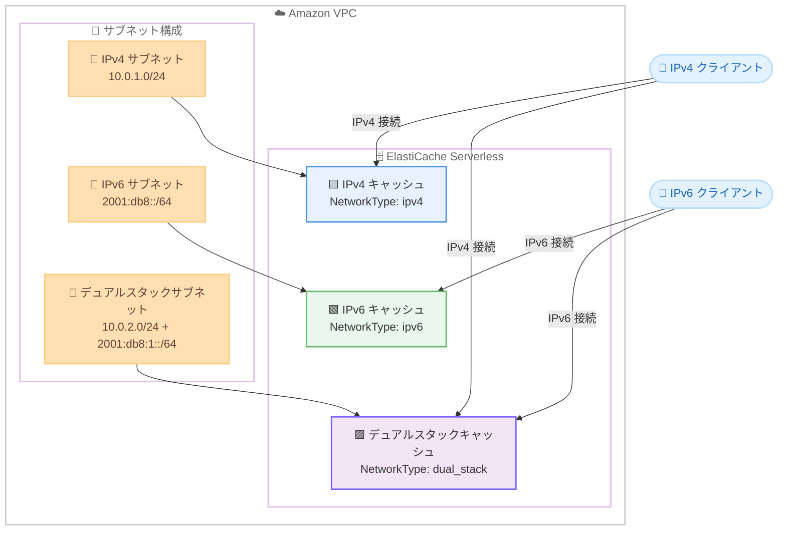

# Amazon ElastiCache Serverless - IPv6 およびデュアルスタック接続のサポート

**リリース日**: 2026 年 4 月 2 日
**サービス**: Amazon ElastiCache
**機能**: ElastiCache Serverless における IPv6 およびデュアルスタック接続

📊 [このアップデートのインフォグラフィックを見る](https://takech9203.github.io/aws-news-summary/20260402-amazon-elasticache-serverless-ipv6-dual-stack.html)

## 概要

Amazon ElastiCache Serverless が IPv6 およびデュアルスタック接続をサポートしました。これまで ElastiCache Serverless は IPv4 のみの接続に対応していましたが、今回のアップデートにより、キャッシュ作成時に IPv4、IPv6、デュアルスタックの 3 つのネットワークタイプから選択できるようになります。

デュアルスタック接続では、キャッシュが IPv4 と IPv6 の両方の接続を同時に受け付けるため、既存の IPv4 環境との下位互換性を維持しながら段階的に IPv6 へ移行する際に最適です。IPv6 接続を選択すると IPv6 のみのサブネットを使用でき、IPv4 アドレスが不要になるため、IPv4 アドレスの枯渇問題への対応やコンプライアンス要件の充足に役立ちます。

本機能は、GovCloud および中国リージョンを含むすべての AWS リージョンで追加料金なしで利用可能です。

**アップデート前の課題**

- ElastiCache Serverless は IPv4 接続のみをサポートしており、IPv6 ネイティブ環境からの接続ができなかった
- IPv6 のみのサブネットに ElastiCache Serverless キャッシュを配置できず、VPC 設計の柔軟性が制限されていた
- IPv6 対応を求めるコンプライアンス要件 (米国連邦政府の OMB M-21-07 等) を ElastiCache Serverless で満たすことが困難だった
- IPv4 アドレスの枯渇問題に対して、ElastiCache Serverless では IPv4 アドレスの使用を回避する手段がなかった

**アップデート後の改善**

- IPv4、IPv6、デュアルスタックの 3 つのネットワークタイプからキャッシュ作成時に選択可能になった
- IPv6 のみのサブネットへの ElastiCache Serverless キャッシュの配置が可能になり、IPv4 アドレスが不要になった
- デュアルスタックにより、既存の IPv4 クライアントとの互換性を維持しながら段階的な IPv6 移行が可能になった
- すべての AWS リージョンで追加料金なく利用可能で、コンプライアンス要件への対応が容易になった

## アーキテクチャ図



ElastiCache Serverless で選択可能な 3 つのネットワークタイプ (IPv4、IPv6、デュアルスタック) と、それぞれに対応するサブネット構成およびクライアント接続パターンを示しています。

## サービスアップデートの詳細

### 主要機能

1. **3 つのネットワークタイプの選択**
   - キャッシュ作成時に `NetworkType` パラメータで `ipv4`、`ipv6`、`dual_stack` のいずれかを指定可能
   - ネットワークタイプはキャッシュ作成時に設定するものであり、既存のキャッシュに対して変更することはできない
   - デフォルト値は `ipv4` であり、既存の動作との互換性が維持される

2. **デュアルスタック接続**
   - IPv4 と IPv6 の両方のプロトコルでキャッシュへの同時接続を受け付ける
   - 既存の IPv4 クライアントとの下位互換性を維持しながら、新しい IPv6 クライアントからの接続にも対応
   - IPv4 から IPv6 への段階的な移行シナリオに最適

3. **IPv6 ネイティブ接続**
   - IPv6 のみのサブネットへのキャッシュ配置が可能
   - IPv4 アドレスの割り当てが不要になり、アドレス管理の簡素化に貢献
   - IPv6 対応を求めるコンプライアンス要件への準拠を支援

## 技術仕様

### ネットワークタイプの比較

| 項目 | IPv4 | IPv6 | デュアルスタック |
|------|------|------|-----------------|
| NetworkType 値 | `ipv4` | `ipv6` | `dual_stack` |
| サポートするプロトコル | IPv4 のみ | IPv6 のみ | IPv4 + IPv6 |
| 必要なサブネット | IPv4 サブネット | IPv6 サブネット | デュアルスタックサブネット |
| IPv4 アドレスの必要性 | あり | なし | あり |
| IPv6 移行への適合性 | 低 | 高 | 高 (段階移行向け) |

### API 変更履歴

| 日付 | サービス | 変更内容 |
|------|----------|----------|
| 2026/04/01 | [Amazon ElastiCache](https://awsapichanges.com/archive/changes/56a6ef-elasticache.html) | 4 updated api methods - CreateServerlessCache、DeleteServerlessCache、DescribeServerlessCaches、ModifyServerlessCache に NetworkType パラメータを追加 |

### API パラメータの詳細

`CreateServerlessCache` API に `NetworkType` パラメータが追加されました。

```python
client.create_serverless_cache(
    ServerlessCacheName='my-cache',
    Engine='valkey',
    SubnetIds=['subnet-xxxxxxxxx'],
    SecurityGroupIds=['sg-xxxxxxxxx'],
    NetworkType='dual_stack'  # 'ipv4' | 'ipv6' | 'dual_stack'
)
```

レスポンスの `ServerlessCache` オブジェクトにも `NetworkType` フィールドが追加され、`DescribeServerlessCaches`、`DeleteServerlessCache`、`ModifyServerlessCache` の各レスポンスで確認可能です。

## 設定方法

### 前提条件

1. 選択するネットワークタイプに対応したサブネットが VPC 内に存在すること
2. ElastiCache Serverless キャッシュの作成権限 (`elasticache:CreateServerlessCache`) を持つ IAM ロールまたはユーザー
3. IPv6 サブネットを使用する場合は、VPC に IPv6 CIDR ブロックが割り当てられていること

### 手順

#### ステップ 1: VPC とサブネットの確認

デュアルスタックまたは IPv6 キャッシュを作成する場合、VPC に IPv6 CIDR ブロックが関連付けられていることを確認します。

```bash
aws ec2 describe-vpcs \
  --vpc-ids vpc-xxxxxxxxx \
  --query 'Vpcs[0].Ipv6CidrBlockAssociationSet'
```

VPC に IPv6 CIDR ブロックが割り当てられているか確認します。空の配列が返された場合は、IPv6 CIDR ブロックの関連付けが必要です。

#### ステップ 2: IPv6 対応サブネットの確認

```bash
aws ec2 describe-subnets \
  --subnet-ids subnet-xxxxxxxxx \
  --query 'Subnets[0].Ipv6CidrBlockAssociationSet'
```

使用するサブネットに IPv6 CIDR ブロックが割り当てられているか確認します。デュアルスタック接続の場合は、IPv4 と IPv6 の両方の CIDR ブロックが必要です。

#### ステップ 3: デュアルスタックキャッシュの作成

```bash
aws elasticache create-serverless-cache \
  --serverless-cache-name my-dualstack-cache \
  --engine valkey \
  --subnet-ids subnet-xxxxxxxxx subnet-yyyyyyyyy \
  --security-group-ids sg-xxxxxxxxx \
  --network-type dual_stack
```

`--network-type dual_stack` を指定して、IPv4 と IPv6 の両方で接続可能なキャッシュを作成します。`--network-type` を省略した場合は IPv4 がデフォルトで使用されます。

#### ステップ 4: キャッシュのネットワークタイプの確認

```bash
aws elasticache describe-serverless-caches \
  --serverless-cache-name my-dualstack-cache \
  --query 'ServerlessCaches[0].NetworkType'
```

作成したキャッシュのネットワークタイプが正しく設定されていることを確認します。

## メリット

### ビジネス面

- **コンプライアンス要件への対応**: 米国連邦政府の OMB M-21-07 等、IPv6 対応を求める規制要件を ElastiCache Serverless でも満たすことが可能に
- **コスト最適化**: IPv6 のみの構成にすることで、AWS の IPv4 パブリックアドレス課金 ($0.005/IP/時間) を回避可能
- **追加料金なし**: ネットワークタイプの選択による追加料金は発生せず、既存の ElastiCache Serverless の料金体系のまま利用可能

### 技術面

- **VPC 設計の柔軟性向上**: IPv6 のみのサブネットへのキャッシュ配置が可能になり、IPv4/IPv6 混在環境の設計自由度が向上
- **段階的移行のサポート**: デュアルスタック接続により、既存の IPv4 クライアントを維持したまま新規クライアントを IPv6 で接続可能
- **グローバル対応**: GovCloud および中国リージョンを含むすべてのリージョンで利用可能であり、グローバル展開に対応
- **API の一貫性**: 既存の ElastiCache Serverless API に自然に統合され、`NetworkType` パラメータの追加のみで利用可能

## デメリット・制約事項

### 制限事項

- ネットワークタイプはキャッシュ作成時にのみ設定可能であり、作成後に変更することはできない
- 既存の IPv4 キャッシュをデュアルスタックや IPv6 に変更するには、新しいキャッシュを作成してデータを移行する必要がある
- IPv6 または デュアルスタックを選択する場合、VPC とサブネットが IPv6 CIDR ブロックに対応している必要がある

### 考慮すべき点

- IPv6 のみのキャッシュを選択した場合、IPv4 のみのクライアントからは接続できないため、すべてのクライアントの IPv6 対応状況を事前に確認する必要がある
- DNS 解決において、デュアルスタックキャッシュのエンドポイントは A レコード (IPv4) と AAAA レコード (IPv6) の両方を返すため、クライアント側の DNS 解決動作を確認することを推奨
- セキュリティグループのルール設定で、IPv6 トラフィックに対応するインバウンドルールの追加が必要になる場合がある

## ユースケース

### ユースケース 1: IPv6 対応コンプライアンスの充足

**シナリオ**: 米国連邦政府機関向けのアプリケーションで、OMB M-21-07 に基づく IPv6 対応が必要。ElastiCache Serverless を GovCloud リージョンで IPv6 のみの構成で運用したい。

**実装例**:
```bash
aws elasticache create-serverless-cache \
  --serverless-cache-name federal-app-cache \
  --engine valkey \
  --subnet-ids subnet-ipv6only-1 subnet-ipv6only-2 \
  --security-group-ids sg-federal-app \
  --network-type ipv6
```

**効果**: IPv6 のみのサブネットでキャッシュを運用することで、連邦政府の IPv6 対応要件を満たしつつ、IPv4 アドレスの管理負荷を排除できる。

### ユースケース 2: 段階的な IPv6 移行

**シナリオ**: 既存の IPv4 ベースのマイクロサービスアーキテクチャを運用しており、新規サービスから順次 IPv6 に移行したい。移行期間中は IPv4 と IPv6 の両方のクライアントがキャッシュにアクセスする必要がある。

**実装例**:
```bash
aws elasticache create-serverless-cache \
  --serverless-cache-name migration-cache \
  --engine valkey \
  --subnet-ids subnet-dualstack-1 subnet-dualstack-2 \
  --security-group-ids sg-migration-app \
  --network-type dual_stack
```

**効果**: 既存の IPv4 クライアントの動作に影響を与えることなく、新規サービスを IPv6 で接続できるため、リスクを最小限に抑えた段階的な移行が実現できる。

### ユースケース 3: IPv4 アドレスコストの最適化

**シナリオ**: 大規模な VPC 環境で多数の ElastiCache Serverless キャッシュを運用しており、AWS の IPv4 パブリックアドレス課金 ($0.005/IP/時間) を削減したい。

**実装例**:
```bash
# IPv6 のみのサブネットを作成
aws ec2 create-subnet \
  --vpc-id vpc-xxxxxxxxx \
  --ipv6-native \
  --ipv6-cidr-block 2001:db8:1:1::/64 \
  --availability-zone ap-northeast-1a

# IPv6 のみのキャッシュを作成
aws elasticache create-serverless-cache \
  --serverless-cache-name cost-optimized-cache \
  --engine valkey \
  --subnet-ids subnet-ipv6native \
  --security-group-ids sg-ipv6-app \
  --network-type ipv6
```

**効果**: IPv4 アドレスの割り当てを排除することで、パブリック IPv4 アドレスに関連するコストを削減し、大規模環境では年間で大きなコスト削減効果が期待できる。

## 料金

IPv6 およびデュアルスタック接続の利用に追加料金は発生しません。ElastiCache Serverless の標準料金体系が適用されます。

### 料金例

| 項目 | 料金 |
|------|------|
| ElastiCache Serverless データストレージ | $0.125/GB/時間 |
| ElastiCache Serverless ECPU | $0.0034/100 万 ECPU |
| IPv6/デュアルスタック追加料金 | なし |

※ 料金は us-east-1 リージョンの例です。最新の料金は [Amazon ElastiCache 料金ページ](https://aws.amazon.com/elasticache/pricing/) を参照してください。なお、IPv6 のみの構成を選択することで、AWS の IPv4 パブリックアドレス課金 ($0.005/IP/時間) を回避できる場合があります。

## 利用可能リージョン

すべての AWS リージョンで利用可能です。AWS GovCloud (US) リージョンおよび中国リージョンを含みます。

## 関連サービス・機能

- **Amazon ElastiCache Serverless**: 今回のアップデートの対象サービス。キャパシティ管理不要のサーバーレスキャッシュサービス
- **Amazon VPC**: IPv6 CIDR ブロックの割り当てやデュアルスタックサブネットの構成など、ネットワーク基盤を提供
- **Amazon EC2**: ElastiCache Serverless に接続するクライアントアプリケーションの実行基盤。EC2 インスタンスも IPv6 およびデュアルスタックに対応
- **Elastic Load Balancing**: デュアルスタック構成のロードバランサーと組み合わせることで、エンドツーエンドの IPv6 対応アーキテクチャを構築可能
- **Amazon ElastiCache (ノードベース)**: ノードベースの ElastiCache では既に IPv6 およびデュアルスタックがサポートされており、今回の Serverless 対応により機能の一貫性が向上

## 参考リンク

- 📊 [インフォグラフィック](https://takech9203.github.io/aws-news-summary/20260402-amazon-elasticache-serverless-ipv6-dual-stack.html)
- [公式発表 (What's New)](https://aws.amazon.com/about-aws/whats-new/2026/04/amazon-elasticache-serverless-ipv6-dual-stack/)
- [ドキュメント - ElastiCache Serverless](https://docs.aws.amazon.com/AmazonElastiCache/latest/dg/serverless.html)
- [API リファレンス - CreateServerlessCache](https://docs.aws.amazon.com/AmazonElastiCache/latest/APIReference/API_CreateServerlessCache.html)
- [API 変更履歴](https://awsapichanges.com/archive/changes/56a6ef-elasticache.html)
- [料金ページ - Amazon ElastiCache](https://aws.amazon.com/elasticache/pricing/)

## まとめ

Amazon ElastiCache Serverless が IPv6 およびデュアルスタック接続に対応し、キャッシュ作成時に IPv4、IPv6、デュアルスタックの 3 つのネットワークタイプから選択可能になりました。デュアルスタック接続は既存の IPv4 環境との互換性を維持しながら段階的に IPv6 に移行する際に最適であり、IPv6 のみの接続は IPv4 アドレスの不要化やコンプライアンス要件の充足に役立ちます。すべての AWS リージョンで追加料金なく利用可能であるため、IPv6 移行を計画している場合は、新規キャッシュ作成時にデュアルスタックまたは IPv6 の採用を検討することを推奨します。
