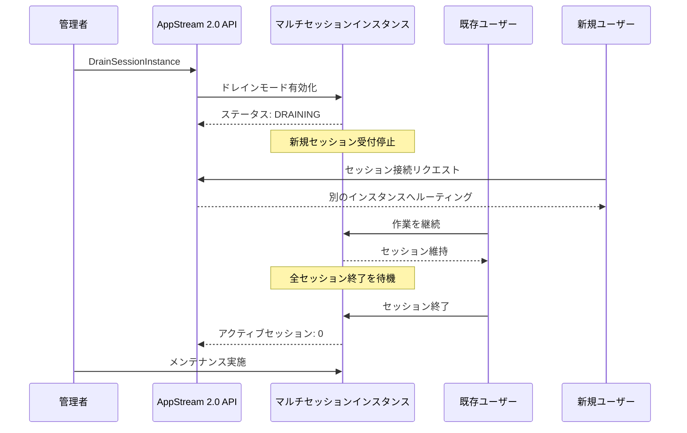

# Amazon WorkSpaces Applications - マルチセッションフリートのドレインモード

**リリース日**: 2026 年 4 月 2 日
**サービス**: Amazon WorkSpaces Applications
**機能**: マルチセッションフリートのドレインモード

[このアップデートのインフォグラフィックを見る](https://takech9203.github.io/aws-news-summary/20260402-amazon-workspaces-applications-drain-mode.html)

## 概要

Amazon WorkSpaces Applications のマルチセッションフリートにおいて、個々のインスタンスに対してドレインモードを設定できるようになりました。ドレインモードを有効にすると、対象のインスタンスは新しいユーザーセッションの受け入れを停止しつつ、既存のセッションは中断されることなく継続できます。

マルチセッションフリートは、1 つのインスタンス上に複数のエンドユーザーセッションをホストすることで、基盤となるインフラストラクチャの使用率を最大化する仕組みです。ドレインモードの導入により、管理者はメンテナンス、スケーリング、システムアップデートの際にアクティブユーザーへの影響を最小限に抑えながら、インスタンスを段階的に空にすることが可能になりました。

この機能は追加料金なしで利用可能であり、Amazon WorkSpaces Applications が提供されているすべての AWS リージョンで使用できます。

**アップデート前の課題**

- マルチセッションインスタンスのメンテナンス時に、アクティブなユーザーセッションを強制的に終了する必要があった
- セキュリティパッチ適用やスケールダウンの際に、ユーザーの作業が中断されるリスクがあった
- インスタンス単位で新規セッションの受け入れを制御する標準的な手段がなかった

**アップデート後の改善**

- ドレインモードにより、既存セッションを維持したまま新規セッションの受け入れを停止できるようになった
- 管理者がインスタンスを段階的に空にできるため、ユーザーへの影響なくメンテナンスを実施できるようになった
- API 経由でドレインモードの状態を監視し、自動化ワークフローに組み込めるようになった

## アーキテクチャ図



管理者がドレインモードを有効にすると、インスタンスは新規セッションの受け入れを停止し、既存ユーザーのセッションが自然に終了するのを待機します。全セッション終了後、管理者はメンテナンスを安全に実施できます。

## サービスアップデートの詳細

### 主要機能

1. **DrainSessionInstance API**
   - 新規追加された API メソッドで、セッション ID を指定してインスタンスのドレインモードを有効化
   - `client.drain_session_instance(SessionId='string')` で呼び出し可能
   - マルチセッションフリートのインスタンスに対してのみ使用可能

2. **ドレインモードステータスの監視**
   - `DescribeSessions` API のレスポンスに `InstanceDrainStatus` フィールドが追加
   - ステータス値: `ACTIVE` (通常動作)、`DRAINING` (ドレイン中)、`NOT_APPLICABLE` (該当なし)
   - インスタンスごとのドレイン状態をリアルタイムで確認可能

3. **ComputeCapacityStatus の拡張**
   - `CreateFleet`、`UpdateFleet`、`DescribeFleets` API のレスポンスに 3 つの新しいフィールドが追加
   - `Draining`: ドレイン中のインスタンス数
   - `DrainModeActiveUserSessions`: ドレイン中インスタンス上のアクティブセッション数
   - `DrainModeUnusedUserSessions`: ドレイン中インスタンス上の未使用セッション数

## 技術仕様

### API 変更の概要

| API メソッド | 変更種別 | 変更内容 |
|------|----------|----------|
| `DrainSessionInstance` | 新規追加 | セッション ID を指定してドレインモードを有効化 |
| `CreateFleet` | レスポンス拡張 | `ComputeCapacityStatus` にドレイン関連フィールド追加 |
| `UpdateFleet` | レスポンス拡張 | `ComputeCapacityStatus` にドレイン関連フィールド追加 |
| `DescribeFleets` | レスポンス拡張 | `ComputeCapacityStatus` にドレイン関連フィールド追加 |
| `DescribeSessions` | レスポンス拡張 | `InstanceDrainStatus` フィールド追加 |

### API 変更履歴

| 日付 | サービス | 変更内容 |
|------|----------|----------|
| 2026/04/02 | [Amazon AppStream](https://awsapichanges.com/archive/changes/d3423d-appstream2.html) | 1 new 4 updated api methods - ドレインモードサポート追加 |
| 2026/03/30 | [Amazon AppStream](https://awsapichanges.com/archive/changes/99ac86-appstream2.html) | 3 updated api methods - URL リダイレクションサポート追加 |

### ComputeCapacityStatus の新規フィールド

```json
{
  "ComputeCapacityStatus": {
    "Desired": 5,
    "Running": 5,
    "InUse": 3,
    "Available": 2,
    "Draining": 1,
    "DrainModeActiveUserSessions": 2,
    "DrainModeUnusedUserSessions": 1
  }
}
```

### InstanceDrainStatus の値

```json
{
  "Sessions": [
    {
      "Id": "session-id",
      "InstanceId": "instance-id",
      "State": "ACTIVE",
      "InstanceDrainStatus": "DRAINING"
    }
  ]
}
```

## 設定方法

### 前提条件

1. Amazon WorkSpaces Applications のマルチセッションフリートが作成済みであること
2. フリートが `RUNNING` 状態であること
3. AWS CLI v2 または対応する SDK がインストール済みであること

### 手順

#### ステップ 1: 対象セッションの確認

```bash
aws appstream describe-sessions \
  --stack-name "my-stack" \
  --fleet-name "my-multi-session-fleet"
```

マルチセッションフリートのセッション一覧を取得し、ドレイン対象のインスタンスに紐づくセッション ID を確認します。

#### ステップ 2: ドレインモードの有効化

```bash
aws appstream drain-session-instance \
  --session-id "session-id-on-target-instance"
```

指定したセッションが存在するインスタンスのドレインモードを有効化します。以降、そのインスタンスは新規セッションの受け入れを停止します。

#### ステップ 3: ドレイン状態の監視

```bash
aws appstream describe-fleets \
  --names "my-multi-session-fleet" \
  --query "Fleets[0].ComputeCapacityStatus.{Draining:Draining,ActiveSessions:DrainModeActiveUserSessions,UnusedSessions:DrainModeUnusedUserSessions}"
```

フリートの `ComputeCapacityStatus` を確認し、ドレイン中のインスタンス数とアクティブセッション数を監視します。`DrainModeActiveUserSessions` が 0 になったらメンテナンスを開始できます。

## メリット

### ビジネス面

- **ユーザー体験の向上**: メンテナンス時にユーザーの作業が中断されないため、業務の生産性を維持できる
- **計画的なメンテナンス**: スケジュールに基づいた段階的なインスタンス入れ替えが可能になり、運用の予測可能性が向上する
- **追加コストなし**: 既存の料金体系の中で利用でき、新たな費用は発生しない

### 技術面

- **API による自動化**: `DrainSessionInstance` API により、メンテナンスワークフローの自動化が容易になる
- **きめ細かな制御**: インスタンス単位でドレインモードを制御できるため、フリート全体を停止する必要がない
- **監視の強化**: `ComputeCapacityStatus` の新フィールドにより、ドレイン中のインスタンスとセッションの状態をリアルタイムで把握できる

## デメリット・制約事項

### 制限事項

- マルチセッションフリートのみが対象であり、シングルセッションフリートには適用されない
- ドレインモードはインスタンスの新規セッション受け入れを停止するのみで、既存セッションの強制終了機能は提供しない
- ドレインモード解除の明示的な API は確認されておらず、セッション完了後のインスタンス再利用の方法については公式ドキュメントの確認が必要

### 考慮すべき点

- ドレイン中のインスタンスは新規ユーザーを受け入れないため、フリート全体のキャパシティ計画に影響する可能性がある
- 長時間のセッションが存在する場合、ドレインモードが完了するまでの待機時間が長くなる可能性がある

## ユースケース

### ユースケース 1: セキュリティパッチの適用

**シナリオ**: セキュリティパッチを適用するために、マルチセッションフリートのインスタンスを順次メンテナンスする必要がある。

**実装例**:
```bash
# 対象インスタンスのセッションを確認
aws appstream describe-sessions \
  --stack-name "production-stack" \
  --fleet-name "multi-session-fleet" \
  --instance-id "i-0123456789abcdef0"

# ドレインモードを有効化
aws appstream drain-session-instance \
  --session-id "target-session-id"

# 全セッション終了後にメンテナンスを実施
```

**効果**: ユーザーの作業を中断することなく、セキュリティパッチを順次適用できる。

### ユースケース 2: スケールダウンの最適化

**シナリオ**: 業務時間外にフリートのインスタンス数を削減する際、アクティブなセッションが残っているインスタンスのユーザーに影響を与えずにスケールダウンしたい。

**実装例**:
```bash
# フリートのキャパシティ状況を確認
aws appstream describe-fleets \
  --names "multi-session-fleet" \
  --query "Fleets[0].ComputeCapacityStatus"

# 使用率の低いインスタンスをドレインモードに設定
aws appstream drain-session-instance \
  --session-id "low-usage-session-id"

# ドレイン完了後にフリートのキャパシティを更新
aws appstream update-fleet \
  --name "multi-session-fleet" \
  --compute-capacity DesiredSessions=50
```

**効果**: アクティブユーザーへの影響なく、コスト効率の良いスケールダウンを実現できる。

### ユースケース 3: アプリケーションイメージの更新

**シナリオ**: 新しいアプリケーションバージョンを含むイメージに更新する際、既存ユーザーのセッションを維持しながらインスタンスを入れ替えたい。

**実装例**:
```bash
# 既存インスタンスを順次ドレインモードに設定
for session_id in $(aws appstream describe-sessions \
  --stack-name "app-stack" \
  --fleet-name "app-fleet" \
  --query "Sessions[].Id" --output text); do
  aws appstream drain-session-instance --session-id "$session_id"
done

# 新しいイメージでフリートを更新
aws appstream update-fleet \
  --name "app-fleet" \
  --image-name "new-app-image-v2"
```

**効果**: ゼロダウンタイムでアプリケーションイメージの更新を実施でき、ユーザーへの影響を最小化できる。

## 料金

ドレインモードは追加料金なしで利用できます。Amazon WorkSpaces Applications の既存の従量課金制 (Pay-as-you-go) の料金体系がそのまま適用されます。

| 項目 | 料金 |
|------|------|
| ドレインモード機能 | 無料 (追加料金なし) |
| インスタンス利用料 | 既存の従量課金制が適用 |

## 利用可能リージョン

Amazon WorkSpaces Applications が提供されているすべての AWS リージョンで利用可能です。AWS GovCloud (US) リージョンを含みます。

## 関連サービス・機能

- **Amazon WorkSpaces**: 仮想デスクトップサービス。WorkSpaces Applications はアプリケーションストリーミングに特化
- **Amazon AppStream 2.0**: WorkSpaces Applications の基盤となるアプリケーションストリーミングサービス
- **AWS Auto Scaling**: フリートのスケーリングポリシーと組み合わせることで、ドレインモードを活用した効率的なスケーリングが可能

## 参考リンク

- [インフォグラフィック](https://takech9203.github.io/aws-news-summary/20260402-amazon-workspaces-applications-drain-mode.html)
- [公式発表 (What's New)](https://aws.amazon.com/about-aws/whats-new/2026/04/amazon-workspaces-applications-drain-mode/)
- [Amazon WorkSpaces Applications ドキュメント](https://docs.aws.amazon.com/appstream2/latest/developerguide/)
- [Amazon WorkSpaces Applications 料金](https://aws.amazon.com/appstream2/pricing/)
- [API リファレンス - DrainSessionInstance](https://docs.aws.amazon.com/appstream2/latest/APIReference/API_DrainSessionInstance.html)

## まとめ

Amazon WorkSpaces Applications のドレインモードは、マルチセッションフリートの運用管理を大幅に改善する機能です。メンテナンスやスケーリング時にアクティブなユーザーセッションを中断することなく、インスタンスを段階的に空にできるようになります。追加料金なしで利用可能なため、マルチセッションフリートを運用しているすべての管理者は、メンテナンスワークフローにドレインモードを組み込むことを推奨します。
