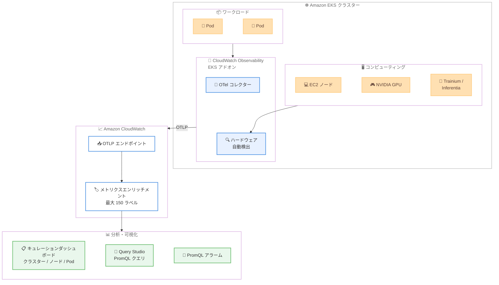

# Amazon CloudWatch - OTel Container Insights for Amazon EKS

**リリース日**: 2026 年 4 月 2 日
**サービス**: Amazon CloudWatch / Amazon EKS
**機能**: Container Insights with OpenTelemetry metrics for Amazon EKS (パブリックプレビュー)

📊 [このアップデートのインフォグラフィックを見る](https://takech9203.github.io/aws-news-summary/20260402-cloudwatch-otel-container-insights-eks.html)

## 概要

Amazon CloudWatch が Container Insights に OpenTelemetry メトリクスのサポートを導入しました (パブリックプレビュー)。この機能により、Amazon EKS クラスターからオープンソースおよび AWS コレクターを通じてより多くのメトリクスを収集し、OpenTelemetry Protocol (OTLP) を使用して CloudWatch に送信できるようになります。

各メトリクスには Kubernetes メタデータやユーザー定義ラベルを含む最大 150 の記述ラベルが自動的に付与されます。キュレーションされたダッシュボードにより、クラスター、ノード、Pod のヘルスをインスタンスタイプ、アベイラビリティーゾーン、ノードグループ、カスタムラベルで集約・フィルタリングして可視化できます。さらに、CloudWatch Query Studio で PromQL クエリを直接記述して分析を行うことが可能です。

**アップデート前の課題**

- Container Insights の従来のメトリクス収集では、収集可能なメトリクスの種類やラベルの詳細度に限界があった
- NVIDIA GPU、AWS Trainium/Inferentia、EFA などのアクセラレーテッドコンピューティングハードウェアの自動検出と監視が困難だった
- PromQL を使用した柔軟なメトリクスクエリを CloudWatch 上で直接実行する手段が限られていた

**アップデート後の改善**

- OpenTelemetry Protocol を通じて、より豊富なメトリクスと最大 150 のラベルを持つ詳細なテレメトリデータの収集が可能になった
- NVIDIA GPU、EFA、AWS Trainium、AWS Inferentia を含むアクセラレーテッドハードウェアの自動検出に対応した
- CloudWatch Query Studio で PromQL クエリを使用した高度なメトリクス分析が可能になった

## アーキテクチャ図



Amazon EKS クラスター内の OTel コレクターがワークロードとハードウェアからメトリクスを収集し、OTLP を通じて CloudWatch に送信する全体的なデータフローを示しています。

## サービスアップデートの詳細

### 主要機能

1. **OpenTelemetry Protocol によるメトリクス収集**
   - オープンソースおよび AWS のコレクターからより多くのメトリクスを収集可能
   - OTLP を使用して CloudWatch にメトリクスを送信
   - 各メトリクスに最大 150 の記述ラベルを自動付与 (Kubernetes メタデータ、ユーザー定義ラベルを含む)

2. **キュレーションダッシュボード**
   - クラスター、ノード、Pod のヘルスをリアルタイムで可視化
   - インスタンスタイプ、アベイラビリティーゾーン、ノードグループ、カスタムラベルによる集約・フィルタリング
   - 運用チームが即座にクラスターの状態を把握可能

3. **PromQL クエリサポート**
   - CloudWatch Query Studio で PromQL クエリを直接記述・実行可能
   - OTLP エンドポイントで取り込んだメトリクスに対する PromQL アラームの設定に対応
   - Prometheus 互換のクエリ言語による柔軟な分析

4. **アクセラレーテッドハードウェアの自動検出**
   - NVIDIA GPU の自動検出と関連メトリクスの収集
   - Elastic Fabric Adapter (EFA) の検出
   - AWS Trainium および AWS Inferentia チップの自動認識

5. **ワンクリックインストール**
   - CloudWatch Observability EKS アドオンによる簡易セットアップ
   - Amazon EKS コンソール、CloudFormation、CDK、Terraform からのデプロイに対応

## 技術仕様

### 対応環境

| 項目 | 詳細 |
|------|------|
| プロトコル | OpenTelemetry Protocol (OTLP) |
| ラベル数 | メトリクスあたり最大 150 |
| ラベル種別 | Kubernetes メタデータ、ユーザー定義ラベル |
| クエリ言語 | PromQL (CloudWatch Query Studio) |
| 対応ハードウェア | NVIDIA GPU、EFA、AWS Trainium、AWS Inferentia |
| デプロイ方法 | EKS コンソール、CloudFormation、CDK、Terraform |

### API 変更履歴

| 日付 | サービス | 変更内容 |
|------|----------|----------|
| 2026/04/02 | [Amazon CloudWatch](https://awsapichanges.com/archive/changes/d3423d-monitoring.html) | 3 new 3 updated api methods - OTel Enrichment API の追加 (StartOTelEnrichment, StopOTelEnrichment, GetOTelEnrichment) および PromQL ベースのアラーム機能の追加 (DescribeAlarms, DescribeAlarmsForMetric, PutMetricAlarm に EvaluationCriteria.PromQLCriteria を追加) |

### 新規 API メソッド

```python
# OTel Enrichment の開始
client.start_o_tel_enrichment()

# OTel Enrichment のステータス取得
response = client.get_o_tel_enrichment()
# response: {'Status': 'Running'|'Stopped'}

# OTel Enrichment の停止
client.stop_o_tel_enrichment()
```

### PromQL アラーム設定例

```python
client.put_metric_alarm(
    AlarmName='eks-pod-cpu-high',
    EvaluationCriteria={
        'PromQLCriteria': {
            'Query': 'avg(container_cpu_usage_seconds_total{namespace="production"}) > 0.8',
            'PendingPeriod': 300,
            'RecoveryPeriod': 300
        }
    },
    EvaluationInterval=60,
    AlarmActions=['arn:aws:sns:us-east-1:123456789012:alerts']
)
```

## 設定方法

### 前提条件

1. Amazon EKS クラスターが稼働していること
2. EKS クラスターの Kubernetes バージョンがサポート対象であること
3. 適切な IAM 権限が設定されていること

### 手順

#### ステップ 1: CloudWatch Observability EKS アドオンのインストール

```bash
aws eks create-addon \
  --cluster-name my-cluster \
  --addon-name amazon-cloudwatch-observability \
  --region us-east-1
```

CloudWatch Observability EKS アドオンをクラスターにインストールします。このアドオンにより、OTel コレクターが自動的にデプロイされ、メトリクス収集が開始されます。

#### ステップ 2: OTel Enrichment の有効化

```bash
aws cloudwatch start-o-tel-enrichment
```

OTel Enrichment を有効化して、収集されたメトリクスに Kubernetes メタデータやリソースラベルが自動的に付与されるようにします。

#### ステップ 3: ダッシュボードでの確認

CloudWatch コンソールの Container Insights セクションにアクセスし、キュレーションダッシュボードでクラスターのヘルスを確認します。Query Studio で PromQL クエリを使用して、カスタム分析を実行することも可能です。

## メリット

### ビジネス面

- **運用コストの削減**: ワンクリックインストールと自動検出により、監視セットアップの工数を大幅に削減
- **プレビュー期間中の無料利用**: パブリックプレビュー期間中は追加料金なしで全機能を評価可能
- **障害検知の迅速化**: 最大 150 ラベルによる詳細なメトリクスとキュレーションダッシュボードにより、問題の特定が高速化

### 技術面

- **OpenTelemetry 標準準拠**: オープンスタンダードの OTLP を採用し、ベンダーロックインを回避
- **PromQL 互換**: Prometheus ユーザーが既存の知識とクエリをそのまま活用可能
- **AI/ML ワークロード対応**: GPU、Trainium、Inferentia の自動検出により、機械学習ワークロードの監視が容易

## デメリット・制約事項

### 制限事項

- パブリックプレビューのため、本番環境での利用は慎重に検討が必要
- 利用可能リージョンが 5 リージョンに限定されている
- プレビュー期間中の SLA は提供されない

### 考慮すべき点

- プレビューから GA (一般提供) への移行時に仕様変更が発生する可能性がある
- OTLP エンドポイントへのメトリクス送信量が増加するため、GA 後の料金体系を事前に確認しておくことが望ましい
- 既存の Container Insights セットアップからの移行パスを検討する必要がある

## ユースケース

### ユースケース 1: AI/ML 推論ワークロードの GPU 監視

**シナリオ**: EKS 上で NVIDIA GPU を使用した推論ワークロードを運用しており、GPU 使用率やメモリ消費を詳細に監視したい。

**実装例**:
```bash
# CloudWatch Observability アドオンをインストール
aws eks create-addon \
  --cluster-name ml-inference-cluster \
  --addon-name amazon-cloudwatch-observability

# Query Studio で GPU メトリクスを PromQL で分析
# gpu_utilization{cluster="ml-inference-cluster", instance_type="p5.48xlarge"}
```

**効果**: GPU ハードウェアが自動検出され、設定不要で GPU 使用率、メモリ、温度などのメトリクスが CloudWatch に送信される。PromQL による柔軟なクエリで、推論レイテンシとリソース利用率の相関分析が可能。

### ユースケース 2: マルチテナント EKS クラスターの Namespace 別監視

**シナリオ**: 複数のチームが共有する EKS クラスターで、Namespace ごとのリソース使用状況を把握し、コスト配分やキャパシティプランニングに活用したい。

**実装例**:
```promql
# Namespace 別の CPU 使用率集計
sum by (namespace) (
  rate(container_cpu_usage_seconds_total{cluster="shared-cluster"}[5m])
)

# Namespace 別のメモリ使用量
sum by (namespace) (
  container_memory_working_set_bytes{cluster="shared-cluster"}
)
```

**効果**: 最大 150 のラベルにより Namespace、チーム、コストセンターなどのカスタムラベルでメトリクスを集約・フィルタリングでき、チーム別のリソース使用状況を正確に把握可能。

### ユースケース 3: AWS Trainium を使用した分散トレーニングの監視

**シナリオ**: AWS Trainium インスタンスを使用した大規模な分散モデルトレーニングジョブを EKS 上で実行しており、ニューロンデバイスの稼働状況をリアルタイムで監視したい。

**実装例**:
```bash
# EKS アドオンをインストール - Trainium が自動検出される
aws eks create-addon \
  --cluster-name training-cluster \
  --addon-name amazon-cloudwatch-observability

# PromQL アラームで異常を検出
aws cloudwatch put-metric-alarm \
  --alarm-name "trainium-utilization-low" \
  --evaluation-criteria '{
    "PromQLCriteria": {
      "Query": "avg(neuron_device_utilization{cluster=\"training-cluster\"}) < 0.5",
      "PendingPeriod": 600,
      "RecoveryPeriod": 300
    }
  }' \
  --evaluation-interval 60
```

**効果**: Trainium デバイスの自動検出により、ニューロンコアの使用率やメモリ消費を設定不要で監視可能。利用率低下時のアラームにより、トレーニングジョブの異常を早期に検出。

## 料金

プレビュー期間中は追加料金なしで利用できます。

GA (一般提供) 後は、CloudWatch の標準的なメトリクス料金が適用される見込みです。具体的な料金体系については、GA 時のアナウンスを確認してください。

| 項目 | プレビュー期間中 |
|------|------------------|
| Container Insights OTel メトリクス | 無料 |
| キュレーションダッシュボード | 無料 |
| PromQL クエリ | 無料 |

## 利用可能リージョン

パブリックプレビューとして以下の 5 リージョンで利用可能です。

| リージョン名 | リージョンコード |
|-------------|-----------------|
| US East (N. Virginia) | us-east-1 |
| US West (Oregon) | us-west-2 |
| Asia Pacific (Sydney) | ap-southeast-2 |
| Asia Pacific (Singapore) | ap-southeast-1 |
| Europe (Ireland) | eu-west-1 |

## 関連サービス・機能

- **Amazon CloudWatch Container Insights**: EKS および ECS のコンテナワークロード監視の基盤となるサービス。今回の OTel 対応はその拡張
- **AWS Distro for OpenTelemetry (ADOT)**: AWS がサポートする OpenTelemetry ディストリビューション。OTel コレクターとして連携
- **Amazon CloudWatch Query Studio**: PromQL を含む複数のクエリ言語でメトリクスを分析するためのインターフェース
- **Amazon EKS アドオン**: EKS クラスターに運用ソフトウェアを簡単に追加するための仕組み。CloudWatch Observability アドオンとして提供

## 参考リンク

- 📊 [インフォグラフィック](https://takech9203.github.io/aws-news-summary/20260402-cloudwatch-otel-container-insights-eks.html)
- [公式発表 (What's New)](https://aws.amazon.com/about-aws/whats-new/2026/04/cloudwatch-otel-container-insights-eks/)
- [Amazon CloudWatch Container Insights ドキュメント](https://docs.aws.amazon.com/AmazonCloudWatch/latest/monitoring/ContainerInsights.html)
- [Amazon CloudWatch 料金ページ](https://aws.amazon.com/cloudwatch/pricing/)
- [Amazon EKS アドオン ドキュメント](https://docs.aws.amazon.com/eks/latest/userguide/eks-add-ons.html)

## まとめ

Amazon CloudWatch の OTel Container Insights for Amazon EKS は、OpenTelemetry 標準に基づいた EKS クラスターの高度な可視化を実現するアップデートです。最大 150 ラベルの自動付与、PromQL クエリ対応、GPU/Trainium/Inferentia の自動検出により、特に AI/ML ワークロードを運用する組織にとって大きな価値をもたらします。プレビュー期間中は無料で利用できるため、対象リージョンで EKS を運用している場合は、早期に評価を開始することを推奨します。
