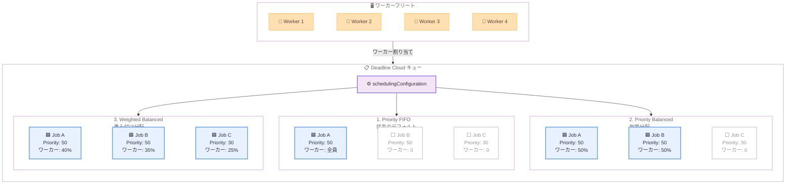

# AWS Deadline Cloud - キューのジョブスケジューリングモード設定

**リリース日**: 2026 年 4 月 2 日
**サービス**: AWS Deadline Cloud
**機能**: キューに対する設定可能なジョブスケジューリングモード

📊 [このアップデートのインフォグラフィックを見る](https://takech9203.github.io/aws-news-summary/20260402-deadline-cloud-job-scheduling.html)

## 概要

AWS Deadline Cloud において、キューごとにジョブスケジューリングモードを設定できる機能が追加されました。これにより、キュー内のジョブに対してワーカーをどのように分配するかを制御できるようになります。映像制作やアニメーション、VFX などのレンダリングワークロードにおいて、チームの作業効率を大幅に向上させる機能です。

従来は、すべての利用可能なワーカーが優先度の最も高い最初に送信されたジョブに集中的に割り当てられていました。今回のアップデートにより、3 つのスケジューリングモードから選択できるようになり、ワークロードの特性に応じた最適なワーカー分配が可能になります。特に Priority Balanced モードと Weighted Balanced モードでは、アーティストが先行ジョブの完了を待たずに新しいサブミッションのフィードバックを即座に得ることが可能になります。

**アップデート前の課題**

- すべてのワーカーが最も優先度の高い最初に送信されたジョブに集中するため、後続のジョブの処理開始が遅延していた
- アーティストが新しいジョブを送信しても、先行ジョブが完了するまでレンダリング結果のフィードバックを得られなかった
- ジョブの特性 (エラー数、レンダリングタスク数など) に基づいたワーカー分配の最適化ができなかった
- 複数のアーティストが同じキューを共有する環境で、公平なリソース配分が困難だった

**アップデート後の改善**

- 3 つのスケジューリングモードからワークロードに適した方式を選択可能になった
- Priority Balanced モードにより、同一優先度のジョブ間でワーカーを均等に分配できるようになった
- Weighted Balanced モードにより、優先度、エラー数、送信時刻、レンダリングタスク数などのパラメータに基づいた重み付けスケジューリングが可能になった
- アーティストがジョブ送信直後にフィードバックを得られるようになり、イテレーション速度が向上した

## アーキテクチャ図



3 つのスケジューリングモードにおけるワーカー分配の違いを示しています。Priority FIFO では最優先ジョブに全ワーカーが集中し、Priority Balanced では同一優先度のジョブ間で均等に分配され、Weighted Balanced では複数のパラメータに基づいて全ジョブに重み付けで分配されます。

## サービスアップデートの詳細

### 主要機能

1. **Priority FIFO モード**
   - 従来のデフォルトスケジューリング方式
   - 利用可能なすべてのワーカーを、最も優先度が高く最初に送信されたジョブに割り当てる
   - そのジョブが完了すると次のジョブにワーカーが移動する
   - 個々のジョブの最速完了を重視するワークロードに適している

2. **Priority Balanced モード**
   - 最も高い優先度レベルのすべてのジョブにワーカーを均等に分配する
   - 同一優先度のジョブ間で公平なリソース配分を実現
   - `renderingTaskBuffer` パラメータでレンダリングタスクのバッファサイズを設定可能
   - 複数のアーティストが同時にフィードバックを必要とする環境に適している

3. **Weighted Balanced モード**
   - 複数の設定可能なパラメータに基づいてジョブに重みを付けてワーカーを分配する
   - 優先度 (`priorityWeight`)、エラー数 (`errorWeight`)、送信時刻 (`submissionTimeWeight`)、レンダリングタスク数 (`renderingTaskWeight`) の 4 つの重みパラメータを調整可能
   - `maxPriorityOverride` で特定ジョブを常に最優先でスケジュール可能
   - `minPriorityOverride` で特定ジョブを常に最後にスケジュール可能
   - 最も柔軟なスケジューリングが必要な大規模レンダリング環境に適している

## 技術仕様

### スケジューリングモード比較

| 項目 | Priority FIFO | Priority Balanced | Weighted Balanced |
|------|--------------|-------------------|-------------------|
| ワーカー分配 | 最優先ジョブに全集中 | 同一優先度間で均等分配 | 重みパラメータで分配 |
| 優先度の扱い | 最高優先度のジョブのみ実行 | 最高優先度のジョブ群に分配 | 全ジョブに重み付けで分配 |
| フィードバック速度 | 後続ジョブは遅延 | 同一優先度は即時 | 全ジョブで即時 |
| 設定パラメータ | なし | renderingTaskBuffer | priorityWeight, errorWeight, submissionTimeWeight, renderingTaskWeight, renderingTaskBuffer |
| 推奨ユースケース | 単一ジョブの最速完了 | チーム間の公平な分配 | 大規模環境の最適化 |

### API 変更履歴

| 日付 | サービス | 変更内容 |
|------|----------|----------|
| 2026/04/02 | [AWSDeadlineCloud](https://awsapichanges.com/archive/changes/d3423d-deadline.html) | 3 updated methods - CreateQueue, GetQueue, UpdateQueue に schedulingConfiguration パラメータを追加 |

### schedulingConfiguration パラメータ

```json
{
  "schedulingConfiguration": {
    "priorityFifo": {},
    "priorityBalanced": {
      "renderingTaskBuffer": 123
    },
    "weightedBalanced": {
      "priorityWeight": 1.0,
      "errorWeight": 0.5,
      "submissionTimeWeight": 0.3,
      "renderingTaskWeight": 0.2,
      "renderingTaskBuffer": 100,
      "maxPriorityOverride": {
        "alwaysScheduleFirst": {}
      },
      "minPriorityOverride": {
        "alwaysScheduleLast": {}
      }
    }
  }
}
```

`schedulingConfiguration` は union 型で、3 つのモードのうちいずれか 1 つを指定します。`weightedBalanced` では各重みパラメータを `double` 型で指定し、ジョブの優先度スコアの計算に使用されます。

### IAM 権限

スケジューリングモードの設定には、既存の `deadline:CreateQueue` および `deadline:UpdateQueue` の IAM アクション権限が必要です。新しい IAM アクションの追加はありません。

## 設定方法

### 前提条件

1. AWS Deadline Cloud のファーム (Farm) が作成済みであること
2. `deadline:CreateQueue` または `deadline:UpdateQueue` の IAM 権限を持つユーザーまたはロール
3. AWS CLI v2 の最新バージョン (schedulingConfiguration パラメータに対応)

### 手順

#### ステップ 1: Priority Balanced モードでキューを作成

```bash
aws deadline create-queue \
  --farm-id farm-xxxxxxxxxxxxxxxxx \
  --display-name "VFX-Rendering-Queue" \
  --scheduling-configuration '{
    "priorityBalanced": {
      "renderingTaskBuffer": 50
    }
  }'
```

`priorityBalanced` モードでキューを作成します。`renderingTaskBuffer` はレンダリングタスクのバッファサイズを指定し、スケジューリングの効率を調整します。

#### ステップ 2: 既存キューのスケジューリングモードを変更

```bash
aws deadline update-queue \
  --farm-id farm-xxxxxxxxxxxxxxxxx \
  --queue-id queue-xxxxxxxxxxxxxxxxx \
  --scheduling-configuration '{
    "weightedBalanced": {
      "priorityWeight": 1.0,
      "errorWeight": 0.5,
      "submissionTimeWeight": 0.3,
      "renderingTaskWeight": 0.2,
      "renderingTaskBuffer": 100
    }
  }'
```

既存のキューを `weightedBalanced` モードに変更します。各重みパラメータは、ジョブのスケジューリングスコア計算における各要素の影響度を制御します。

#### ステップ 3: キューのスケジューリング設定を確認

```bash
aws deadline get-queue \
  --farm-id farm-xxxxxxxxxxxxxxxxx \
  --queue-id queue-xxxxxxxxxxxxxxxxx \
  --query "schedulingConfiguration"
```

キューに設定されているスケジューリングモードとパラメータを確認します。`--query` オプションで `schedulingConfiguration` のみを抽出して表示します。

## メリット

### ビジネス面

- **アーティストの生産性向上**: ジョブ送信後すぐにレンダリング結果のフィードバックを得られるため、イテレーションサイクルが短縮される
- **チーム間の公平なリソース配分**: 複数のアーティストやプロジェクトが同じキューを共有する場合に、公平なワーカー分配が可能になる
- **プロジェクト管理の柔軟性**: ワークロードの特性に応じてスケジューリング方式を切り替えることで、納期やリソース効率を最適化できる

### 技術面

- **細粒度の制御**: Weighted Balanced モードの 4 つの重みパラメータにより、スケジューリングロジックを詳細にチューニング可能
- **優先度オーバーライド**: `maxPriorityOverride` と `minPriorityOverride` で特定ジョブのスケジューリング順序を強制的に制御可能
- **既存 API との互換性**: 新しい API エンドポイントは追加されず、既存の CreateQueue、GetQueue、UpdateQueue API にパラメータが追加される形式で後方互換性を維持
- **キュー単位の設定**: キューごとに異なるスケジューリングモードを設定でき、ワークロードの種類に応じた最適化が可能

## デメリット・制約事項

### 制限事項

- `schedulingConfiguration` は union 型のため、3 つのモードのうち同時に 1 つしか設定できない
- Weighted Balanced モードの重みパラメータの最適値はワークロードに依存するため、チューニングが必要
- スケジューリングモードの変更は実行中のジョブへの影響について、公式ドキュメントでの確認が必要

### 考慮すべき点

- Priority FIFO から他のモードに変更すると、個々のジョブの完了時間は長くなる可能性がある (ワーカーが分散されるため)
- Weighted Balanced モードの重みパラメータは、実際のワークロードでテストしながら段階的に調整することを推奨
- `renderingTaskBuffer` の値が小さすぎるとスケジューリングの効率が低下し、大きすぎるとメモリ使用量が増加する可能性がある

## ユースケース

### ユースケース 1: VFX スタジオでの複数アーティスト環境

**シナリオ**: VFX スタジオで複数のアーティストが同じキューを使用してレンダリングジョブを送信している。各アーティストが素早くプレビュー結果を確認したい。

**実装例**:
```bash
aws deadline update-queue \
  --farm-id farm-xxxxxxxxxxxxxxxxx \
  --queue-id queue-xxxxxxxxxxxxxxxxx \
  --scheduling-configuration '{
    "priorityBalanced": {
      "renderingTaskBuffer": 30
    }
  }'
```

**効果**: 同一優先度のジョブにワーカーが均等に分配されるため、全アーティストが並行してレンダリング結果のフィードバックを受けられる。先行ジョブの完了を待つ必要がなくなり、チーム全体の作業効率が向上する。

### ユースケース 2: 大規模プロダクション環境での最適化

**シナリオ**: アニメーション制作会社で、優先度の異なる複数のプロジェクト (締切の近い本番レンダリング、テストレンダリング、プレビュー生成) が混在している。

**実装例**:
```bash
aws deadline update-queue \
  --farm-id farm-xxxxxxxxxxxxxxxxx \
  --queue-id queue-xxxxxxxxxxxxxxxxx \
  --scheduling-configuration '{
    "weightedBalanced": {
      "priorityWeight": 2.0,
      "errorWeight": 1.0,
      "submissionTimeWeight": 0.5,
      "renderingTaskWeight": 0.3,
      "renderingTaskBuffer": 100,
      "maxPriorityOverride": {
        "alwaysScheduleFirst": {}
      }
    }
  }'
```

**効果**: 優先度の高いジョブにより多くのワーカーが割り当てられつつ、低優先度のジョブにも一定のワーカーが分配される。`errorWeight` によりエラーの多いジョブの優先度が調整され、`maxPriorityOverride` で緊急ジョブを最優先で処理できる。

### ユースケース 3: 単一プロジェクトの最速完了

**シナリオ**: 納期が迫っているプロジェクトで、1 つのジョブをできるだけ早く完了させる必要がある。

**実装例**:
```bash
aws deadline update-queue \
  --farm-id farm-xxxxxxxxxxxxxxxxx \
  --queue-id queue-xxxxxxxxxxxxxxxxx \
  --scheduling-configuration '{
    "priorityFifo": {}
  }'
```

**効果**: 従来のデフォルト動作と同じく、最も優先度の高い最初に送信されたジョブにすべてのワーカーが集中するため、個々のジョブの完了時間が最短になる。

## 料金

ジョブスケジューリングモードの設定自体に追加料金は発生しません。AWS Deadline Cloud の標準料金が適用されます。

### 料金例

| 項目 | 料金 |
|------|------|
| Deadline Cloud ワーカー | ワーカーの使用時間に基づく従量課金 |
| API リクエスト | CreateQueue、UpdateQueue、GetQueue の API コールに追加料金なし |

※ 最新の料金は [AWS Deadline Cloud 料金ページ](https://aws.amazon.com/deadline-cloud/pricing/) を参照してください。

## 利用可能リージョン

このアップデートは、AWS Deadline Cloud がサポートされているすべての AWS リージョンで利用可能です。

## 関連サービス・機能

- **AWS Deadline Cloud フリート**: ワーカーの自動スケーリングやインスタンス管理を行う機能。スケジューリングモードと組み合わせてリソース配分を最適化
- **AWS Deadline Cloud ファーム**: キューやフリートを管理する最上位のリソース。複数のキューに異なるスケジューリングモードを設定可能
- **AWS Deadline Cloud モニター**: Deadline Cloud のウェブベース UI。アーティストがジョブの状態やレンダリング結果を確認する際に使用
- **Amazon CloudWatch**: Deadline Cloud のメトリクスを監視し、ワーカーの使用率やジョブの完了状況をダッシュボードで可視化

## 参考リンク

- 📊 [インフォグラフィック](https://takech9203.github.io/aws-news-summary/20260402-deadline-cloud-job-scheduling.html)
- [公式発表 (What's New)](https://aws.amazon.com/about-aws/whats-new/2026/04/deadline-cloud-job-scheduling/)
- [ドキュメント - AWS Deadline Cloud](https://docs.aws.amazon.com/deadline-cloud/latest/userguide/)
- [API リファレンス - CreateQueue](https://docs.aws.amazon.com/deadline-cloud/latest/APIReference/API_CreateQueue.html)
- [API リファレンス - UpdateQueue](https://docs.aws.amazon.com/deadline-cloud/latest/APIReference/API_UpdateQueue.html)
- [料金ページ - AWS Deadline Cloud](https://aws.amazon.com/deadline-cloud/pricing/)

## まとめ

AWS Deadline Cloud のキューにおけるジョブスケジューリングモードの設定機能により、ワーカーの分配方式を Priority FIFO、Priority Balanced、Weighted Balanced の 3 つから選択できるようになりました。特に Priority Balanced と Weighted Balanced モードでは、アーティストがジョブ送信直後にレンダリング結果のフィードバックを得られるため、VFX やアニメーション制作におけるイテレーション速度が大幅に向上します。API レベルでは CreateQueue、GetQueue、UpdateQueue に `schedulingConfiguration` パラメータが追加されており、既存のキューに対しても動的にスケジューリングモードを変更できます。複数のアーティストやプロジェクトが同じキューを共有する環境では、Priority Balanced または Weighted Balanced モードの導入を検討することを推奨します。
