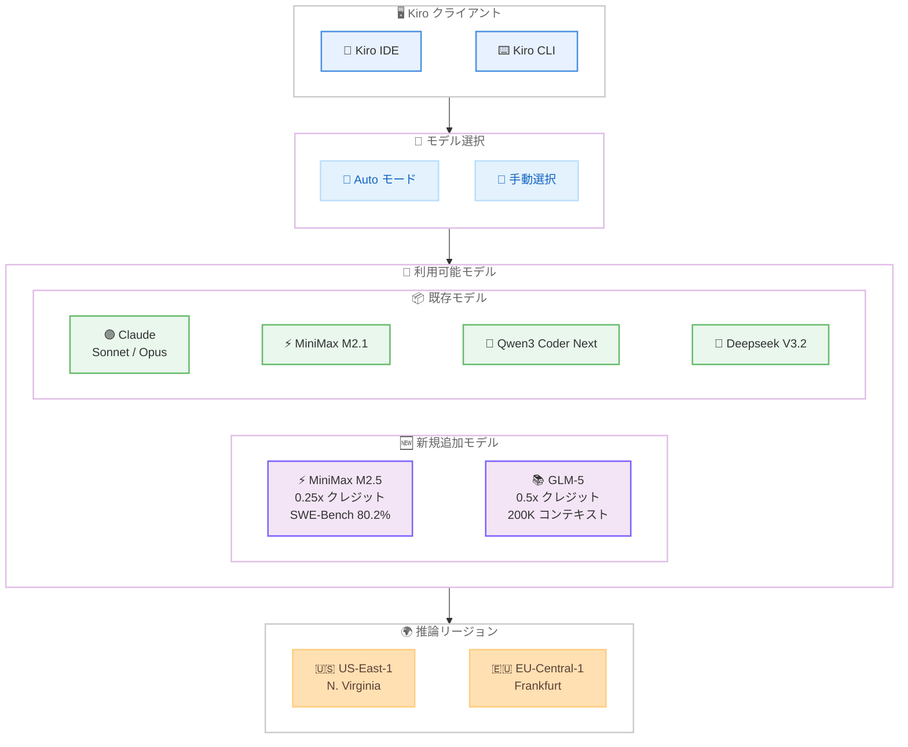

# Kiro - MiniMax M2.5 および GLM-5 モデルの追加

**リリース日**: 2026 年 4 月 2 日
**サービス**: Kiro
**機能**: MiniMax M2.5 および GLM-5 モデルのネイティブサポート

📊 [このアップデートのインフォグラフィックを見る](https://takech9203.github.io/aws-news-summary/20260402-kiro-minimax-m25-glm5.html)

## 概要

Kiro IDE および CLI において、オープンウェイトモデルである MiniMax M2.5 と GLM-5 が新たに利用可能になりました。Kiro はコスト・コンテキスト・速度のスペクトラム全体にわたるモデルをサポートしており、今回の 2 つのモデル追加によって開発者やチームがタスクに応じて最適なモデルを選択できる幅がさらに広がります。

MiniMax M2.5 はクレジット倍率 0.25x のコスト効率に優れたスパース MoE モデルで、SWE-Bench Verified で 80.2% のスコアを達成し、オープンウェイトモデルとして初めて Claude Sonnet を超える性能を記録しました。GLM-5 はクレジット倍率 0.5x で 200K のコンテキストウィンドウを持つ大規模 MoE モデルであり、リポジトリ規模のコンテキスト処理と長期的なエージェントワークフローに最適化されています。

さらに、既存のオープンウェイトモデルである MiniMax M2.1、Qwen3 Coder Next、Deepseek V3.2 が IAM Identity Center 経由の認証ユーザーを含むすべてのユーザーに利用可能となり、一部モデルは EU-Central-1 リージョンでも利用できるようになりました。

**アップデート前の課題**

- Kiro で利用可能なオープンウェイトモデルの選択肢が限られており、特にコスト効率と高性能を両立するモデルが不足していた
- 200K レベルの大規模コンテキストウィンドウを持つモデルがなく、リポジトリ規模のコードベースを一括で処理するユースケースに対応が困難だった
- IAM Identity Center 経由で認証するエンタープライズユーザーは、一部のオープンウェイトモデルにアクセスできなかった
- EU リージョンで利用可能なモデルが限定されており、データレジデンシー要件を持つチームの選択肢が少なかった

**アップデート後の改善**

- MiniMax M2.5 の追加により、0.25x クレジットという低コストで SWE-Bench Verified 80.2% の高性能コーディングモデルが利用可能になった
- GLM-5 の 200K コンテキストウィンドウにより、大規模コードベースのクロスファイルマイグレーションやリファクタリングが効率的に実行可能になった
- MiniMax M2.1、Qwen3 Coder Next、Deepseek V3.2 が IAM Identity Center ユーザーを含む全ユーザーに開放された
- MiniMax M2.1 と Qwen3 Coder Next が EU-Central-1 リージョンでも利用可能になり、ヨーロッパのチームにとっての選択肢が拡大した

## アーキテクチャ図



Kiro IDE および CLI からモデルセレクターを通じて新規追加モデルを含む各モデルを選択し、AWS リージョンで推論を実行するアーキテクチャを示しています。

## サービスアップデートの詳細

### 新規追加モデル

1. **MiniMax M2.5**
   - スパース MoE アーキテクチャで、クエリあたり 10B パラメータをアクティベート
   - クレジット倍率 0.25x で Kiro 内のモデル中で最もコスト効率が高いモデルの 1 つ
   - SWE-Bench Verified で 80.2% を達成し、オープンウェイトモデルとして初めて Claude Sonnet を超過。Claude Opus 4.6 の 80.8% に次ぐスコア
   - MiniMax M2.1 と比較して複雑なエージェントタスクの完了速度が 37% 向上
   - コードを書く前に機能を分解し構造をマッピングするため、マルチステップの実装作業や長時間のエージェントセッションに強み
   - Go、C、C++、TypeScript、Rust、Kotlin、Python、Java、JavaScript など 10 以上の言語に対応
   - Web、Android、iOS、Windows にまたがるフルスタックプロジェクトに対応

2. **GLM-5**
   - 大規模 MoE モデルで 200K コンテキストウィンドウを搭載
   - 長期的なエージェントワークフローに最適化
   - リポジトリ規模のコンテキスト処理とマルチステップツール使用時の一貫性維持に優れる
   - クロスファイルマイグレーション、フルスタック機能開発、レガシーリファクタリングなど深いコンテキストが必要なタスクに最適

### 既存モデルのアクセス拡大

1. **IAM Identity Center 対応**
   - MiniMax M2.1、Qwen3 Coder Next、Deepseek V3.2 が IAM Identity Center 経由の認証を含むすべてのユーザーに利用可能
   - エンタープライズ環境での SSO 認証によるモデルアクセスが実現

2. **EU-Central-1 リージョンの追加**
   - MiniMax M2.1 と Qwen3 Coder Next が US-East-1 に加えて EU-Central-1 リージョンでも利用可能に
   - ヨーロッパのデータレジデンシー要件を持つチームへの対応を強化

## 技術仕様

### モデル比較

| モデル | アーキテクチャ | クレジット倍率 | SWE-Bench Verified | コンテキストウィンドウ | 推論リージョン |
|--------|---------------|---------------|--------------------|-----------------------|---------------|
| MiniMax M2.5 | スパース MoE 10B アクティブ | 0.25x | 80.2% | - | US-East-1, EU-Central-1 |
| GLM-5 | 大規模 MoE | 0.5x | - | 200K | US-East-1 |
| MiniMax M2.1 | - | - | - | - | US-East-1, EU-Central-1 |
| Qwen3 Coder Next | - | - | - | - | US-East-1, EU-Central-1 |
| Deepseek V3.2 | - | - | - | - | US-East-1 |

### モデル選択ガイド

| ユースケース | 推奨モデル | 理由 |
|-------------|-----------|------|
| コスト重視の反復的なコーディング | MiniMax M2.5 | 0.25x クレジットで高性能 |
| 大規模リファクタリング | GLM-5 | 200K コンテキストでリポジトリ全体を把握 |
| マルチステップ実装作業 | MiniMax M2.5 | 機能分解と構造マッピングの自動実行 |
| クロスファイルマイグレーション | GLM-5 | 長期的なエージェントワークフローへの最適化 |
| フルスタック開発 | MiniMax M2.5 | Web、Android、iOS、Windows の横断対応 |

## 設定方法

### 前提条件

1. Kiro IDE または Kiro CLI がインストール済みであること
2. 有効な Kiro アカウントでサインイン済みであること
3. 利用可能なクレジットがあること

### 手順

#### ステップ 1: IDE でのモデル選択

Kiro IDE のモデルセレクターから MiniMax M2.5 または GLM-5 を選択します。追加の設定やルーティングは不要で、選択するだけで即座に利用を開始できます。

#### ステップ 2: CLI でのモデル切り替え

Kiro CLI を使用している場合は、CLI のモデル設定から MiniMax M2.5 または GLM-5 を指定します。

#### ステップ 3: Auto モードの活用

特定のモデルを指定する代わりに、Auto モードを使用してタスクに応じた最適なモデルの自動選択を Kiro に委任することも可能です。プロジェクトタイプごとにデフォルトモデルを設定することもできます。

#### ステップ 4: エンタープライズ向けモデルガバナンス

エンタープライズチームの管理者は、モデルガバナンス機能を使用して、コンプライアンスおよびデータレジデンシー要件に合致するモデルのみを利用可能に設定できます。

## メリット

### ビジネス面

- **コスト最適化**: MiniMax M2.5 の 0.25x クレジット倍率により、高性能なコーディング支援を低コストで利用可能。チーム全体のクレジット消費を抑制しながら生産性を維持できる
- **開発速度の向上**: MiniMax M2.5 は MiniMax M2.1 比で 37% 高速にエージェントタスクを完了するため、開発サイクルの短縮に貢献
- **エンタープライズ対応の強化**: IAM Identity Center 対応とモデルガバナンス機能により、企業のセキュリティ・コンプライアンス要件に適合した形でオープンウェイトモデルを活用可能
- **データレジデンシー対応**: EU-Central-1 リージョンでのモデル利用拡大により、GDPR 等のデータレジデンシー要件を持つヨーロッパのチームも柔軟にモデルを選択可能

### 技術面

- **高い SWE-Bench スコア**: MiniMax M2.5 の 80.2% は Claude Opus 4.6 の 80.8% に次ぐ性能で、オープンウェイトモデルとしてトップクラスの実用性
- **大規模コンテキスト処理**: GLM-5 の 200K コンテキストウィンドウにより、リポジトリ全体の構造を把握した上での一貫性のある変更提案が可能
- **マルチ言語・マルチプラットフォーム対応**: MiniMax M2.5 は 10 以上のプログラミング言語と Web、Android、iOS、Windows のフルスタック開発に対応
- **設定不要の即時利用**: モデルセレクターから選択するだけで利用可能。追加のルーティングや設定作業は不要

## デメリット・制約事項

### 制限事項

- 両モデルとも実験的サポート (experimental support) としての提供であり、今後の変更や提供終了の可能性がある
- GLM-5 の推論は現時点で US-East-1 リージョンのみに限定されており、EU リージョンでの利用はできない
- MiniMax M2.5 の SWE-Bench Verified スコアは 80.2% で優秀だが、Claude Opus 4.6 の 80.8% にはわずかに及ばない
- オープンウェイトモデルの性能特性は Claude モデルとは異なる場合があり、タスクによってはパフォーマンスの違いが出る可能性がある

### 考慮すべき点

- コスト効率を重視する場合は MiniMax M2.5 の 0.25x クレジットが有利だが、タスクの性質に応じたモデル選択が重要
- GLM-5 の 200K コンテキストウィンドウは大規模タスクに有利だが、小規模なタスクでは他のモデルの方が効率的な場合がある
- エンタープライズ環境ではモデルガバナンス機能で利用可能なモデルを制限している場合があるため、管理者への確認が必要

## ユースケース

### ユースケース 1: コスト効率の高い反復的コーディングセッション

**シナリオ**: チームが日常的な機能実装やバグ修正を大量に行っており、AI アシスタントのクレジット消費を最適化したい。

**実装例**:
```
Kiro IDE のモデルセレクターで MiniMax M2.5 を選択し、
プロジェクトのデフォルトモデルとして設定する。
0.25x クレジット倍率により、同じクレジット予算で
約 4 倍の利用が可能になる。
```

**効果**: チーム全体のクレジット消費を大幅に削減しながら、SWE-Bench Verified 80.2% の高い性能を維持した AI 支援を受けられる。

### ユースケース 2: 大規模コードベースのリファクタリング

**シナリオ**: レガシーシステムのモダナイゼーションプロジェクトで、複数ファイルにまたがるアーキテクチャ変更を一貫性を持って実施したい。

**実装例**:
```
GLM-5 を選択し、リポジトリ全体のコンテキストを活用して
クロスファイルマイグレーションを実行する。
200K コンテキストウィンドウにより、変更対象の
全ファイルの関連性を把握した上での提案が可能。
```

**効果**: リポジトリ規模のコンテキストを維持したまま、複数ファイルにわたる一貫性のあるリファクタリング提案を受けられる。

### ユースケース 3: マルチプラットフォームアプリケーション開発

**シナリオ**: Web フロントエンド、モバイルアプリ (Android/iOS)、バックエンド API を同時に開発するフルスタックプロジェクトで、言語やプラットフォームを横断したコーディング支援が必要。

**実装例**:
```
MiniMax M2.5 を選択し、TypeScript、Kotlin、Swift、
Python などの複数言語を使用するプロジェクトで
プラットフォーム横断的な機能実装を行う。
Auto モードを活用して、タスクの性質に応じた
最適なモデルの自動選択を利用することも可能。
```

**効果**: 10 以上のプログラミング言語に対応した MiniMax M2.5 により、Web、Android、iOS、Windows にまたがるフルスタック開発を低コストかつ高品質に支援できる。

## 料金

Kiro のモデル利用はクレジットベースの課金方式です。

### クレジット倍率

| モデル | クレジット倍率 | 説明 |
|--------|---------------|------|
| MiniMax M2.5 | 0.25x | 1 クレジットで 4 回分の利用に相当する高コスト効率 |
| GLM-5 | 0.5x | 1 クレジットで 2 回分の利用に相当 |

※ クレジット倍率は標準モデル (1.0x) との比較です。最新の料金体系は [Kiro 料金ページ](https://kiro.dev/pricing/) を参照してください。

## 利用可能リージョン

Kiro はグローバルサービスとして提供されていますが、モデルの推論リージョンはモデルごとに異なります。

| モデル | US-East-1 N. Virginia | EU-Central-1 Frankfurt |
|--------|:---------------------:|:----------------------:|
| MiniMax M2.5 | 対応 | 対応 |
| GLM-5 | 対応 | - |
| MiniMax M2.1 | 対応 | 対応 |
| Qwen3 Coder Next | 対応 | 対応 |
| Deepseek V3.2 | 対応 | - |

## 関連サービス・機能

- **Kiro IDE**: AI 駆動のエージェント型 IDE。モデルセレクターから新規モデルを直接選択して利用可能
- **Kiro CLI**: コマンドラインインターフェースからモデルを選択してエージェントワークフローを実行可能
- **Kiro モデルガバナンス**: エンタープライズ管理者がチームに利用可能なモデルを制御するガバナンス機能
- **IAM Identity Center**: エンタープライズ向けの SSO 認証基盤。今回のアップデートにより、オープンウェイトモデルへのアクセスが全ユーザーに拡大
- **Amazon Bedrock**: Kiro のモデル推論基盤として AWS リージョンでのモデル実行を支援

## 参考リンク

- 📊 [インフォグラフィック](https://takech9203.github.io/aws-news-summary/20260402-kiro-minimax-m25-glm5.html)
- [公式ブログ - MiniMax M2.5 and GLM-5 are now in Kiro](https://kiro.dev/blog/minimax-m25-and-glm-5/)
- [Kiro モデルドキュメント](https://kiro.dev/docs/models)
- [Kiro CLI モデル設定](https://kiro.dev/docs/cli/models/)
- [Kiro 料金ページ](https://kiro.dev/pricing/)
- [モデルガバナンスについて](https://kiro.dev/blog/enterprise-governance-mcp-and-models/)

## まとめ

今回のアップデートにより、Kiro IDE および CLI でオープンウェイトモデルの MiniMax M2.5 と GLM-5 が利用可能になりました。MiniMax M2.5 は 0.25x クレジットという低コストで SWE-Bench Verified 80.2% を達成するコスト効率に優れたモデルであり、GLM-5 は 200K コンテキストウィンドウによる大規模コードベース処理に強みを持つモデルです。さらに、既存のオープンウェイトモデルの IAM Identity Center 対応および EU-Central-1 リージョンへの拡大により、エンタープライズ環境でのモデル選択肢がさらに広がりました。開発タスクの性質やコスト要件に応じて最適なモデルを選択し、Kiro を活用した開発生産性の向上を推奨します。
