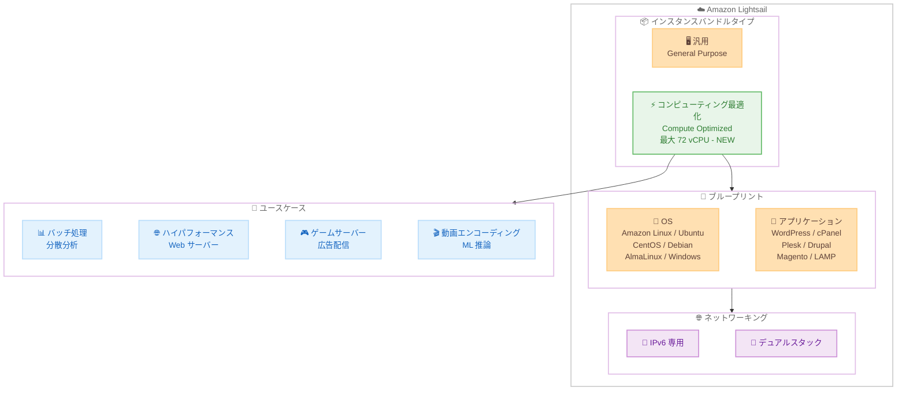

# Amazon Lightsail - コンピューティング最適化インスタンスバンドル

**リリース日**: 2026 年 4 月 2 日
**サービス**: Amazon Lightsail
**機能**: コンピューティング最適化インスタンスバンドル

[このアップデートのインフォグラフィックを見る](https://takech9203.github.io/aws-news-summary/20260402-lightsail-compute-optimized-instances.html)

## 概要

Amazon Lightsail に新たにコンピューティング最適化インスタンスバンドルが追加された。最大 72 vCPU を搭載し、CPU 集約型のワークロードに対応する高性能インスタンスを提供する。7 つのサイズが用意されており、IPv6 専用およびデュアルスタックの両方のネットワーキングタイプに対応している。

このアップデートにより、Lightsail のシンプルな管理体験を維持しながら、バッチ処理、分散分析、ハイパフォーマンス Web サーバー、科学的モデリング、専用ゲームサーバー、広告配信エンジン、動画エンコーディング、CPU 集約型の ML 推論など、高い CPU 性能を必要とするワークロードを実行できるようになった。

すべての Lightsail ブループリント (Linux および Windows の OS ブループリントとアプリケーションブループリント) がサポートされており、WordPress、cPanel & WHM、Plesk、Drupal、Magento、MEAN、LAMP、Node.js、Ruby on Rails、Amazon Linux、Ubuntu、CentOS、Debian、AlmaLinux、Windows から選択できる。

**アップデート前の課題**

- Lightsail の既存のインスタンスバンドルは汎用的な構成であり、CPU 集約型ワークロードに最適化されていなかった
- CPU 性能を重視するワークロードでは、Lightsail の簡易性を諦めて EC2 に移行する必要があった
- バッチ処理や動画エンコーディングなどの高 CPU ワークロードに対して、専用の CPU リソースを確保できなかった

**アップデート後の改善**

- 最大 72 vCPU のコンピューティング最適化インスタンスにより、CPU 集約型ワークロードを Lightsail 上で直接実行可能になった
- 一貫した専用 CPU パフォーマンスが保証され、アプリケーションが常に必要な処理能力を利用できるようになった
- Lightsail のシンプルな料金体系と管理体験を維持しながら、高性能コンピューティングが利用可能になった

## アーキテクチャ図



Lightsail のインスタンスバンドルタイプにコンピューティング最適化が追加され、既存のブループリントとネットワーキングオプションを組み合わせて、CPU 集約型の多様なユースケースに対応できることを示している。

## サービスアップデートの詳細

### 主要機能

1. **コンピューティング最適化インスタンスバンドル**
   - 最大 72 vCPU を搭載した高 CPU 性能インスタンス
   - 7 つのサイズから選択可能
   - 一貫した専用 CPU パフォーマンスを保証

2. **ネットワーキングオプション**
   - IPv6 専用ネットワーキングタイプに対応
   - デュアルスタック (IPv4 + IPv6) ネットワーキングタイプに対応
   - 用途に応じて最適なネットワーク構成を選択可能

3. **全ブループリント対応**
   - Linux OS ブループリント: Amazon Linux、Ubuntu、CentOS、Debian、AlmaLinux
   - Windows OS ブループリント: Windows Server
   - アプリケーションブループリント: WordPress、cPanel & WHM、Plesk、Drupal、Magento、MEAN、LAMP、Node.js、Ruby on Rails

## 技術仕様

### インスタンスバンドルサイズ

コンピューティング最適化インスタンスは 7 つのサイズで提供される。既存の汎用インスタンスと比較して、同じメモリ容量に対してより多くの vCPU が割り当てられている点が特徴となる。

| 項目 | 詳細 |
|------|------|
| バンドルタイプ | コンピューティング最適化 |
| サイズ数 | 7 サイズ |
| 最大 vCPU | 72 vCPU |
| ネットワーキング | IPv6 専用、デュアルスタック |
| 対応 OS | Linux (Amazon Linux、Ubuntu、CentOS、Debian、AlmaLinux)、Windows |
| 対応アプリケーション | WordPress、cPanel & WHM、Plesk、Drupal、Magento、MEAN、LAMP、Node.js、Ruby on Rails |

### API 変更履歴

| 日付 | サービス | 変更内容 |
|------|----------|----------|
| 2026/04/03 | [lightsail](https://awsapichanges.com/archive/changes/da2768-lightsail.html) | 2 updated api methods - Alarm リソースタイプへのタグ付けサポートを追加 |

## 設定方法

### 前提条件

1. AWS アカウントを保有していること
2. Lightsail が利用可能なリージョンであること
3. Lightsail コンソールまたは AWS CLI へのアクセス権限があること

### 手順

#### ステップ 1: Lightsail コンソールでインスタンスを作成

Lightsail コンソール (https://lightsail.aws.amazon.com) にアクセスし、「Create instance」を選択する。

#### ステップ 2: ブループリントを選択

OS のみのブループリントまたはアプリケーション付きのブループリントを選択する。すべてのブループリントがコンピューティング最適化インスタンスに対応している。

#### ステップ 3: コンピューティング最適化バンドルを選択

インスタンスプランの選択画面で「Compute optimized」タブを選択し、ワークロードに適したサイズを 7 つの選択肢から選ぶ。

#### ステップ 4: ネットワーキングタイプを選択

IPv6 専用またはデュアルスタックのいずれかのネットワーキングタイプを選択する。

#### ステップ 5: AWS CLI での作成

```bash
# AWS CLI を使用してコンピューティング最適化インスタンスを作成する例
aws lightsail create-instances \
  --instance-names my-compute-instance \
  --availability-zone us-east-1a \
  --blueprint-id amazon_linux_2023 \
  --bundle-id compute_medium_3_0 \
  --ip-address-type dualstack
```

このコマンドは、us-east-1a アベイラビリティーゾーンに Amazon Linux 2023 のコンピューティング最適化インスタンスをデュアルスタック構成で作成する。

## メリット

### ビジネス面

- **シンプルな料金体系**: Lightsail の予測可能な月額固定料金のまま、高性能コンピューティングを利用できる
- **運用コスト削減**: EC2 への移行が不要になり、Lightsail のシンプルな管理インターフェースで高 CPU ワークロードを運用可能
- **迅速な導入**: ブループリントを活用することで、アプリケーション環境を数分で構築できる

### 技術面

- **専用 CPU パフォーマンス**: バースト型ではなく一貫した CPU パフォーマンスが保証され、処理性能が安定する
- **スケーラビリティ**: 7 つのサイズから最適なインスタンスを選択でき、最大 72 vCPU まで段階的にスケールアップ可能
- **柔軟なネットワーキング**: IPv6 専用とデュアルスタックの両方に対応し、モダンなネットワーク構成に対応

## デメリット・制約事項

### 制限事項

- コンピューティング最適化インスタンスは全 15 リージョンで利用可能だが、すべての AWS リージョンに対応しているわけではない
- Lightsail の他のリソース (データベース、コンテナサービスなど) との組み合わせにおけるリソース制限は既存のクォータに従う
- 汎用インスタンスからコンピューティング最適化インスタンスへのインプレース変更はできず、新規インスタンスの作成が必要となる場合がある

### 考慮すべき点

- コンピューティング最適化インスタンスは CPU 集約型ワークロード向けであり、メモリ集約型ワークロードには汎用インスタンスの方が適切な場合がある
- 72 vCPU を超える CPU 要件がある場合は、Amazon EC2 の利用を検討する必要がある

## ユースケース

### ユースケース 1: 動画エンコーディングサーバー

**シナリオ**: メディア制作会社が複数の動画フォーマットへのトランスコーディングを行うサーバーを構築したい。高い CPU パフォーマンスが必要だが、インフラ管理はシンプルに保ちたい。

**実装例**:
```bash
aws lightsail create-instances \
  --instance-names video-encoder \
  --availability-zone us-west-2a \
  --blueprint-id ubuntu_24_04 \
  --bundle-id compute_xlarge_3_0 \
  --ip-address-type ipv6
```

**効果**: 高 vCPU のコンピューティング最適化インスタンスにより、FFmpeg などのツールを使用した並列動画エンコーディングを高速に実行できる。Lightsail の月額固定料金により、コスト予測も容易になる。

### ユースケース 2: ハイパフォーマンス Web サーバー

**シナリオ**: EC サイトが大量の同時リクエストを処理する Web サーバーを必要としている。WordPress と WooCommerce を使用しており、ピーク時のレスポンス低下が課題となっている。

**実装例**:
```bash
aws lightsail create-instances \
  --instance-names web-server-prod \
  --availability-zone ap-northeast-1a \
  --blueprint-id wordpress \
  --bundle-id compute_large_3_0 \
  --ip-address-type dualstack
```

**効果**: 専用 CPU パフォーマンスにより、ピーク時でも安定したレスポンスタイムを維持できる。WordPress ブループリントにより、初期セットアップの時間も大幅に短縮される。

### ユースケース 3: バッチ処理・データ分析

**シナリオ**: スタートアップ企業が日次のデータ分析バッチジョブを実行している。データ量の増加に伴い、処理時間が長時間化しており、CPU パフォーマンスの向上が求められている。

**実装例**:
```bash
aws lightsail create-instances \
  --instance-names batch-processor \
  --availability-zone eu-central-1a \
  --blueprint-id amazon_linux_2023 \
  --bundle-id compute_2xlarge_3_0 \
  --ip-address-type dualstack
```

**効果**: 高 vCPU インスタンスにより並列処理が高速化され、バッチジョブの完了時間を大幅に短縮できる。EC2 を使用する場合と比較して、インフラ管理の複雑さを軽減できる。

## 料金

Lightsail のコンピューティング最適化インスタンスバンドルは、既存のバンドルと同様に月額固定料金で提供される。料金にはインスタンス、SSD ストレージ、データ転送が含まれる。

詳細な料金は [Amazon Lightsail の料金ページ](https://aws.amazon.com/lightsail/pricing/)を参照。

## 利用可能リージョン

以下の 15 の AWS リージョンで利用可能。

- **米国**: US East (バージニア北部)、US East (オハイオ)、US West (オレゴン)
- **欧州**: Europe (フランクフルト)、Europe (ロンドン)、Europe (パリ)、Europe (ストックホルム)、Europe (アイルランド)
- **アジアパシフィック**: Asia Pacific (東京)、Asia Pacific (ジャカルタ)、Asia Pacific (ムンバイ)、Asia Pacific (シンガポール)、Asia Pacific (シドニー)、Asia Pacific (ソウル)
- **カナダ**: Canada (中部)

## 関連サービス・機能

- **Amazon EC2**: より高度なカスタマイズや大規模なコンピューティング要件がある場合の代替選択肢。Lightsail からの移行パスも用意されている
- **Amazon Lightsail ロードバランサー**: コンピューティング最適化インスタンスを複数台使用する場合の負荷分散に利用可能
- **Amazon Lightsail ディスク**: 追加の SSD ストレージが必要な場合にインスタンスにアタッチ可能
- **Amazon Lightsail スナップショット**: コンピューティング最適化インスタンスのバックアップと復元に使用

## 参考リンク

- [インフォグラフィック](https://takech9203.github.io/aws-news-summary/20260402-lightsail-compute-optimized-instances.html)
- [公式発表 (What's New)](https://aws.amazon.com/about-aws/whats-new/2026/04/lightsail-compute-optimized-instances/)
- [Amazon Lightsail ドキュメント](https://docs.aws.amazon.com/lightsail/)
- [Amazon Lightsail 料金ページ](https://aws.amazon.com/lightsail/pricing/)

## まとめ

Amazon Lightsail にコンピューティング最適化インスタンスバンドルが追加されたことで、CPU 集約型ワークロードを Lightsail のシンプルな管理体験のまま実行できるようになった。最大 72 vCPU、7 サイズ、全ブループリント対応という充実した構成により、バッチ処理、動画エンコーディング、ハイパフォーマンス Web サーバーなど幅広いユースケースに対応する。EC2 への移行を検討していた CPU 集約型ワークロードのユーザーにとって、Lightsail を引き続き利用できる有力な選択肢となる。
