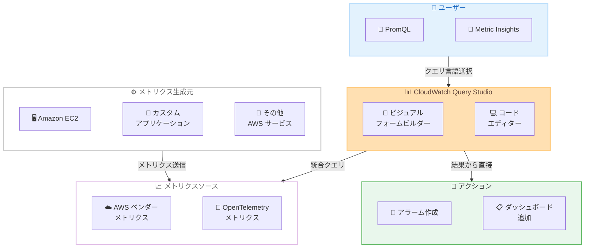

# Amazon CloudWatch - Query Studio パブリックプレビュー

**リリース日**: 2026 年 4 月 3 日
**サービス**: Amazon CloudWatch
**機能**: Query Studio (PromQL クエリ対応の統合クエリ/可視化インターフェース)

📊 [このアップデートのインフォグラフィックを見る](https://takech9203.github.io/aws-news-summary/20260403-amazon-cloudwatch-query-studio-preview.html)

## 概要

Amazon CloudWatch は Query Studio のパブリックプレビューを発表しました。Query Studio は、CloudWatch 初のネイティブ PromQL クエリ機能を提供する統合クエリおよび可視化エクスペリエンスです。PromQL と CloudWatch Metric Insights を単一のインターフェースに統合し、コンソールを切り替えることなく好みのクエリ言語で AWS ベンダーメトリクスと OpenTelemetry メトリクスの両方をクエリできます。

Query Studio はビジュアルフォームビルダー (オートコンプリート付き) とコードエディター (シンタックスハイライト付き) を備えており、初心者から上級者まで幅広いユーザーに対応します。例えば、Amazon EC2 上でアプリケーションを実行するチームは、カスタム OpenTelemetry アプリケーションメトリクスと EC2 ベンダーメトリクスをサイドバイサイドで相関分析し、問題を迅速に特定し、クエリ結果から直接アラームの作成やダッシュボードへのチャート追加が可能です。

**アップデート前の課題**

- CloudWatch で PromQL を使用したクエリがネイティブにサポートされておらず、Prometheus 互換のクエリには別途 Amazon Managed Service for Prometheus が必要だった
- AWS ベンダーメトリクスと OpenTelemetry メトリクスを横断的に分析するには、複数のコンソールやツール間を行き来する必要があった
- CloudWatch Metric Insights と PromQL は別々のワークフローで、統一されたクエリ体験が存在しなかった

**アップデート後の改善**

- CloudWatch 内でネイティブ PromQL クエリが可能になり、Prometheus エコシステムに精通したユーザーが既存の知識を直接活用可能
- 単一インターフェースで PromQL と Metric Insights の両方を使用でき、コンソール切り替えが不要に
- ビジュアルフォームビルダーとコードエディターにより、スキルレベルに応じた柔軟なクエリ作成が可能

## アーキテクチャ図



Query Studio は PromQL と Metric Insights の 2 つのクエリ言語を統合インターフェースで提供し、AWS ベンダーメトリクスと OpenTelemetry メトリクスの両方に対して横断的なクエリと可視化を実現します。

## サービスアップデートの詳細

### 主要機能

1. **ネイティブ PromQL クエリサポート**
   - CloudWatch 初のネイティブ PromQL クエリ機能
   - Prometheus エコシステムに精通したユーザーが既存のクエリ知識を直接活用可能
   - OpenTelemetry メトリクスに対する PromQL クエリを CloudWatch 内で実行

2. **統合クエリインターフェース**
   - PromQL と CloudWatch Metric Insights を単一画面で利用可能
   - コンソール間の切り替えが不要
   - AWS ベンダーメトリクスと OpenTelemetry メトリクスを横断的にクエリ

3. **ビジュアルフォームビルダー**
   - オートコンプリート機能付きのビジュアルクエリビルダー
   - クエリ言語に不慣れなユーザーでも直感的にクエリを作成可能
   - メトリクスの選択やフィルタリングを GUI で実行

4. **コードエディター**
   - シンタックスハイライト付きのコードエディター
   - 上級ユーザー向けの高度なクエリ記述が可能
   - PromQL および Metric Insights の両方の構文をサポート

5. **クエリ結果からの直接アクション**
   - クエリ結果からアラームを直接作成
   - クエリ結果のチャートをダッシュボードに直接追加
   - 分析から運用アクションへのシームレスな移行

## 技術仕様

### 対応クエリ言語

| 項目 | 詳細 |
|------|------|
| PromQL | Prometheus Query Language - OpenTelemetry メトリクスおよび AWS ベンダーメトリクスに対応 |
| CloudWatch Metric Insights | CloudWatch ネイティブのクエリ言語 |
| エディターモード | ビジュアルフォームビルダー、コードエディター |

### OTel エンリッチメント

今回の Query Studio リリースと合わせて、CloudWatch API に OTel エンリッチメント関連の新機能が追加されました。OTel エンリッチメントを有効にすることで、サポートされている AWS リソースのベンダーメトリクスがリソース ARN やタグラベル付きで PromQL からクエリ可能になります。

### API 変更履歴

| 日付 | サービス | 変更内容 |
|------|----------|----------|
| 2026/04/03 | [Amazon CloudWatch Logs](https://awsapichanges.com/archive/changes/da2768-logs.html) | 1 updated method - DescribeQueries にクエリコスト情報フィールドを追加 |
| 2026/04/02 | [Amazon CloudWatch](https://awsapichanges.com/archive/changes/d3423d-monitoring.html) | 3 new 3 updated methods - OTel エンリッチメントおよび PromQL アラーム対応 |

### 新規 API メソッド

```python
# OTel エンリッチメントの有効化
client.start_o_tel_enrichment()

# OTel エンリッチメントのステータス確認
response = client.get_o_tel_enrichment()
# {'Status': 'Running'|'Stopped'}

# OTel エンリッチメントの停止
client.stop_o_tel_enrichment()
```

### PromQL アラーム設定

```python
# PromQL ベースのメトリクスアラーム作成
client.put_metric_alarm(
    AlarmName='high-cpu-promql',
    EvaluationCriteria={
        'PromQLCriteria': {
            'Query': 'avg(system_cpu_utilization) > 0.8',
            'PendingPeriod': 300,
            'RecoveryPeriod': 300
        }
    },
    EvaluationInterval=60,
    AlarmActions=['arn:aws:sns:us-east-1:123456789012:my-topic']
)
```

## 設定方法

### 前提条件

1. AWS アカウントを保有していること
2. 対応リージョンにアクセス可能であること
3. CloudWatch へのアクセス権限を持つ IAM ユーザーまたはロール

### 手順

#### ステップ 1: OTel エンリッチメントの有効化

```bash
aws cloudwatch start-o-tel-enrichment
```

OTel エンリッチメントを有効化し、AWS ベンダーメトリクスをリソース ARN やタグラベル付きで PromQL からクエリ可能にします。

#### ステップ 2: Query Studio へのアクセス

CloudWatch コンソールにログインし、ナビゲーションペインから Query Studio を選択します。

#### ステップ 3: クエリの実行

```promql
# PromQL の例: EC2 インスタンスの CPU 使用率を取得
avg by (InstanceId) (system_cpu_utilization)
```

ビジュアルフォームビルダーまたはコードエディターを使用してクエリを入力し、実行します。結果はグラフとして可視化されます。

#### ステップ 4: アクションの実行

クエリ結果から直接アラームを作成するか、ダッシュボードにチャートを追加します。

## メリット

### ビジネス面

- **運用効率の向上**: 単一インターフェースでメトリクスを横断分析でき、コンソール間の切り替えが不要になることで運用効率が向上
- **トラブルシューティング時間の短縮**: AWS ベンダーメトリクスとカスタムアプリケーションメトリクスをサイドバイサイドで相関分析でき、問題の特定が迅速化
- **既存スキルの活用**: Prometheus エコシステムに精通したチームが既存の PromQL 知識をそのまま CloudWatch で活用可能

### 技術面

- **PromQL ネイティブサポート**: Amazon Managed Service for Prometheus を別途使用せずに CloudWatch 内で PromQL クエリが可能
- **OTel エンリッチメント**: ベンダーメトリクスにリソース ARN やタグラベルが付与され、PromQL での詳細なフィルタリングが可能
- **PromQL アラーム**: OpenTelemetry メトリクスに対してマルチコントリビューター評価付きの PromQL アラームを設定可能

## デメリット・制約事項

### 制限事項

- パブリックプレビュー段階であり、GA 時に機能や仕様が変更される可能性がある
- 利用可能リージョンが 5 リージョンに限定されている
- プレビュー期間中は SLA の対象外となる可能性がある

### 考慮すべき点

- 本番環境での使用前にプレビューの制約事項を十分に確認すること
- PromQL クエリの互換性について、既存の Prometheus 環境で使用しているクエリがすべてサポートされるか検証が必要
- OTel エンリッチメント有効化による追加コストの確認が必要

## ユースケース

### ユースケース 1: EC2 アプリケーションの統合モニタリング

**シナリオ**: Amazon EC2 上でマイクロサービスを運用するチームが、カスタム OpenTelemetry アプリケーションメトリクスと EC2 ベンダーメトリクスを統合的に監視したい場合。

**実装例**:
```promql
# カスタムアプリケーションのレイテンシと EC2 CPU をサイドバイサイドで確認
http_server_request_duration_seconds_bucket{service="my-app"}

# EC2 インスタンスの CPU 使用率
avg by (InstanceId) (system_cpu_utilization{aws_resource_type="AWS::EC2::Instance"})
```

**効果**: アプリケーションレベルのパフォーマンス低下とインフラストラクチャの状態を単一画面で相関分析し、根本原因の特定を迅速化

### ユースケース 2: Prometheus からの移行/ハイブリッド運用

**シナリオ**: 既存の Prometheus 環境で使用している PromQL クエリをそのまま CloudWatch で活用し、AWS ネイティブメトリクスとの統合分析を行いたい場合。

**実装例**:
```promql
# 既存の Prometheus アラートルールを CloudWatch PromQL アラームに移行
avg(rate(http_requests_total{status=~"5.."}[5m]))
  / avg(rate(http_requests_total[5m])) > 0.05
```

**効果**: 既存の PromQL 知識とクエリ資産を活かしながら、CloudWatch の統合ダッシュボードやアラーム機能を活用可能

### ユースケース 3: OpenTelemetry メトリクスのアラーム設定

**シナリオ**: OTLP エンドポイント経由で取り込んだ OpenTelemetry メトリクスに対して、PromQL ベースのアラームを設定したい場合。

**実装例**:
```python
import boto3

client = boto3.client('cloudwatch')
client.put_metric_alarm(
    AlarmName='high-error-rate',
    EvaluationCriteria={
        'PromQLCriteria': {
            'Query': 'sum(rate(http_server_request_duration_seconds_count{http_status_code=~"5.."}[5m])) / sum(rate(http_server_request_duration_seconds_count[5m])) > 0.01',
            'PendingPeriod': 300,
            'RecoveryPeriod': 600
        }
    },
    EvaluationInterval=60,
    AlarmActions=['arn:aws:sns:us-east-1:123456789012:alerts']
)
```

**効果**: PromQL の柔軟な集約とフィルタリング機能を使用して、OpenTelemetry メトリクスに対する高度なアラーム条件を設定可能

## 料金

Query Studio 自体の追加料金はなく、標準の CloudWatch ダッシュボード料金が適用されます。

### 料金例

| 使用量 | 月額料金 (概算) |
|--------|------------------|
| ダッシュボード 1 つあたり | $3.00/月 |
| メトリクス API リクエスト (GetMetricData) | $0.01/1,000 メトリクスリクエスト |

## 利用可能リージョン

パブリックプレビューとして以下の 5 リージョンで利用可能です。

| リージョン | コード |
|------------|--------|
| 米国東部 (バージニア北部) | us-east-1 |
| 米国西部 (オレゴン) | us-west-2 |
| アジアパシフィック (シドニー) | ap-southeast-2 |
| アジアパシフィック (シンガポール) | ap-southeast-1 |
| 欧州 (アイルランド) | eu-west-1 |

## 関連サービス・機能

- **Amazon Managed Service for Prometheus**: フルマネージドの Prometheus 互換モニタリングサービス。Query Studio により CloudWatch 内でも PromQL が利用可能に
- **AWS Distro for OpenTelemetry**: OpenTelemetry のセキュアかつ本番対応の AWS ディストリビューション。Query Studio で OTel メトリクスをクエリ
- **CloudWatch Metric Insights**: CloudWatch ネイティブの SQL ライクなクエリ言語。Query Studio で PromQL と並んで利用可能
- **CloudWatch Dashboards**: メトリクス可視化ダッシュボード。Query Studio のクエリ結果から直接チャートを追加可能

## 参考リンク

- 📊 [インフォグラフィック](https://takech9203.github.io/aws-news-summary/20260403-amazon-cloudwatch-query-studio-preview.html)
- [公式発表 (What's New)](https://aws.amazon.com/about-aws/whats-new/2026/04/amazon-cloudwatch-query-studio-preview/)
- [Amazon CloudWatch ドキュメント](https://docs.aws.amazon.com/AmazonCloudWatch/latest/monitoring/)
- [CloudWatch 料金ページ](https://aws.amazon.com/cloudwatch/pricing/)

## まとめ

Amazon CloudWatch Query Studio は、CloudWatch に初めてネイティブ PromQL クエリ機能をもたらす重要なアップデートです。Prometheus エコシステムに精通したチームは既存の知識を直接活用でき、AWS ベンダーメトリクスと OpenTelemetry メトリクスを単一インターフェースで横断分析できるようになります。パブリックプレビュー段階のため、まずは対応リージョンで機能を評価し、既存の PromQL クエリの互換性を検証することを推奨します。
