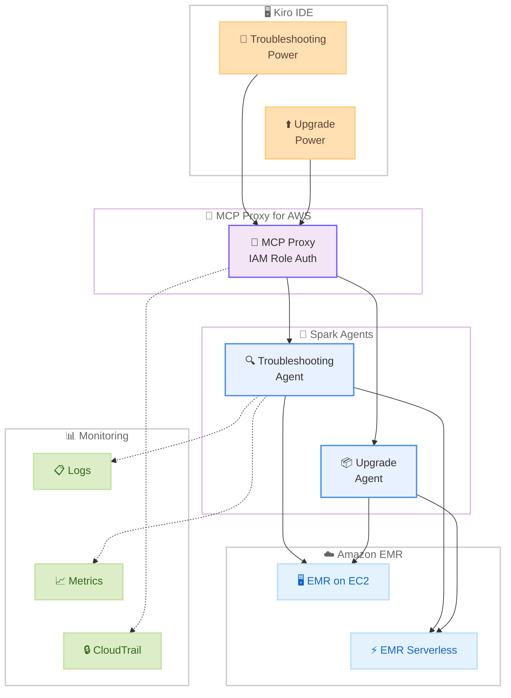

# Amazon EMR - Apache Spark トラブルシューティングおよびアップグレードエージェントが Kiro パワーとして利用可能に

**リリース日**: 2026 年 4 月 3 日
**サービス**: Amazon EMR
**機能**: Apache Spark Troubleshooting Agent / Upgrade Agent (Kiro Powers)

📊 [このアップデートのインフォグラフィックを見る](https://takech9203.github.io/aws-news-summary/20260403-amazon-emr-spark-troubleshooting-upgrade-kiro-power.html)

## 概要

Apache Spark のトラブルシューティングエージェントとアップグレードエージェントが、Kiro パワーとして利用可能になった。これにより、Kiro IDE 上からワンクリックで AI アシスタント付き Spark 運用にアクセスできるようになる。データエンジニアはトラブルシューティング時間を数時間から数分に短縮し、Spark バージョンのアップグレードを数か月から数週間に圧縮できる。

トラブルシューティングパワーは、Spark ジョブが失敗した際にログ、メトリクス、設定を分析して根本原因を特定し、PySpark アプリケーション向けの具体的なコード修正を提案する。アップグレードパワーは、EMR 6.5 から EMR 7.12 への移行などの Spark バージョンアップグレードを自動化し、コード変換や依存関係の解決をリモートバリデーションとデータ品質比較を通じて実行する。

両パワーは MCP Proxy for AWS を介して Spark エージェントに接続し、IAM ロールベースの認証を使用する。すべてのアクションは AWS CloudTrail に記録され、完全な監査性を確保している。

**アップデート前の課題**

- Spark ジョブの障害分析にはログ、メトリクス、設定を手動で調査する必要があり、数時間を要していた
- Spark バージョンのアップグレードにはコード変換、依存関係解決、テストを含む数か月のプロジェクトが必要だった
- EMR on EC2 と EMR Serverless の両環境にまたがるトラブルシューティングが複雑だった
- PySpark アプリケーションのバージョン互換性の確認と修正が手作業で行われていた

**アップデート後の改善**

- Kiro IDE からワンクリックでトラブルシューティングエージェントにアクセスし、根本原因分析を自動化できるようになった
- アップグレードエージェントがコード変換と依存関係解決を自動化し、アップグレード期間を大幅に短縮できるようになった
- MCP Proxy for AWS を介した統一的なエージェント接続により、IDE から直接 Spark 運用が可能になった
- CloudTrail による全アクションの記録で、監査とコンプライアンスの要件を満たせるようになった

## アーキテクチャ図



Kiro IDE のパワーが MCP Proxy for AWS を経由して Spark エージェントに接続し、EMR on EC2 および EMR Serverless 環境のログ・メトリクスを分析する。すべての操作は CloudTrail に記録される。

## サービスアップデートの詳細

### 主要機能

1. **Spark トラブルシューティングパワー**
   - Spark ジョブ失敗時にログ、メトリクス、設定を横断的に分析して根本原因を特定
   - EMR on EC2 および EMR Serverless の両環境に対応
   - PySpark アプリケーション向けの具体的なコード修正提案を提供
   - トラブルシューティング時間を数時間から数分に短縮

2. **Spark アップグレードパワー**
   - EMR 6.5 から EMR 7.12 など、Spark バージョン間のアップグレードを自動化
   - コード変換と依存関係の解決を自動で実行
   - リモートバリデーションによるアップグレード検証
   - データ品質比較によるアップグレード前後の整合性確認
   - アップグレード期間を数か月から数週間に圧縮

3. **MCP Proxy for AWS によるセキュアな接続**
   - MCP Proxy を介した Spark エージェントへの接続
   - IAM ロールベースの認証による安全なアクセス制御
   - AWS CloudTrail による全アクションの記録で完全な監査性を確保

## 技術仕様

### サポート対象環境

| 項目 | 詳細 |
|------|------|
| 対応環境 | EMR on EC2、EMR Serverless |
| 対応言語 | PySpark アプリケーション |
| アップグレードパス例 | EMR 6.5 から EMR 7.12 |
| 認証方式 | IAM ロールベース認証 |
| 接続方式 | MCP Proxy for AWS |
| 監査ログ | AWS CloudTrail |

### セキュリティと認証

| 項目 | 詳細 |
|------|------|
| 認証 | IAM ロールベース認証 |
| 通信経路 | MCP Proxy for AWS 経由 |
| 監査証跡 | CloudTrail で全アクション記録 |
| アクセス制御 | IAM ポリシーによる細かい権限管理 |

## 設定方法

### 前提条件

1. Kiro IDE がインストールされていること
2. AWS アカウントに適切な IAM ロールが設定されていること
3. Amazon EMR on EC2 または EMR Serverless の環境が構築済みであること
4. MCP Proxy for AWS へのアクセス権限があること

### 手順

#### ステップ 1: Kiro パワーの有効化

Kiro IDE を開き、パワー一覧から「Spark Troubleshooting」または「Spark Upgrade」パワーを選択してワンクリックで有効化する。

#### ステップ 2: IAM ロールの設定

MCP Proxy for AWS を介した接続に必要な IAM ロールを設定する。EMR クラスターおよび CloudWatch Logs へのアクセス権限を含む IAM ポリシーをアタッチする。

```json
{
  "Version": "2012-10-17",
  "Statement": [
    {
      "Effect": "Allow",
      "Action": [
        "elasticmapreduce:DescribeCluster",
        "elasticmapreduce:ListSteps",
        "elasticmapreduce:DescribeStep",
        "logs:GetLogEvents",
        "logs:FilterLogEvents",
        "cloudwatch:GetMetricData"
      ],
      "Resource": "*"
    }
  ]
}
```

上記の IAM ポリシーは、EMR クラスターの情報取得、ステップの一覧表示と詳細取得、CloudWatch Logs のログイベント取得、CloudWatch メトリクスの取得を許可する。

#### ステップ 3: トラブルシューティングの実行

Spark ジョブが失敗した際に、Kiro IDE 上でトラブルシューティングパワーを起動すると、エージェントがログ、メトリクス、設定を自動的に分析し、根本原因と修正案を提示する。

#### ステップ 4: バージョンアップグレードの実行

アップグレードパワーを起動し、現在の EMR バージョンとターゲットバージョンを指定すると、エージェントがコード変換、依存関係解決、リモートバリデーション、データ品質比較を自動的に実行する。

## メリット

### ビジネス面

- **運用コストの削減**: トラブルシューティング時間の大幅短縮により、データエンジニアの生産性が向上する
- **アップグレードプロジェクトの加速**: 数か月かかっていたバージョンアップグレードを数週間に圧縮し、最新機能をより早く活用できる
- **コンプライアンス対応**: CloudTrail による完全な監査証跡で、規制要件への対応が容易になる

### 技術面

- **AI による根本原因分析**: ログ、メトリクス、設定の横断的な分析により、人手では見落としがちな問題を検出できる
- **自動コード変換**: Spark バージョン間の非互換性を自動的に検出し、コード変換を実行する
- **データ品質保証**: アップグレード前後のデータ品質比較により、アップグレードによるリグレッションを防止できる

## デメリット・制約事項

### 制限事項

- PySpark アプリケーションが主な対象であり、Scala や Java の Spark アプリケーションへの対応範囲は確認が必要
- MCP Proxy for AWS を介した接続が必須であり、ネットワーク構成の考慮が必要
- Kiro IDE からの利用が前提であり、他の IDE からは直接利用できない

### 考慮すべき点

- IAM ロールの権限設定は最小権限の原則に従い、必要なリソースに限定することが推奨される
- 大規模なアップグレードプロジェクトでは、エージェントの提案を人間がレビューするプロセスを組み込むことが重要
- CloudTrail のログ量が増加する可能性があるため、ログの保持ポリシーとコストを事前に確認する

## ユースケース

### ユースケース 1: Spark ジョブの障害対応

**シナリオ**: 本番環境の日次バッチ処理で PySpark ジョブが突然失敗し、データパイプラインが停止した。従来は複数のログソースを手動で調査する必要があり、復旧に数時間かかっていた。

**実装例**:
```
1. Kiro IDE でトラブルシューティングパワーを起動
2. 失敗したジョブの EMR クラスター ID を指定
3. エージェントがログ、メトリクス、設定を自動分析
4. 根本原因（例: メモリ不足による OutOfMemoryError）と
   PySpark コードの修正案を提示
```

**効果**: 障害対応時間を数時間から数分に短縮し、データパイプラインの SLA を維持できる。

### ユースケース 2: EMR バージョンの計画的アップグレード

**シナリオ**: セキュリティパッチと新機能のために EMR 6.5 から EMR 7.12 へのアップグレードが必要だが、数百の PySpark ジョブの互換性確認と修正に数か月の工数を見込んでいた。

**実装例**:
```
1. Kiro IDE でアップグレードパワーを起動
2. ソースバージョン（EMR 6.5）とターゲットバージョン（EMR 7.12）を指定
3. エージェントが各ジョブのコードを分析し、非互換箇所を検出
4. 自動コード変換と依存関係の解決を実行
5. リモートバリデーションとデータ品質比較で検証
```

**効果**: アップグレードプロジェクトの期間を数か月から数週間に短縮し、最新の Spark 機能とセキュリティパッチを迅速に適用できる。

### ユースケース 3: マルチ環境のトラブルシューティング

**シナリオ**: EMR on EC2 と EMR Serverless の両方を使用している環境で、同一の PySpark コードが一方の環境でのみ失敗する問題が発生した。

**実装例**:
```
1. Kiro IDE でトラブルシューティングパワーを起動
2. 両環境のジョブ情報を指定
3. エージェントが環境間の設定差異を分析
4. 環境固有の設定や動作の違いに起因する
   根本原因を特定し、修正案を提示
```

**効果**: 複数環境にまたがる複雑な問題の調査を効率化し、環境間の一貫性を確保できる。

## 料金

Kiro パワーとしての Spark エージェントの追加料金については、公式ドキュメントで確認が必要。Amazon EMR 自体の料金は従来通り適用される。Kiro の料金体系に応じて、パワーの利用に追加コストが発生する可能性がある。

## 利用可能リージョン

EMR on EC2 および EMR Serverless が利用可能なリージョンで使用できる。詳細なリージョン対応状況については公式ドキュメントを参照。

## 関連サービス・機能

- **Amazon EMR on EC2**: Spark ジョブを EC2 インスタンス上で実行するマネージドクラスター環境
- **Amazon EMR Serverless**: インフラ管理不要で Spark ジョブを実行するサーバーレス環境
- **Kiro**: AWS が提供する AI 搭載 IDE。パワー機能により AI エージェントをワンクリックで利用可能
- **MCP Proxy for AWS**: Kiro パワーと AWS サービスを安全に接続するプロキシ
- **AWS CloudTrail**: API コールの記録と監査を提供するサービス
- **Amazon CloudWatch**: EMR クラスターのメトリクスとログの監視に使用

## 参考リンク

- 📊 [インフォグラフィック](https://takech9203.github.io/aws-news-summary/20260403-amazon-emr-spark-troubleshooting-upgrade-kiro-power.html)
- [公式発表 (What's New)](https://aws.amazon.com/about-aws/whats-new/2026/04/amazon-emr-spark-troubleshooting-upgrade-kiro-power/)
- [Amazon EMR ドキュメント](https://docs.aws.amazon.com/emr/)
- [Kiro 公式サイト](https://kiro.dev/)
- [Amazon EMR 料金ページ](https://aws.amazon.com/emr/pricing/)

## まとめ

Apache Spark のトラブルシューティングとアップグレードが Kiro パワーとして統合されたことで、データエンジニアは IDE から直接 AI アシスタント付きの Spark 運用を利用できるようになった。特にトラブルシューティング時間の短縮とアップグレードの自動化は、大規模な Spark ワークロードを運用するチームに大きな効果をもたらす。EMR を利用しているチームは、Kiro IDE でこれらのパワーを有効化し、障害対応やバージョンアップグレードのワークフローに組み込むことを推奨する。
