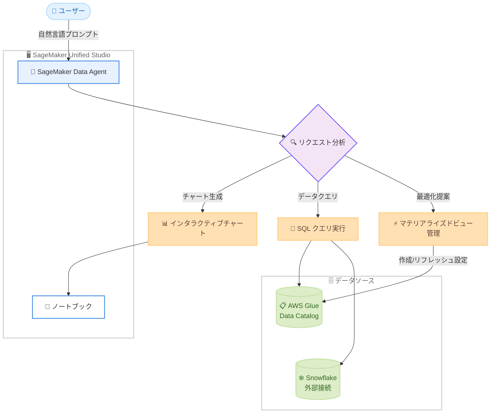

# Amazon SageMaker - Data Agent にチャート機能とマテリアライズドビューのサポートを追加

**リリース日**: 2026 年 4 月 3 日
**サービス**: Amazon SageMaker
**機能**: SageMaker Data Agent チャート機能 / マテリアライズドビュー管理

📊 [このアップデートのインフォグラフィックを見る](https://takech9203.github.io/aws-news-summary/20260403-amazon-sgmkr-dataagent-chart-mv.html)

## 概要

Amazon SageMaker Data Agent に、インタラクティブなチャート生成機能、Snowflake データソースに対する SQL アナリティクス、および Amazon SageMaker Unified Studio ノートブック上でのマテリアライズドビュー管理機能が追加されました。

Data Agent は従来のコード生成にとどまらず、AWS および外部データソースの探索、結果の可視化、クエリパフォーマンスの最適化を自然言語プロンプトで完結できる包括的なアナリティクスワークフローを提供します。例えば「2025 年のリージョン別月次売上トレンドをプロットして」と指示するだけで、ノートブック上にインタラクティブなチャートが生成されます。

このアップデートは、データアナリスト、データサイエンティスト、ビジネスインテリジェンス担当者など、日常的にデータ分析と可視化を行うユーザーを主な対象としています。

**アップデート前の課題**

- Data Agent はコード生成が主な機能であり、分析結果の可視化には別途チャートライブラリを手動で設定する必要があった
- Snowflake などの外部データソースと AWS データソースを組み合わせた分析には、複数のツールやコネクタの設定が必要だった
- クエリパフォーマンスの最適化にはデータベース管理の専門知識が求められ、マテリアライズドビューの設計と管理を手動で行う必要があった

**アップデート後の改善**

- 自然言語プロンプトだけでインタラクティブなチャートをノートブック内に直接生成できるようになった
- Snowflake テーブルを外部接続経由でクエリし、AWS Glue Data Catalog のデータと 1 つのプロンプトで結合できるようになった
- Data Agent がクエリパターンを分析し、マテリアライズドビューの推奨、作成、リフレッシュスケジュールの設定を自動で実行できるようになった

## アーキテクチャ図



Data Agent が自然言語プロンプトを受け取り、チャート生成、SQL クエリ実行、マテリアライズドビュー管理の 3 つのワークフローを統合的に処理する全体像を示しています。

## サービスアップデートの詳細

### 主要機能

1. **インタラクティブチャート生成**
   - 自然言語で「2025 年のリージョン別月次売上トレンドをプロットして」のように指示するだけで、ノートブック内にインタラクティブなチャートを生成
   - コード生成だけでなく、チャートの描画まで自動で実行
   - データ探索と可視化をシームレスに統合し、分析ワークフロー全体を自然言語で操作可能

2. **Snowflake データソースの SQL アナリティクス**
   - 外部接続を通じて Snowflake テーブルに対する SQL クエリを実行可能
   - AWS Glue Data Catalog のデータと Snowflake のデータを 1 つのプロンプトで結合
   - マルチデータソースにまたがるクロスプラットフォーム分析を自然言語で実現

3. **マテリアライズドビュー管理**
   - 「ノートブックを分析して、マテリアライズドビューの恩恵を受けるクエリを提案して」と指示可能
   - クエリパターンに基づいた最適化の推奨を自動実行
   - マテリアライズドビューの作成とリフレッシュスケジュールの設定を Data Agent が実施

## 技術仕様

### 対応機能一覧

| 項目 | 詳細 |
|------|------|
| チャート生成 | ノートブック内でインタラクティブチャートを直接レンダリング |
| データソース | AWS Glue Data Catalog、Snowflake (外部接続) |
| クエリ言語 | SQL (自然言語からの自動生成) |
| マテリアライズドビュー | 自動推奨、作成、リフレッシュスケジュール設定 |
| インターフェース | SageMaker Unified Studio ノートブック |
| 操作方法 | 自然言語プロンプト |

### API 変更履歴

今回の Data Agent 機能アップデートに直接関連する API 変更は確認されていません。Data Agent はノートブック上の自然言語インターフェースを通じて動作するため、SDK レベルでの新規 API 追加ではなく、サービス内部の機能拡張として提供されています。

なお、同時期の SageMaker 関連 API 変更として以下が確認されています。

| 日付 | サービス | 変更内容 |
|------|----------|----------|
| 2026/03/30 | [Amazon SageMaker Service](https://awsapichanges.com/archive/changes/99ac86-api.sagemaker.html) | 7 updated api methods - 推論コンポーネントエンドポイントの配置戦略とコンソリデーションのサポート追加 |

## 設定方法

### 前提条件

1. Amazon SageMaker Unified Studio へのアクセス権限
2. SageMaker Unified Studio ノートブックの利用環境
3. Snowflake を使用する場合は外部接続の設定が完了していること

### 手順

#### ステップ 1: SageMaker Unified Studio でノートブックを開く

SageMaker Unified Studio にログインし、ノートブック環境を起動します。Data Agent 機能はノートブック内で自動的に利用可能です。

#### ステップ 2: チャート生成を試す

ノートブック内で Data Agent に自然言語プロンプトを入力します。

```
2025年のリージョン別月次売上トレンドをプロットして
```

Data Agent がデータを取得し、インタラクティブなチャートをノートブック内に直接生成します。

#### ステップ 3: Snowflake データとの結合クエリを実行する

外部接続が設定済みの Snowflake データソースと AWS Glue Data Catalog のデータを組み合わせた分析を実行します。

```
Snowflake の顧客テーブルと Glue カタログの注文データを結合して、地域別の売上サマリーを表示して
```

Data Agent が適切な SQL を生成し、クロスプラットフォームのデータ結合を実行します。

#### ステップ 4: マテリアライズドビューの最適化を依頼する

```
ノートブックを分析して、マテリアライズドビューの恩恵を受けるクエリを提案して
```

Data Agent がクエリパターンを分析し、最適化の推奨事項を提示した上で、マテリアライズドビューの作成とリフレッシュスケジュールの設定を実行します。

## メリット

### ビジネス面

- **分析の民主化**: SQL やチャートライブラリの専門知識がなくても、自然言語でデータ分析と可視化が可能
- **意思決定の迅速化**: データ探索からチャート生成までをシームレスに実行でき、インサイト獲得までの時間を短縮
- **クロスプラットフォーム分析**: AWS と Snowflake のデータを統合的に分析でき、データサイロの解消に貢献

### 技術面

- **ワークフロー統合**: コード生成、クエリ実行、チャート描画、パフォーマンス最適化を 1 つのインターフェースで完結
- **クエリパフォーマンス最適化**: マテリアライズドビューの自動推奨により、手動チューニングの工数を削減
- **外部データソース連携**: Snowflake との外部接続を活用し、マルチクラウドデータ分析基盤を構築可能

## デメリット・制約事項

### 制限事項

- SageMaker Unified Studio ノートブック環境でのみ利用可能
- Snowflake 以外の外部データソースへの対応状況については公式ドキュメントでの確認が必要
- マテリアライズドビューの自動推奨はクエリパターンに依存するため、十分なクエリ履歴がない場合は最適な提案が得られない可能性がある

### 考慮すべき点

- マテリアライズドビューのリフレッシュにはコンピューティングリソースが消費されるため、スケジュール設定時にコストへの影響を確認すること
- Snowflake との外部接続にはネットワーク設定とクレデンシャル管理が必要であり、セキュリティポリシーに準拠した設定を行うこと

## ユースケース

### ユースケース 1: マルチソースの売上分析ダッシュボード

**シナリオ**: EC サイトの売上データが AWS に、顧客 CRM データが Snowflake に格納されている。ビジネスアナリストが両方のデータを組み合わせてリージョン別の売上傾向を可視化したい。

**実装例**:
```
Snowflake の顧客マスタと Glue カタログの売上トランザクションを
リージョンキーで結合して、2025年の四半期別リージョン別売上を
棒グラフで表示して
```

**効果**: 従来は ETL パイプラインの構築やデータ移行が必要だった分析を、自然言語プロンプト 1 つで即座に実行可能に。

### ユースケース 2: レポート用チャートの迅速な生成

**シナリオ**: データサイエンティストが週次の経営レポート用に複数のチャートを作成する必要がある。これまでは matplotlib や plotly のコードを毎回記述していた。

**実装例**:
```
過去12ヶ月のサービス利用率を折れ線グラフで表示して、
月別のトレンドと前年同月比を含めて
```

**効果**: チャートライブラリのコード記述が不要になり、レポート作成時間を大幅に短縮。

### ユースケース 3: クエリパフォーマンスの自動最適化

**シナリオ**: データエンジニアがノートブック内で繰り返し実行される重いクエリのパフォーマンスを改善したい。

**実装例**:
```
このノートブック内のクエリパターンを分析して、
マテリアライズドビューで最適化できるものを提案して
```

**効果**: クエリパターンの分析からマテリアライズドビューの作成、リフレッシュスケジュールの設定まで自動化され、DBA の作業負荷を軽減。

## 料金

SageMaker Data Agent の料金は SageMaker Unified Studio の利用料金に含まれます。具体的な料金体系については、公式の料金ページを確認してください。マテリアライズドビューのリフレッシュやクエリ実行に伴うコンピューティングコスト、および Snowflake 側のクエリ実行コストは別途発生する点にご注意ください。

## 利用可能リージョン

公式発表では、SageMaker Unified Studio が利用可能なリージョンで Data Agent のチャート機能およびマテリアライズドビューサポートを利用できます。具体的な対応リージョンの最新情報は、公式ドキュメントを参照してください。

## 関連サービス・機能

- **Amazon SageMaker Unified Studio**: Data Agent が動作するノートブック環境を提供する統合開発プラットフォーム
- **AWS Glue Data Catalog**: Data Agent がクエリ対象とする AWS 側のデータカタログ
- **Snowflake**: 外部接続を通じて Data Agent からクエリ可能な外部データウェアハウス

## 参考リンク

- 📊 [インフォグラフィック](https://takech9203.github.io/aws-news-summary/20260403-amazon-sgmkr-dataagent-chart-mv.html)
- [公式発表 (What's New)](https://aws.amazon.com/about-aws/whats-new/2026/03/amazon-sgmkr-dataagent-chart-mv/)
- [Amazon SageMaker Unified Studio ドキュメント](https://docs.aws.amazon.com/sagemaker-unified-studio/latest/userguide/)
- [Amazon SageMaker 料金ページ](https://aws.amazon.com/sagemaker/pricing/)

## まとめ

Amazon SageMaker Data Agent のチャート機能とマテリアライズドビューサポートの追加により、データ分析のワークフローが大幅に簡素化されました。自然言語だけでデータ探索、可視化、クエリ最適化を一気通貫で実行できるようになったことで、技術的なスキルレベルに関わらず、より多くのユーザーがデータドリブンな意思決定を加速できます。SageMaker Unified Studio を利用中の組織は、ノートブック環境でこの新機能を試し、分析業務の効率化を検討することを推奨します。
