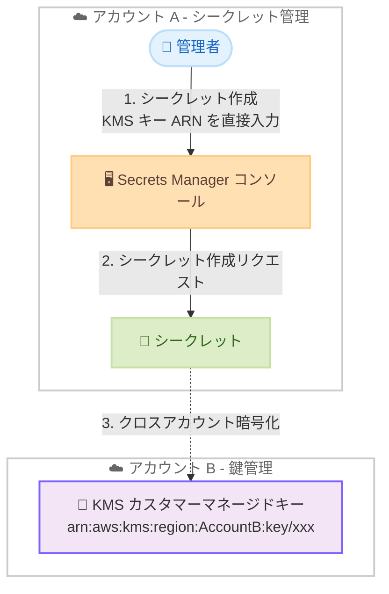

# AWS Secrets Manager - コンソールでのカスタム AWS KMS キー入力サポート

**リリース日**: 2026 年 4 月 3 日
**サービス**: AWS Secrets Manager
**機能**: コンソールでのカスタム KMS キー ARN 直接入力

[このアップデートのインフォグラフィックを見る](https://takech9203.github.io/aws-news-summary/20260403-aws-secrets-manager-console-custom-kms-key-input.html)

## 概要

AWS Secrets Manager のコンソールにおいて、シークレット作成時にカスタムの AWS KMS キーを直接指定できるようになった。従来のドロップダウンリストからの選択に加えて、KMS キーの ARN を直接入力できるフィールドが追加され、別の AWS アカウントの KMS キーもコンソールから指定可能になった。

この機能強化により、コンソールの操作性が既存の API や CLI の機能と同等になった。これまでクロスアカウントの KMS キーを使用するシークレットを作成する場合は API や CLI を使用する必要があったが、コンソールからも同じ操作が可能になり、マルチアカウント環境でのシークレット管理ワークフローが大幅に簡素化された。

**アップデート前の課題**

- コンソールのドロップダウンリストには同一アカウント内の KMS キーのみが表示されていた
- クロスアカウントの KMS キーを使用する場合は AWS CLI や API を使用する必要があった
- コンソールと API/CLI の機能に差異があり、運用手順が複雑になっていた

**アップデート後の改善**

- KMS キーの ARN をコンソール上で直接入力できるようになった
- 別の AWS アカウントの KMS キーをコンソールから指定可能になった
- コンソールの機能が API/CLI と同等になり、一貫した操作体験を提供

## アーキテクチャ図



アカウント A の Secrets Manager コンソールから、アカウント B に存在する KMS カスタマーマネージドキーの ARN を直接入力してシークレットを暗号化するクロスアカウント構成を示している。

## サービスアップデートの詳細

### 主要機能

1. **KMS キー ARN の直接入力**
   - シークレット作成画面で KMS キーの ARN を直接テキスト入力できるフィールドが追加された
   - 従来のドロップダウンリストからの選択も引き続き利用可能
   - ARN 形式: `arn:aws:kms:<region>:<account-id>:key/<key-id>`

2. **クロスアカウント KMS キーのサポート**
   - 別の AWS アカウントに存在する KMS キーの ARN を指定可能
   - コンソールから直接クロスアカウント暗号化ワークフローを実行できる
   - API/CLI で既にサポートされていた機能がコンソールにも拡張された

3. **既存のドロップダウンリストとの併用**
   - 同一アカウント内の KMS キーは従来通りドロップダウンリストから選択可能
   - カスタム入力とドロップダウン選択の両方の方法が利用できる

## 技術仕様

### KMS キー指定方法の比較

| 項目 | アップデート前 | アップデート後 |
|------|---------------|---------------|
| 同一アカウントの KMS キー | ドロップダウンリストから選択 | ドロップダウンリストから選択 + ARN 直接入力 |
| クロスアカウントの KMS キー | API/CLI のみ | コンソール + API/CLI |
| デフォルト KMS キー | 選択可能 | 選択可能 |

### クロスアカウント KMS キー使用の前提条件

| 項目 | 詳細 |
|------|------|
| KMS キーポリシー | キー所有アカウントでクロスアカウントアクセスを許可するポリシーの設定が必要 |
| IAM ポリシー | シークレット作成アカウントで KMS キーの使用を許可する IAM ポリシーが必要 |
| キータイプ | カスタマーマネージドキーのみ対応 |

### 設定例: クロスアカウント KMS キーポリシー

```json
{
  "Sid": "AllowCrossAccountSecretsManager",
  "Effect": "Allow",
  "Principal": {
    "AWS": "arn:aws:iam::111122223333:root"
  },
  "Action": [
    "kms:Decrypt",
    "kms:GenerateDataKey",
    "kms:DescribeKey",
    "kms:CreateGrant"
  ],
  "Resource": "*",
  "Condition": {
    "StringEquals": {
      "kms:ViaService": "secretsmanager.ap-northeast-1.amazonaws.com"
    }
  }
}
```

## 設定方法

### 前提条件

1. クロスアカウントで使用する KMS カスタマーマネージドキーが作成済みであること
2. KMS キーのキーポリシーでクロスアカウントアクセスが許可されていること
3. シークレットを作成するアカウントの IAM ユーザーまたはロールに KMS キーの使用権限があること

### 手順

#### ステップ 1: KMS キーの ARN を確認

KMS キーを所有するアカウント B で、使用する KMS キーの ARN を確認する。

```bash
aws kms describe-key --key-id alias/my-secrets-key \
  --query 'KeyMetadata.Arn' --output text
```

このコマンドは指定したキーエイリアスに対応する KMS キーの完全な ARN を出力する。

#### ステップ 2: コンソールでシークレットを作成

1. AWS Secrets Manager コンソールを開く
2. 「新しいシークレットを保存する」を選択
3. シークレットのタイプと値を入力
4. 暗号化キーのセクションで、KMS キーの ARN を直接入力フィールドに貼り付ける
5. 残りの設定を完了してシークレットを作成

#### ステップ 3: AWS CLI での同等操作

```bash
aws secretsmanager create-secret \
  --name "my-cross-account-secret" \
  --secret-string '{"username":"admin","password":"example"}' \
  --kms-key-id "arn:aws:kms:ap-northeast-1:999888777666:key/12345678-abcd-efgh-ijkl-123456789012"
```

このコマンドは別アカウントの KMS キー ARN を指定してシークレットを作成する。今回のアップデートにより、この操作と同等のことがコンソールからも可能になった。

## メリット

### ビジネス面

- **運用効率の向上**: クロスアカウントのシークレット作成がコンソールから直接行えるようになり、運用手順が簡素化された
- **学習コストの削減**: CLI や API の知識がなくてもクロスアカウント暗号化ワークフローを実行できる
- **セキュリティガバナンスの強化**: 組織全体で一元管理された KMS キーをコンソールから容易に利用でき、暗号化ポリシーの遵守が容易になった

### 技術面

- **コンソールと API の機能パリティ**: コンソールの機能が API/CLI と同等になり、ツール間の差異が解消された
- **クロスアカウントワークフローの簡素化**: マルチアカウント環境での暗号化キー管理が効率的になった
- **柔軟なキー指定**: ドロップダウンリストに表示されないキーも ARN を知っていれば使用可能

## デメリット・制約事項

### 制限事項

- AWS マネージドキー (`aws/secretsmanager`) はクロスアカウントでは使用不可。カスタマーマネージドキーのみ対応
- KMS キーのキーポリシーで明示的にクロスアカウントアクセスを許可する必要がある
- コンソール上での ARN 入力時にバリデーションエラーが発生した場合、キーポリシーや IAM ポリシーの確認が必要

### 考慮すべき点

- クロスアカウント KMS キーを使用する場合、キー所有アカウントの KMS キーが削除されるとシークレットの復号が不可能になる
- KMS キーのリージョンとシークレットのリージョンが一致している必要がある
- クロスアカウントアクセスの IAM ポリシーと KMS キーポリシーの両方を適切に設定する必要がある

## ユースケース

### ユースケース 1: 中央集権的な暗号化キー管理

**シナリオ**: セキュリティチームが専用の AWS アカウントで KMS キーを一元管理し、各プロジェクトアカウントの Secrets Manager シークレットをその KMS キーで暗号化する。

**実装例**:
```bash
# セキュリティアカウントの KMS キー ARN をコンソールに入力
arn:aws:kms:ap-northeast-1:SECURITY-ACCOUNT-ID:key/centralized-key-id
```

**効果**: 暗号化キーのライフサイクル管理を一元化でき、コンプライアンス要件への対応が容易になる。

### ユースケース 2: マルチアカウント環境でのアプリケーションシークレット管理

**シナリオ**: AWS Organizations で管理された複数のアカウントにまたがるマイクロサービス環境で、共有データベースの認証情報を統一された KMS キーで暗号化する。

**実装例**:
```bash
# 各アカウントのコンソールから共通の KMS キー ARN を指定してシークレットを作成
aws secretsmanager create-secret \
  --name "shared-db-credentials" \
  --secret-string '{"host":"db.example.com","username":"app","password":"secret"}' \
  --kms-key-id "arn:aws:kms:ap-northeast-1:SHARED-ACCOUNT:key/shared-key-id"
```

**効果**: 複数アカウントで一貫した暗号化ポリシーを適用でき、鍵のローテーション管理も一箇所で行える。

### ユースケース 3: 監査・コンプライアンス対応

**シナリオ**: 金融機関で規制要件に基づき、特定の KMS キーでのみシークレットを暗号化する必要がある環境で、監査チームが管理するキーを各部門のアカウントから利用する。

**実装例**:
```bash
# 監査アカウントの承認済み KMS キー ARN を使用
arn:aws:kms:ap-northeast-1:AUDIT-ACCOUNT-ID:key/approved-compliance-key-id
```

**効果**: コンプライアンス要件を満たす暗号化キーの使用をコンソールレベルで強制でき、監査証跡の管理が容易になる。

## 料金

今回のコンソール機能強化自体に追加料金は発生しない。関連する既存の料金体系は以下の通り。

### 料金例

| 項目 | 料金 |
|------|------|
| Secrets Manager シークレット 1 件あたり | $0.40/月 |
| API コール 10,000 回あたり | $0.05 |
| KMS カスタマーマネージドキー 1 件あたり | $1.00/月 |
| KMS API リクエスト 10,000 回あたり | $0.03 |

クロスアカウントの KMS キーを使用する場合も、料金体系は同一アカウントの場合と同じ。KMS の料金はキーを所有するアカウントに課金される。

## 利用可能リージョン

Secrets Manager が利用可能なすべての AWS リージョンで利用可能。

## 関連サービス・機能

- **AWS KMS**: シークレットの暗号化に使用するキー管理サービス。カスタマーマネージドキーのクロスアカウント共有が今回の機能の中核
- **AWS Organizations**: マルチアカウント環境の管理。組織内のアカウント間での KMS キー共有に活用
- **AWS IAM**: KMS キーへのクロスアカウントアクセス権限の管理。キーポリシーと IAM ポリシーの両方の設定が必要
- **AWS CloudTrail**: シークレット作成時の KMS キー使用状況の監査ログ記録

## 参考リンク

- [インフォグラフィック](https://takech9203.github.io/aws-news-summary/20260403-aws-secrets-manager-console-custom-kms-key-input.html)
- [公式発表 (What's New)](https://aws.amazon.com/about-aws/whats-new/2026/04/aws-secrets-manager-console-custom-kms-key-input/)
- [AWS Secrets Manager ドキュメント](https://docs.aws.amazon.com/secretsmanager/latest/userguide/)
- [AWS KMS クロスアカウントアクセス](https://docs.aws.amazon.com/kms/latest/developerguide/key-policy-modifying-external-accounts.html)
- [Secrets Manager 料金ページ](https://aws.amazon.com/secrets-manager/pricing/)

## まとめ

AWS Secrets Manager コンソールでのカスタム KMS キー ARN 直接入力サポートにより、クロスアカウント暗号化ワークフローがコンソールから実行可能になった。マルチアカウント環境で Secrets Manager を使用している組織は、CLI や API に頼ることなくコンソールからクロスアカウントの KMS キーを指定できるようになるため、運用手順の見直しを検討することを推奨する。特に、中央集権的な暗号化キー管理を行っている環境で大きなメリットが得られる。
