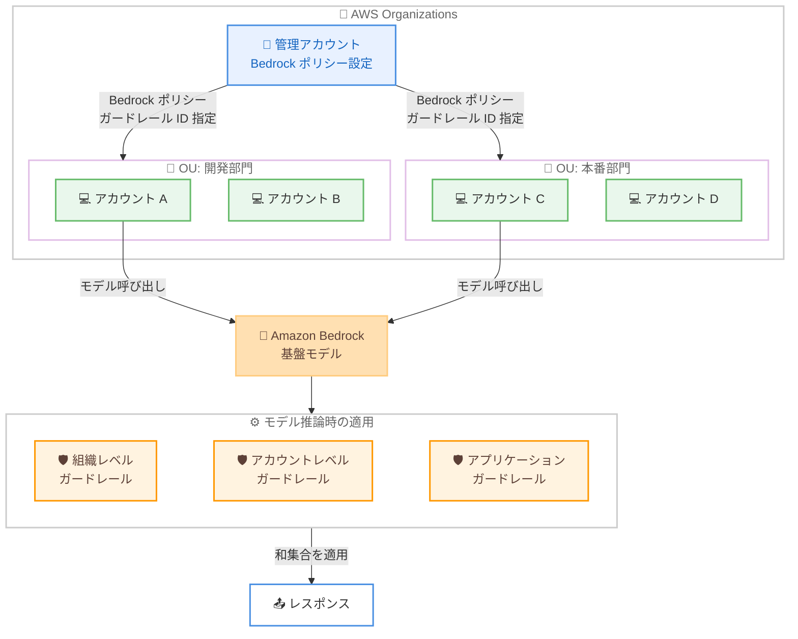

# Amazon Bedrock Guardrails - クロスアカウントセーフガードの一般提供開始

**リリース日**: 2026年4月3日
**サービス**: Amazon Bedrock
**機能**: Guardrails クロスアカウントセーフガード

📊 [このアップデートのインフォグラフィックを見る](https://takech9203.github.io/aws-news-summary/20260403-bedrock-guardrails-cross-account-safeguards.html)

## 概要

Amazon Bedrock Guardrails がクロスアカウントセーフガード機能の一般提供 (GA) を開始しました。この機能により、AWS Organizations 内のすべてのアカウントに対して、基盤モデルの安全性制御を一元的に適用できるようになります。中央のセキュリティチームや管理者は、管理アカウントからガードレール ID を指定した Amazon Bedrock ポリシーを作成するだけで、組織全体のモデル呼び出しに対してセーフガードを自動的に適用できます。

この機能は、組織レベルでの統一的なベースライン保護、アカウントレベルでの部門別要件への対応、アプリケーション固有のセーフガードという 3 つの階層での制御を実現します。複数のガードレールが適用される場合は、それらの和集合 (ユニオン) がモデル推論時に強制されます。

**アップデート前の課題**

- 各 AWS アカウントで個別にガードレールを手動設定する必要があり、運用負荷が大きかった
- 組織全体で統一的な安全性ポリシーを適用する仕組みがなかった
- アカウント数が増えるほどガードレールの設定漏れや不整合が発生するリスクが高まった
- 中央のセキュリティチームが各アカウントの設定状況を把握・管理することが困難だった

**アップデート後の改善**

- 管理アカウントから組織全体に対してガードレールを一括適用できるようになった
- AWS Organizations のポリシーを通じて、OU やアカウント単位での階層的な制御が可能になった
- 各アカウントでの手動設定が不要になり、運用オーバーヘッドが大幅に削減された
- 複数のガードレールの和集合が自動的に適用され、抜け漏れのない保護を実現できるようになった

## アーキテクチャ図



管理アカウントから Bedrock ポリシーを通じてガードレールを組織全体に配布し、モデル推論時に組織レベル、アカウントレベル、アプリケーションレベルのガードレールの和集合が自動的に適用されます。

## サービスアップデートの詳細

### 主要機能

1. **クロスアカウントセーフガード**
   - 管理アカウントからガードレール ID を指定した Bedrock ポリシーを作成
   - AWS Organizations の OU およびアカウント単位でポリシーをアタッチ
   - 対象メンバーアカウントのすべてのモデル呼び出しに対してガードレールが自動適用

2. **階層的なガードレール制御**
   - **組織レベル**: 組織全体で統一的なベースライン保護を適用
   - **アカウントレベル**: 部門ごとの要件に応じたガードレールを設定
   - **アプリケーションレベル**: 個別アプリケーションの要件に対応するガードレールを設定

3. **ガードレールのユニオン適用**
   - 複数のガードレールが適用される場合、すべてのガードレールの和集合が推論時に強制
   - 組織ポリシー、アカウントポリシー、アプリケーション固有のガードレールが統合的に適用
   - より制限的な方向で保護が強化される

## 技術仕様

### ポリシー構成

| 項目 | 詳細 |
|------|------|
| ポリシータイプ | Amazon Bedrock ポリシー |
| 管理レベル | AWS Organizations 管理アカウント |
| 適用対象 | OU、個別アカウント |
| ガードレール指定 | ガードレール ID を使用 |
| 適用タイミング | モデル推論呼び出し時 |
| 複数ガードレール | 和集合 (ユニオン) として適用 |

### API 変更履歴

| 日付 | サービス | 変更内容 |
|------|----------|----------|
| 2026/04/03 | [Agents for Amazon Bedrock](https://awsapichanges.com/archive/changes/da2768-bedrock-agent.html) | 10 updated methods - Guardrails enforcement configuration APIs でシステムプロンプト、ユーザーメッセージ、アシスタントメッセージに対する選択的ガーディング制御とリソースポリシー API の SDK サポートを追加 |
| 2026/04/03 | [Amazon Bedrock](https://awsapichanges.com/archive/changes/da2768-bedrock.html) | 3 new 2 updated methods - Guardrails enforcement configuration APIs でシステムプロンプト、ユーザーメッセージ、アシスタントメッセージに対する選択的ガーディング制御とリソースポリシー API の SDK サポートを追加 |

### ガードレールで利用可能な制御

Amazon Bedrock Guardrails が提供するセーフガード機能はすべてクロスアカウントで適用可能です。

| 制御カテゴリ | 説明 |
|-------------|------|
| コンテンツフィルタ | 有害コンテンツのカテゴリ別フィルタリング |
| トピック拒否 | 特定のトピックに関するリクエストのブロック |
| 機密情報フィルタ | PII などの機密情報の検出とマスキング |
| 単語フィルタ | カスタム単語リストによるフィルタリング |
| コンテキストグラウンディング | ハルシネーション防止のための根拠確認 |

## 設定方法

### 前提条件

1. AWS Organizations が有効化されていること
2. 管理アカウントへのアクセス権限
3. Amazon Bedrock Guardrails でガードレールが作成済みであること
4. AWS Organizations のポリシー機能が有効であること

### 手順

#### ステップ 1: ガードレールの作成

```bash
aws bedrock create-guardrail \
  --name "org-baseline-guardrail" \
  --description "組織全体のベースラインガードレール" \
  --content-policy-config '{
    "filtersConfig": [
      {
        "type": "SEXUAL",
        "inputStrength": "HIGH",
        "outputStrength": "HIGH"
      },
      {
        "type": "HATE",
        "inputStrength": "HIGH",
        "outputStrength": "HIGH"
      },
      {
        "type": "VIOLENCE",
        "inputStrength": "HIGH",
        "outputStrength": "HIGH"
      }
    ]
  }' \
  --blocked-input-messaging "このリクエストは組織のポリシーによりブロックされました。" \
  --blocked-output-messaging "このレスポンスは組織のポリシーによりブロックされました。"
```

管理アカウントで組織全体に適用するベースラインのガードレールを作成します。作成後に返されるガードレール ID を記録しておきます。

#### ステップ 2: Amazon Bedrock ポリシーの作成

```bash
aws organizations create-policy \
  --name "bedrock-guardrails-policy" \
  --type "BEDROCK_POLICY" \
  --description "組織全体の Bedrock ガードレールポリシー" \
  --content '{
    "guardrails": {
      "guardrail_id": "abc123def456",
      "guardrail_version": "1",
      "enforcement": "ENABLED"
    }
  }'
```

AWS Organizations で Bedrock ポリシーを作成し、管理アカウントのガードレール ID を指定します。

#### ステップ 3: ポリシーを OU またはアカウントにアタッチ

```bash
# OU にアタッチ
aws organizations attach-policy \
  --policy-id "p-1234567890" \
  --target-id "ou-abc1-defghijk"

# 個別アカウントにアタッチ
aws organizations attach-policy \
  --policy-id "p-1234567890" \
  --target-id "123456789012"
```

作成したポリシーを対象の OU や個別アカウントにアタッチします。アタッチされたメンバーアカウントでのすべてのモデル呼び出しに対して、指定したガードレールが自動的に適用されます。

## メリット

### ビジネス面

- **ガバナンスの一元化**: 中央のセキュリティチームが組織全体の AI 安全性ポリシーを一元管理できる
- **コンプライアンス対応の効率化**: 規制要件に対応するガードレールを組織全体に即座に展開可能
- **運用コストの削減**: 各アカウントでの個別設定が不要になり、管理工数を大幅に削減

### 技術面

- **設定漏れの防止**: ポリシーベースの自動適用により、新規アカウントにも自動的にガードレールが適用される
- **階層的制御**: 組織、OU、アカウント、アプリケーションの各レベルで柔軟にガードレールを設定可能
- **ユニオン適用**: 複数のガードレールが重複する場合、最も制限的な方向で和集合が適用され、抜け漏れを防止

## デメリット・制約事項

### 制限事項

- AWS Organizations の管理アカウントからのみポリシーを作成・管理可能
- ガードレールのユニオン適用により、意図せず制限が厳しくなる可能性がある
- ポリシーの適用はモデル推論時に行われるため、推論レイテンシーへの影響を考慮する必要がある

### 考慮すべき点

- 組織レベルのガードレールとアプリケーション固有のガードレールが競合する場合の動作を事前にテストすること
- ガードレールのバージョン管理と更新プロセスを組織全体で統一する運用フローの整備が必要
- 既存のアカウント個別設定からクロスアカウントポリシーへの移行計画を策定すること

## ユースケース

### ユースケース 1: 金融機関での組織全体の AI 安全性管理

**シナリオ**: 大手金融機関が複数の部門 (リテール、法人、資産管理) でそれぞれ AWS アカウントを運用しており、すべての部門で基盤モデルの利用に対して統一的な安全性基準を適用したい。

**実装例**:
```bash
# 組織全体のベースラインガードレール
aws bedrock create-guardrail \
  --name "financial-baseline" \
  --sensitive-information-policy-config '{
    "piiEntitiesConfig": [
      {"type": "CREDIT_DEBIT_CARD_NUMBER", "action": "ANONYMIZE"},
      {"type": "US_SOCIAL_SECURITY_NUMBER", "action": "BLOCK"},
      {"type": "CREDIT_DEBIT_CARD_CVV", "action": "BLOCK"}
    ]
  }'
```

**効果**: すべての部門アカウントで PII の漏洩を防止し、金融規制への準拠を組織全体で確保できる。

### ユースケース 2: マルチテナント SaaS プロバイダーでのテナント別制御

**シナリオ**: SaaS プロバイダーが顧客テナントごとに AWS アカウントを分離しており、テナント共通のベースライン保護と、業界別の追加制御を適用したい。

**実装例**:
```bash
# ベースラインポリシーを組織ルートにアタッチ
aws organizations attach-policy \
  --policy-id "p-baseline-001" \
  --target-id "r-root1"

# ヘルスケア業界テナント用の OU に追加ポリシーをアタッチ
aws organizations attach-policy \
  --policy-id "p-healthcare-001" \
  --target-id "ou-healthcare"
```

**効果**: ベースライン保護と業界固有の制御が和集合として自動適用され、テナントごとの手動設定が不要になる。

### ユースケース 3: 開発環境と本番環境での段階的ガードレール適用

**シナリオ**: 開発チームが新しい AI アプリケーションを開発しており、開発環境では緩めの制御、本番環境では厳格な制御を適用したい。

**実装例**:
```bash
# 開発 OU 用ポリシー (基本的なフィルタのみ)
aws organizations create-policy \
  --name "dev-guardrails" \
  --type "BEDROCK_POLICY" \
  --content '{"guardrails": {"guardrail_id": "dev-guardrail-001"}}'

# 本番 OU 用ポリシー (厳格なフィルタ + PII 保護)
aws organizations create-policy \
  --name "prod-guardrails" \
  --type "BEDROCK_POLICY" \
  --content '{"guardrails": {"guardrail_id": "prod-guardrail-001"}}'
```

**効果**: 環境に応じた適切なレベルのガードレールを OU 単位で管理でき、本番デプロイ時に追加のガードレール設定が不要になる。

## 料金

Amazon Bedrock Guardrails のクロスアカウントセーフガード機能自体に追加料金は発生しません。通常の Amazon Bedrock Guardrails の利用料金が適用されます。

### 料金例

| 項目 | 料金 |
|------|------|
| テキスト保護 (1,000 テキストユニット) | Guardrails の標準料金が適用 |
| 画像保護 (1 画像あたり) | Guardrails の標準料金が適用 |
| クロスアカウントポリシー管理 | 追加料金なし |

※ 最新の料金情報は [Amazon Bedrock 料金ページ](https://aws.amazon.com/bedrock/pricing/) を確認してください。

## 利用可能リージョン

すべての AWS 商用リージョンおよび AWS GovCloud (US) リージョンで利用可能です。

## 関連サービス・機能

- **AWS Organizations**: クロスアカウントポリシーの管理基盤として使用
- **Amazon Bedrock Guardrails**: 基盤モデルの安全性制御を提供するコア機能
- **AWS Organizations サービスコントロールポリシー (SCP)**: IAM レベルでのアクセス制御との組み合わせで多層防御を実現
- **Amazon Bedrock**: 基盤モデルの推論サービス

## 参考リンク

- 📊 [インフォグラフィック](https://takech9203.github.io/aws-news-summary/20260403-bedrock-guardrails-cross-account-safeguards.html)
- [公式発表 (What's New)](https://aws.amazon.com/about-aws/whats-new/2026/04/bedrock-guardrails-cross-account-safeguards/)
- [AWS Blog](https://aws.amazon.com/blogs/aws/amazon-bedrock-guardrails-supports-cross-account-safeguards-with-centralized-control-and-management)
- [Amazon Bedrock Guardrails ドキュメント](https://docs.aws.amazon.com/bedrock/latest/userguide/guardrails.html)
- [料金ページ](https://aws.amazon.com/bedrock/pricing/)

## まとめ

Amazon Bedrock Guardrails のクロスアカウントセーフガード機能は、組織全体での AI 安全性管理を大幅に効率化する重要なアップデートです。AWS Organizations との統合により、中央のセキュリティチームが管理アカウントから一元的にガードレールポリシーを展開でき、各アカウントでの個別設定が不要になります。マルチアカウント環境で Amazon Bedrock を利用している組織は、早期にこの機能を導入して組織全体の AI ガバナンス基盤を強化することを推奨します。
