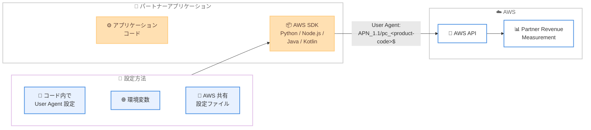

# Partner Revenue Measurement - User Agent 文字列サポート

**リリース日**: 2026 年 4 月 3 日
**サービス**: AWS Partner Revenue Measurement
**機能**: User Agent 文字列による AWS サービス消費量の測定

[このアップデートのインフォグラフィックを見る](https://takech9203.github.io/aws-news-summary/20260403-partner-revenue-measurement-user-agent-support.html)

## 概要

AWS は Partner Revenue Measurement の新機能として、User Agent 文字列による AWS サービス消費量の測定機能の一般提供を発表しました。この機能により、AWS パートナーは AWS API および SDK を使用して、自社ソリューションが駆動する AWS サービスの消費量を測定できるようになります。

Partner Revenue Measurement は、パートナーが AWS 収益への影響と製品消費パターンをより詳細に理解するための仕組みです。今回の User Agent 文字列機能では、AWS Marketplace リスティングの一意のプロダクトコードを User Agent として埋め込むことで、特定のサービスにおけるソリューションの AWS 収益への影響を定量化・測定できます。

**アップデート前の課題**

- パートナーが API 駆動型ワークロードの AWS サービス消費量を自動的に測定する手段が限られていた
- リソースタグ付けのみでは、API コールベースのワークロードの追跡が困難だった
- 複数の SDK やプログラミング言語にまたがるデプロイメントで、一貫した帰属追跡を行う仕組みがなかった

**アップデート後の改善**

- User Agent 文字列をアプリケーションに追加するだけで、API 駆動型ワークロードの消費量測定が可能に
- 環境変数または AWS 共有設定ファイルによる自動的な User Agent 文字列の適用が可能に
- Python、Node.js、Java、Kotlin など複数の AWS SDK で利用可能になり、一貫した帰属追跡が実現

## アーキテクチャ図



パートナーアプリケーションが AWS SDK を通じて API コールを行う際に、User Agent 文字列にプロダクトコードを埋め込むことで、Partner Revenue Measurement がソリューション別の AWS サービス消費量を自動的に測定します。

## サービスアップデートの詳細

### 主要機能

1. **User Agent 文字列による帰属追跡**
   - フォーマット: `APN_1.1/pc_<AWS Marketplace product-code>$`
   - AWS Marketplace リスティングのプロダクトコードを使用して、ソリューション別の消費量を測定
   - パートナーマネージドアカウントと顧客マネージドアカウントの両方で利用可能

2. **複数の設定方法**
   - アプリケーションコード内で直接 User Agent を設定
   - 環境変数による SDK レベルでの自動適用
   - AWS 共有設定ファイル (`~/.aws/config`) による設定

3. **マルチ SDK 対応**
   - Python (Boto3)、Node.js、Java、Kotlin など主要な AWS SDK をサポート
   - 自動デプロイメント全体で一貫した帰属追跡を実現

4. **既存機能との補完**
   - リソースタグ付けによる追跡機能と併用可能
   - AWS Marketplace Metering 連携と組み合わせて包括的な測定が可能

## 技術仕様

### User Agent 文字列フォーマット

| 項目 | 詳細 |
|------|------|
| フォーマット | `APN_1.1/pc_<AWS Marketplace product-code>$` |
| プレフィックス | `APN_1.1/pc_` |
| 識別子 | AWS Marketplace リスティングのプロダクトコード |
| サフィックス | `$` |

### 設定方法の比較

| 設定方法 | 適用範囲 | ユースケース |
|----------|----------|-------------|
| コード内設定 | 特定の API コール | 細かい制御が必要な場合 |
| 環境変数 | SDK セッション全体 | コンテナ / サーバーレスデプロイメント |
| 共有設定ファイル | プロファイル単位 | 開発環境 / 長期稼働インスタンス |

### 対応 SDK

| SDK | 言語 |
|-----|------|
| Boto3 | Python |
| AWS SDK for JavaScript | Node.js |
| AWS SDK for Java | Java |
| AWS SDK for Kotlin | Kotlin |
| その他 AWS SDK | 各種言語 |

## 設定方法

### 前提条件

1. AWS Marketplace にリスティングされたプロダクトがあること
2. AWS Marketplace のプロダクトコードを取得済みであること
3. 対応する AWS SDK がインストールされていること

### 手順

#### ステップ 1: プロダクトコードの確認

AWS Marketplace の出品情報からプロダクトコードを取得します。プロダクトコードは AWS Marketplace の管理コンソールから確認できます。

#### ステップ 2: 環境変数による設定

```bash
# 環境変数で User Agent 文字列を設定
export AWS_SDK_UA_APP_ID="APN_1.1/pc_YOUR_PRODUCT_CODE$"
```

この環境変数を設定することで、SDK が行うすべての AWS API コールに自動的に User Agent 文字列が付与されます。

#### ステップ 3: AWS 共有設定ファイルによる設定

```ini
# ~/.aws/config
[profile partner-app]
sdk_ua_app_id = APN_1.1/pc_YOUR_PRODUCT_CODE$
```

共有設定ファイルに記述することで、特定のプロファイルを使用する際に自動的に User Agent 文字列が適用されます。

#### ステップ 4: Python SDK での直接設定例

```python
import boto3
from botocore.config import Config

config = Config(
    user_agent_extra="APN_1.1/pc_YOUR_PRODUCT_CODE$"
)

client = boto3.client('s3', config=config)
```

コード内で直接設定する場合、`Config` オブジェクトの `user_agent_extra` パラメータを使用します。

## メリット

### ビジネス面

- **収益影響の可視化**: パートナーソリューションが AWS サービス消費にどの程度貢献しているかを定量的に把握可能
- **投資判断の改善**: データに基づいた製品投資やマーケティング戦略の意思決定が可能に
- **AWS パートナープログラムでの評価向上**: 正確な収益貢献度の測定により、パートナーティアの昇格やインセンティブの獲得に有利

### 技術面

- **低侵襲な実装**: 環境変数や設定ファイルの変更だけで導入可能で、アプリケーションコードの変更が不要
- **マルチ SDK 対応**: 複数のプログラミング言語で一貫した実装が可能
- **既存機能との補完**: リソースタグ付けや Marketplace Metering と組み合わせることで、包括的な測定体制を構築可能

## デメリット・制約事項

### 制限事項

- すべての AWS サービスで利用可能なわけではなく、特定のサービスのみ対応
- User Agent 文字列のフォーマットが厳密に定められており、誤った形式では測定されない
- AWS Marketplace にリスティングされた製品のプロダクトコードが必要

### 考慮すべき点

- 対応サービスの一覧は公式ドキュメントで確認が必要
- 環境変数と設定ファイルの両方が設定されている場合の優先順位を理解しておく必要がある
- 顧客マネージドアカウントでの測定には、顧客側での設定や同意が必要となる場合がある

## ユースケース

### ユースケース 1: SaaS プロバイダーの収益貢献度測定

**シナリオ**: AWS 上に SaaS アプリケーションを構築しているパートナーが、自社ソリューションが顧客の AWS サービス消費にどの程度貢献しているかを測定したい。

**実装例**:
```bash
# コンテナのデプロイ設定で環境変数を追加
export AWS_SDK_UA_APP_ID="APN_1.1/pc_abcdef123456$"
```

**効果**: API コールベースのワークロード全体での収益貢献度を自動測定でき、製品の価値を定量化できます。

### ユースケース 2: マルチ SDK デプロイメントでの一貫した追跡

**シナリオ**: Python でバックエンド、Node.js でフロントエンド API を構築しているパートナーが、両方のコンポーネントからの AWS サービス消費を一元的に追跡したい。

**実装例**:
```ini
# ~/.aws/config で統一設定
[default]
sdk_ua_app_id = APN_1.1/pc_abcdef123456$
```

**効果**: 言語やフレームワークに関係なく、すべての AWS API コールで一貫した帰属追跡が実現します。

### ユースケース 3: リソースタグ付けとの併用による包括的測定

**シナリオ**: 既にリソースタグ付けによる Partner Revenue Measurement を導入しているパートナーが、タグ付けが困難な API 駆動型ワークロードもカバーしたい。

**実装例**:
```python
import boto3
from botocore.config import Config

# User Agent 文字列を設定
config = Config(user_agent_extra="APN_1.1/pc_abcdef123456$")

# リソースタグ付けと併用
client = boto3.client('ec2', config=config)
client.create_tags(
    Resources=['i-1234567890abcdef0'],
    Tags=[{'Key': 'aws-marketplace-product-code', 'Value': 'abcdef123456'}]
)
```

**効果**: リソースベースの追跡と API ベースの追跡を組み合わせることで、AWS サービス消費の全体像を把握できます。

## 料金

Partner Revenue Measurement の User Agent 文字列機能の利用に追加料金は発生しません。AWS Marketplace にリスティングされた製品のプロダクトコードを使用するため、AWS Marketplace の出品が前提となります。

## 利用可能リージョン

すべての AWS 商用リージョンで利用可能です。

## 関連サービス・機能

- **AWS Marketplace**: パートナー製品のリスティングとプロダクトコードの提供元
- **Partner Revenue Measurement - リソースタグ付け**: AWS リソースにタグを適用する方式での収益測定。User Agent 文字列と補完関係にある
- **AWS Marketplace Metering**: 使用量ベースの課金と消費量測定。Partner Revenue Measurement と連携して包括的な測定を実現

## 参考リンク

- [公式発表 (What's New)](https://aws.amazon.com/about-aws/whats-new/2026/04/partner-revenue-measurement-user-agent-support/)
- [User Agent 実装ガイド](https://docs.aws.amazon.com/partner-central/latest/user-agent-guide/overview.html)
- [対応サービス一覧](https://docs.aws.amazon.com/partner-central/latest/user-agent-guide/supported-services.html)
- [Partner Revenue Measurement オンボーディングガイド](https://docs.aws.amazon.com/partner-central/latest/getting-started/partner-revenue-measurement.html)

## まとめ

Partner Revenue Measurement の User Agent 文字列サポートにより、AWS パートナーは API 駆動型ワークロードの収益貢献度を簡単かつ自動的に測定できるようになりました。環境変数や設定ファイルの変更だけで導入できるため、既存のアプリケーションへの影響を最小限に抑えながら、包括的な収益測定体制を構築することをお勧めします。既にリソースタグ付けを利用しているパートナーは、User Agent 文字列と組み合わせることで、より完全な消費量の可視化が可能になります。
