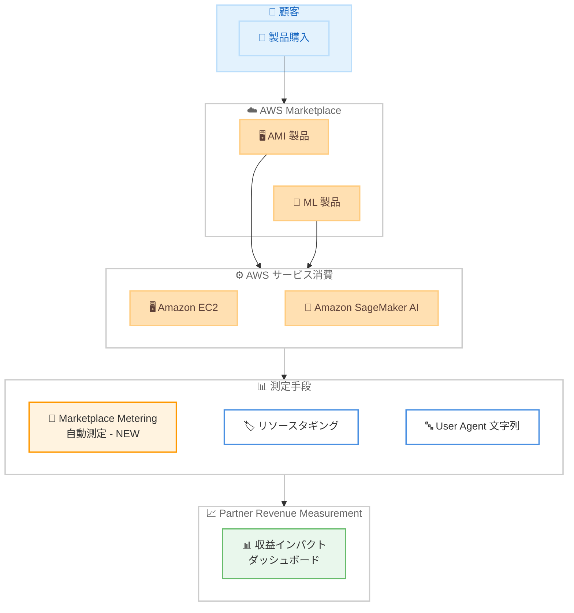

# Partner Revenue Measurement - AWS Marketplace Metering 対応

**リリース日**: 2026 年 4 月 3 日
**サービス**: AWS Partner Revenue Measurement
**機能**: AWS Marketplace Metering による AMI / ML 製品の消費量測定

[このアップデートのインフォグラフィックを見る](https://takech9203.github.io/aws-news-summary/20260403-partner-revenue-supports-mp-metering.html)

## 概要

AWS Partner Revenue Measurement が AWS Marketplace Metering との統合に対応しました。これにより、AWS Marketplace に掲載されている Amazon Machine Image (AMI) および Machine Learning (ML) 製品について、顧客が購入・利用した際の AWS サービス消費量を自動的に測定できるようになります。

パートナーは、自社のソリューションが Amazon EC2 および Amazon SageMaker AI のサービス消費にどの程度影響しているかを、パートナーマネージドアカウントと顧客マネージドアカウントの両方で可視化できます。今回追加された AWS Marketplace Metering は、既存のリソースタギングおよび User Agent 文字列による測定方法を補完する 3 つ目の測定手段として位置付けられています。

**アップデート前の課題**

- AMI や ML 製品の利用に伴う AWS サービス消費量を自動的に測定する手段がなかった
- リソースタギングや User Agent 文字列による測定では、手動でのタグ付けや設定が必要だった
- AWS Marketplace で販売した AMI / ML 製品が実際にどの程度 EC2 や SageMaker AI の利用を促進しているか把握が困難だった

**アップデート後の改善**

- AWS Marketplace Metering により、AMI および ML 製品の AWS サービス消費量が自動的に測定される
- 手動でのタグ付けなしに、EC2 および SageMaker AI の消費量を可視化可能に
- リソースタギング、User Agent 文字列と合わせて 3 つの測定手段を組み合わせた包括的な収益測定が可能に

## アーキテクチャ図

顧客が AWS Marketplace で AMI / ML 製品を購入・利用すると、EC2 や SageMaker AI のサービス消費が発生します。今回新たに追加された Marketplace Metering により、この消費量が自動的に測定され、Partner Revenue Measurement のダッシュボードで可視化されます。

## サービスアップデートの詳細

### 主要機能

1. **AWS Marketplace Metering による自動測定**
   - AMI および ML 製品の利用に伴う AWS サービス消費量を自動的に測定
   - 手動でのタグ付けや設定変更が不要
   - AWS Marketplace の既存のメータリング基盤を活用

2. **EC2 および SageMaker AI の消費量可視化**
   - AMI 製品経由の Amazon EC2 インスタンス利用量を追跡
   - ML 製品経由の Amazon SageMaker AI リソース消費量を追跡
   - パートナーマネージドアカウントと顧客マネージドアカウントの両方を対象

3. **3 つの測定手段の統合**
   - AWS Marketplace Metering: AMI / ML 製品の自動測定 (今回追加)
   - リソースタギング: `aws-apn-id` タグによる手動追跡 (既存)
   - User Agent 文字列: API コール元の識別による追跡 (既存)

## 技術仕様

### 対応製品タイプと測定対象

| 製品タイプ | 測定対象サービス | 測定方法 |
|------------|------------------|----------|
| AMI 製品 | Amazon EC2 | Marketplace Metering による自動測定 |
| ML 製品 | Amazon SageMaker AI | Marketplace Metering による自動測定 |

### 3 つの測定手段の比較

| 測定手段 | 対象 | 設定 | 特徴 |
|----------|------|------|------|
| Marketplace Metering | AMI / ML 製品 | 自動 | 製品購入時に自動適用 |
| リソースタギング | 全リソース | 手動 | `aws-apn-id` タグの適用が必要 |
| User Agent 文字列 | API コール | 手動 | SDK / CLI に識別子を設定 |

## 設定方法

### 前提条件

1. AWS Marketplace に AMI または ML 製品を掲載済みであること
2. Partner Revenue Measurement へのオンボーディングが完了していること
3. AWS パートナーポータルへのアクセス権限があること

### 手順

#### ステップ 1: Partner Revenue Measurement の有効化確認

AWS パートナーポータルにログインし、Partner Revenue Measurement が有効になっていることを確認します。初回の場合はオンボーディングガイドに沿ってセットアップを完了してください。

#### ステップ 2: Marketplace Metering の動作確認

AWS Marketplace に掲載済みの AMI または ML 製品について、顧客が購入・利用を開始すると、Marketplace Metering による自動測定が開始されます。パートナー側での追加設定は不要です。

#### ステップ 3: ダッシュボードでの確認

AWS パートナーポータルの Partner Revenue Measurement ダッシュボードで、Marketplace Metering 経由の消費量データを確認します。EC2 および SageMaker AI の消費量がソリューション別に表示されます。

## メリット

### ビジネス面

- **自動測定による正確なデータ**: 手動設定が不要なため、測定漏れのリスクが大幅に低減される
- **AMI / ML 製品の価値実証**: 自社製品が AWS サービス消費にどの程度貢献しているかを定量的に示せる
- **投資判断の精度向上**: 製品ポートフォリオの中で最も AWS 利用を促進している製品を特定可能

### 技術面

- **ゼロ設定**: Marketplace Metering は自動的に動作するため、パートナー側の実装負荷がない
- **既存手段との補完**: リソースタギングや User Agent 文字列ではカバーしにくかった AMI / ML 製品固有の消費を測定可能
- **包括的な測定**: 3 つの手段を組み合わせることで、より網羅的な収益インパクト測定を実現

## デメリット・制約事項

### 制限事項

- 対象は AMI 製品と ML 製品に限定されており、SaaS 製品やコンテナ製品は現時点で対象外
- 測定対象の AWS サービスは Amazon EC2 と Amazon SageMaker AI に限定
- AWS Marketplace 経由で販売された製品のみが対象で、直接販売分は含まれない

### 考慮すべき点

- Marketplace Metering のデータがダッシュボードに反映されるまでにタイムラグが生じる可能性がある
- 既存のリソースタギングや User Agent 文字列による測定と併用する場合、重複カウントの可能性について確認が必要

## ユースケース

### ユースケース 1: AMI ベースのセキュリティソリューション

**シナリオ**: セキュリティベンダーが AWS Marketplace で AMI 形式のファイアウォールアプライアンスを提供しており、顧客の EC2 利用量への影響を測定したい。

**効果**: Marketplace Metering により、AMI 製品の購入後に発生する EC2 インスタンスの消費量が自動的に測定され、パートナーのソリューションが EC2 利用をどの程度促進しているかを定量化できる。

### ユースケース 2: ML モデルの SageMaker AI 利用量測定

**シナリオ**: AI / ML スタートアップが AWS Marketplace で ML アルゴリズムやモデルを提供しており、顧客の SageMaker AI 利用量への貢献度を把握したい。

**効果**: ML 製品の利用に伴う SageMaker AI のトレーニングおよび推論リソースの消費量が自動的に追跡され、製品の価値を顧客に対して数値で実証可能になる。

### ユースケース 3: 複数測定手段の併用による包括的な分析

**シナリオ**: 大手 ISV パートナーが AMI 製品、SaaS 製品、コンサルティングサービスを包括的に提供しており、全体の AWS 収益貢献度を把握したい。

**効果**: AMI 製品は Marketplace Metering、その他のサービスはリソースタギングや User Agent 文字列で測定し、3 つの手段を組み合わせることで製品ポートフォリオ全体の収益インパクトを網羅的に可視化できる。

## 料金

Partner Revenue Measurement および AWS Marketplace Metering の利用に追加料金は不要です。AWS パートナーは無料でこれらの測定機能を利用できます。

## 利用可能リージョン

すべての AWS 商用リージョンで利用可能です。

## 関連サービス・機能

- **AWS Marketplace**: AMI および ML 製品の販売・配布プラットフォーム
- **Amazon EC2**: AMI 製品の実行基盤となるコンピューティングサービス
- **Amazon SageMaker AI**: ML 製品の実行基盤となる機械学習サービス
- **Partner Revenue Measurement リソースタギング**: `aws-apn-id` タグによる手動測定手段
- **AWS Cost Explorer**: コスト分析と可視化ツール

## 参考リンク

- [このアップデートのインフォグラフィック](https://takech9203.github.io/aws-news-summary/20260403-partner-revenue-supports-mp-metering.html)
- [公式発表 (What's New)](https://aws.amazon.com/about-aws/whats-new/2026/04/partner-revenue-supports-mp-metering/)
- [Partner Revenue Measurement オンボーディングガイド](https://docs.aws.amazon.com/PRM/latest/aws-prm-onboarding-guide/what-is-service.html)
- [AWS Marketplace](https://aws.amazon.com/marketplace/)
- [AWS Partner Network](https://aws.amazon.com/partners/)

## まとめ

Partner Revenue Measurement が AWS Marketplace Metering に対応したことで、AMI および ML 製品を提供するパートナーは手動設定なしに EC2 および SageMaker AI の消費量を自動的に測定できるようになりました。既存のリソースタギングおよび User Agent 文字列と合わせて 3 つの測定手段が利用可能となり、AWS パートナーはより包括的かつ正確な収益インパクト測定を実現できます。AMI や ML 製品を AWS Marketplace で提供しているパートナーは、追加設定なしでこの機能を活用できるため、早期の確認を推奨します。
