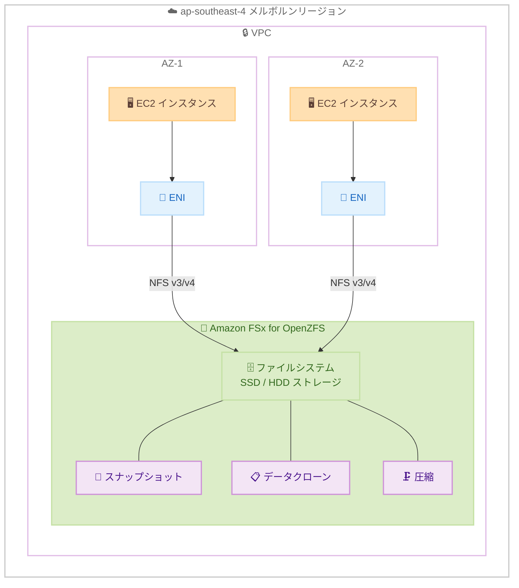

# Amazon FSx for OpenZFS - アジアパシフィック (メルボルン) リージョンで利用可能に

**リリース日**: 2026 年 4 月 6 日
**サービス**: Amazon FSx for OpenZFS
**機能**: アジアパシフィック (メルボルン) リージョンでの提供開始

📊 [このアップデートのインフォグラフィックを見る](https://takech9203.github.io/aws-news-summary/20260406-amazon-fsx-openzfs-melbourne-region.html)

## 概要

Amazon FSx for OpenZFS が、アジアパシフィック (メルボルン) リージョン (ap-southeast-4) で利用可能になりました。これにより、オーストラリアのメルボルン近郊の顧客は、ローカルリージョンでフルマネージドの OpenZFS ファイルシステムを作成し、サブミリ秒のレイテンシーと複数 GB/s のスループットを備えた共有ファイルストレージを利用できるようになります。

Amazon FSx for OpenZFS は、人気の高い OpenZFS ファイルシステムをベースに構築されたフルマネージドの共有ファイルストレージサービスです。スナップショット、データクローニング、圧縮などの ZFS の豊富なデータ管理機能を活用しながら、コスト効率の高いファイルストレージを提供します。インフラストラクチャの管理は不要で、NFS (v3、v4、v4.1、v4.2) プロトコルを介して Linux、Windows、macOS のクライアントからアクセスできます。

**アップデート前の課題**

- メルボルンリージョンで Amazon FSx for OpenZFS が利用できなかった
- オーストラリア南東部のワークロードにおいて、他のリージョン (シドニーなど) を使用する必要があり、レイテンシーが増加していた
- データレジデンシー要件により、オーストラリア国内の特定の地理的場所にデータを保持する必要がある場合に選択肢が限られていた

**アップデート後の改善**

- メルボルンリージョンで Amazon FSx for OpenZFS ファイルシステムを直接作成可能になった
- ローカルリージョンの利用により、サブミリ秒のレイテンシーでファイルアクセスが可能になった
- オーストラリア国内のデータレジデンシー要件に対応するリージョン選択肢が増加した

## アーキテクチャ図



メルボルンリージョンにおける Amazon FSx for OpenZFS の基本的なアーキテクチャを示しています。VPC 内の EC2 インスタンスが NFS プロトコルを介してファイルシステムにアクセスし、スナップショット、データクローン、圧縮などの ZFS 機能を活用できます。

## サービスアップデートの詳細

### 主要機能

1. **フルマネージド OpenZFS ファイルストレージ**
   - インフラストラクチャのプロビジョニング、パッチ適用、バックアップを AWS が管理
   - OpenZFS ファイルシステムの運用負担を軽減
   - 高可用性を備えたストレージ環境を提供

2. **高パフォーマンス**
   - サブミリ秒のレイテンシーでデータにアクセス
   - 複数 GB/s のスループットを実現
   - SSD および HDD ストレージオプションにより、パフォーマンスとコストを最適化

3. **ZFS データ管理機能**
   - **スナップショット**: ポイントインタイムのデータコピーを即座に作成
   - **データクローニング**: データのコピーなしに瞬時にクローンを作成
   - **圧縮**: データ圧縮によりストレージコストを削減
   - **ボリューム管理**: 複数のボリュームを 1 つのファイルシステムで管理

## 技術仕様

### FSx for OpenZFS の主要仕様

| 項目 | 詳細 |
|------|------|
| プロトコル | NFS v3、v4、v4.1、v4.2 |
| ストレージタイプ | SSD、HDD |
| 最大スループット | 最大 12.5 GB/s |
| レイテンシー | サブミリ秒 |
| 対応クライアント | Linux、Windows、macOS |
| デプロイタイプ | Single-AZ、Multi-AZ |
| データ管理 | スナップショット、クローン、圧縮 |

### API 変更履歴

直近 7 日間で関連する API 変更は確認されていません。

## 設定方法

### 前提条件

1. AWS アカウントとメルボルンリージョンへのアクセス権限
2. VPC とサブネットの構成
3. 適切なセキュリティグループの設定 (NFS ポート 2049 の許可)

### 手順

#### ステップ 1: ファイルシステムの作成

```bash
aws fsx create-file-system \
  --file-system-type OPENZFS \
  --storage-capacity 64 \
  --storage-type SSD \
  --subnet-ids subnet-xxxxxxxxxxxxxxxxx \
  --open-zfs-configuration '{
    "DeploymentType": "SINGLE_AZ_1",
    "ThroughputCapacity": 64,
    "RootVolumeConfiguration": {
      "DataCompressionType": "ZSTD"
    }
  }' \
  --region ap-southeast-4
```

メルボルンリージョン (ap-southeast-4) に 64 GiB の SSD ストレージと ZSTD 圧縮を有効にした OpenZFS ファイルシステムを作成します。

#### ステップ 2: ファイルシステムのマウント

```bash
# ファイルシステムの DNS 名を取得
aws fsx describe-file-systems \
  --file-system-ids fs-xxxxxxxxxxxxxxxxx \
  --region ap-southeast-4 \
  --query 'FileSystems[0].DNSName' \
  --output text

# EC2 インスタンスからマウント
sudo mount -t nfs -o nfsvers=4.1 \
  fs-xxxxxxxxxxxxxxxxx.fsx.ap-southeast-4.amazonaws.com:/fsx \
  /mnt/fsx
```

作成したファイルシステムの DNS 名を取得し、NFS v4.1 を使用して EC2 インスタンスにマウントします。

#### ステップ 3: スナップショットの作成

```bash
aws fsx create-snapshot \
  --name "daily-backup" \
  --volume-id fsvol-xxxxxxxxxxxxxxxxx \
  --region ap-southeast-4
```

ボリュームのポイントインタイムスナップショットを作成します。スナップショットはデータ保護やテスト環境の迅速な構築に活用できます。

## メリット

### ビジネス面

- **データレジデンシー対応**: オーストラリアのメルボルンリージョンにデータを保持でき、データ主権要件に対応
- **レイテンシー削減**: メルボルン近郊のワークロードにおいて、ローカルリージョンの使用によりレイテンシーを大幅に削減
- **コスト最適化**: リージョン間データ転送コストの削減と、圧縮機能によるストレージコストの低減

### 技術面

- **フルマネージド運用**: インフラストラクチャの管理が不要で、運用チームの負担を軽減
- **ZFS の高度な機能**: スナップショット、クローン、圧縮などのエンタープライズグレードのデータ管理機能を利用可能
- **柔軟なアクセス**: NFS プロトコルにより、Linux、Windows、macOS から透過的にアクセス可能

## デメリット・制約事項

### 制限事項

- メルボルンリージョンは比較的新しいリージョンのため、他のリージョンと比較して利用可能な EC2 インスタンスタイプが限定される場合がある
- リージョン間のデータレプリケーションは手動でのバックアップ・リストアまたはサードパーティツールが必要
- Single-AZ デプロイの場合、AZ 障害に対する自動フェイルオーバーは提供されない

### 考慮すべき点

- メルボルンリージョンの料金は他のリージョンと異なる場合があるため、事前に料金ページで確認が必要
- 既存のシドニーリージョンのワークロードからの移行を検討する場合は、データ移行の計画が必要

## ユースケース

### ユースケース 1: コンテンツ管理・メディアワークフロー

**シナリオ**: メルボルンに拠点を持つメディア企業が、大容量の動画や画像ファイルを共有ストレージで管理し、複数のワークステーションからアクセスする。

**実装例**:
```bash
# 高スループット設定でファイルシステムを作成
aws fsx create-file-system \
  --file-system-type OPENZFS \
  --storage-capacity 1024 \
  --storage-type SSD \
  --subnet-ids subnet-xxxxxxxxxxxxxxxxx \
  --open-zfs-configuration '{
    "DeploymentType": "SINGLE_AZ_1",
    "ThroughputCapacity": 1024,
    "RootVolumeConfiguration": {
      "DataCompressionType": "LZ4"
    }
  }' \
  --region ap-southeast-4
```

**効果**: サブミリ秒のレイテンシーと高スループットにより、大容量メディアファイルの編集・処理を効率化。LZ4 圧縮によりストレージ使用量も削減。

### ユースケース 2: 開発・テスト環境の迅速な構築

**シナリオ**: ソフトウェア開発チームが、本番データのクローンを使用してテスト環境を迅速に構築する必要がある。

**実装例**:
```bash
# 本番ボリュームのスナップショットを作成
aws fsx create-snapshot \
  --name "prod-snapshot-$(date +%Y%m%d)" \
  --volume-id fsvol-prod-xxxxxxxxx \
  --region ap-southeast-4

# スナップショットからクローンボリュームを作成
aws fsx create-volume \
  --name "test-env-clone" \
  --volume-type OPENZFS \
  --open-zfs-configuration '{
    "ParentVolumeId": "fsvol-prod-xxxxxxxxx",
    "OriginSnapshot": {
      "SnapshotARN": "arn:aws:fsx:ap-southeast-4:123456789012:snapshot/fsvolsnap-xxxxxxxxx",
      "CopyStrategy": "CLONE"
    }
  }' \
  --region ap-southeast-4
```

**効果**: スナップショットとクローン機能により、追加のストレージ容量をほぼ消費せずに本番データのコピーを瞬時に作成。テスト環境の構築時間を大幅に短縮。

### ユースケース 3: 機械学習のデータパイプライン

**シナリオ**: メルボルンのデータサイエンスチームが、大量のトレーニングデータを共有ストレージに格納し、複数の EC2 インスタンスから並行してアクセスする。

**実装例**:
```bash
# 高スループットファイルシステムの作成
aws fsx create-file-system \
  --file-system-type OPENZFS \
  --storage-capacity 2048 \
  --storage-type SSD \
  --subnet-ids subnet-xxxxxxxxxxxxxxxxx \
  --open-zfs-configuration '{
    "DeploymentType": "SINGLE_AZ_1",
    "ThroughputCapacity": 2048,
    "RootVolumeConfiguration": {
      "DataCompressionType": "ZSTD"
    }
  }' \
  --region ap-southeast-4
```

**効果**: 複数 GB/s のスループットにより、大規模なデータセットの読み込みを高速化。ZSTD 圧縮によりストレージコストを最適化しながら、高パフォーマンスを維持。

## 料金

Amazon FSx for OpenZFS の料金は、ファイルシステムのストレージ容量、スループット、バックアップストレージに基づいて課金されます。

### 料金例

| 項目 | 月額料金 (概算) |
|------|-----------------|
| SSD ストレージ 1 TB | リージョンにより異なる (料金ページを参照) |
| HDD ストレージ 1 TB | リージョンにより異なる (料金ページを参照) |
| スループット 128 MB/s | リージョンにより異なる (料金ページを参照) |
| バックアップストレージ 1 TB | リージョンにより異なる (料金ページを参照) |

メルボルンリージョンの最新の料金情報は [Amazon FSx for OpenZFS 料金ページ](https://aws.amazon.com/fsx/openzfs/pricing/) で確認してください。

## 利用可能リージョン

Amazon FSx for OpenZFS は、今回のメルボルンリージョンの追加により、以下を含む多数の AWS リージョンで利用可能です。

- 米国東部 (バージニア北部、オハイオ)
- 米国西部 (オレゴン、北カリフォルニア)
- アジアパシフィック (東京、大阪、シンガポール、シドニー、メルボルン、ソウル、ムンバイ、香港、ジャカルタ)
- 欧州 (アイルランド、フランクフルト、ロンドン、ストックホルム、パリ、ミラノ、スペイン、チューリッヒ)
- カナダ (中部)
- 南米 (サンパウロ)

最新のリージョン情報は [AWS リージョン表](https://aws.amazon.com/about-aws/global-infrastructure/regional-product-services/) を参照してください。

## 関連サービス・機能

- **Amazon FSx for NetApp ONTAP**: NetApp ONTAP ベースのフルマネージドファイルストレージ。マルチプロトコル (NFS、SMB、iSCSI) 対応
- **Amazon FSx for Lustre**: 高性能コンピューティング向けのフルマネージドファイルシステム
- **Amazon FSx for Windows File Server**: Windows 環境向けのフルマネージド SMB ファイルシステム
- **Amazon EFS**: Linux ワークロード向けのサーバーレス弾力性ファイルシステム
- **AWS Backup**: FSx for OpenZFS のバックアップを一元管理

## 参考リンク

- 📊 [インフォグラフィック](https://takech9203.github.io/aws-news-summary/20260406-amazon-fsx-openzfs-melbourne-region.html)
- [公式発表 (What's New)](https://aws.amazon.com/about-aws/whats-new/2026/04/amazon-fsx-openzfs-melbourne-region/)
- [Amazon FSx for OpenZFS ドキュメント](https://docs.aws.amazon.com/fsx/latest/OpenZFSGuide/what-is-fsx.html)
- [Amazon FSx for OpenZFS 料金ページ](https://aws.amazon.com/fsx/openzfs/pricing/)
- [Amazon FSx for OpenZFS 製品ページ](https://aws.amazon.com/fsx/openzfs/)

## まとめ

Amazon FSx for OpenZFS のアジアパシフィック (メルボルン) リージョンでの提供開始により、オーストラリアの顧客はローカルリージョンでフルマネージドの OpenZFS ファイルストレージを利用できるようになりました。サブミリ秒のレイテンシー、高スループット、スナップショットやクローンなどの ZFS データ管理機能を活用し、データレジデンシー要件を満たしながら低レイテンシーでファイルアクセスが可能です。メルボルンリージョンでワークロードを運用している場合は、FSx for OpenZFS の導入を検討することを推奨します。
