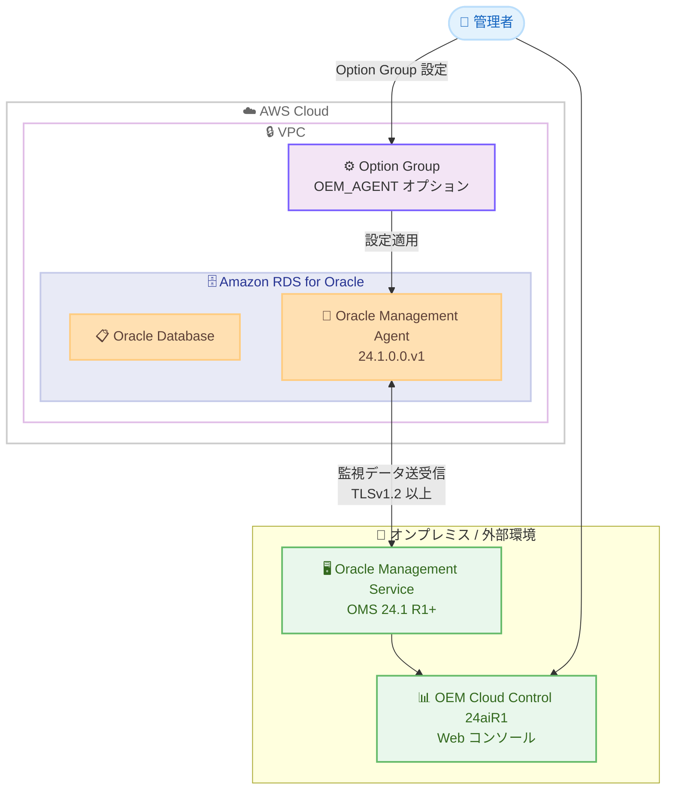

# Amazon RDS for Oracle - Oracle Management Agent 24.1.0.0.v1 のサポート

**リリース日**: 2026 年 4 月 6 日
**サービス**: Amazon RDS for Oracle
**機能**: Oracle Management Agent (OMA) バージョン 24.1.0.0.v1 for Oracle Enterprise Manager Cloud Control 24aiR1

📊 [このアップデートのインフォグラフィックを見る](https://takech9203.github.io/aws-news-summary/20260406-amazon-rds-oracle-supports-oracle-management-agent-version-for-oracle-enterprise-manager.html)

## 概要

Amazon RDS for Oracle が Oracle Management Agent (OMA) バージョン 24.1.0.0.v1 をサポートしました。これにより、Oracle Enterprise Manager (OEM) Cloud Control 24ai Release 1 を使用して Amazon RDS for Oracle データベースを監視・管理できるようになります。

OEM 24ai は、Oracle データベースの監視と管理を行うための Web ベースのツールです。Amazon RDS for Oracle は OMA をインストールし、Oracle Management Service (OMS) と通信してモニタリング情報を提供します。OMS バージョン 24.1 Release 1 以降を使用している場合、OMA 24.1.0.0.v1 をインストールしてデータベースを管理できます。

**アップデート前の課題**

- OEM 24ai Release 1 に対応する OMA バージョンが Amazon RDS for Oracle で利用できなかった
- OMS 24.1 Release 1 を使用している場合、RDS for Oracle インスタンスの監視・管理に最新の OMA を使用できなかった
- OEM の最新機能を RDS for Oracle 環境で活用するためのエージェントバージョンが不足していた

**アップデート後の改善**

- OMA バージョン 24.1.0.0.v1 を Amazon RDS for Oracle にインストール可能になった
- OEM Cloud Control 24aiR1 の最新機能を使用して RDS for Oracle データベースを監視・管理できるようになった
- オプショングループの設定により、簡単に OMA を有効化できるようになった

## アーキテクチャ図



Amazon RDS for Oracle にインストールされた OMA 24.1.0.0.v1 が、TLSv1.2 以上の暗号化通信で OMS と接続し、OEM Cloud Control 24aiR1 の Web コンソールからデータベースの監視・管理を行う構成を示しています。

## サービスアップデートの詳細

### 主要機能

1. **OMA バージョン 24.1.0.0.v1 のサポート**
   - OEM Cloud Control 24ai Release 1 に対応する最新のエージェントバージョン
   - OMS バージョン 24.1 Release 1 以降との互換性
   - Web ベースのモニタリングツールを通じた Oracle データベースの包括的な管理

2. **オプショングループによる簡単な設定**
   - AWS Management Console の「Option Groups」から設定可能
   - 新規または既存のオプショングループに「OEM_AGENT」オプションを追加
   - AGENT_VERSION パラメータを「24.1.0.0.v1」に設定

3. **セキュアな通信**
   - 最小 TLS バージョンとして TLSv1.2 を設定
   - OMS ホスト名 (または IP アドレス) とポートの指定
   - エージェント登録パスワードによる認証

## 技術仕様

### 設定パラメータ

| 項目 | 詳細 |
|------|------|
| オプション名 | OEM_AGENT |
| エージェントバージョン | 24.1.0.0.v1 |
| 対応 OEM バージョン | Cloud Control 24ai Release 1 |
| 必要な OMS バージョン | 24.1 Release 1 以降 |
| 最小 TLS バージョン | TLSv1.2 |

### API 変更履歴

過去 7 日間に Amazon RDS for Oracle に関連する API 変更は確認されていません。

### OEM_AGENT オプション設定

```json
{
  "OptionGroupName": "my-oracle-option-group",
  "OptionName": "OEM_AGENT",
  "OptionSettings": [
    {
      "Name": "AGENT_VERSION",
      "Value": "24.1.0.0.v1"
    },
    {
      "Name": "OMS_HOST",
      "Value": "oms.example.com"
    },
    {
      "Name": "OMS_PORT",
      "Value": "4903"
    },
    {
      "Name": "AGENT_REGISTRATION_PASSWORD",
      "Value": "your-registration-password"
    },
    {
      "Name": "MINIMUM_TLS_VERSION",
      "Value": "TLSv1.2"
    }
  ]
}
```

## 設定方法

### 前提条件

1. Amazon RDS for Oracle データベースインスタンスが稼働していること
2. OMS バージョン 24.1 Release 1 以降が構成済みであること
3. OMS ホスト名 (または IP) とポート番号が確認済みであること
4. エージェント登録パスワードが準備されていること
5. RDS インスタンスから OMS への TLS 通信が可能なネットワーク設定であること

### 手順

#### ステップ 1: オプショングループの作成または確認

```bash
aws rds describe-option-groups \
  --engine-name oracle-ee \
  --query "OptionGroupsList[*].{Name:OptionGroupName,Engine:EngineName,Version:MajorEngineVersion}"
```

既存のオプショングループを確認します。新規に作成する場合は、対象の Oracle エンジンバージョンに合わせたオプショングループを作成します。

#### ステップ 2: OEM_AGENT オプションの追加

```bash
aws rds add-option-to-option-group \
  --option-group-name my-oracle-option-group \
  --options "OptionName=OEM_AGENT,OptionSettings=[{Name=AGENT_VERSION,Value=24.1.0.0.v1},{Name=OMS_HOST,Value=oms.example.com},{Name=OMS_PORT,Value=4903},{Name=AGENT_REGISTRATION_PASSWORD,Value=your-registration-password},{Name=MINIMUM_TLS_VERSION,Value=TLSv1.2}]"
```

OEM_AGENT オプションをオプショングループに追加します。OMS_HOST、OMS_PORT、AGENT_REGISTRATION_PASSWORD は環境に合わせて変更してください。

#### ステップ 3: オプショングループを RDS インスタンスに適用

```bash
aws rds modify-db-instance \
  --db-instance-identifier my-oracle-instance \
  --option-group-name my-oracle-option-group \
  --apply-immediately
```

オプショングループを RDS for Oracle インスタンスに関連付けます。`--apply-immediately` を指定すると即座に適用されますが、メンテナンスウィンドウでの適用も選択できます。

## メリット

### ビジネス面

- **最新の監視機能の活用**: OEM 24ai の最新機能を使用して、データベースのパフォーマンスや健全性をより詳細に把握できる
- **運用の統合管理**: オンプレミスの Oracle データベースと RDS for Oracle を同一の OEM コンソールから一元管理できる
- **コンプライアンス対応**: TLSv1.2 以上の暗号化通信により、セキュリティ要件を満たした監視環境を構築できる

### 技術面

- **簡単な導入**: オプショングループの設定のみで OMA を有効化でき、手動でのエージェントインストールが不要
- **バージョン互換性**: OMS 24.1 Release 1 以降との互換性が保証されており、最新の OEM 機能を利用可能
- **セキュアな通信**: TLSv1.2 以上による暗号化通信で、監視データの安全な転送を実現

## デメリット・制約事項

### 制限事項

- OMS バージョン 24.1 Release 1 以降が必要であり、古い OMS バージョンでは利用できない
- OMS と RDS インスタンス間のネットワーク接続 (VPN、Direct Connect など) が必要
- OEM のライセンスは別途 Oracle から取得する必要がある

### 考慮すべき点

- オプショングループの変更時にインスタンスの再起動が発生する場合がある
- OMS ホスト名やポートの変更には、オプショングループの設定更新が必要
- セキュリティグループで OMS への通信ポートを適切に許可する設定が必要

## ユースケース

### ユースケース 1: ハイブリッド Oracle 環境の統合監視

**シナリオ**: オンプレミスと AWS の両方で Oracle データベースを運用しており、OEM Cloud Control で統一的に監視・管理したい。

**実装例**:
```bash
# RDS for Oracle に OMA を設定
aws rds add-option-to-option-group \
  --option-group-name hybrid-oracle-og \
  --options "OptionName=OEM_AGENT,OptionSettings=[{Name=AGENT_VERSION,Value=24.1.0.0.v1},{Name=OMS_HOST,Value=oms.corp.example.com},{Name=OMS_PORT,Value=4903},{Name=AGENT_REGISTRATION_PASSWORD,Value=securepassword},{Name=MINIMUM_TLS_VERSION,Value=TLSv1.2}]"
```

**効果**: オンプレミスと RDS for Oracle のデータベースを単一の OEM コンソールから監視でき、運用効率が向上する。

### ユースケース 2: OEM 24ai へのアップグレード対応

**シナリオ**: 既存の OEM 環境を 24ai Release 1 にアップグレードし、RDS for Oracle の OMA も最新バージョンに更新したい。

**実装例**:
```bash
# 既存のオプショングループの OMA バージョンを更新
aws rds add-option-to-option-group \
  --option-group-name existing-oracle-og \
  --options "OptionName=OEM_AGENT,OptionSettings=[{Name=AGENT_VERSION,Value=24.1.0.0.v1},{Name=OMS_HOST,Value=oms.example.com},{Name=OMS_PORT,Value=4903},{Name=AGENT_REGISTRATION_PASSWORD,Value=securepassword},{Name=MINIMUM_TLS_VERSION,Value=TLSv1.2}]"
```

**効果**: OEM 24ai の最新機能 (AI を活用した分析など) を RDS for Oracle データベースの監視に適用できる。

### ユースケース 3: マルチ RDS インスタンスの一括監視設定

**シナリオ**: 複数の RDS for Oracle インスタンスを運用しており、すべてのインスタンスに OMA を一括で設定したい。

**実装例**:
```bash
# 共通のオプショングループを作成して OMA を設定
aws rds create-option-group \
  --option-group-name shared-oem-og \
  --engine-name oracle-ee \
  --major-engine-version 19 \
  --option-group-description "Shared OEM Agent option group"

# OMA オプションを追加
aws rds add-option-to-option-group \
  --option-group-name shared-oem-og \
  --options "OptionName=OEM_AGENT,OptionSettings=[{Name=AGENT_VERSION,Value=24.1.0.0.v1},{Name=OMS_HOST,Value=oms.example.com},{Name=OMS_PORT,Value=4903},{Name=AGENT_REGISTRATION_PASSWORD,Value=securepassword},{Name=MINIMUM_TLS_VERSION,Value=TLSv1.2}]"

# 各 RDS インスタンスにオプショングループを適用
for INSTANCE in oracle-prod-1 oracle-prod-2 oracle-dev-1; do
  aws rds modify-db-instance \
    --db-instance-identifier "$INSTANCE" \
    --option-group-name shared-oem-og \
    --apply-immediately
done
```

**効果**: 共通のオプショングループを使用することで、複数インスタンスの OMA 設定を効率的に管理できる。

## 料金

OMA の利用自体に追加の AWS 料金は発生しません。ただし、以下の費用を考慮する必要があります。

| 項目 | 詳細 |
|------|------|
| Amazon RDS for Oracle | 通常の RDS インスタンス料金 (インスタンスタイプ、ストレージに依存) |
| Oracle ライセンス | OEM Cloud Control のライセンスは Oracle から別途取得が必要 |
| ネットワーク転送 | OMS との通信に伴うデータ転送料金 (AWS 外部への送信の場合) |

## 利用可能リージョン

Amazon RDS for Oracle が利用可能なすべてのリージョンで OMA 24.1.0.0.v1 を使用できます。Amazon RDS for Oracle は、ほとんどの AWS 商用リージョンおよび AWS GovCloud (US) リージョンで利用可能です。

最新のリージョン対応状況は [AWS リージョン別サービス一覧](https://aws.amazon.com/about-aws/global-infrastructure/regional-product-services/) で確認できます。

## 関連サービス・機能

- **Amazon RDS for Oracle**: Oracle データベースのフルマネージドサービス。OMA はこのサービスのオプション機能として提供される
- **Oracle Enterprise Manager Cloud Control**: Oracle データベースの監視・管理プラットフォーム。OMA を介して RDS for Oracle と連携する
- **AWS Direct Connect / AWS VPN**: オンプレミスの OMS と RDS for Oracle 間のセキュアなネットワーク接続に使用

## 参考リンク

- 📊 [インフォグラフィック](https://takech9203.github.io/aws-news-summary/20260406-amazon-rds-oracle-supports-oracle-management-agent-version-for-oracle-enterprise-manager.html)
- [公式発表 (What's New)](https://aws.amazon.com/about-aws/whats-new/2026/04/amazon-rds-oracle-supports-oracle-management-agent-version-for-oracle-enterprise-manager=cloud-control/)
- [Amazon RDS for Oracle ドキュメント](https://docs.aws.amazon.com/AmazonRDS/latest/UserGuide/CHAP_Oracle.html)
- [Amazon RDS 料金ページ](https://aws.amazon.com/rds/oracle/pricing/)

## まとめ

Amazon RDS for Oracle が OMA バージョン 24.1.0.0.v1 をサポートしたことで、OEM Cloud Control 24ai Release 1 を使用した RDS for Oracle データベースの監視・管理が可能になりました。OMS 24.1 Release 1 以降を運用している場合は、オプショングループに OEM_AGENT オプションを追加するだけで簡単に設定できます。ハイブリッド Oracle 環境の統合監視や、OEM 24ai の最新機能の活用を検討している場合は、早期の導入をお勧めします。
