# Amazon SageMaker Unified Studio - ノートブックインポート/エクスポートおよび開発者アクセラレーション機能

**リリース日**: 2026 年 4 月 6 日
**サービス**: Amazon SageMaker Unified Studio
**機能**: ノートブックインポート/エクスポートおよび開発者アクセラレーション機能

:bar_chart: [このアップデートのインフォグラフィックを見る](https://takech9203.github.io/aws-news-summary/20260406-amazon-sagemaker-unified-studio.html)

## 概要

Amazon SageMaker Unified Studio のノートブックにインポート/エクスポート機能が追加されました。これにより、JupyterLab やその他のノートブックプラットフォームからのマイグレーションが可能になります。.ipynb、.json、.py 形式のファイルをサポートし、セルタイプ、メタデータ、出力を保持したままインポートできます。また、4 つの形式でのエクスポートに対応しています。

さらに、開発者アクセラレーション機能として、セルの並び替え、キーボードショートカット、セルのリネーム、マルチライン SQL サポートが追加されました。これらの機能により、SageMaker Unified Studio でのノートブック開発体験が大幅に向上し、データサイエンティストやアナリストの生産性が向上します。

**アップデート前の課題**

- JupyterLab や他のノートブックプラットフォームで作成したノートブックを SageMaker Unified Studio に直接取り込む手段がなく、手動でのコード移行が必要でした
- SageMaker Unified Studio で作成したノートブックを他のプラットフォームやチームメンバーと共有するための標準的なエクスポート手段が限られていました
- ノートブック内でのセル操作やショートカットキーが不足しており、効率的な開発が困難でした

**アップデート後の改善**

- .ipynb、.json、.py 形式のノートブックファイルを直接インポートでき、セルタイプ、メタデータ、出力が保持されるようになりました
- 4 つの形式でエクスポートが可能になり、チーム間でのノートブック共有やプラットフォーム間の移行がスムーズになりました
- セルの並び替え、キーボードショートカット、セルリネーム、マルチライン SQL サポートにより、ノートブック開発の効率が向上しました

## アーキテクチャ図

```mermaid
flowchart LR
    subgraph Import["📥 インポート"]
        direction LR
        JL["📓 JupyterLab<br/>.ipynb"]
        PY["🐍 Python<br/>.py"]
        JSON["📄 JSON<br/>.json"]
        JL ~~~ PY ~~~ JSON
    end

    subgraph Studio["⚙️ SageMaker Unified Studio"]
        NB["📒 ノートブック<br/>セルタイプ / メタデータ / 出力を保持"]
    end

    subgraph Export["📤 エクスポート"]
        direction LR
        ZIP["📦 Jupyter + requirements<br/>.zip"]
        IPYNB["📓 標準 Jupyter<br/>.ipynb"]
        PYE["🐍 Python スクリプト<br/>.py"]
        JSONE["📄 ネイティブ形式<br/>.json"]
        ZIP ~~~ IPYNB ~~~ PYE ~~~ JSONE
    end

    Import --> Studio
    Studio --> Export

    classDef cloud fill:none,stroke:#CCCCCC,stroke-width:2px,color:#666666
    classDef compute fill:#FFE0B2,stroke:#FFCC80,stroke-width:2px,color:#5D4037
    classDef input fill:#E9F7EC,stroke:#66BB6A,stroke-width:2px,color:#333333
    classDef output fill:#E3F2FD,stroke:#BBDEFB,stroke-width:2px,color:#1565C0

    class Import input
    class Studio compute
    class Export output
```

SageMaker Unified Studio ノートブックのインポート/エクスポートワークフローを示しています。外部プラットフォームからの 3 つのインポート形式と、4 つのエクスポート形式をサポートしています。

## サービスアップデートの詳細

### 主要機能

1. **ノートブックインポート機能**
   - JupyterLab やその他のノートブックプラットフォームからのマイグレーションをサポート
   - .ipynb (Jupyter Notebook)、.json、.py (Python スクリプト) 形式のファイルに対応
   - インポート時にセルタイプ、メタデータ、出力が保持される
   - 既存のノートブック資産をそのまま活用可能

2. **ノートブックエクスポート機能**
   - Jupyter notebook with requirements (.zip): 依存関係を含む完全なパッケージ
   - 標準 .ipynb 形式: 他の Jupyter 互換環境での利用に最適
   - Python スクリプト (.py): コードの再利用やバージョン管理に便利
   - SageMaker Unified Studio ネイティブ形式 (.json): Studio 間での共有に使用

3. **開発者アクセラレーション機能**
   - セルの並び替え: ドラッグアンドドロップでノートブック内のセルを自由に移動
   - キーボードショートカット: 一般的な操作を素早く実行可能
   - セルのリネーム: セルに分かりやすい名前を付けて管理性を向上
   - マルチライン SQL サポート: 複数行にわたる複雑な SQL クエリの記述が可能

## 技術仕様

### サポートされるファイル形式

| 操作 | 形式 | 拡張子 | 説明 |
|------|------|--------|------|
| インポート | Jupyter Notebook | .ipynb | 標準的な Jupyter ノートブック形式 |
| インポート | JSON | .json | SageMaker Unified Studio ネイティブ形式 |
| インポート | Python スクリプト | .py | Python ソースコード |
| エクスポート | Jupyter + requirements | .zip | 依存関係情報を含む Jupyter ノートブック |
| エクスポート | Jupyter Notebook | .ipynb | 標準的な Jupyter ノートブック形式 |
| エクスポート | Python スクリプト | .py | Python ソースコード形式 |
| エクスポート | ネイティブ形式 | .json | SageMaker Unified Studio 固有の形式 |

### 開発者アクセラレーション機能の詳細

| 機能 | 説明 |
|------|------|
| セルの並び替え | ノートブック内のセルをドラッグアンドドロップで再配置 |
| キーボードショートカット | セルの実行、追加、削除などの操作を効率化 |
| セルのリネーム | セルにカスタム名を設定して可読性を向上 |
| マルチライン SQL | 複数行の SQL クエリを 1 つのセル内で記述・実行 |

## 設定方法

### 前提条件

1. Amazon SageMaker Unified Studio ドメインが設定済みであること
2. SageMaker Unified Studio プロジェクトが作成済みであること
3. ノートブックの作成・編集権限を持つ IAM ロールが設定されていること

### 手順

#### ステップ 1: ノートブックのインポート

SageMaker Unified Studio のノートブック画面からインポート機能を使用して、既存のノートブックファイルをアップロードします。.ipynb、.json、.py のいずれかの形式のファイルを選択してインポートを実行します。

#### ステップ 2: インポートされたノートブックの確認

インポート後、セルタイプ、メタデータ、出力が正しく保持されていることを確認します。必要に応じてセルの並び替えやリネーム機能を使用してノートブックを整理します。

#### ステップ 3: ノートブックのエクスポート

ノートブックのメニューからエクスポートオプションを選択し、用途に応じた 4 つの形式から適切なものを選んでエクスポートします。

## メリット

### ビジネス面

- **マイグレーションコストの削減**: 既存のノートブック資産をそのまま SageMaker Unified Studio に移行でき、手動でのコード書き換えが不要
- **チームコラボレーションの向上**: 複数のエクスポート形式により、異なるツールを使用するチームメンバー間でのノートブック共有が容易
- **開発者の生産性向上**: キーボードショートカットやセル操作機能により、日常的な開発作業の効率が向上

### 技術面

- **プラットフォーム間の相互運用性**: 標準的なファイル形式のサポートにより、JupyterLab との間でシームレスな移行が可能
- **メタデータの保持**: インポート時にセルタイプ、メタデータ、出力が維持されるため、ノートブックの再現性が確保される
- **マルチライン SQL サポート**: 複雑な分析クエリの記述が容易になり、データ分析ワークフローが改善

## デメリット・制約事項

### 制限事項

- インポート時にプラットフォーム固有の拡張機能やウィジェットは完全に再現されない場合がある
- エクスポートされた .zip 形式の requirements ファイルは、SageMaker Unified Studio の依存関係を反映するため、他の環境でそのまま使用できるとは限らない
- カスタムカーネルやプラグインに依存するノートブックは、インポート後に追加設定が必要になる可能性がある

### 考慮すべき点

- 大量のノートブックを一括でインポートする場合は、バッチ処理の可用性を確認する必要がある
- エクスポート形式の選択は、利用先の環境に応じて適切に判断する必要がある

## ユースケース

### ユースケース 1: JupyterLab からの移行

**シナリオ**: データサイエンスチームが、ローカル環境の JupyterLab で開発していたノートブックを SageMaker Unified Studio に移行する場合。

**効果**: 既存の .ipynb ファイルをそのままインポートでき、セルの出力やメタデータが保持されるため、移行に伴うコードの再実行や手動修正が最小限に抑えられます。

### ユースケース 2: マルチプラットフォームでのノートブック共有

**シナリオ**: 複数のチームが異なるツール (SageMaker Unified Studio、ローカルの JupyterLab、VS Code) を使用している組織で、ノートブックを共有する場合。

**効果**: .ipynb や .py 形式でエクスポートすることで、各チームが使い慣れたツールでノートブックを開いて作業を継続でき、コラボレーションが促進されます。

### ユースケース 3: データアナリストの SQL 分析効率化

**シナリオ**: データアナリストが SageMaker Unified Studio のノートブック内で複雑な SQL クエリを使用したデータ分析を行う場合。

**効果**: マルチライン SQL サポートにより、複雑なクエリを可読性の高い形式で記述でき、キーボードショートカットやセルの並び替え機能と組み合わせることで分析ワークフローが大幅に効率化されます。

## 料金

SageMaker Unified Studio のノートブック機能は、SageMaker Unified Studio の利用料金に含まれます。インポート/エクスポート機能自体に追加料金は発生しません。ノートブックの実行に使用するコンピューティングリソースについては、通常の SageMaker の料金体系が適用されます。

## 利用可能リージョン

SageMaker Unified Studio が利用可能なすべての AWS リージョンで使用できます。

## 関連サービス・機能

- **Amazon SageMaker AI**: 機械学習モデルの構築、トレーニング、デプロイのためのフルマネージドサービスで、SageMaker Unified Studio と統合して利用可能
- **Amazon DataZone**: データガバナンスとカタログ機能を提供し、SageMaker Unified Studio のデータ管理機能と連携
- **AWS Glue**: データ統合サービスで、SageMaker Unified Studio のノートブックからデータソースにアクセスする際に活用

## 参考リンク

- :bar_chart: [インフォグラフィック](https://takech9203.github.io/aws-news-summary/20260406-amazon-sagemaker-unified-studio.html)
- [公式発表 (What's New)](https://aws.amazon.com/about-aws/whats-new/2026/04/amazon-sagemaker-unified-studio/)
- [Amazon SageMaker Unified Studio ドキュメント](https://docs.aws.amazon.com/sagemaker-unified-studio/latest/userguide/)
- [Amazon SageMaker 料金ページ](https://aws.amazon.com/sagemaker/pricing/)

## まとめ

Amazon SageMaker Unified Studio のノートブックインポート/エクスポート機能の追加により、JupyterLab などの既存プラットフォームからの移行が大幅に簡素化されました。開発者アクセラレーション機能と合わせて、データサイエンティストやアナリストの日常的な開発体験が向上しています。既存のノートブック資産を活用しつつ SageMaker Unified Studio への移行を検討している組織は、この機能を活用して移行コストを削減することを推奨します。
