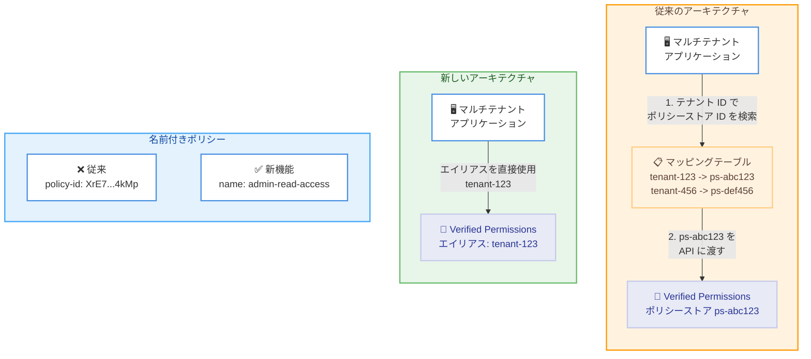

# Amazon Verified Permissions - ポリシーストアエイリアスと名前付きポリシー/ポリシーテンプレートのサポート

**リリース日**: 2026年4月6日
**サービス**: Amazon Verified Permissions
**機能**: ポリシーストアエイリアス、名前付きポリシー、名前付きポリシーテンプレート

📊 [このアップデートのインフォグラフィックを見る](https://takech9203.github.io/aws-news-summary/20260406-amazon-verified-permissions-policy-store.html)

## 概要

Amazon Verified Permissions がポリシーストアエイリアスと名前付きポリシー/ポリシーテンプレートのサポートを開始しました。Amazon Verified Permissions は Cedar ポリシーを使用してアプリケーション全体のきめ細かい認可を管理・適用するサービスです。今回のアップデートにより、マルチテナントデプロイメントの簡素化と日常的なポリシー管理の効率化が実現されます。

これまでマルチテナントアプリケーションでは、テナント識別子とポリシーストア ID のマッピングテーブルを個別に管理する必要がありました。同様に、個々のポリシーやテンプレートの ID を追跡する作業も運用負荷の原因となっていました。今回の機能追加により、これらの課題が解消され、より直感的なポリシー管理が可能になります。

**アップデート前の課題**

- マルチテナントアプリケーションにおいて、テナント識別子とポリシーストア ID を紐付けるマッピングテーブルを別途管理する必要があった
- ポリシーやポリシーテンプレートの参照にシステム生成の ID を使用しており、可読性が低かった
- アプリケーションが成長するにつれて、多数の ID を追跡・管理する運用コストが増大していた
- API 呼び出し時にポリシーストア ID のルックアップが必要で、アーキテクチャが複雑化していた

**アップデート後の改善**

- ポリシーストアにテナント識別子に基づく人間が読める形式のエイリアスを割り当て、任意の API 呼び出しで使用できるようになった
- ポリシーやポリシーテンプレートを意味のある名前で参照できるようになり、管理が容易になった
- マッピングテーブルやルックアップテーブルの管理が不要になり、アーキテクチャが簡素化された
- アプリケーションの拡大に伴うポリシー管理の運用負荷が大幅に軽減された

## アーキテクチャ図



従来はマッピングテーブルを経由してポリシーストア ID を解決する必要がありましたが、エイリアスを使用することでアプリケーションから直接テナント識別子で API を呼び出せるようになります。

## サービスアップデートの詳細

### 主要機能

1. **ポリシーストアエイリアス**
   - マルチテナントアプリケーション開発者がテナント識別子に基づく人間が読める形式のエイリアスをポリシーストアに割り当て可能
   - 任意の Amazon Verified Permissions API 呼び出しでエイリアスを使用可能
   - ポリシーストア ID のルックアップテーブルが不要になり、アーキテクチャが簡素化

2. **名前付きポリシー**
   - システム生成の ID の代わりに意味のある名前でポリシーを参照可能
   - 認可ロジックの管理が直感的になり、アプリケーション成長時の運用が容易に
   - ポリシーの目的や役割が名前から即座に把握可能

3. **名前付きポリシーテンプレート**
   - ポリシーテンプレートにも意味のある名前を付与可能
   - テンプレートの再利用や管理が効率化
   - テンプレートベースのポリシー運用における可読性が向上

## 技術仕様

### 機能の比較

| 項目 | 従来 | 今回のアップデート後 |
|------|------|---------------------|
| ポリシーストアの参照 | ポリシーストア ID のみ | エイリアスまたは ID |
| ポリシーの参照 | システム生成 ID のみ | 名前または ID |
| ポリシーテンプレートの参照 | システム生成 ID のみ | 名前または ID |
| テナントマッピング | 外部マッピングテーブルが必要 | エイリアスで直接参照可能 |
| ID 管理 | アプリケーション側で追跡が必要 | 人間が読める名前で管理可能 |

### API 変更履歴

過去 7 日間に Amazon Verified Permissions に関連する API 変更は検出されませんでした。

### API 呼び出し例

```json
{
  "policyStoreAlias": "tenant-acme-corp",
  "principal": {
    "entityType": "MyApp::User",
    "entityId": "user-123"
  },
  "action": {
    "actionType": "MyApp::Action",
    "actionId": "ReadDocument"
  },
  "resource": {
    "entityType": "MyApp::Document",
    "entityId": "doc-456"
  }
}
```

## 設定方法

### 前提条件

1. AWS アカウントを保有していること
2. Amazon Verified Permissions のポリシーストアが作成済みであること
3. AWS CLI v2 または AWS SDK がインストール済みであること

### 手順

#### ステップ 1: ポリシーストアにエイリアスを設定

```bash
aws verifiedpermissions create-policy-store \
  --validation-settings "mode=STRICT" \
  --description "ACME Corp tenant policy store" \
  --alias "tenant-acme-corp"
```

テナント識別子に基づくエイリアスを指定してポリシーストアを作成します。既存のポリシーストアにエイリアスを追加することも可能です。

#### ステップ 2: 名前付きポリシーを作成

```bash
aws verifiedpermissions create-policy \
  --policy-store-alias "tenant-acme-corp" \
  --definition '{
    "static": {
      "description": "Admins can read all documents",
      "statement": "permit(principal in MyApp::Group::\"admins\", action == MyApp::Action::\"ReadDocument\", resource);"
    }
  }' \
  --name "admin-read-access"
```

意味のある名前を付けてポリシーを作成します。エイリアスを使ってポリシーストアを指定できます。

#### ステップ 3: 名前付きポリシーテンプレートを作成

```bash
aws verifiedpermissions create-policy-template \
  --policy-store-alias "tenant-acme-corp" \
  --statement "permit(principal == ?principal, action == MyApp::Action::\"ReadDocument\", resource == ?resource);" \
  --description "Template for document read access" \
  --name "document-read-template"
```

ポリシーテンプレートにも名前を付けて作成することで、テンプレートの管理が容易になります。

## メリット

### ビジネス面

- **運用コスト削減**: マッピングテーブルの管理や ID 追跡の作業が不要になり、運用工数が削減される
- **開発速度の向上**: 直感的な名前ベースの管理により、新規テナントのオンボーディングやポリシー変更が迅速化
- **スケーラビリティの改善**: テナント数やポリシー数が増加しても管理の複雑さが線形的に増加しない

### 技術面

- **アーキテクチャの簡素化**: 外部マッピングテーブルやルックアップロジックの排除によりコンポーネント数が削減
- **可読性の向上**: システム生成 ID の代わりに意味のある名前を使用でき、コードレビューやデバッグが容易に
- **API 統合の効率化**: エイリアスを任意の API 呼び出しで使用できるため、統合コードがシンプルに

## デメリット・制約事項

### 制限事項

- エイリアスの一意性がアカウント・リージョン単位で要求される可能性があり、命名規則の設計が必要
- 既存のポリシーストア ID を使用した実装からの移行作業が発生する
- 名前付きポリシーの名前にも一意性の制約がある可能性がある

### 考慮すべき点

- 既存のマッピングテーブルを使用した実装がある場合、段階的な移行計画を策定する必要がある
- エイリアスや名前の命名規則をチーム内で統一し、標準化することが重要

## ユースケース

### ユースケース 1: SaaS マルチテナントアプリケーション

**シナリオ**: SaaS プラットフォームで数百のテナントを管理しており、各テナントに個別のポリシーストアを割り当てている。

**実装例**:
```python
# エイリアスを使用してテナント固有のポリシーストアに直接アクセス
response = avp_client.is_authorized(
    policyStoreAlias=f"tenant-{tenant_id}",
    principal={"entityType": "App::User", "entityId": user_id},
    action={"actionType": "App::Action", "actionId": "ViewDashboard"},
    resource={"entityType": "App::Dashboard", "entityId": dashboard_id}
)
```

**効果**: マッピングテーブルの管理が不要になり、テナントオンボーディングの自動化がシンプルになる。

### ユースケース 2: ポリシーのバージョン管理とデプロイ

**シナリオ**: 認可ポリシーを Infrastructure as Code で管理し、CI/CD パイプラインでデプロイしている。

**実装例**:
```yaml
# CloudFormation / CDK でのポリシー定義
Resources:
  AdminReadPolicy:
    Type: AWS::VerifiedPermissions::Policy
    Properties:
      PolicyStoreAlias: "tenant-acme-corp"
      Name: "admin-read-access"
      Definition:
        Static:
          Statement: "permit(principal in App::Group::\"admins\", action == App::Action::\"Read\", resource);"
```

**効果**: ポリシー名がコードと一致するため、デプロイ時の参照が容易になり、変更追跡が改善される。

### ユースケース 3: 大規模な権限管理の標準化

**シナリオ**: 複数のマイクロサービスが同じポリシーテンプレートを共有して認可判断を行っている。

**実装例**:
```python
# 名前付きテンプレートからポリシーを作成
response = avp_client.create_policy(
    policyStoreAlias="shared-platform",
    definition={
        "templateLinked": {
            "policyTemplateName": "resource-access-template",
            "principal": {"entityType": "App::User", "entityId": "user-789"},
            "resource": {"entityType": "App::Resource", "entityId": "res-001"}
        }
    },
    name="user789-res001-access"
)
```

**効果**: テンプレート名による参照でマイクロサービス間の認可ロジックの共有・標準化が容易になる。

## 料金

Amazon Verified Permissions の料金は、認可リクエスト数に基づく従量課金制です。ポリシーストアエイリアスや名前付きポリシー/ポリシーテンプレートの使用に対する追加料金は発表時点では記載されていません。

### 料金例

| 使用量 | 月額料金 (概算) |
|--------|------------------|
| 認可リクエスト 100 万件/月 | 約 $15.00 |
| 認可リクエスト 1,000 万件/月 | 約 $105.00 |

※ 最新の料金情報は [Amazon Verified Permissions の料金ページ](https://aws.amazon.com/verified-permissions/pricing/) をご確認ください。

## 利用可能リージョン

Amazon Verified Permissions が利用可能なすべてのリージョンで本機能を使用できます。主要なリージョンは以下の通りです。

- 米国東部 (バージニア北部、オハイオ)
- 米国西部 (オレゴン)
- アジアパシフィック (東京、シンガポール、シドニー、ムンバイ、ソウル)
- 欧州 (フランクフルト、アイルランド、ロンドン、パリ、ストックホルム)
- カナダ (中部)

※ 最新のリージョン対応状況は [AWS リージョン別サービス一覧](https://aws.amazon.com/about-aws/global-infrastructure/regional-product-services/) をご確認ください。

## 関連サービス・機能

- **Amazon Cognito**: ユーザー認証とトークン発行を担い、Verified Permissions と連携してきめ細かい認可を実現
- **AWS IAM**: AWS リソースレベルのアクセス制御を提供し、Verified Permissions はアプリケーションレベルの認可を補完
- **Cedar ポリシー言語**: Amazon Verified Permissions の基盤となるポリシー言語で、表現力豊かな認可ルールの記述が可能

## 参考リンク

- 📊 [インフォグラフィック](https://takech9203.github.io/aws-news-summary/20260406-amazon-verified-permissions-policy-store.html)
- [公式発表 (What's New)](https://aws.amazon.com/about-aws/whats-new/2026/04/amazon-verified-permissions-policy-store/)
- [Amazon Verified Permissions ドキュメント](https://docs.aws.amazon.com/verifiedpermissions/latest/userguide/)
- [料金ページ](https://aws.amazon.com/verified-permissions/pricing/)

## まとめ

Amazon Verified Permissions のポリシーストアエイリアスと名前付きポリシー/ポリシーテンプレートは、マルチテナント SaaS アプリケーションにおける認可管理を大幅に簡素化するアップデートです。外部マッピングテーブルの排除とシステム生成 ID からの脱却により、運用コストの削減と開発者体験の向上が期待できます。マルチテナント環境で Amazon Verified Permissions を使用している場合は、エイリアスへの移行を検討することを推奨します。
