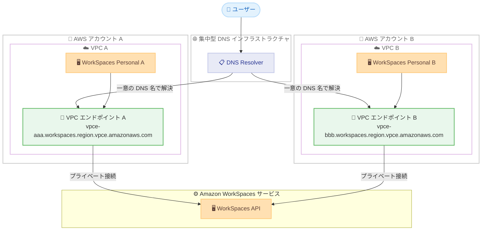

# Amazon WorkSpaces Personal - PrivateLink 向け一意の DNS 名サポート

**リリース日**: 2026 年 4 月 6 日
**サービス**: Amazon WorkSpaces Personal
**機能**: PrivateLink VPC エンドポイントの一意の DNS 名

## 概要

Amazon WorkSpaces Personal が AWS PrivateLink の各 VPC エンドポイントに対して、一意かつパブリックに解決可能な DNS (Domain Name System) 名を提供するようになりました。これにより、エンタープライズのお客様は複数の AWS VPC やアカウントにまたがって WorkSpaces を展開する際に、DNS 解決の競合を回避できます。

各インターフェイス VPC エンドポイントは、従来のすべてのエンドポイントで共有されていた汎用 DNS 名に加えて、グローバルに一意な AWS マネージド DNS 名を受け取ります。これにより、集中型 DNS インフラストラクチャを持つマルチアカウント環境でトラフィックを適切にルーティングできます。パブリックに解決可能な DNS 名は、各 VPC 内からのみアクセス可能なプライベート IP アドレスに解決されるため、セキュリティを維持しながら設定を簡素化します。

**アップデート前の課題**

- すべての PrivateLink VPC エンドポイントが同じ汎用 DNS 名を共有しており、マルチアカウント環境で DNS 解決の競合が発生していた
- 複数の VPC やアカウントにまたがる WorkSpaces 展開において、トラフィックを正しいエンドポイントにルーティングすることが困難だった
- 集中型 DNS インフラストラクチャを使用する環境では、各エンドポイントを区別するためにカスタム Route 53 設定や回避策が必要だった

**アップデート後の改善**

- 各 VPC エンドポイントにグローバルに一意な DNS 名が自動的に割り当てられ、DNS 競合が解消された
- マルチアカウント環境でのトラフィックルーティングが適切に行えるようになった
- Route 53 の追加設定が不要となり、AWS がライフサイクル全体を通じて DNS 名を自動管理する
- 従来の DNS 設定との後方互換性が維持されている

## アーキテクチャ図



マルチアカウント環境において、各 VPC エンドポイントが一意の DNS 名を持つことで、集中型 DNS インフラストラクチャからのトラフィックルーティングが正確に行える構成を示しています。

## サービスアップデートの詳細

### 主要機能

1. **グローバルに一意な DNS 名の自動割り当て**
   - 各インターフェイス VPC エンドポイントに対して、AWS が管理するグローバルに一意な DNS 名が自動的に割り当てられる
   - 従来の汎用 DNS 名も引き続き利用可能で、後方互換性が維持される
   - DNS 名はパブリックに解決可能だが、プライベート IP アドレスに解決されるため、対応する VPC 内からのみアクセス可能

2. **AWS マネージドライフサイクル管理**
   - 一意の DNS 名は AWS によってライフサイクル全体を通じて自動管理される
   - 追加の Route 53 設定は不要
   - エンドポイントの作成時に自動的に割り当てられ、削除時に自動的にクリーンアップされる

3. **マルチアカウント環境でのトラフィックルーティング**
   - 集中型 DNS インフラストラクチャを持つ環境で、各エンドポイントへのトラフィックを正確にルーティング可能
   - 複数の VPC やアカウントにまたがる大規模な WorkSpaces 展開をサポート

## 技術仕様

### DNS 名の仕組み

| 項目 | 詳細 |
|------|------|
| DNS 名の形式 | 各エンドポイントに一意な AWS マネージド DNS 名 |
| DNS 解決 | パブリックに解決可能、プライベート IP アドレスに解決 |
| アクセス範囲 | 対応する VPC 内からのみアクセス可能 |
| 後方互換性 | 従来の汎用 DNS 名との後方互換性あり |
| 管理方式 | AWS による自動管理、追加の Route 53 設定不要 |

### API 変更履歴

過去 7 日間において、Amazon WorkSpaces に関連する API 変更は確認されていません。

## 設定方法

### 前提条件

1. Amazon WorkSpaces Personal が利用可能なリージョンの AWS アカウント
2. VPC および PrivateLink の設定権限を持つ IAM ロール
3. 既存の VPC 環境

### 手順

#### ステップ 1: VPC エンドポイントの作成

```bash
aws ec2 create-vpc-endpoint \
  --vpc-id vpc-12345678 \
  --service-name com.amazonaws.ap-northeast-1.workspaces \
  --vpc-endpoint-type Interface \
  --subnet-ids subnet-abcdef12 \
  --security-group-ids sg-12345678
```

VPC 内に WorkSpaces 向けのインターフェイス VPC エンドポイントを作成します。作成後、自動的にグローバルに一意な DNS 名が割り当てられます。

#### ステップ 2: エンドポイントの DNS 名を確認

```bash
aws ec2 describe-vpc-endpoints \
  --vpc-endpoint-ids vpce-0123456789abcdef0 \
  --query 'VpcEndpoints[].DnsEntries'
```

作成されたエンドポイントの DNS エントリを確認します。従来の汎用 DNS 名に加えて、一意な DNS 名が表示されます。

#### ステップ 3: DNS ルーティングの設定

マルチアカウント環境の集中型 DNS インフラストラクチャで、各 VPC エンドポイントの一意な DNS 名を使用してルーティングルールを設定します。追加の Route 53 設定は不要です。

## メリット

### ビジネス面

- **マルチアカウント展開の簡素化**: 複数のアカウントや VPC にまたがる WorkSpaces 展開が容易になり、大規模組織での導入を加速
- **運用コストの削減**: カスタム DNS 設定や回避策が不要になり、DNS 管理の運用負担が軽減
- **スケーラビリティの向上**: 組織の成長に伴う VPC やアカウントの追加時にも、DNS 競合を気にせずスケールアウト可能

### 技術面

- **DNS 競合の解消**: 各エンドポイントが一意な DNS 名を持つことで、マルチ VPC 環境での名前解決の競合が完全に解消
- **セキュリティの維持**: パブリックに解決可能ながらもプライベート IP に解決されるため、ネットワークセキュリティ体制を損なわない
- **ゼロ設定管理**: AWS がライフサイクル全体を自動管理するため、Route 53 の追加設定やメンテナンスが不要

## デメリット・制約事項

### 制限事項

- AWS PrivateLink の利用料金が引き続き適用される (VPC エンドポイントの時間料金およびデータ処理料金)
- 一意の DNS 名はパブリックに解決可能であるため、DNS 名自体の存在はパブリックに知られる可能性がある
- VPC エンドポイント数の上限はリージョンごとのサービスクォータに従う

### 考慮すべき点

- 既存の PrivateLink 設定は後方互換性があるため、即座の移行は不要だが、マルチアカウント環境では新しい一意の DNS 名への移行を推奨
- 集中型 DNS インフラストラクチャのルーティングルールを更新する際は、段階的な移行を検討

## ユースケース

### ユースケース 1: マルチアカウント環境での WorkSpaces 展開

**シナリオ**: 大企業が部門ごとに異なる AWS アカウントを使用しており、各アカウントで WorkSpaces Personal を展開している。集中型 DNS サーバーから各 VPC のエンドポイントに正確にトラフィックをルーティングする必要がある。

**実装例**:
```bash
# アカウント A の VPC エンドポイント
# DNS: vpce-aaa111.workspaces.ap-northeast-1.vpce.amazonaws.com

# アカウント B の VPC エンドポイント
# DNS: vpce-bbb222.workspaces.ap-northeast-1.vpce.amazonaws.com

# 集中型 DNS で各エンドポイントの一意な DNS 名を使用して
# 適切な VPC にルーティング
```

**効果**: DNS 競合なしに各部門の WorkSpaces 環境を正確に分離・管理でき、セキュリティとガバナンスを維持

### ユースケース 2: ハブアンドスポーク型ネットワークアーキテクチャ

**シナリオ**: Transit Gateway を使用したハブアンドスポーク型ネットワーク構成で、共有サービス VPC に集中型 DNS Resolver を配置している環境。複数のスポーク VPC から WorkSpaces にアクセスする。

**実装例**:
```bash
# 共有サービス VPC の Route 53 Resolver で
# 各スポーク VPC の一意なエンドポイント DNS 名への
# 条件付きフォワーディングルールを設定
aws route53resolver create-resolver-rule \
  --rule-type FORWARD \
  --domain-name "vpce-xxx.workspaces.ap-northeast-1.vpce.amazonaws.com" \
  --target-ips "Ip=10.0.1.10"
```

**効果**: 集中型ネットワークアーキテクチャにおいて、各スポーク VPC の WorkSpaces トラフィックを正確にルーティング可能

### ユースケース 3: 規制要件対応のネットワーク分離

**シナリオ**: 金融機関や医療機関など、規制要件により本番環境と開発環境のネットワークを厳密に分離する必要がある組織。各環境で WorkSpaces を使用しているが、DNS レベルでの分離が求められる。

**実装例**:
```bash
# 本番環境 VPC エンドポイント
# vpce-prod123.workspaces.ap-northeast-1.vpce.amazonaws.com
# -> 10.1.0.x (本番 VPC 内のプライベート IP)

# 開発環境 VPC エンドポイント
# vpce-dev456.workspaces.ap-northeast-1.vpce.amazonaws.com
# -> 10.2.0.x (開発 VPC 内のプライベート IP)
```

**効果**: DNS レベルで環境を完全に分離し、規制要件への準拠を技術的に証明可能

## 料金

本アップデート自体に追加料金はありません。一意の DNS 名は自動的に割り当てられ、追加コストは発生しません。

ただし、AWS PrivateLink の標準料金が引き続き適用されます。

### 料金例

| 項目 | 料金 (東京リージョン概算) |
|------|--------------------------|
| VPC エンドポイント (1 時間あたり) | $0.014/時間 |
| データ処理 (1 GB あたり) | $0.01/GB |
| VPC エンドポイント (月額、730 時間) | 約 $10.22/月 |

## 利用可能リージョン

Amazon WorkSpaces Personal で PrivateLink が利用可能なすべてのリージョンで、一意の DNS 名が利用可能です。

## 関連サービス・機能

- **AWS PrivateLink**: VPC とサービス間のプライベート接続を提供する基盤技術。今回のアップデートで各エンドポイントに一意な DNS 名が付与される
- **Amazon Route 53**: DNS サービス。今回のアップデートにより、Route 53 での追加設定が不要になった
- **AWS Transit Gateway**: ハブアンドスポーク型ネットワークアーキテクチャでの集中型ルーティングに使用。マルチ VPC 環境での WorkSpaces 接続に活用
- **AWS Organizations**: マルチアカウント管理。各アカウントの VPC エンドポイントが一意な DNS 名を持つことで、組織全体の DNS 管理が簡素化

## 参考リンク

- [公式発表 (What's New)](https://aws.amazon.com/about-aws/whats-new/2026/04/amazon-workspaces-personal-privatelink/)
- [Amazon WorkSpaces ドキュメント](https://docs.aws.amazon.com/workspaces/)
- [AWS PrivateLink ドキュメント](https://docs.aws.amazon.com/vpc/latest/privatelink/)
- [Amazon WorkSpaces 料金](https://aws.amazon.com/workspaces/pricing/)

## まとめ

Amazon WorkSpaces Personal の PrivateLink VPC エンドポイントへの一意な DNS 名サポートは、マルチアカウント・マルチ VPC 環境で WorkSpaces を展開するエンタープライズ組織にとって重要なアップデートです。DNS 競合の解消、Route 53 追加設定の不要化、AWS による自動ライフサイクル管理により、大規模環境での運用が大幅に簡素化されます。既存の設定との後方互換性が維持されているため、既存ユーザーは段階的に新しい一意の DNS 名を活用した構成への移行を検討することを推奨します。
