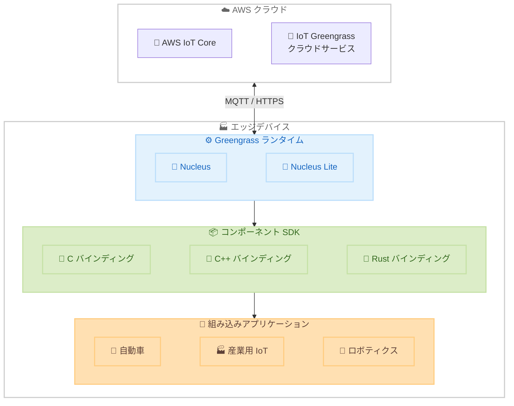

# AWS IoT Greengrass - コンポーネント SDK for C, C++, Rust

**リリース日**: 2026 年 4 月 6 日
**サービス**: AWS IoT Greengrass
**機能**: Greengrass コンポーネント SDK for C, C++, Rust

📊 [このアップデートのインフォグラフィックを見る](https://takech9203.github.io/aws-news-summary/20260406-iot-greengrass-component-sdk.html)

## 概要

AWS IoT Greengrass 向けの新しいコンポーネント SDK が発表された。この SDK は C、C++、Rust のネイティブバインディングを提供し、エッジデバイス上で動作する IoT アプリケーションの開発を大幅に効率化する。従来の SDK と比較してメモリフットプリントが 0.5MB 未満と極めて軽量であり、リソースが制限されたエッジデバイスへの高度なアプリケーションのデプロイを可能にする。

この SDK は AWS IoT Greengrass nucleus および nucleus lite の両方と完全な互換性を持ち、自動車、産業用 IoT、ロボティクス、スマートビルディングなどの業界における組み込みアプリケーション開発に最適化されている。パフォーマンスとコストが重要な組み込みアプリケーションを開発するエンジニアやアーキテクトにとって、エッジコンピューティングの選択肢を大幅に拡張するアップデートである。

**アップデート前の課題**

- 既存の Greengrass コンポーネント SDK は主に Java や Python 向けであり、メモリフットプリントが約 30MB と大きく、リソースが制限されたエッジデバイスでの利用が困難であった
- C、C++、Rust などのシステムプログラミング言語でネイティブに Greengrass コンポーネントを開発するための公式 SDK が提供されていなかった
- メモリやコンピューティングリソースが限られた組み込みデバイスで高度な IoT アプリケーションをデプロイするには、カスタム実装が必要であった

**アップデート後の改善**

- メモリフットプリントが 0.5MB 未満の軽量 SDK により、リソースが制限されたエッジデバイスでも Greengrass コンポーネントの実行が可能になった
- C、C++、Rust のネイティブバインディングにより、パフォーマンス重視の組み込みアプリケーションを効率的に開発できるようになった
- Greengrass nucleus と nucleus lite の両方に対応することで、幅広いエッジデバイスでの統一的な開発体験が実現された

## アーキテクチャ図



エッジデバイス上で Greengrass ランタイム (nucleus / nucleus lite) が動作し、新しいコンポーネント SDK を介して C、C++、Rust で開発された組み込みアプリケーションが AWS IoT クラウドサービスと連携する構成を示している。

## サービスアップデートの詳細

### 主要機能

1. **軽量メモリフットプリント**
   - メモリ使用量が 0.5MB 未満で、従来の SDK の約 30MB と比較して約 60 分の 1 に削減
   - マイクロコントローラーやリソースが制限された組み込みデバイスでの動作が可能
   - メモリ制約が厳しいエッジ環境でも高度な IoT アプリケーションをデプロイ可能

2. **ネイティブ言語バインディング**
   - C、C++、Rust の 3 つの言語に対応したネイティブバインディングを提供
   - 各言語の特性を活かしたパフォーマンス最適化が可能
   - Rust のメモリ安全性を活用した信頼性の高い組み込みアプリケーション開発をサポート

3. **Greengrass nucleus / nucleus lite 完全互換**
   - 標準的な Greengrass nucleus との完全な互換性
   - より軽量な nucleus lite との互換性により、さらにリソースが制限されたデバイスにも対応
   - 既存の Greengrass エコシステムとシームレスに統合

## 技術仕様

### 基本仕様

| 項目 | 詳細 |
|------|------|
| 対応言語 | C、C++、Rust |
| メモリフットプリント | 0.5MB 未満 |
| 従来の SDK メモリフットプリント | 約 30MB |
| 対応ランタイム | Greengrass nucleus、nucleus lite |
| 対象デバイス | リソース制限のあるエッジデバイス、組み込みデバイス |
| 対象業界 | 自動車、産業用 IoT、ロボティクス、スマートビルディング |

### メモリフットプリント比較

| SDK | メモリ使用量 | 削減率 |
|-----|-------------|--------|
| 従来の SDK | 約 30MB | - |
| 新コンポーネント SDK | 0.5MB 未満 | 約 98% 削減 |

## 設定方法

### 前提条件

1. AWS アカウントと IoT Greengrass へのアクセス権限
2. Greengrass nucleus または nucleus lite がインストールされたエッジデバイス
3. C、C++、または Rust の開発環境

### 手順

#### ステップ 1: SDK の取得

```bash
# Rust の場合、Cargo.toml に依存関係を追加
# [dependencies]
# greengrass-component-sdk = "1.0"
cargo add greengrass-component-sdk
```

上記コマンドにより、Rust プロジェクトに Greengrass コンポーネント SDK の依存関係が追加される。

#### ステップ 2: コンポーネントの開発

```rust
// Rust でのコンポーネント実装例
use greengrass_component_sdk::GreengrassClient;

fn main() {
    let client = GreengrassClient::new();
    // IPC を通じて Greengrass nucleus と通信
    client.publish_to_topic("sensor/data", payload);
}
```

上記コードは、Rust で Greengrass コンポーネントを実装する基本的な例である。SDK を通じて Greengrass nucleus との IPC 通信を行う。

#### ステップ 3: コンポーネントのデプロイ

```bash
# Greengrass コンポーネントをビルドしてデプロイ
cargo build --release --target arm-unknown-linux-gnueabihf

# AWS CLI を使用してコンポーネントを作成
aws greengrassv2 create-component-version \
  --inline-recipe fileb://recipe.yaml
```

上記コマンドにより、クロスコンパイルされたバイナリを含む Greengrass コンポーネントを作成し、デバイスにデプロイできる。

## メリット

### ビジネス面

- **コスト削減**: リソースが制限された安価なエッジデバイスでも Greengrass アプリケーションを実行できるため、ハードウェアコストを削減
- **対応デバイスの拡大**: メモリフットプリントの大幅な削減により、これまで対応できなかった小型の組み込みデバイスにも IoT ソリューションを展開可能
- **市場投入の加速**: ネイティブ SDK の提供により、組み込みエンジニアが慣れ親しんだ言語で Greengrass コンポーネントを開発でき、開発期間を短縮

### 技術面

- **パフォーマンス向上**: C、C++、Rust のネイティブコードによりランタイムオーバーヘッドが最小化され、リアルタイム性が求められるアプリケーションに適合
- **メモリ効率**: 0.5MB 未満のフットプリントにより、限られたメモリリソースをアプリケーションロジックに割り当て可能
- **安全性**: Rust のメモリ安全性機能により、組み込みシステムで発生しやすいメモリ関連のバグを防止

## デメリット・制約事項

### 制限事項

- C、C++ でのメモリ管理は開発者の責任であり、メモリリークやバッファオーバーフローのリスクがある
- Java や Python の既存 SDK と比較して、高レベルの抽象化やユーティリティ機能が限定される可能性がある
- クロスコンパイル環境の構築が必要であり、ターゲットデバイスのアーキテクチャに応じたツールチェーンの設定が求められる

### 考慮すべき点

- 既存の Java / Python ベースのコンポーネントとの共存や移行計画を検討する必要がある
- Rust はまだ組み込み開発者にとって比較的新しい言語であり、学習コストを考慮する必要がある
- nucleus lite を使用する場合、標準の nucleus と比較して利用可能な機能が制限される可能性がある

## ユースケース

### ユースケース 1: 自動車のエッジコンピューティング

**シナリオ**: 車載 ECU 上でセンサーデータのリアルタイム処理と AWS クラウドへの送信を行う。メモリとコンピューティングリソースが厳しく制限された環境で、低レイテンシの処理が求められる。

**実装例**:
```c
// C でのセンサーデータ処理コンポーネント
#include "greengrass_component_sdk.h"

void process_sensor_data(const uint8_t* data, size_t len) {
    // センサーデータをフィルタリング・集約
    gg_publish("vehicle/telemetry", filtered_data, filtered_len);
}
```

**効果**: 0.5MB 未満のメモリフットプリントにより、車載 ECU の限られたリソースでも Greengrass コンポーネントとして動作可能。C 言語によるリアルタイム処理でミリ秒単位のレイテンシを実現

### ユースケース 2: 産業用 IoT ゲートウェイ

**シナリオ**: 工場のプロダクションラインに設置された多数のセンサーからデータを収集し、異常検知をエッジで実行する。ゲートウェイデバイスのメモリ制約内で複数のコンポーネントを同時に実行する必要がある。

**実装例**:
```rust
// Rust での異常検知コンポーネント
use greengrass_component_sdk::GreengrassClient;

fn detect_anomaly(sensor_reading: f64, threshold: f64) -> bool {
    sensor_reading > threshold
}

fn main() {
    let client = GreengrassClient::new();
    // センサーデータをサブスクライブして異常検知を実行
    client.subscribe("factory/sensors/#", |topic, payload| {
        if detect_anomaly(payload.value, 95.0) {
            client.publish_to_topic("factory/alerts", alert_payload);
        }
    });
}
```

**効果**: 軽量な SDK により、1 台のゲートウェイ上で複数の検知コンポーネントを同時実行可能。Rust のメモリ安全性により、長期間の無停止運用でも安定した動作を実現

### ユースケース 3: スマートビルディングのコントローラー

**シナリオ**: ビル管理システムの各フロアに設置されたコントローラーで、照明、空調、セキュリティの制御をエッジで実行し、クラウドと連携する。

**実装例**:
```cpp
// C++ でのビル制御コンポーネント
#include "greengrass_component_sdk.hpp"

class HVACController {
    GreengrassClient client;
public:
    void adjust_temperature(float target) {
        // ローカルで温度制御ロジックを実行
        auto command = build_hvac_command(target);
        client.publish("building/hvac/control", command);
    }
};
```

**効果**: 省メモリの SDK により、低コストのコントローラーハードウェアでも高度な制御ロジックを実行可能。C++ のオブジェクト指向設計により、複雑な制御ロジックの保守性が向上

## 料金

AWS IoT Greengrass のコンポーネント SDK 自体は無料で利用できる。料金は AWS IoT Greengrass サービスの使用量に基づいて発生する。

### 料金の構成要素

| 項目 | 説明 |
|------|------|
| Greengrass コアデバイス | アクティブな Greengrass コアデバイスごとの月額料金 |
| メッセージング | IoT Core を通じたメッセージの送受信に対する課金 |
| クラウド接続 | Greengrass クラウドサービスとの通信に対する課金 |

## 利用可能リージョン

AWS IoT Greengrass が利用可能な全てのリージョンで利用できる。主要リージョンには以下が含まれる。

- 米国東部 (バージニア北部)、米国西部 (オレゴン)
- 欧州 (アイルランド)、欧州 (フランクフルト)
- アジアパシフィック (東京)、アジアパシフィック (シドニー)

## 関連サービス・機能

- **AWS IoT Core**: IoT デバイスとクラウド間のメッセージングおよびデバイス管理サービス。Greengrass コンポーネントが MQTT プロトコルを通じてクラウドと通信する際に使用
- **AWS IoT Greengrass nucleus lite**: リソースが極めて制限されたデバイス向けの軽量ランタイム。新しいコンポーネント SDK と組み合わせることで、最小構成のエッジデバイスでの IoT アプリケーション実行が可能
- **AWS IoT Device Management**: IoT デバイスのフリート管理サービス。Greengrass コンポーネントのデプロイやデバイスの監視に活用

## 参考リンク

- 📊 [インフォグラフィック](https://takech9203.github.io/aws-news-summary/20260406-iot-greengrass-component-sdk.html)
- [公式発表 (What's New)](https://aws.amazon.com/about-aws/whats-new/2026/04/iot-greengrass-component-sdk/)
- [AWS IoT Greengrass ドキュメント](https://docs.aws.amazon.com/greengrass/)
- [AWS IoT Greengrass 料金ページ](https://aws.amazon.com/greengrass/pricing/)

## まとめ

AWS IoT Greengrass コンポーネント SDK for C、C++、Rust は、エッジコンピューティングにおけるリソース制約の課題を解決する重要なアップデートである。メモリフットプリントを従来の約 30MB から 0.5MB 未満に削減することで、これまで対応が困難であった小型の組み込みデバイスでも Greengrass エコシステムを活用した IoT ソリューションの構築が可能になった。自動車、産業用 IoT、ロボティクスなどの分野でエッジアプリケーションを開発しているチームは、この SDK の採用を検討することを推奨する。
