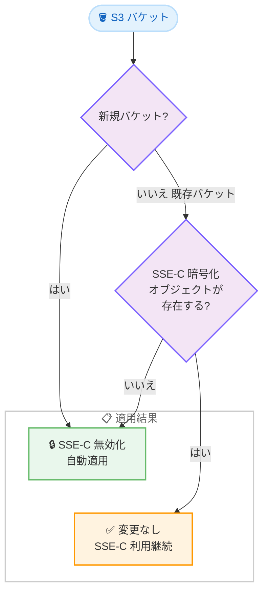

# Amazon S3 - デフォルトバケットセキュリティ設定による SSE-C 自動無効化

**リリース日**: 2026 年 04 月 06 日
**サービス**: Amazon S3
**機能**: デフォルトバケットセキュリティ設定 (SSE-C 自動無効化)

[このアップデートのインフォグラフィックを見る](https://takech9203.github.io/aws-news-summary/20260406-s3-default-bucket-security-setting.html)

## 概要

Amazon S3 が、新しいデフォルトバケットセキュリティ設定の展開を開始しました。この設定により、すべての新規汎用バケットに対してカスタマー提供キーによるサーバー側暗号化 (SSE-C) が自動的に無効化されます。2025 年 11 月 19 日に発表されたこの変更が、37 の AWS リージョン (中国リージョンおよび GovCloud を含む) に順次展開されています。

SSE-C は、ユーザーが自身で管理する暗号化キーを S3 に提供してオブジェクトを暗号化する方式ですが、キー管理の責任がユーザー側にあるため、キーの紛失によるデータ消失リスクや、セキュリティインシデント発生時の対応が複雑になるという課題がありました。今回のアップデートにより、AWS が新しいセキュリティベストプラクティスをデフォルトで適用し、意図しない SSE-C の使用を防止します。

既存バケットについても、SSE-C で暗号化されたオブジェクトが存在しない AWS アカウントでは、S3 が自動的に SSE-C を無効化します。SSE-C を使用中の AWS アカウントについては、バケットの暗号化設定は変更されません。

**アップデート前の課題**

- 新規バケットでは SSE-C がデフォルトで許可されており、意図せず SSE-C を使用してしまうリスクがあった
- SSE-C を使用した場合、暗号化キーの管理がすべてユーザー側の責任となり、キー紛失によるデータ消失リスクがあった
- バケットポリシーで SSE-C を明示的にブロックする設定を手動で行う必要があった
- 組織全体で SSE-C の使用状況を把握し、制御するための一貫した方法が不足していた

**アップデート後の改善**

- すべての新規汎用バケットで SSE-C が自動的に無効化され、セキュリティベストプラクティスがデフォルトで適用される
- SSE-C で暗号化されたオブジェクトが存在しない既存バケットでも、自動的に SSE-C が無効化される
- SSE-C を使用中のアカウントは影響を受けず、既存のワークロードが中断されない
- S3 バケットポリシーにアクセスしなくても、AWS が自動的にセキュリティベストプラクティスを適用

## アーキテクチャ図



この図は、S3 が SSE-C の無効化をどのように判定するかの意思決定フローを示しています。新規バケットは無条件で SSE-C が無効化され、既存バケットは SSE-C オブジェクトの有無に応じて判定されます。

## サービスアップデートの詳細

### 主要機能

1. **新規バケットの SSE-C 自動無効化**
   - すべての新規汎用バケットで SSE-C が自動的に無効化される
   - バケット作成時に追加の設定は不要
   - SSE-S3 または SSE-KMS による暗号化は引き続き利用可能

2. **既存バケットへの段階的適用**
   - SSE-C で暗号化されたオブジェクトが存在しない AWS アカウントの既存バケットが対象
   - S3 が自動的に SSE-C を無効化し、新しい書き込みリクエストで SSE-C をブロック
   - SSE-C を使用中のアカウントのバケット設定は変更されない

3. **グローバル展開**
   - 37 の AWS リージョンに展開 (中国リージョンおよび GovCloud を含む)
   - すべてのリージョンで同一のセキュリティベストプラクティスが適用される

### SSE-C を引き続き使用する場合

SSE-C を使用するビジネス要件がある場合、バケットの暗号化設定を明示的に変更して SSE-C を再有効化できます。ただし、AWS は SSE-S3 または SSE-KMS の使用を推奨しています。

## 技術仕様

### 暗号化方式の比較

| 項目 | SSE-S3 | SSE-KMS | SSE-C |
|------|--------|---------|-------|
| キー管理 | AWS が管理 | AWS KMS で管理 | ユーザーが管理 |
| キー保存 | AWS 側 | AWS KMS 側 | ユーザー側 |
| 追加コスト | なし | KMS リクエスト料金 | なし |
| 監査ログ | CloudTrail | CloudTrail + KMS ログ | CloudTrail |
| キー紛失リスク | なし | なし | データ消失の可能性あり |
| デフォルト設定 | 有効 | 設定可能 | 新規バケットで無効化 |

### 影響範囲

| 条件 | SSE-C の状態 |
|------|-------------|
| 新規汎用バケット | 自動的に無効化 |
| 既存バケット (SSE-C オブジェクトなし) | 自動的に無効化 |
| 既存バケット (SSE-C オブジェクトあり) | 変更なし |
| ディレクトリバケット (S3 Express One Zone) | 対象外 |

## 設定方法

### 前提条件

1. AWS CLI v2 がインストールされていること
2. S3 バケットに対する適切な IAM 権限があること

### 手順

#### ステップ 1: 現在のバケット暗号化設定を確認

```bash
aws s3api get-bucket-encryption --bucket my-bucket
```

バケットの現在のサーバー側暗号化設定を確認します。SSE-C が無効化されている場合、`SSECConfiguration` セクションで確認できます。

#### ステップ 2: SSE-C の使用状況を確認

```bash
aws s3api head-object --bucket my-bucket --key my-object
```

個別のオブジェクトが SSE-C で暗号化されているかどうかを確認します。レスポンスの `ServerSideEncryption` フィールドが空で、`SSECustomerAlgorithm` フィールドが存在する場合、そのオブジェクトは SSE-C で暗号化されています。

#### ステップ 3: SSE-C を再有効化する場合 (必要な場合のみ)

SSE-C を引き続き使用する必要がある場合は、バケットの暗号化設定を明示的に変更して SSE-C を許可する設定に変更できます。ただし、AWS は SSE-KMS または SSE-S3 への移行を推奨しています。

#### ステップ 4: SSE-C オブジェクトを SSE-KMS に移行する場合

```bash
aws s3api update-object-encryption \
  --bucket my-bucket \
  --key my-object \
  --server-side-encryption aws:kms \
  --ssekms-key-id arn:aws:kms:region:account-id:key/key-id
```

`UpdateObjectEncryption` API を使用して、SSE-C で暗号化されたオブジェクトを SSE-KMS に移行します。大規模な移行には S3 Batch Operations の使用を推奨します。

## メリット

### ビジネス面

- **コンプライアンスの強化**: デフォルトで安全な暗号化設定が適用され、セキュリティ監査への対応が容易になる
- **運用リスクの軽減**: SSE-C のキー管理に起因するデータ消失リスクが低減される
- **管理負荷の削減**: バケットポリシーの手動設定が不要になり、セキュリティ設定の管理工数が削減される

### 技術面

- **セキュリティベストプラクティスの自動適用**: 新規バケット作成時に追加の設定なくセキュリティが確保される
- **既存ワークロードへの影響なし**: SSE-C を使用中のアカウントは自動変更の対象外
- **段階的なロールアウト**: 37 リージョンへの段階的展開により、予期しない問題を最小化

## デメリット・制約事項

### 制限事項

- SSE-C を意図的に使用しているワークロードでは、新規バケット作成時に SSE-C の再有効化が必要
- 自動無効化のタイミングはリージョンごとに異なり、ユーザーが制御できない
- ディレクトリバケット (S3 Express One Zone) は今回のアップデートの対象外

### 考慮すべき点

- SSE-C を使用するサードパーティツールやアプリケーションを利用している場合、新規バケットでの動作確認が必要
- SSE-C の再有効化が必要な場合は、明示的な設定変更が必要となるため、自動化スクリプトの更新が必要な場合がある

## ユースケース

### ユースケース 1: セキュリティガバナンスの強化

**シナリオ**: 大規模な組織で複数のチームが S3 バケットを作成しており、一部のチームが誤って SSE-C を使用するリスクがある。

**効果**: 新規バケットで SSE-C がデフォルトで無効化されるため、意図しない SSE-C の使用を防止でき、組織全体で一貫した暗号化ポリシーを維持できます。

### ユースケース 2: コンプライアンス要件への対応

**シナリオ**: 金融業界や医療業界など、厳格なデータ暗号化要件がある環境で、AWS KMS を使用したキー管理が必須とされている。

**効果**: SSE-C がデフォルトで無効化されることで、SSE-KMS または SSE-S3 の使用が促進され、監査証跡の確保とキー管理の一元化が実現します。

### ユースケース 3: 既存環境の SSE-C からの移行

**シナリオ**: 過去に SSE-C を使用していたが、キー管理の運用負荷を軽減するために SSE-KMS への移行を検討している。

**実装例**:
```bash
# S3 Batch Operations で SSE-C オブジェクトを SSE-KMS に一括移行
aws s3control create-job \
  --account-id 123456789012 \
  --operation '{"S3PutObjectCopy":{"TargetResource":"arn:aws:s3:::my-bucket","SSEAwsKmsKeyId":"arn:aws:kms:region:account-id:key/key-id"}}' \
  --manifest '{"Spec":{"Format":"S3BatchOperations_CSV_20180820","Fields":["Bucket","Key"]},"Location":{"ObjectArn":"arn:aws:s3:::manifest-bucket/manifest.csv","ETag":"manifest-etag"}}' \
  --report '{"Bucket":"arn:aws:s3:::report-bucket","Prefix":"reports/","Format":"Report_CSV_20180820","Enabled":true,"ReportScope":"AllTasks"}' \
  --priority 1 \
  --role-arn arn:aws:iam::123456789012:role/S3BatchRole \
  --region us-east-1
```

**効果**: S3 Batch Operations を活用して大規模な暗号化方式の移行を効率的に実施し、今回のデフォルト設定変更と合わせて SSE-C からの完全移行が可能です。

## 料金

今回のセキュリティ設定変更に伴う追加料金は発生しません。SSE-S3 によるデフォルト暗号化は追加費用なしで利用できます。SSE-KMS を使用する場合は、AWS KMS のリクエスト料金が発生します。

| 暗号化方式 | 追加コスト |
|-----------|-----------|
| SSE-S3 | なし (デフォルト) |
| SSE-KMS | KMS API リクエスト: $0.03/10,000 リクエスト |
| SSE-KMS + S3 Bucket Keys | KMS リクエスト数を最大 99% 削減 |

## 利用可能リージョン

37 の AWS リージョンに展開されています。中国リージョンおよび AWS GovCloud (US) リージョンを含むすべての商用リージョンが対象です。

## 関連サービス・機能

- **AWS KMS**: SSE-KMS による暗号化キー管理。SSE-C の代替として推奨される暗号化方式
- **S3 Bucket Keys**: SSE-KMS 使用時の KMS リクエスト数を削減し、コストを最適化する機能
- **S3 Batch Operations**: 大規模なオブジェクトの暗号化方式変更を一括で実行可能
- **UpdateObjectEncryption API**: データ移動なしで既存オブジェクトの暗号化タイプを変更する API (2026 年 1 月リリース)
- **AWS CloudTrail**: S3 バケットへのアクセスと暗号化設定変更の監査ログを記録

## 参考リンク

- [インフォグラフィック](https://takech9203.github.io/aws-news-summary/20260406-s3-default-bucket-security-setting.html)
- [公式発表 (What's New)](https://aws.amazon.com/about-aws/whats-new/2026/04/s3-default-bucket-security-setting/)
- [Amazon S3 サーバー側暗号化ドキュメント](https://docs.aws.amazon.com/AmazonS3/latest/userguide/serv-side-encryption.html)
- [Amazon S3 料金ページ](https://aws.amazon.com/s3/pricing/)

## まとめ

Amazon S3 が新しいセキュリティベストプラクティスとして、SSE-C の自動無効化をデフォルトで展開開始しました。新規バケットおよび SSE-C 未使用の既存バケットが対象で、SSE-C を使用中のアカウントには影響ありません。SSE-C を使用しているユーザーは、現在のワークロードへの影響を確認し、可能であれば SSE-KMS または SSE-S3 への移行を検討することを推奨します。
