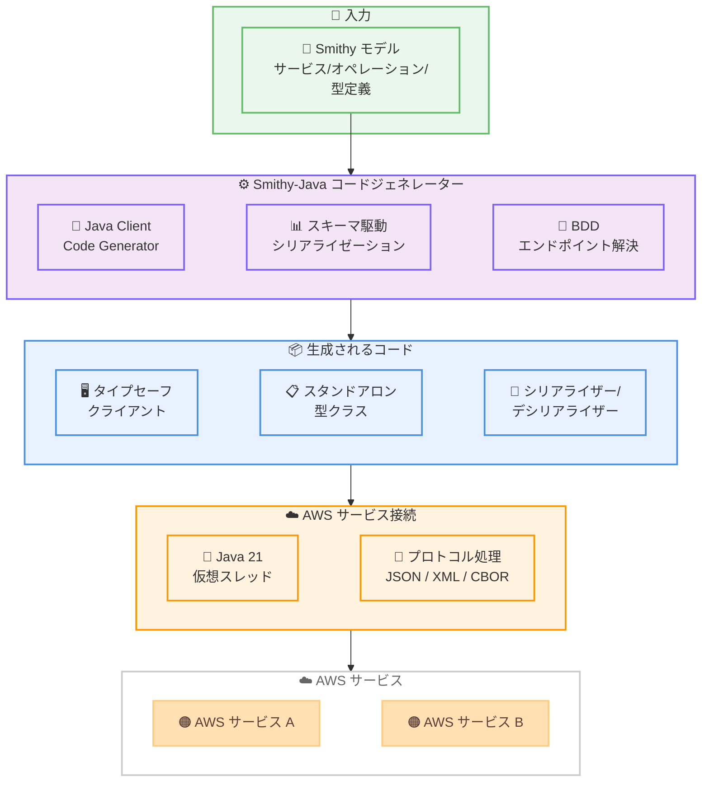

# Smithy-Java - オープンソース Java クライアントフレームワークの一般提供開始

**リリース日**: 2026 年 4 月 6 日
**サービス**: AWS SDKs and Tools
**機能**: Smithy-Java Client Framework (GA)

📊 [このアップデートのインフォグラフィックを見る](https://takech9203.github.io/aws-news-summary/20260406-smithy-java-client-framework.html)

## 概要

AWS は Smithy-Java クライアントフレームワークの一般提供開始 (GA) を発表した。Smithy-Java は、Smithy モデルからタイプセーフな Java クライアントおよびスタンドアロンクラスを生成するオープンソースフレームワークである。エンタープライズ Smithy ユーザーから最も要望の多かったプロダクショングレードの Java SDK 生成機能を提供する。

Smithy-Java は Java 21 の仮想スレッド (Virtual Threads) を基盤に構築されており、複雑な非同期 API の代わりにブロッキングスタイルの API を提供する。これにより、コードの可読性とデバッグのしやすさを維持しつつ、非同期処理と同等のパフォーマンスを実現する。シリアライゼーション、プロトコル処理、リクエスト/レスポンスのライフサイクルがすべてモデルから自動生成されるため、手動でのコード記述が不要になる。

Amazon 社内のチームでは、Smithy-Java を使用することで、従来数か月かかっていたサービス構築を数週間で完了できるようになったと報告されている。

**アップデート前の課題**

- Smithy モデルから Java クライアントを生成するための公式フレームワークが存在せず、手動でシリアライゼーションやプロトコル処理のコードを記述する必要があった
- 非同期 API (コールバックやリアクティブストリーム) の使用が複雑で、開発者の認知負荷とメンテナンス負担が大きかった
- 複数のプロトコル間での移行やマルチプロトコルサポートにはコード変更が必要だった

**アップデート後の改善**

- Smithy モデルからタイプセーフなクライアントコードが自動生成され、手動コーディングが不要になった
- Java 21 仮想スレッドによるブロッキングスタイル API で、シンプルかつ高性能な開発が可能になった
- ランタイムでのプロトコル切り替えにより、コード変更なしでプロトコル移行が可能になった

## アーキテクチャ図



Smithy モデルを入力として、コードジェネレーターがタイプセーフなクライアント、型クラス、シリアライザーを自動生成する。生成されたコードは Java 21 仮想スレッドとプロトコル処理ランタイムを通じて AWS サービスに接続する。

## サービスアップデートの詳細

### 主要機能

1. **タイプセーフなクライアント自動生成**
   - Smithy モデルからオペレーション、シリアライザー、デシリアライザー、プロトコル処理を含む完全な Java クライアントを生成
   - API 変更時にはモデルを更新してクライアントを再生成するだけで、手動のコード変更は不要
   - リトライ、エラーマッピング、カスタムインターセプターなどのクライアント機能を標準サポート

2. **プロトコル柔軟性とランタイム切り替え**
   - AWS JSON 1.0/1.1、REST-JSON、REST-XML、AWS Query、Smithy RPCv2-CBOR をサポート
   - クライアントの再ビルドなしにランタイムでプロトコルを切り替え可能
   - 段階的なプロトコル移行やマルチプロトコルサポートをコード変更なしで実現

3. **ダイナミッククライアント**
   - ビルド時のコード生成なしに Smithy モデルをランタイムで読み込んで任意のサービス API を呼び出し可能
   - ツール、サービスアグリゲーター、ビルド時に未知のサービスと連携するシステムの構築に有用
   - デプロイフットプリントを最小限に維持

4. **スタンドアロン型コード生成**
   - サービスコンテキストなしで Smithy シェイプからタイプセーフな Java クラスを生成
   - 複数サービス間での型の共有やデータモデリングに活用可能
   - モデルファーストアプローチをサービス呼び出し以外のデータ層やロジック層にも拡張

5. **スキーマ駆動シリアライゼーション**
   - SDK サイズを削減しつつパフォーマンスを向上させるアーキテクチャイノベーション
   - シリアライゼーション処理をスキーマ情報に基づいて最適化

6. **バイナリ決定図 (BDD) によるエンドポイント解決**
   - エンドポイントルール解決にバイナリ決定図を採用し、レイテンシを大幅に改善
   - 従来のルールエンジンと比較して高速なエンドポイント解決を実現

## 技術仕様

### サポートされるプロトコルと認証

| 項目 | 詳細 |
|------|------|
| 対応プロトコル | AWS JSON 1.0/1.1、REST-JSON、REST-XML、AWS Query、Smithy RPCv2-CBOR |
| 認証方式 | AWS SigV4 |
| Java バージョン | Java 21 以上 (仮想スレッド必須) |
| ビルドシステム | Gradle (コード生成プラグイン) |
| ライセンス | Apache 2.0 (オープンソース) |

### 生成されるコンポーネント

| コンポーネント | 説明 |
|----------------|------|
| タイプセーフクライアント | サービスオペレーションに対応した型安全なメソッドを持つクライアントクラス |
| シリアライザー/デシリアライザー | プロトコルに応じたリクエスト/レスポンスの変換処理 |
| 型クラス | Smithy シェイプに対応した Java クラス (スタンドアロン生成可能) |
| ダイナミッククライアント | ランタイムでモデルを読み込む汎用クライアント |
| エンドポイントリゾルバー | BDD ベースの高速エンドポイント解決エンジン |

### API 変更履歴

本アップデートは AWS サービス API の変更ではなく、オープンソースフレームワークの GA リリースであるため、該当する API 変更はない。

## 設定方法

### 前提条件

1. Java 21 以上がインストールされていること
2. Gradle がインストールされていること
3. Smithy モデルファイルが用意されていること

### 手順

#### ステップ 1: Smithy モデルの定義

```smithy
namespace com.example

use aws.api#service
use smithy.protocols#rpcv2Cbor

@title("Coffee Shop Service")
@rpcv2Cbor
@service(sdkId: "CoffeeShop")
service CoffeeShop {
    version: "2024-08-23"
    operations: [
        GetMenu
    ]
}

@readonly
operation GetMenu {
    output := { items: CoffeeItems }
}
```

サービス、オペレーション、データシェイプを宣言的に定義する。このモデルが API サーフェスの唯一の正規定義として機能する。

#### ステップ 2: クライアントの生成と使用

```java
var client = CoffeeShopClient.builder()
    .endpointProvider(EndpointResolver.staticEndpoint("http://localhost:8888"))
    .build();

var menu = client.getMenu();
```

生成されたクライアントは、ビルダーパターンでインスタンス化する。エンドポイント、認証、プロトコルなどの設定をビルダーで指定する。

#### ステップ 3: ダイナミッククライアントの使用 (オプション)

```java
var model = Model.assembler()
    .addImport("model.smithy")
    .assemble()
    .unwrap();
var serviceId = ShapeId.from("com.example#CoffeeShop");
var client = DynamicClient.builder()
    .model(model)
    .serviceId(serviceId)
    .build();
var result = client.call("GetMenu");
```

ダイナミッククライアントを使用すると、ビルド時のコード生成なしにランタイムで Smithy モデルを読み込んでサービスを呼び出すことができる。

#### ステップ 4: イベントストリームの使用 (仮想スレッド活用例)

```java
var client = TranscribeClient.builder().build();
var audioStream = EventStream.<AudioStream>newWriter();
var request = StartStreamTranscriptionInput.builder()
    .audioStream(audioStream)
    .build();

// 仮想スレッドで音声データを送信
Thread.startVirtualThread(() -> {
    try (var audioStreamWriter = audioStream.asWriter()) {
        for (var chunk : iterableAudioChunks()) {
            var event = AudioEvent.builder()
                .audioChunk(chunk)
                .build();
            audioStreamWriter.write(
                AudioStream.builder().audioEvent(event).build()
            );
        }
    }
});

// リクエスト送信
var response = client.startStreamTranscription(request);

// 仮想スレッドで文字起こし結果を読み取り
Thread.startVirtualThread(() -> {
    try (var results = response.getTranscriptResultStream().asReader()) {
        for (var event : results) {
            // イベント処理
        }
    }
});
```

Java 21 仮想スレッドとイベントストリームを組み合わせたブロッキングスタイルの API により、ストリーミング処理をシンプルに記述できる。

## メリット

### ビジネス面

- **開発期間の大幅短縮**: Amazon 社内チームの実績では、数か月かかっていたサービス構築が数週間に短縮された
- **メンテナンスコストの削減**: モデルからの自動生成により、手動でのボイラープレートコード管理が不要になる
- **段階的な技術移行の実現**: ランタイムプロトコル切り替えにより、既存サービスのプロトコル移行をリスクなく段階的に進められる

### 技術面

- **仮想スレッドによる高性能化**: Java 21 仮想スレッドにより、ブロッキングスタイルの簡潔な API で非同期処理と同等のパフォーマンスを実現
- **SDK サイズの最適化**: スキーマ駆動シリアライゼーションにより、不要なコードを排除し SDK サイズを削減
- **エンドポイント解決の高速化**: BDD によるエンドポイントルール解決で、レイテンシを大幅に改善
- **型安全性の保証**: コンパイル時の型チェックにより、ランタイムエラーを事前に防止

## デメリット・制約事項

### 制限事項

- Java 21 以上が必須であり、それ以前の Java バージョンでは使用できない
- 仮想スレッドを基盤としているため、仮想スレッド非対応のライブラリとの組み合わせに注意が必要
- GA リリース時点のプロトコルサポートは AWS 関連プロトコルが中心であり、カスタムプロトコルの対応状況は限定的な可能性がある

### 考慮すべき点

- 既存の AWS SDK for Java 2.x との使い分けや移行パスを検討する必要がある
- Smithy モデルの学習コストがあり、チーム全体での Smithy モデリングスキルの習得が前提となる
- コード生成ベースのアプローチであるため、生成されたコードのカスタマイズには制約がある場合がある

## ユースケース

### ユースケース 1: マイクロサービスのクライアント SDK 自動生成

**シナリオ**: 複数のマイクロサービスで構成されたシステムにおいて、各サービスのクライアント SDK を手動で作成・メンテナンスする負担が大きい。

**実装例**:
```smithy
@service(sdkId: "OrderService")
service OrderService {
    version: "2026-01-01"
    operations: [CreateOrder, GetOrder, ListOrders]
}
```

**効果**: Smithy モデルを API の正規定義として管理し、クライアントコードを自動生成することで、サービス間の型の一貫性を保ちつつメンテナンスコストを大幅に削減できる。

### ユースケース 2: プロトコル移行の段階的実施

**シナリオ**: 既存の REST-JSON ベースのサービスを、パフォーマンス向上のために Smithy RPCv2-CBOR へ移行したい。しかし、一括移行はリスクが高い。

**実装例**:
```java
// 同一クライアントでプロトコルをランタイム切り替え
var client = MyServiceClient.builder()
    .protocol(RpcV2CborProtocol.create())
    .build();
```

**効果**: ランタイムでのプロトコル切り替えにより、コード変更なしで段階的にトラフィックを新プロトコルに移行できる。問題が発生した場合も即座にロールバック可能。

### ユースケース 3: サービスアグリゲーターの構築

**シナリオ**: 複数の AWS サービスや社内サービスの情報を集約するダッシュボードツールを構築したい。ビルド時にはすべてのサービス定義が確定していない。

**実装例**:
```java
var model = Model.assembler()
    .addImport("service-models/")
    .assemble()
    .unwrap();
var client = DynamicClient.builder()
    .model(model)
    .serviceId(targetServiceId)
    .build();
var result = client.call(operationName);
```

**効果**: ダイナミッククライアントにより、ビルド時に未知のサービスに対してもランタイムで接続可能。新しいサービスの追加時にもコード変更や再ビルドが不要。

## 料金

Smithy-Java はオープンソースフレームワーク (Apache 2.0 ライセンス) であり、フレームワーク自体の利用に料金は発生しない。Smithy-Java を使用して AWS サービスを呼び出す場合は、各 AWS サービスの通常の利用料金が適用される。

## 利用可能リージョン

Smithy-Java はオープンソースフレームワークであり、AWS リージョンに依存しない。GitHub からグローバルに利用可能である。生成されたクライアントから接続する AWS サービスのリージョン可用性は、各サービスのドキュメントを参照すること。

## 関連サービス・機能

- **Smithy**: AWS が開発した API モデリング言語。Smithy-Java はこの Smithy モデルを入力として Java コードを生成する
- **AWS SDK for Java 2.x**: 既存の AWS 公式 Java SDK。Smithy-Java は同じ Smithy モデル駆動アプローチを採用しつつ、ユーザーが独自のクライアントを生成できるフレームワークを提供する
- **AWS SigV4**: AWS の署名プロトコル。Smithy-Java が生成するクライアントは SigV4 認証を標準サポートする
- **Smithy RPCv2-CBOR**: バイナリ形式のプロトコル。JSON に比べてペイロードサイズが小さく、シリアライゼーション/デシリアライゼーションが高速

## 参考リンク

- 📊 [インフォグラフィック](https://takech9203.github.io/aws-news-summary/20260406-smithy-java-client-framework.html)
- [公式発表 (What's New)](https://aws.amazon.com/about-aws/whats-new/2026/03/smithy-java-client-framework/)
- [AWS Blog - Smithy Java client framework is now generally available](https://aws.amazon.com/blogs/developer/smithy-java-client-framework-is-now-generally-available/)
- [GitHub リポジトリ](https://github.com/smithy-lang/smithy-java)
- [Smithy ドキュメント](https://smithy.io/)

## まとめ

Smithy-Java の GA リリースにより、エンタープライズ Java 開発者は Smithy モデルからプロダクショングレードのタイプセーフなクライアントを自動生成できるようになった。Java 21 仮想スレッド、スキーマ駆動シリアライゼーション、BDD エンドポイント解決といった技術革新により、シンプルさとパフォーマンスを両立している。Smithy を使用したサービス開発を行っている Java チームや、マイクロサービス間のクライアント SDK 管理に課題を抱えるチームは、導入を検討することを推奨する。
