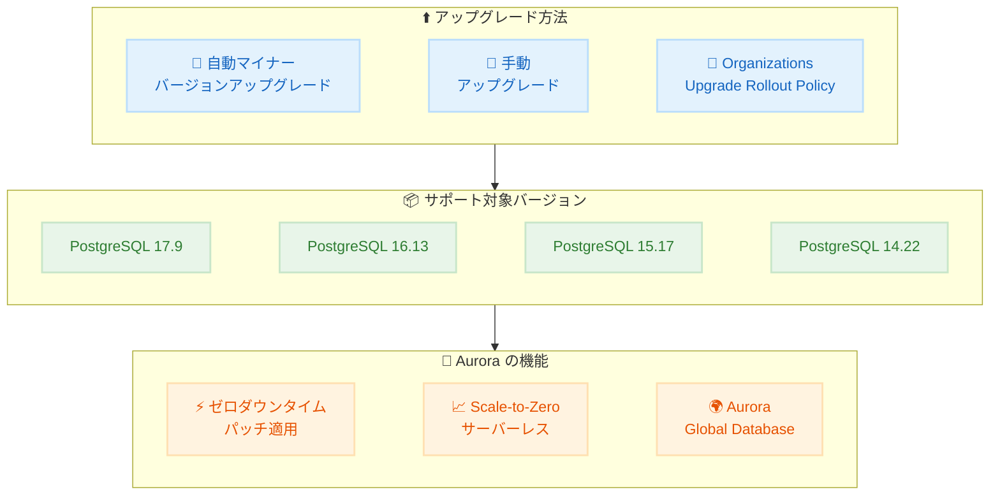

# Amazon Aurora PostgreSQL - バージョン 17.9、16.13、15.17、14.22 のサポート

**リリース日**: 2026 年 4 月 7 日
**サービス**: Amazon Aurora PostgreSQL-Compatible Edition
**機能**: PostgreSQL 17.9、16.13、15.17、14.22 のサポート

📊 [このアップデートのインフォグラフィックを見る](https://takech9203.github.io/aws-news-summary/20260407-amazon-aurora-postgresql-17-9-16-13-15-17-14-22.html)

## 概要

Amazon Aurora PostgreSQL-Compatible Edition が PostgreSQL バージョン 17.9、16.13、15.17、14.22 をサポートしました。これらのバージョンには、PostgreSQL コミュニティによるバグ修正と Aurora 固有の機能強化が含まれています。

AWS は、既知のセキュリティ脆弱性に対処するため、最新のマイナーバージョンへのアップグレードを推奨しています。アップグレードは、スケジュールされたメンテナンスウィンドウ中に自動マイナーバージョンアップグレードを使用して実行できます。また、AWS Organizations Upgrade Rollout Policy を使用することで、数千のアップグレードを段階的にオーケストレーションし、本番環境の前に開発環境へ適用できます。

**アップデート前の課題**

- 以前のマイナーバージョンに含まれる既知のセキュリティ脆弱性への対応が必要だった
- PostgreSQL コミュニティが報告したバグが修正されていない状態で運用する必要があった
- 大規模環境でのアップグレード管理が複雑だった

**アップデート後の改善**

- 最新の PostgreSQL コミュニティバグ修正が適用され、安定性が向上
- 既知のセキュリティ脆弱性が修正され、セキュリティ体制が強化
- Aurora 固有の機能強化により、パフォーマンスと運用性が改善
- AWS Organizations Upgrade Rollout Policy による段階的なアップグレード管理が可能

## アーキテクチャ図



Aurora PostgreSQL のアップグレードフロー。複数のアップグレード方法からサポート対象バージョンへ移行し、Aurora 固有の機能を活用できます。

## サービスアップデートの詳細

### 主要機能

1. **PostgreSQL コミュニティバグ修正**
   - 各マイナーバージョンには、PostgreSQL コミュニティが提供するバグ修正が含まれる
   - データベースの安定性と信頼性が向上
   - 既知のセキュリティ脆弱性への対処

2. **Aurora 固有の機能強化**
   - Aurora 独自の最適化とパフォーマンス改善
   - Aurora ストレージエンジンとの統合改善
   - マネージドサービスとしての運用性向上

3. **段階的アップグレードオーケストレーション**
   - AWS Organizations Upgrade Rollout Policy を使用して大規模環境でのアップグレードを管理
   - 開発環境から本番環境へ段階的に適用可能
   - 数千のデータベースインスタンスのアップグレードを自動化

4. **ゼロダウンタイムパッチ適用**
   - Aurora のゼロダウンタイムパッチ適用 (ZDP) により、マイナーバージョンアップグレード時のダウンタイムを最小化
   - アクティブな接続を維持しながらパッチを適用

## 技術仕様

### サポートバージョン

| PostgreSQL バージョン | Aurora エンジンバージョン | 主な内容 |
|---------------------|------------------------|---------|
| 17.9 | 17.9 | コミュニティバグ修正 + Aurora 機能強化 |
| 16.13 | 16.13 | コミュニティバグ修正 + Aurora 機能強化 |
| 15.17 | 15.17 | コミュニティバグ修正 + Aurora 機能強化 |
| 14.22 | 14.22 | コミュニティバグ修正 + Aurora 機能強化 |

### Aurora PostgreSQL の主要機能

| 機能 | 説明 |
|------|------|
| Scale-to-Zero サーバーレス | Aurora Serverless v2 でワークロードに応じた自動スケーリング |
| Aurora Global Database | 複数リージョンにまたがるグローバルデータベース |
| Aurora I/O-Optimized | I/O 集中型ワークロード向けの最適化構成 |
| ゼロダウンタイムパッチ適用 | マイナーバージョンアップグレード時のダウンタイム最小化 |
| ビルトインセキュリティ | 保管時・転送時の暗号化、IAM 認証 |

### API 変更履歴

今回のアップデートに関連する API 変更は確認されていません。

## 設定方法

### 前提条件

1. Amazon Aurora PostgreSQL クラスターが稼働していること
2. 適切な IAM 権限 (rds:ModifyDBCluster, rds:ModifyDBInstance) を持つこと
3. アップグレード前にスナップショットを取得しておくこと

### 手順

#### ステップ 1: 現在のバージョンを確認

```bash
aws rds describe-db-clusters \
  --db-cluster-identifier my-aurora-cluster \
  --query 'DBClusters[0].EngineVersion' \
  --output text
```

現在の Aurora PostgreSQL クラスターのエンジンバージョンを確認します。

#### ステップ 2: 利用可能なアップグレードターゲットを確認

```bash
aws rds describe-db-engine-versions \
  --engine aurora-postgresql \
  --engine-version <current-version> \
  --query 'DBEngineVersions[0].ValidUpgradeTarget[*].EngineVersion' \
  --output table
```

現在のバージョンからアップグレード可能なターゲットバージョンを確認します。

#### ステップ 3: マイナーバージョンアップグレードを実行

```bash
aws rds modify-db-cluster \
  --db-cluster-identifier my-aurora-cluster \
  --engine-version 17.9 \
  --apply-immediately
```

`--apply-immediately` を指定すると即座にアップグレードが開始されます。メンテナンスウィンドウ中に実行する場合はこのオプションを省略します。

#### ステップ 4: 自動マイナーバージョンアップグレードを有効化

```bash
aws rds modify-db-instance \
  --db-instance-identifier my-aurora-instance \
  --auto-minor-version-upgrade \
  --apply-immediately
```

今後のマイナーバージョンアップグレードを自動で適用するように設定します。

## メリット

### ビジネス面

- **セキュリティ強化**: 既知のセキュリティ脆弱性への迅速な対応により、コンプライアンス要件を満たしやすくなる
- **運用効率の向上**: AWS Organizations Upgrade Rollout Policy を活用した大規模アップグレードの自動化
- **ダウンタイムの最小化**: ゼロダウンタイムパッチ適用により、ビジネスへの影響を最小限に抑制

### 技術面

- **安定性の向上**: PostgreSQL コミュニティバグ修正により、データベースの安定性が向上
- **パフォーマンス改善**: Aurora 固有の機能強化によるパフォーマンス最適化
- **段階的デプロイ**: 開発環境で検証してから本番環境にアップグレードを適用できる

## デメリット・制約事項

### 制限事項

- PostgreSQL 14 は今後 EOL (End of Life) に近づいているため、早めのメジャーバージョンアップグレードを検討する必要がある
- ゼロダウンタイムパッチ適用はすべての状況で保証されるわけではなく、長時間実行中のトランザクションがある場合はダウンタイムが発生する可能性がある
- カスタム拡張機能を使用している場合、新バージョンとの互換性を事前に確認する必要がある

### 考慮すべき点

- アップグレード前にスナップショットを取得し、ロールバック手段を確保すること
- アプリケーションの互換性テストを開発環境で実施してからアップグレードを適用すること
- 拡張機能 (pg_cron, PostGIS, pgvector など) のバージョン互換性を確認すること

## ユースケース

### ユースケース 1: セキュリティパッチの迅速な適用

**シナリオ**: 金融機関のデータベースで、セキュリティ監査によりすべてのデータベースを最新のパッチレベルに保つことが要求されている

**実装例**:
```bash
# 自動マイナーバージョンアップグレードを有効化
aws rds modify-db-instance \
  --db-instance-identifier prod-financial-db \
  --auto-minor-version-upgrade \
  --apply-immediately
```

**効果**: メンテナンスウィンドウ中に自動的に最新のマイナーバージョンが適用され、セキュリティパッチが迅速に展開される

### ユースケース 2: 大規模環境の段階的アップグレード

**シナリオ**: 数百の Aurora PostgreSQL クラスターを運用する企業が、安全にアップグレードを展開したい

**実装例**:
```bash
# Organizations Upgrade Rollout Policy を使用して
# 開発環境 -> ステージング環境 -> 本番環境の順にアップグレード
aws rds modify-db-cluster \
  --db-cluster-identifier dev-cluster-001 \
  --engine-version 17.9 \
  --apply-immediately
```

**効果**: AWS Organizations Upgrade Rollout Policy により、数千のクラスターを段階的にアップグレードし、問題が発生した場合は早期に検知して対処できる

### ユースケース 3: ゼロダウンタイムでの本番環境アップグレード

**シナリオ**: 24/7 稼働の EC サイトのデータベースをダウンタイムなしでアップグレードしたい

**実装例**:
```bash
# メンテナンスウィンドウを設定してアップグレード
aws rds modify-db-cluster \
  --db-cluster-identifier ecommerce-prod \
  --engine-version 16.13 \
  --preferred-maintenance-window "sun:03:00-sun:04:00"
```

**効果**: Aurora のゼロダウンタイムパッチ適用により、アクティブなデータベース接続を維持しながらマイナーバージョンアップグレードが実行され、サービスへの影響が最小限に抑えられる

## 料金

Aurora PostgreSQL のマイナーバージョンアップグレードに追加料金は発生しません。Aurora の料金は通常どおり、インスタンスの使用量、ストレージ、I/O に基づいて課金されます。

### 料金例

| 構成 | 月額料金 (概算、東京リージョン) |
|------|-------------------------------|
| db.r6g.large (1 ライターインスタンス) | 約 $200 |
| db.r6g.xlarge (1 ライター + 1 リーダー) | 約 $800 |
| Aurora Serverless v2 (平均 8 ACU) | 約 $470 |

## 利用可能リージョン

Aurora PostgreSQL がサポートされているすべての AWS リージョンで利用可能です。詳細は [Aurora PostgreSQL リリースノート](https://docs.aws.amazon.com/AmazonRDS/latest/AuroraPostgreSQLReleaseNotes/AuroraPostgreSQL.Updates.html)を参照してください。

## 関連サービス・機能

- **Amazon Aurora Serverless v2**: ワークロードに応じた自動スケーリング、Scale-to-Zero 対応
- **Aurora Global Database**: 複数リージョンにまたがるレプリケーション、災害対策に活用
- **Aurora I/O-Optimized**: I/O 集中型ワークロード向けの料金最適化構成
- **AWS Organizations Upgrade Rollout Policy**: 大規模環境でのアップグレードオーケストレーション
- **Amazon RDS Performance Insights**: データベースパフォーマンスの分析と最適化

## 参考リンク

- 📊 [インフォグラフィック](https://takech9203.github.io/aws-news-summary/20260407-amazon-aurora-postgresql-17-9-16-13-15-17-14-22.html)
- [公式発表 (What's New)](https://aws.amazon.com/about-aws/whats-new/2026/04/amazon-aurora-postgresql-17-9-16-13-15-17-14-22/)
- [Aurora PostgreSQL リリースノート](https://docs.aws.amazon.com/AmazonRDS/latest/AuroraPostgreSQLReleaseNotes/AuroraPostgreSQL.Updates.html)
- [Aurora PostgreSQL ドキュメント](https://docs.aws.amazon.com/AmazonRDS/latest/AuroraUserGuide/Aurora.AuroraPostgreSQL.html)
- [Aurora 料金ページ](https://aws.amazon.com/rds/aurora/pricing/)

## まとめ

Amazon Aurora PostgreSQL が PostgreSQL 17.9、16.13、15.17、14.22 をサポートしました。既知のセキュリティ脆弱性への対応とコミュニティバグ修正が含まれているため、最新のマイナーバージョンへのアップグレードが推奨されます。自動マイナーバージョンアップグレードや AWS Organizations Upgrade Rollout Policy を活用して、段階的かつ安全にアップグレードを実施してください。
