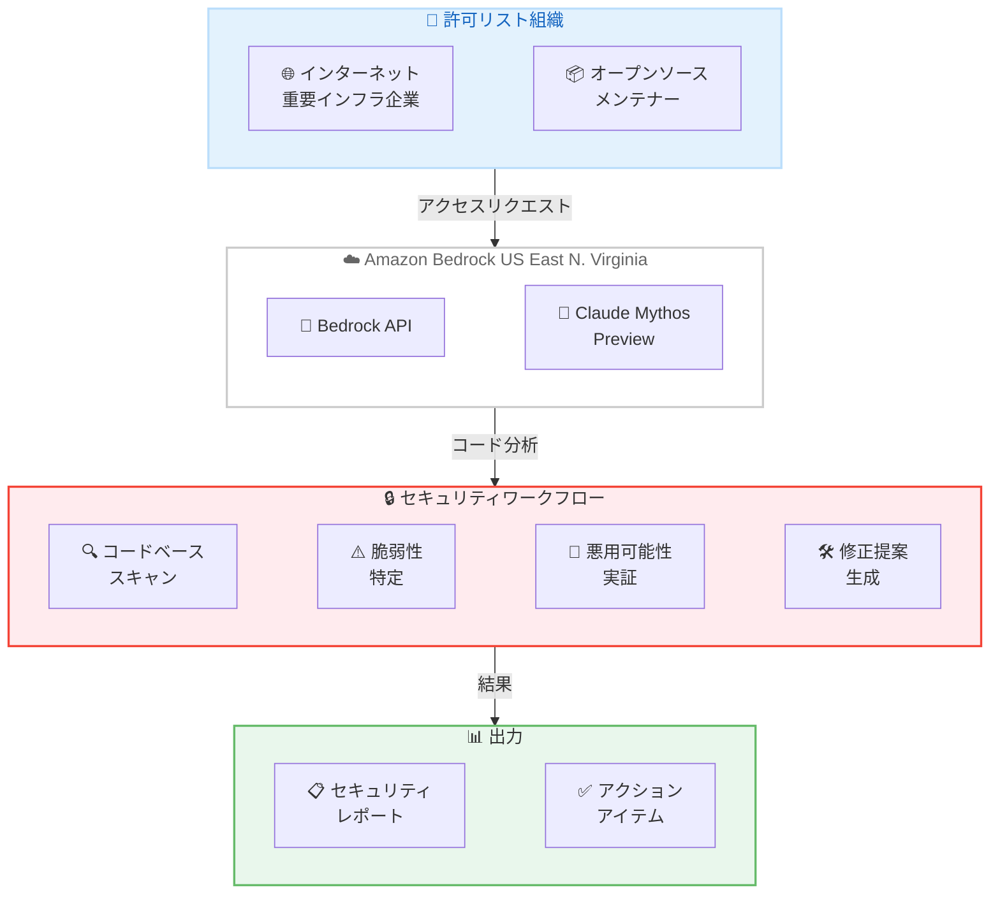

# Amazon Bedrock - Claude Mythos Preview

**リリース日**: 2026 年 4 月 7 日
**サービス**: Amazon Bedrock
**機能**: Claude Mythos Preview (Gated Research Preview)

📊 [このアップデートのインフォグラフィックを見る](https://takech9203.github.io/aws-news-summary/20260407-amazon-bedrock-claude-mythos.html)

## 概要

Amazon Bedrock で Claude Mythos Preview が限定研究プレビューとして利用可能になりました。Claude Mythos Preview は Anthropic の Project Glasswing の一環として提供される、同社史上最も高度な AI モデルです。従来のモデルとは根本的に異なる新しいモデルクラスに位置づけられ、サイバーセキュリティ、ソフトウェアコーディング、複雑な推論タスクにおいて最先端の能力を発揮します。

特にサイバーセキュリティ分野では、ソフトウェア内の高度なセキュリティ脆弱性を特定し、その悪用可能性を実証する能力を備えています。大規模なコードベースを理解し、従来の AI モデルと比較して少ない手動ガイダンスで実用的な知見を提供します。これにより、セキュリティチームは防御的なサイバーセキュリティ業務を加速し、世界で最も重要なソフトウェアのセキュリティ脆弱性を脅威が顕在化する前に発見・修正できるようになります。

Anthropic と AWS は慎重なリリースアプローチを採用しており、インターネットの重要インフラを担う企業やオープンソースメンテナーを優先してアクセスを提供しています。現在、米国東部 (バージニア北部) リージョンでのみ利用可能で、初期許可リストに含まれる組織に限定されています。

**アップデート前の課題**

- ソフトウェアのセキュリティ脆弱性の発見には、専門知識を持つセキュリティエンジニアによる手動のコードレビューが必要であり、大規模なコードベースの網羅的な監査には膨大な時間とコストがかかっていた
- 従来の AI モデルでは、複雑なセキュリティ脆弱性の特定や悪用可能性の実証に多くの手動ガイダンスが必要であり、自動化の範囲が限定的だった
- 脅威が顕在化してから対処する事後対応型のセキュリティアプローチが主流で、プロアクティブな脆弱性発見が困難だった

**アップデート後の改善**

- Claude Mythos Preview により、大規模なコードベースの高度なセキュリティ脆弱性を自動的に特定し、悪用可能性を実証できるようになった
- 従来の AI モデルよりも少ない手動ガイダンスで実用的なセキュリティ知見を取得できるようになった
- 脅威が顕在化する前にプロアクティブに脆弱性を発見・修正する防御的サイバーセキュリティアプローチが可能になった

## アーキテクチャ図



許可リストに含まれる組織が Amazon Bedrock API を通じて Claude Mythos Preview にアクセスし、コードベースのセキュリティスキャン、脆弱性の特定と悪用可能性の実証、修正提案の生成までを一貫して実行するワークフローを示しています。

## サービスアップデートの詳細

### 主要機能

1. **高度なセキュリティ脆弱性検出**
   - ソフトウェア内の高度なセキュリティ脆弱性を自動的に特定
   - 脆弱性の悪用可能性を実証し、リスクの深刻度を具体的に評価
   - 従来の AI モデルと比較して、手動ガイダンスの必要性が大幅に低減

2. **大規模コードベースの理解**
   - 大規模なコードベース全体を包括的に理解する能力
   - コンポーネント間の依存関係やデータフローを分析し、隠れた脆弱性パターンを検出
   - 実用的で具体的な知見を提供

3. **複雑な推論タスク**
   - サイバーセキュリティに限らず、ソフトウェアコーディングや複雑な推論タスクにおいて最先端の能力を発揮
   - 根本的に新しいモデルクラスとして、従来のモデルでは対応が困難だった複雑なタスクに対応

4. **慎重なリリースアプローチ**
   - Project Glasswing の一環として、段階的かつ慎重なリリース戦略を採用
   - インターネットの重要インフラを担う企業やオープンソースメンテナーを優先的に対象
   - 何億人ものユーザーに影響するソフトウェアやデジタルサービスのセキュリティ強化に焦点

## 技術仕様

### モデル仕様

| 項目 | 詳細 |
|------|------|
| モデル名 | Claude Mythos Preview |
| 提供元 | Anthropic |
| プロジェクト | Project Glasswing |
| リリース段階 | Gated Research Preview |
| モデルクラス | 従来とは根本的に異なる新しいモデルクラス |
| 主要能力 | サイバーセキュリティ、ソフトウェアコーディング、複雑な推論 |
| アクセス方式 | 初期許可リストによる限定アクセス |

### 対象ユーザー

| 優先度 | 対象 | 説明 |
|--------|------|------|
| 高 | インターネット重要インフラ企業 | 何億人ものユーザーに影響するデジタルサービスを提供する企業 |
| 高 | オープンソースメンテナー | 広く利用されるオープンソースソフトウェアの管理者 |

### API 変更履歴

| 日付 | サービス | 変更内容 |
|------|----------|----------|
| 2026/04/03 | [Amazon Bedrock](https://awsapichanges.com/archive/changes/da2768-bedrock.html) | 3 new 2 updated api methods - Guardrails enforcement configuration APIs でシステムプロンプトおよびユーザー/アシスタントメッセージの選択的ガード制御をサポート |

## 設定方法

### 前提条件

1. AWS アカウントの保有
2. Amazon Bedrock サービスへのアクセス権限
3. Claude Mythos Preview の許可リストへの登録承認

### 手順

#### ステップ 1: アクセスリクエスト

Claude Mythos Preview は限定研究プレビューのため、まず許可リストへの登録を申請する必要があります。インターネットの重要インフラを担う企業やオープンソースメンテナーが優先的に承認されます。

#### ステップ 2: モデルアクセスの有効化

許可リストに承認された後、Amazon Bedrock コンソールから Claude Mythos Preview のモデルアクセスを有効化します。

```bash
# AWS CLI を使用したモデル情報の確認
aws bedrock list-foundation-models \
  --region us-east-1 \
  --by-provider Anthropic \
  --query "modelSummaries[?contains(modelName, 'Mythos')]"
```

上記のコマンドにより、利用可能な Claude Mythos モデルの情報を確認できます。

#### ステップ 3: API 呼び出し

```python
import boto3
import json

bedrock_runtime = boto3.client(
    service_name="bedrock-runtime",
    region_name="us-east-1"
)

# Claude Mythos Preview を使用したセキュリティ分析の例
response = bedrock_runtime.converse(
    modelId="anthropic.claude-mythos-preview-v1",
    messages=[
        {
            "role": "user",
            "content": [
                {
                    "text": "以下のコードのセキュリティ脆弱性を分析してください:\n\n[コードをここに挿入]"
                }
            ]
        }
    ]
)

print(json.dumps(response["output"]["message"]["content"], indent=2))
```

上記のコードは、Amazon Bedrock の Converse API を使用して Claude Mythos Preview にセキュリティ分析リクエストを送信する例です。モデル ID は正式リリース時に変更される可能性があります。

## メリット

### ビジネス面

- **プロアクティブなセキュリティ対策**: 脅威が顕在化する前に脆弱性を発見・修正でき、セキュリティインシデントによるビジネスへの影響を未然に防止できる
- **セキュリティ業務の効率化**: 手動のコードレビューに依存していたセキュリティ監査を大幅に自動化でき、セキュリティチームのリソースをより戦略的なタスクに集中させられる
- **重要インフラの保護強化**: 何億人ものユーザーに影響するソフトウェアやデジタルサービスのセキュリティ品質を向上させ、社会全体のデジタルインフラの安全性に貢献できる

### 技術面

- **高度な脆弱性検出能力**: 従来のスキャンツールでは検出が困難な高度なセキュリティ脆弱性を特定し、悪用可能性まで実証できる
- **大規模コードベース対応**: 大規模なコードベース全体を理解し、コンポーネント間の複雑な依存関係に潜む脆弱性を検出できる
- **低い手動ガイダンス要件**: 従来の AI モデルよりも少ない指示で実用的な知見を提供するため、セキュリティ分析のワークフローが簡素化される

## デメリット・制約事項

### 制限事項

- 現時点では米国東部 (バージニア北部) リージョンでのみ利用可能であり、他のリージョンでは使用できない
- アクセスは初期許可リストに含まれる組織に限定されており、一般的な利用は不可能
- Gated Research Preview の段階であり、本番環境での利用には適さない可能性がある

### 考慮すべき点

- 許可リストへの登録基準は、インターネット重要インフラ企業やオープンソースメンテナーが優先されるため、一般企業がアクセスするまでには時間がかかる可能性がある
- サイバーセキュリティに特化した強力な能力を持つモデルであるため、悪用防止の観点から慎重なアクセス管理が必要
- Research Preview の段階であり、モデルの動作や API 仕様が正式リリース時に変更される可能性がある
- 料金体系が未発表のため、コスト計画の策定が現時点では困難

## ユースケース

### ユースケース 1: オープンソースソフトウェアの脆弱性監査

**シナリオ**: 広く利用されるオープンソースプロジェクトのメンテナーが、大規模なコードベース全体のセキュリティ脆弱性を体系的に検出したい。

**実装例**:
```python
# オープンソースプロジェクトのコードベースをセキュリティ分析
analysis_prompt = """
以下のリポジトリのソースコードを分析し、
セキュリティ脆弱性を特定してください。
各脆弱性について以下を報告してください:
1. 脆弱性の種類と深刻度
2. 影響を受けるコードの場所
3. 悪用シナリオ
4. 推奨される修正方法

[ソースコードをここに挿入]
"""
```

**効果**: 手動では数週間かかるセキュリティ監査を大幅に短縮し、リリース前に重大な脆弱性を発見・修正できる。

### ユースケース 2: 重要インフラのセキュリティ継続監視

**シナリオ**: インターネットの重要インフラを提供する企業が、コード変更のたびにセキュリティ脆弱性の自動チェックを実施したい。

**実装例**:
```python
# CI/CD パイプラインに統合するセキュリティチェック
def security_review(code_diff):
    response = bedrock_runtime.converse(
        modelId="anthropic.claude-mythos-preview-v1",
        messages=[
            {
                "role": "user",
                "content": [
                    {
                        "text": f"以下のコード変更にセキュリティ上の問題がないか分析してください:\n\n{code_diff}"
                    }
                ]
            }
        ]
    )
    return response
```

**効果**: コード変更のたびに自動的にセキュリティ分析が実行され、脆弱性の混入を早期に検出できる。

### ユースケース 3: 防御的サイバーセキュリティの研究

**シナリオ**: セキュリティ研究者が、新しい攻撃手法に対する防御策を事前に研究し、脆弱性の悪用パターンを理解したい。

**実装例**:
```python
# 脆弱性の悪用可能性を分析
exploit_analysis_prompt = """
以下のコードに含まれる脆弱性について、
悪用可能性を技術的に分析してください:
1. 攻撃ベクトルの特定
2. 悪用の前提条件
3. 影響範囲の評価
4. 防御策の提案

[対象コードをここに挿入]
"""
```

**効果**: 脅威が顕在化する前に防御策を準備でき、ゼロデイ脆弱性への対応力を向上させられる。

## 料金

Claude Mythos Preview の料金体系は現時点では公式に発表されていません。Gated Research Preview の段階であるため、許可リストに登録された組織に対して個別に案内される可能性があります。

| 項目 | 詳細 |
|------|------|
| 料金体系 | 未発表 |
| プレビュー料金 | 許可リスト組織に個別案内の可能性 |

## 利用可能リージョン

現時点では米国東部 (バージニア北部) リージョンでのみ利用可能です。Gated Research Preview の段階であり、追加リージョンへの展開は正式リリース時に発表される見込みです。

| リージョン | ステータス |
|-----------|----------|
| US East (N. Virginia) us-east-1 | 利用可能 (Gated Research Preview) |
| その他のリージョン | 未提供 |

## 関連サービス・機能

- **Amazon Bedrock**: Claude Mythos Preview を提供する基盤サービス。Anthropic を含む複数の AI プロバイダーのモデルをマネージドサービスとして利用可能
- **Amazon Bedrock Guardrails**: Bedrock で利用するモデルに対してセーフティガードを設定するサービス。強力なセキュリティ分析能力を持つ Claude Mythos の適切な利用制御に活用可能
- **AWS Security Hub**: AWS 環境全体のセキュリティ状態を可視化するサービス。Claude Mythos による脆弱性分析の結果をセキュリティ運用ワークフローに統合可能
- **Amazon CodeGuru Security**: コードのセキュリティ脆弱性を検出するサービス。Claude Mythos のより高度な分析能力と組み合わせることで、多層的なセキュリティ検査が可能

## 参考リンク

- 📊 [インフォグラフィック](https://takech9203.github.io/aws-news-summary/20260407-amazon-bedrock-claude-mythos.html)
- [公式発表 (What's New)](https://aws.amazon.com/about-aws/whats-new/2026/04/amazon-bedrock-claude-mythos/)
- [AWS Security Blog - Building AI Defenses at Scale Before the Threats Emerge](https://aws.amazon.com/blogs/security/building-ai-defenses-at-scale-before-the-threats-emerge)
- [Amazon Bedrock ドキュメント](https://docs.aws.amazon.com/bedrock/latest/userguide/)
- [Amazon Bedrock 料金ページ](https://aws.amazon.com/bedrock/pricing/)

## まとめ

Claude Mythos Preview は、AI によるサイバーセキュリティ防御の新しい時代を切り開く画期的なモデルです。大規模なコードベースの高度な脆弱性を自動的に検出し、悪用可能性を実証する能力は、従来のセキュリティツールや AI モデルでは実現困難だった水準です。現在は Gated Research Preview として限定的に提供されていますが、インターネットの重要インフラやオープンソースソフトウェアのセキュリティ強化に大きく貢献することが期待されます。許可リストの対象拡大や正式リリースに向けて、今後の発表に注目することを推奨します。
