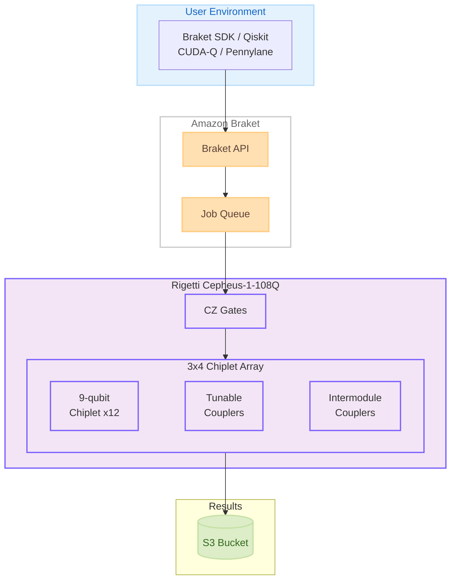

# Amazon Braket - Rigetti 108 量子ビット Cepheus QPU のサポート追加

**リリース日**: 2026 年 4 月 7 日
**サービス**: Amazon Braket
**機能**: Rigetti Cepheus-1-108Q QPU サポート

[このアップデートのインフォグラフィックを見る](https://takech9203.github.io/aws-news-summary/20260407-amazon-braket-rigetti-cepheus.html)

## 概要

Amazon Braket に Rigetti の Cepheus-1-108Q デバイスが追加されました。これは Amazon Braket で利用可能な初の 100 量子ビット超の超伝導量子プロセッシングユニット (QPU) です。Cepheus-1-108Q は、Rigetti のモジュラーマルチチップアーキテクチャを採用しており、9 量子ビットのチップレット 12 個を 3x4 配列で構成し、チップレット間をチューナブルカプラおよびインターモジュールカプラで接続しています。

今回のアップデートでは、従来の Rigetti QPU で使用されていた iSWAP ゲートに代わり、CZ (controlled phase) ゲートが導入されました。CZ ゲートは超伝導システムで一般的な位相エラーに対する耐性が高く、Rigetti の断熱的 CZ 実装によりリーケージエラーもさらに低減されています。これにより、化学シミュレーション、組合せ最適化、機械学習といった分野でより深い回路の実行が可能になります。

Braket SDK、Qiskit、CUDA-Q、Pennylane を使用したプログラム構築に対応しており、パルスレベル制御も利用可能です。量子コンピューティングの研究者やエンジニアにとって、より大規模で高精度な量子実験をクラウド上で実行できる環境が整いました。

**アップデート前の課題**

- Amazon Braket で利用可能な Rigetti QPU は 100 量子ビット未満であり、大規模な量子回路の実験に制約があった
- 従来の iSWAP ゲートは超伝導システムにおける位相エラーの影響を受けやすかった
- マルチチップ構成による大規模量子プロセッサへのクラウドアクセスが限られていた

**アップデート後の改善**

- 108 量子ビットの Cepheus-1-108Q QPU が利用可能になり、より大規模な量子回路を実行できるようになった
- CZ ゲートの採用により位相エラー耐性が向上し、断熱的実装によるリーケージエラーの低減が実現された
- モジュラーマルチチップアーキテクチャにより、スケーラブルな量子コンピューティングの実験が可能になった

## アーキテクチャ図



ユーザーは Braket SDK や Qiskit などのフレームワークから Amazon Braket API を通じて Cepheus-1-108Q QPU にジョブを送信し、実行結果は S3 バケットに保存されます。

## サービスアップデートの詳細

### 主要機能

1. **108 量子ビット Cepheus-1-108Q QPU**
   - Amazon Braket 初の 100 量子ビット超の超伝導 QPU です
   - 9 量子ビットのチップレット 12 個による 3x4 配列のモジュラーマルチチップアーキテクチャを採用しています
   - チップレット間はチューナブルカプラとインターモジュールカプラで接続されています

2. **CZ ゲートの導入**
   - 従来の Rigetti QPU で使用されていた iSWAP ゲートに代わる新しいネイティブゲートです
   - 超伝導システムで一般的な位相エラーに対する耐性が向上しています
   - Rigetti の断熱的 CZ 実装により、リーケージエラーがさらに低減されています
   - より深い量子回路の実行が可能になりました

3. **マルチフレームワーク対応とパルスレベル制御**
   - Braket SDK、Qiskit、CUDA-Q、Pennylane の 4 つのフレームワークに対応しています
   - パルスレベル制御により、ゲートの動作をカスタマイズした高度な実験が可能です
   - ハイブリッドジョブを使用したクラシカル - 量子ワークロードの統合にも対応しています

## 技術仕様

### Cepheus-1-108Q デバイス仕様

| 項目 | 詳細 |
|------|------|
| デバイス名 | Cepheus-1-108Q |
| 量子ビット数 | 108 |
| アーキテクチャ | モジュラーマルチチップ (3x4 配列) |
| チップレット | 9 量子ビット x 12 チップレット |
| ネイティブゲート | CZ (controlled phase) |
| カプラ | チューナブルカプラ、インターモジュールカプラ |
| 対応 SDK | Braket SDK, Qiskit, CUDA-Q, Pennylane |
| パルスレベル制御 | 対応 |
| プロバイダー | Rigetti Computing |

### API 変更履歴

| 日付 | サービス | 変更内容 |
|------|----------|----------|
| 2026/04/07 | [Braket](https://awsapichanges.com/archive/changes/0db175-braket.html) | 2 updated api methods - Hybrid Jobs で t3, g6, g6e インスタンスタイプのサポートを追加 |

### Braket SDK でのデバイス指定例

```python
from braket.aws import AwsDevice

# Cepheus-1-108Q デバイスを指定
device = AwsDevice("arn:aws:braket:us-west-1::device/qpu/rigetti/Cepheus-1-108Q")

# デバイスのプロパティを確認
print(device.properties)
```

## 設定方法

### 前提条件

1. AWS アカウントを持っていること
2. Amazon Braket へのアクセス権限を持つ IAM ロールまたはユーザーが設定されていること
3. Amazon Braket SDK がインストールされていること
4. US West (N. California) リージョン (us-west-1) を使用すること

### 手順

#### ステップ 1: Amazon Braket SDK のインストール

```bash
pip install amazon-braket-sdk
```

Amazon Braket SDK をインストールします。Qiskit や Pennylane を使用する場合は、対応するプラグインも合わせてインストールします。

#### ステップ 2: 量子回路の作成と実行

```python
from braket.circuits import Circuit
from braket.aws import AwsDevice

# Cepheus-1-108Q デバイスを指定
device = AwsDevice("arn:aws:braket:us-west-1::device/qpu/rigetti/Cepheus-1-108Q")

# 量子回路を作成
circuit = Circuit()
circuit.h(0)       # Hadamard ゲート
circuit.cz(0, 1)   # CZ ゲート (ネイティブゲート)
circuit.h(1)

# タスクを送信
task = device.run(circuit, shots=1000)

# 結果を取得
result = task.result()
print(result.measurement_counts)
```

Cepheus-1-108Q のネイティブゲートである CZ ゲートを使用して量子回路を作成し、QPU 上で実行します。

#### ステップ 3: Qiskit からの利用 (オプション)

```python
from qiskit import QuantumCircuit
from braket.devices import Devices

# Qiskit で量子回路を作成
qc = QuantumCircuit(2)
qc.h(0)
qc.cz(0, 1)
qc.measure_all()

# Amazon Braket Provider 経由で実行
# braket-provider パッケージが必要
```

Qiskit を使い慣れている場合は、Braket Provider プラグインを通じて既存の Qiskit コードから Cepheus-1-108Q を利用できます。

## メリット

### ビジネス面

- **大規模量子実験へのアクセス**: 自社で量子ハードウェアを保有することなく、100 量子ビット超の QPU をクラウド経由で利用できます
- **研究開発の加速**: より大規模な量子回路を実行できることで、化学シミュレーションや最適化問題の研究開発サイクルが短縮されます
- **マルチフレームワーク対応**: 既存の Qiskit や Pennylane のコード資産を活用しながら新しい QPU を利用でき、移行コストを抑えられます

### 技術面

- **高い位相エラー耐性**: CZ ゲートにより超伝導システム固有の位相エラーへの耐性が向上し、量子回路の精度が改善されます
- **リーケージエラーの低減**: 断熱的 CZ 実装により、量子ビットの計算空間外への情報漏洩が抑制されます
- **モジュラーアーキテクチャ**: チップレットベースの設計により、将来的なスケーリングの基盤となる技術を先行して評価できます
- **パルスレベル制御**: ゲートの動作を直接カスタマイズでき、ノイズ軽減や独自のゲート実装が可能です

## デメリット・制約事項

### 制限事項

- 利用可能リージョンは US West (N. California) のみに限定されています
- 量子コンピューティングは現在も NISQ (Noisy Intermediate-Scale Quantum) 段階にあり、実用的な量子優位性は限定的です
- QPU へのアクセスは可用性ウィンドウに依存し、常時利用できるとは限りません

### 考慮すべき点

- 108 量子ビットのすべてが完全に接続されているわけではなく、チップレット間の接続トポロジーを考慮した回路設計が必要です
- CZ ゲートは iSWAP ゲートとは異なる特性を持つため、従来の Rigetti QPU 向けに最適化された回路は再設計が必要になる場合があります
- 量子エラー訂正なしの NISQ デバイスであるため、回路の深さに実質的な制限があります

## ユースケース

### ユースケース 1: 分子シミュレーション

**シナリオ**: 新薬候補の分子構造をシミュレーションし、化学反応のエネルギー計算を量子コンピュータで実行する

**実装例**:
```python
from braket.circuits import Circuit
from braket.aws import AwsDevice

device = AwsDevice("arn:aws:braket:us-west-1::device/qpu/rigetti/Cepheus-1-108Q")

# VQE (Variational Quantum Eigensolver) 回路の構築
# 分子のハミルトニアンに基づくアンザッツ回路
circuit = Circuit()
# パラメータ化された量子ゲートで分子軌道をエンコード
for qubit in range(num_qubits):
    circuit.ry(qubit, angles[qubit])
for i in range(num_qubits - 1):
    circuit.cz(i, i + 1)

task = device.run(circuit, shots=4000)
result = task.result()
```

**効果**: 108 量子ビットを活用することで、従来よりも大きな分子系のシミュレーションが可能になり、新薬開発の探索空間が拡大します

### ユースケース 2: 組合せ最適化

**シナリオ**: サプライチェーンのルート最適化やポートフォリオ最適化などの組合せ最適化問題を QAOA (Quantum Approximate Optimization Algorithm) で解く

**実装例**:
```python
from braket.circuits import Circuit
from braket.aws import AwsDevice

device = AwsDevice("arn:aws:braket:us-west-1::device/qpu/rigetti/Cepheus-1-108Q")

# QAOA 回路の構築
circuit = Circuit()
# 初期状態の準備
for qubit in range(n):
    circuit.h(qubit)
# コスト層とミキサー層を交互に適用
for layer in range(p):
    # コスト層: CZ ゲートで問題構造をエンコード
    for edge in graph_edges:
        circuit.cz(edge[0], edge[1])
    # ミキサー層
    for qubit in range(n):
        circuit.rx(qubit, beta[layer])

task = device.run(circuit, shots=2000)
```

**効果**: 108 量子ビットにより、より多くの変数を持つ最適化問題に取り組むことができ、実問題に近いスケールでの量子最適化アルゴリズムの評価が可能になります

### ユースケース 3: 量子機械学習

**シナリオ**: 量子カーネル法や変分量子分類器を使用して、クラシカルな手法では扱いにくい特徴空間でのデータ分類を行う

**実装例**:
```python
from braket.circuits import Circuit
from braket.aws import AwsDevice
import pennylane as qml

# Pennylane を使用した量子機械学習
dev = qml.device("braket.aws.qubit",
                  device_arn="arn:aws:braket:us-west-1::device/qpu/rigetti/Cepheus-1-108Q",
                  wires=10,
                  shots=1000)

@qml.qnode(dev)
def quantum_classifier(inputs, weights):
    # データエンコーディング
    for i in range(len(inputs)):
        qml.RY(inputs[i], wires=i)
    # 変分層
    for layer in weights:
        for i in range(len(layer) - 1):
            qml.CZ(wires=[i, i + 1])
        for i, w in enumerate(layer):
            qml.RY(w, wires=i)
    return qml.expval(qml.PauliZ(0))
```

**効果**: Pennylane との統合により、量子機械学習のワークフローを効率的に構築でき、CZ ゲートの高い精度により学習の安定性が向上します

## 料金

Amazon Braket の QPU 利用料金は、タスクごとの固定料金とショットごとの従量課金で構成されます。Rigetti デバイスの料金は以下のとおりです。

### 料金例

| 項目 | 料金 (概算) |
|--------|------------------|
| タスク料金 (1 タスクあたり) | $0.30 |
| ショット料金 (1 ショットあたり) | $0.00035 |
| 1,000 ショット x 1 タスク | $0.30 + $0.35 = $0.65 |
| 1,000 ショット x 100 タスク | $30.00 + $35.00 = $65.00 |

※ 料金は Rigetti QPU の一般的な料金体系に基づく概算です。Cepheus-1-108Q の正確な料金は AWS 料金ページで確認してください
※ シミュレータの利用料金は別途適用されます

## 利用可能リージョン

US West (N. California) リージョン (us-west-1) でのみ利用可能です。

## 関連サービス・機能

- **Amazon Braket Hybrid Jobs**: クラシカルコンピューティングと量子コンピューティングを組み合わせた反復的なワークロードを実行できます。今回の API 変更で t3, g6, g6e インスタンスタイプもサポートされました
- **Amazon Braket Pulse Control**: パルスレベルで量子ゲートの動作をカスタマイズし、エラー軽減や独自のゲート実装が可能です
- **Amazon Braket SDK**: Python ベースの SDK で、量子回路の構築、タスクの送信、結果の取得を統合的に行えます
- **Amazon S3**: 量子タスクの実行結果が保存されるストレージサービスです
- **Amazon CloudWatch**: Braket タスクのモニタリングとログの確認に利用できます

## 参考リンク

- [公式発表 (What's New)](https://aws.amazon.com/about-aws/whats-new/2026/04/amazon-braket-rigetti-cepheus/)
- [Amazon Braket ドキュメント](https://docs.aws.amazon.com/braket/latest/developerguide/)
- [Amazon Braket 料金ページ](https://aws.amazon.com/braket/pricing/)
- [Rigetti デバイスドキュメント](https://docs.aws.amazon.com/braket/latest/developerguide/braket-devices-rigetti.html)

## まとめ

Amazon Braket に Rigetti の 108 量子ビット Cepheus-1-108Q QPU が追加されたことで、Amazon Braket で初めて 100 量子ビット超の超伝導量子プロセッサが利用可能になりました。CZ ゲートの採用とモジュラーマルチチップアーキテクチャにより、位相エラー耐性の向上とスケーラビリティが実現されています。量子コンピューティングの研究者やエンジニアは、化学シミュレーション、組合せ最適化、量子機械学習などの分野で、より大規模な量子実験に取り組むことを推奨します。
