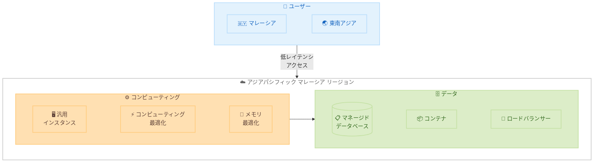

# Amazon Lightsail - アジアパシフィック (マレーシア) リージョンで利用可能に

**リリース日**: 2026 年 4 月 7 日
**サービス**: Amazon Lightsail
**機能**: アジアパシフィック (マレーシア) リージョン対応

📊 [このアップデートのインフォグラフィックを見る](https://takech9203.github.io/aws-news-summary/20260407-amazon-lightsail-malaysia.html)

## 概要

Amazon Lightsail がアジアパシフィック (マレーシア) リージョンで利用可能になった。この拡張により、マレーシアおよび周辺地域のユーザーが Lightsail のシンプルさとパワーを活用できるようになる。マレーシアリージョンでは、インスタンス (汎用、コンピューティング最適化、メモリ最適化バンドル)、マネージドデータベース、コンテナ、ロードバランサーなど、Lightsail の全機能が利用可能である。

Lightsail は、AWS の中でも特にシンプルで予測可能な料金体系を持つサービスであり、VPS (仮想プライベートサーバー) の代替として、ウェブサイトやウェブアプリケーションのホスティング、開発環境の構築などに広く利用されている。マレーシアリージョンの追加により、東南アジア地域のユーザーはローカルでのデータ保存要件を満たしつつ、低レイテンシでのアクセスが可能になる。

このアップデートは、マレーシアおよび東南アジア地域でクラウドインフラストラクチャを必要とするスタートアップ、中小企業、個人開発者にとって特に有益である。

**アップデート前の課題**

- マレーシア国内にデータを保持する必要があるユーザーは、Lightsail を利用する場合にシンガポールやジャカルタなどの近隣リージョンを選択する必要があった
- 近隣リージョンの利用ではネットワークレイテンシが発生し、マレーシア国内のエンドユーザーへのレスポンス速度に影響があった
- マレーシアのデータレジデンシー要件を満たすために、より複雑な AWS サービスを利用する必要があった

**アップデート後の改善**

- マレーシアリージョンで Lightsail の全機能を利用でき、ローカルデータレジデンシー要件を満たせるようになった
- マレーシアおよび周辺地域のユーザーが低レイテンシで Lightsail リソースにアクセスできるようになった
- シンプルで予測可能な料金体系のまま、マレーシア国内でのインフラストラクチャ構築が可能になった

## アーキテクチャ図



マレーシアリージョンでは Lightsail の全機能が利用可能であり、マレーシアおよび東南アジアのユーザーが低レイテンシでアクセスできる。

## サービスアップデートの詳細

### 主要機能

1. **インスタンスバンドル**
   - 汎用バンドル: ウェブサイトやアプリケーションの一般的なワークロードに適したバランス型リソース構成
   - コンピューティング最適化バンドル: CPU 集約型のワークロード向けに vCPU の割り当てが強化されたバンドル
   - メモリ最適化バンドル: データベースやキャッシュなどメモリ集約型のワークロード向けバンドル

2. **マネージドデータベース**
   - MySQL、PostgreSQL をサポートするフルマネージドデータベース
   - 自動バックアップ、メンテナンス、スケーリングを提供
   - シンプルな料金体系で本番環境のデータベースを運用可能

3. **コンテナサービス**
   - Docker コンテナをデプロイおよび管理するための簡易的なコンテナサービス
   - HTTPS エンドポイントの自動設定
   - コンテナのスケーリングと負荷分散を自動管理

4. **ロードバランサー**
   - 複数のインスタンス間でトラフィックを分散
   - SSL/TLS 証明書の管理を含む
   - ヘルスチェックによる自動フェイルオーバー

## 技術仕様

### 利用可能なリージョン一覧

| リージョン | リージョンコード |
|------|------|
| 米国東部 (オハイオ) | us-east-2 |
| 米国東部 (バージニア北部) | us-east-1 |
| 米国西部 (オレゴン) | us-west-2 |
| カナダ (中部) | ca-central-1 |
| 欧州 (フランクフルト) | eu-central-1 |
| 欧州 (アイルランド) | eu-west-1 |
| 欧州 (ロンドン) | eu-west-2 |
| 欧州 (パリ) | eu-west-3 |
| 欧州 (ストックホルム) | eu-north-1 |
| アジアパシフィック (マレーシア) | ap-southeast-5 |
| アジアパシフィック (ジャカルタ) | ap-southeast-3 |
| アジアパシフィック (ムンバイ) | ap-south-1 |
| アジアパシフィック (ソウル) | ap-northeast-2 |
| アジアパシフィック (シンガポール) | ap-southeast-1 |
| アジアパシフィック (シドニー) | ap-southeast-2 |
| アジアパシフィック (東京) | ap-northeast-1 |

## 設定方法

### 前提条件

1. AWS アカウント
2. Lightsail コンソールへのアクセス権限

### 手順

#### ステップ 1: Lightsail コンソールへのアクセス

AWS マネジメントコンソールにサインインし、Lightsail コンソール (https://lightsail.aws.amazon.com/) にアクセスする。

#### ステップ 2: リージョンの選択

Lightsail コンソール上部のリージョンセレクターから「Asia Pacific (Malaysia)」を選択する。

#### ステップ 3: リソースの作成

```bash
# AWS CLI を使用してマレーシアリージョンでインスタンスを作成する例
aws lightsail create-instances \
  --instance-names my-instance \
  --availability-zone ap-southeast-5a \
  --blueprint-id amazon_linux_2023 \
  --bundle-id medium_3_0 \
  --region ap-southeast-5
```

上記コマンドにより、マレーシアリージョンに Amazon Linux 2023 を使用した Lightsail インスタンスが作成される。

#### ステップ 4: 静的 IP アドレスの割り当て

```bash
# 静的 IP を作成してインスタンスにアタッチ
aws lightsail allocate-static-ip \
  --static-ip-name my-static-ip \
  --region ap-southeast-5

aws lightsail attach-static-ip \
  --static-ip-name my-static-ip \
  --instance-name my-instance \
  --region ap-southeast-5
```

静的 IP アドレスを割り当てることで、インスタンスの再起動後も同じ IP アドレスを維持できる。

## メリット

### ビジネス面

- **データレジデンシーの遵守**: マレーシア国内にデータを保持できるため、現地のデータ保護規制やコンプライアンス要件を満たすことが可能
- **予測可能なコスト**: Lightsail のシンプルな月額固定料金により、インフラストラクチャコストの予測と管理が容易
- **市場投入時間の短縮**: マレーシア市場向けのアプリケーションを迅速にデプロイでき、ビジネス展開を加速

### 技術面

- **低レイテンシ**: マレーシアおよび東南アジア地域のエンドユーザーに対するレスポンス速度が向上
- **フルスタックの利用可能性**: インスタンス、データベース、コンテナ、ロードバランサーなど全機能をマレーシアリージョンで利用可能
- **シンプルな運用**: Lightsail のマネージドインフラストラクチャにより、サーバー管理の負荷を軽減

## デメリット・制約事項

### 制限事項

- Lightsail は AWS の他のサービスと比較してカスタマイズの範囲が限定的であり、高度な設定が必要な場合は EC2 などのサービスへの移行が必要になる場合がある
- Lightsail の VPC ピアリングは同一リージョン内の AWS アカウントのデフォルト VPC に限定される
- 一部のバンドルサイズやブループリントはリージョンによって利用可能性が異なる場合がある

### 考慮すべき点

- 大規模なワークロードやエンタープライズ向けの要件がある場合は、EC2 や ECS などのサービスの方が適切な場合がある
- マレーシアリージョンは比較的新しいリージョンであるため、一部の AWS サービスが未対応の可能性がある

## ユースケース

### ユースケース 1: マレーシア向けウェブサイトのホスティング

**シナリオ**: マレーシア国内のユーザーを対象としたウェブサイトを低コストでホスティングしたい。データレジデンシー要件を満たしつつ、低レイテンシでのアクセスを実現する必要がある。

**実装例**:
```bash
# WordPress ブループリントを使用したインスタンス作成
aws lightsail create-instances \
  --instance-names my-wordpress \
  --availability-zone ap-southeast-5a \
  --blueprint-id wordpress \
  --bundle-id medium_3_0 \
  --region ap-southeast-5
```

**効果**: マレーシア国内のユーザーに対して低レイテンシでウェブサイトを提供でき、月額固定料金でコスト管理が容易

### ユースケース 2: 東南アジア向けアプリケーションの開発環境

**シナリオ**: 東南アジア市場向けのウェブアプリケーションを開発中で、本番環境に近い環境でテストを行いたい。

**実装例**:
```bash
# 開発環境用インスタンスとデータベースの作成
aws lightsail create-instances \
  --instance-names dev-app-server \
  --availability-zone ap-southeast-5a \
  --blueprint-id nodejs \
  --bundle-id medium_3_0 \
  --region ap-southeast-5

aws lightsail create-relational-database \
  --relational-database-name dev-db \
  --relational-database-blueprint-id mysql_8_0 \
  --relational-database-bundle-id micro_2_0 \
  --master-username admin \
  --availability-zone ap-southeast-5a \
  --region ap-southeast-5
```

**効果**: 本番環境と同一リージョンで開発環境を構築でき、リアルなパフォーマンステストが可能

### ユースケース 3: コンテナベースのマイクロサービスデプロイ

**シナリオ**: Docker コンテナで構築されたマイクロサービスをマレーシアリージョンにデプロイし、HTTPS エンドポイントで公開したい。

**実装例**:
```bash
# Lightsail コンテナサービスの作成
aws lightsail create-container-service \
  --service-name my-api-service \
  --power medium \
  --scale 2 \
  --region ap-southeast-5
```

**効果**: ECS や EKS よりもシンプルな設定でコンテナベースのサービスをデプロイでき、HTTPS 対応のエンドポイントが自動的に提供される

## 料金

Lightsail はシンプルで予測可能な月額固定料金を提供している。料金にはコンピューティング、ストレージ、データ転送が含まれる。

### インスタンス料金例

| バンドル | vCPU | メモリ | SSD ストレージ | 月額料金 |
|--------|------|--------|--------------|----------|
| $3.50 プラン | 2 | 512 MB | 20 GB | $3.50 |
| $5 プラン | 2 | 1 GB | 40 GB | $5 |
| $10 プラン | 2 | 2 GB | 60 GB | $10 |
| $20 プラン | 2 | 4 GB | 80 GB | $20 |
| $40 プラン | 2 | 8 GB | 160 GB | $40 |
| $80 プラン | 4 | 16 GB | 320 GB | $80 |
| $160 プラン | 8 | 32 GB | 640 GB | $160 |

各プランには毎月一定量のデータ転送が含まれている。詳細な料金体系は AWS 公式料金ページを参照のこと。

## 利用可能リージョン

Lightsail は現在、米国東部 (オハイオ、バージニア北部)、米国西部 (オレゴン)、カナダ (中部)、欧州 (フランクフルト、アイルランド、ロンドン、パリ、ストックホルム)、アジアパシフィック (マレーシア、ジャカルタ、ムンバイ、ソウル、シンガポール、シドニー、東京) の 16 リージョンで利用可能である。

## 関連サービス・機能

- **Amazon EC2**: より高度なカスタマイズや大規模なワークロードが必要な場合の選択肢。Lightsail からの移行パスが提供されている
- **Amazon Lightsail コンテナ**: Docker コンテナを Lightsail 上で簡単にデプロイおよび管理するためのサービス
- **Amazon Lightsail マネージドデータベース**: MySQL および PostgreSQL のフルマネージドデータベースサービス。自動バックアップとメンテナンスを提供

## 参考リンク

- 📊 [インフォグラフィック](https://takech9203.github.io/aws-news-summary/20260407-amazon-lightsail-malaysia.html)
- [公式発表 (What's New)](https://aws.amazon.com/about-aws/whats-new/2026/04/amazon-lightsail-malaysia/)
- [Amazon Lightsail ドキュメント](https://docs.aws.amazon.com/lightsail/)
- [Amazon Lightsail 料金ページ](https://aws.amazon.com/lightsail/pricing/)

## まとめ

Amazon Lightsail のアジアパシフィック (マレーシア) リージョン対応は、マレーシアおよび東南アジア地域のユーザーにとって重要なアップデートである。ローカルデータレジデンシー要件への対応、低レイテンシアクセス、シンプルで予測可能な料金体系により、スタートアップや中小企業がクラウドインフラストラクチャを手軽に活用できる環境が整った。マレーシア市場向けのアプリケーションやウェブサイトを運用しているユーザーは、マレーシアリージョンへの移行を検討することを推奨する。
