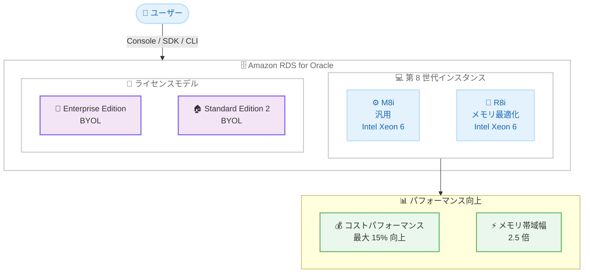

# Amazon RDS for Oracle - M8i および R8i インスタンスのサポート

**リリース日**: 2026年04月07日
**サービス**: Amazon RDS for Oracle
**機能**: 第 8 世代 Intel ベースインスタンス M8i および R8i のサポート

[このアップデートのインフォグラフィックを見る](https://takech9203.github.io/aws-news-summary/20260407-amazon-rds-oracle-8th-gen-instances.html)

## 概要

AWS は 2026 年 4 月 7 日、Amazon RDS for Oracle において第 8 世代 Intel ベースインスタンスである M8i および R8i インスタンスのサポートを発表しました。これらのインスタンスは、AWS 専用のカスタム Intel Xeon 6 プロセッサーを搭載しており、クラウド上の同等の Intel プロセッサーの中で最高のパフォーマンスと最速のメモリ帯域幅を提供します。

M8i および R8i インスタンスは、前世代の Intel ベースインスタンスと比較して最大 15% 優れたコストパフォーマンスと 2.5 倍のメモリ帯域幅を実現します。Oracle Database Enterprise Edition (EE) および Oracle Database Standard Edition 2 (SE2) の Bring Your Own License (BYOL) モデルで利用可能です。

**アップデート前の課題**

- Amazon RDS for Oracle で利用可能な Intel ベースインスタンスは前世代 (M7i/R7i 等) に限られており、最新プロセッサーの性能を活用できなかった
- メモリ帯域幅に制限があり、メモリ集約型の Oracle ワークロードでボトルネックが発生する場合があった
- コストパフォーマンスの最適化に限界があり、同等の処理能力を得るためにより大きなインスタンスが必要な場合があった

**アップデート後の改善**

- カスタム Intel Xeon 6 プロセッサーにより、クラウド上の Intel プロセッサーで最高のパフォーマンスを実現
- メモリ帯域幅が前世代比で 2.5 倍に向上し、メモリ集約型ワークロードの処理速度が大幅に改善
- 最大 15% のコストパフォーマンス向上により、同等以上の性能をより低コストで実現可能

## アーキテクチャ図



この図は、Amazon RDS for Oracle における M8i / R8i インスタンスの構成と、カスタム Intel Xeon 6 プロセッサーによる主要なパフォーマンス向上を示しています。

## サービスアップデートの詳細

### 主要機能

1. **カスタム Intel Xeon 6 プロセッサー搭載**
   - AWS 専用に設計されたカスタム Intel Xeon 6 プロセッサーを採用
   - クラウド上の同等の Intel プロセッサーの中で最高のパフォーマンスを実現
   - AWS でのみ利用可能な専用設計により、最適化されたコンピューティング性能を提供

2. **M8i インスタンス - 汎用タイプ**
   - バランスの取れたコンピューティング、メモリ、ネットワークリソースを提供
   - 一般的な Oracle Database ワークロードに最適
   - 前世代比で最大 15% のコストパフォーマンス向上

3. **R8i インスタンス - メモリ最適化タイプ**
   - 大容量メモリを搭載し、メモリ集約型ワークロードに最適化
   - 前世代比で 2.5 倍のメモリ帯域幅を提供
   - Oracle Database のインメモリ機能や大規模キャッシュを活用するワークロードに適している

4. **柔軟な導入オプション**
   - 既存の RDS インスタンスのインスタンスタイプ変更 (modify) が可能
   - 新規 RDS インスタンスとしての作成も可能
   - AWS マネジメントコンソール、SDK、CLI から操作可能

## 技術仕様

### M8i / R8i インスタンスの特徴

| 項目 | M8i | R8i |
|------|-----|-----|
| タイプ | 汎用 | メモリ最適化 |
| プロセッサー | カスタム Intel Xeon 6 | カスタム Intel Xeon 6 |
| 用途 | 汎用的な Oracle ワークロード | メモリ集約型ワークロード |
| コストパフォーマンス | 前世代比最大 15% 向上 | 前世代比最大 15% 向上 |
| メモリ帯域幅 | 前世代比 2.5 倍 | 前世代比 2.5 倍 |

### 対応ライセンスモデルとエディション

| ライセンスモデル | エディション | 対応状況 |
|-----------------|-------------|---------|
| BYOL | Oracle Database Enterprise Edition (EE) | 対応 |
| BYOL | Oracle Database Standard Edition 2 (SE2) | 対応 |
| License Included | - | 未対応 |

### API 変更履歴

本アップデートに関連する API 変更は、調査期間内で確認されませんでした。M8i および R8i インスタンスタイプは、既存の RDS API (CreateDBInstance、ModifyDBInstance) の DBInstanceClass パラメータで指定できます。

## 設定方法

### 前提条件

1. AWS アカウントと Amazon RDS への適切な IAM 権限
2. Oracle Database の有効な BYOL ライセンス (Enterprise Edition または Standard Edition 2)
3. 対象リージョンへのアクセス

### 手順

#### ステップ 1: 新規 RDS インスタンスを M8i で作成

```bash
aws rds create-db-instance \
  --db-instance-identifier my-oracle-db \
  --db-instance-class db.m8i.4xlarge \
  --engine oracle-ee \
  --license-model bring-your-own-license \
  --master-username admin \
  --master-user-password <your-password> \
  --allocated-storage 200 \
  --region us-east-1
```

このコマンドは、M8i インスタンスタイプで新しい Oracle Database Enterprise Edition の RDS インスタンスを BYOL モデルで作成します。

#### ステップ 2: 既存インスタンスを R8i に変更

```bash
aws rds modify-db-instance \
  --db-instance-identifier my-existing-oracle-db \
  --db-instance-class db.r8i.8xlarge \
  --apply-immediately
```

このコマンドは、既存の RDS for Oracle インスタンスのインスタンスタイプを R8i に変更します。`--apply-immediately` を指定すると即座に変更が適用されますが、短時間のダウンタイムが発生する場合があります。メンテナンスウィンドウ中に適用する場合はこのオプションを省略してください。

#### ステップ 3: インスタンスの状態を確認

```bash
aws rds describe-db-instances \
  --db-instance-identifier my-oracle-db \
  --query "DBInstances[0].{Status:DBInstanceStatus,InstanceClass:DBInstanceClass,Engine:Engine}" \
  --output table
```

このコマンドは、RDS インスタンスの現在の状態、インスタンスクラス、エンジンタイプを確認します。Status が `available` になれば変更が完了しています。

## メリット

### ビジネス面

- **コスト削減**: 最大 15% のコストパフォーマンス向上により、同等のパフォーマンスをより少ないインフラストラクチャコストで実現可能
- **スケーラビリティの向上**: メモリ帯域幅が 2.5 倍に向上したことで、データ量の増加に対してより効率的にスケールアップが可能
- **既存投資の活用**: BYOL モデルにより、既存の Oracle ライセンス投資を活かしながら最新のインフラストラクチャ性能を享受可能

### 技術面

- **メモリ集約型ワークロードの高速化**: 2.5 倍のメモリ帯域幅により、Oracle Database のバッファキャッシュや SGA の利用効率が向上
- **クエリパフォーマンスの改善**: カスタム Intel Xeon 6 プロセッサーにより、CPU 集約型のクエリ処理や PL/SQL 実行が高速化
- **シームレスな移行**: 既存の RDS インスタンスから modify コマンドで簡単にインスタンスタイプを変更可能
- **AWS 最適化アーキテクチャ**: AWS 専用設計のプロセッサーにより、クラウド環境に最適化されたパフォーマンスを実現

## デメリット・制約事項

### 制限事項

- BYOL モデルのみの対応であり、License Included モデルでは利用できない
- Oracle Database Enterprise Edition (EE) および Standard Edition 2 (SE2) のみが対象であり、他のエディションでは利用不可
- インスタンスタイプの変更時には短時間のダウンタイムが発生する場合がある

### 考慮すべき点

- BYOL モデルを利用するには、有効な Oracle Database ライセンスを所有している必要があり、Oracle のライセンスポリシーへの準拠が求められる
- 前世代インスタンスからの移行時には、パフォーマンステストを実施して期待通りの改善が得られることを確認することを推奨
- M8i と R8i の選択は、ワークロードの特性 (CPU 重視か、メモリ重視か) に応じて適切に判断する必要がある

## ユースケース

### ユースケース 1: 基幹系 Oracle Database の性能向上

**シナリオ**: 基幹業務システムで Oracle Database Enterprise Edition を運用している企業が、トランザクション処理のパフォーマンスを改善しつつコストを最適化したい

**実装例**:
```bash
aws rds modify-db-instance \
  --db-instance-identifier erp-oracle-prod \
  --db-instance-class db.r8i.8xlarge \
  --apply-immediately
```

**効果**: メモリ帯域幅の 2.5 倍の向上により、大量のトランザクション処理やレポート生成のパフォーマンスが改善され、最大 15% のコストパフォーマンス向上も実現

### ユースケース 2: データウェアハウスの高速化

**シナリオ**: Oracle Database をデータウェアハウスとして使用しており、大量データに対する複雑な分析クエリの応答時間を短縮したい

**実装例**:
```bash
aws rds create-db-instance \
  --db-instance-identifier dw-oracle \
  --db-instance-class db.r8i.16xlarge \
  --engine oracle-ee \
  --license-model bring-your-own-license \
  --master-username admin \
  --master-user-password <your-password> \
  --allocated-storage 1000 \
  --region us-east-1
```

**効果**: R8i インスタンスの大容量メモリと高帯域幅により、Oracle Database のインメモリ機能を最大限に活用し、分析クエリの処理速度が大幅に向上

### ユースケース 3: Oracle SE2 のコスト最適化

**シナリオ**: Oracle Database Standard Edition 2 を使用している中規模企業が、ライセンスコストを維持しながらインフラストラクチャコストを削減したい

**実装例**:
```bash
aws rds modify-db-instance \
  --db-instance-identifier app-oracle-se2 \
  --db-instance-class db.m8i.2xlarge \
  --apply-immediately
```

**効果**: M8i インスタンスへの移行により、最大 15% のコストパフォーマンス向上を実現し、同等のパフォーマンスをより低いインスタンスコストで運用可能に

## 料金

M8i および R8i インスタンスの料金は、インスタンスサイズとリージョンによって異なります。BYOL モデルのため、Oracle ライセンス費用は別途必要です。前世代インスタンスと比較して最大 15% のコストパフォーマンス向上が期待できます。詳細な料金については、[Amazon RDS for Oracle の料金ページ](https://aws.amazon.com/rds/oracle/pricing/)をご確認ください。

### 料金例

| インスタンスタイプ | 用途 | 月額料金 (概算) |
|-------------------|------|----------------|
| db.m8i.xlarge | 小規模ワークロード | リージョンにより異なる |
| db.r8i.4xlarge | 中規模メモリ集約型 | リージョンにより異なる |
| db.r8i.16xlarge | 大規模データウェアハウス | リージョンにより異なる |

**注**: 料金は変更される可能性があります。BYOL モデルのため、Oracle Database ライセンス費用は別途必要です。最新の料金については公式料金ページをご確認ください。

## 利用可能リージョン

M8i および R8i インスタンスは、Amazon RDS for Oracle が利用可能なリージョンで提供されています。具体的な対応リージョンについては、[Amazon RDS の料金ページ](https://aws.amazon.com/rds/oracle/pricing/)または AWS マネジメントコンソールで最新の情報をご確認ください。

## 関連サービス・機能

- **Amazon RDS Multi-AZ**: M8i / R8i インスタンスと組み合わせて高可用性構成を実現。フェイルオーバー時にも第 8 世代インスタンスの性能を維持
- **Amazon RDS Performance Insights**: M8i / R8i インスタンスのパフォーマンスメトリクスを可視化し、データベースのボトルネックを特定
- **Amazon RDS Read Replicas**: 読み取り負荷の分散に R8i インスタンスのリードレプリカを追加し、分析クエリのパフォーマンスを向上
- **AWS Database Migration Service (DMS)**: オンプレミスの Oracle Database から RDS for Oracle (M8i / R8i) への移行を支援

## 参考リンク

- [インフォグラフィック](https://takech9203.github.io/aws-news-summary/20260407-amazon-rds-oracle-8th-gen-instances.html)
- [公式発表 (What's New)](https://aws.amazon.com/about-aws/whats-new/2026/06/amazon-rds-oracle-8th-gen-instances/)
- [Amazon RDS for Oracle ドキュメント](https://docs.aws.amazon.com/AmazonRDS/latest/UserGuide/CHAP_Oracle.html)
- [Amazon RDS for Oracle 料金ページ](https://aws.amazon.com/rds/oracle/pricing/)
- [Amazon RDS インスタンスタイプ](https://docs.aws.amazon.com/AmazonRDS/latest/UserGuide/Concepts.DBInstanceClass.html)

## まとめ

Amazon RDS for Oracle における M8i および R8i インスタンスのサポートにより、AWS 専用のカスタム Intel Xeon 6 プロセッサーを活用した最高水準のパフォーマンスが利用可能になりました。前世代比で最大 15% のコストパフォーマンス向上と 2.5 倍のメモリ帯域幅の改善は、Oracle Database の幅広いワークロードに恩恵をもたらします。BYOL モデルで Oracle Database EE または SE2 を運用しているお客様は、既存インスタンスの変更または新規作成により、M8i / R8i インスタンスへの移行を検討してください。
