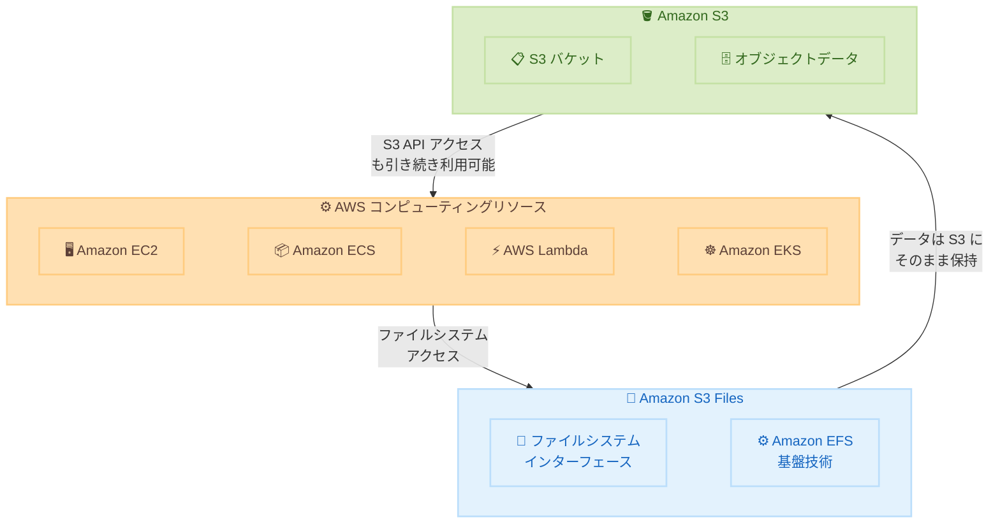

# Amazon S3 - S3 Files

**リリース日**: 2026 年 4 月 7 日
**サービス**: Amazon S3
**機能**: Amazon S3 Files

📊 [このアップデートのインフォグラフィックを見る](https://takech9203.github.io/aws-news-summary/20260407-amazon-s3-files.html)

## 概要

Amazon S3 Files が一般提供 (GA) 開始となった。S3 Files は、S3 バケットをファイルシステムとしてアクセス可能にする新機能であり、AWS のあらゆるコンピューティングリソースから S3 上のデータに対してファイルシステムインターフェースで直接アクセスできるようになる。Amazon S3 は、完全なファイルシステムアクセスを提供する初めてのクラウドオブジェクトストアとなった。

S3 Files は Amazon EFS の技術を基盤として構築されており、ファイルシステムのセマンティクスと低レイテンシのパフォーマンスを提供しながら、データは S3 から移動することなく利用できる。ファイルシステムの使いやすさとパフォーマンスに加え、S3 のスケーラビリティ、耐久性、コスト効率を兼ね備えた統合ストレージソリューションである。

このアップデートは、オブジェクトストレージとファイルストレージの間でデータの複製や移動を行っていたワークロードを持つユーザーにとって特に有益である。AI/ML ワークロード、データ分析、コンテンツ管理など、ファイルシステムアクセスを必要とする幅広いユースケースに対応する。

**アップデート前の課題**

- S3 のデータにファイルシステムとしてアクセスするには、Amazon EFS や Amazon FSx などの別のファイルストレージサービスにデータをコピーする必要があった
- オブジェクトストレージとファイルストレージの間でデータの同期やコピーにかかるコストと運用負荷が発生していた
- ファイルシステムセマンティクス (ディレクトリリスト、ファイルロック、追記書き込みなど) が必要なアプリケーションでは、S3 を直接利用できなかった

**アップデート後の改善**

- S3 バケット上のデータに対して、NFS プロトコルなどのファイルシステムインターフェースで直接アクセスが可能になった
- データを S3 から移動させることなく、ファイルシステムの完全なセマンティクスと低レイテンシのパフォーマンスを利用できるようになった
- オブジェクトストレージとファイルストレージを統合することで、データコピーや同期の運用負荷を削減できるようになった

## アーキテクチャ図



S3 Files は、AWS のコンピューティングリソースと S3 バケットの間にファイルシステムインターフェースを提供する。データは S3 に保持されたまま、ファイルシステムセマンティクスでアクセスできる。

## サービスアップデートの詳細

### 主要機能

1. **ファイルシステムセマンティクスの完全サポート**
   - ディレクトリのリスト表示、ファイルのロック、追記書き込みなどの標準的なファイルシステム操作をサポート
   - POSIX 互換のファイルシステムインターフェースを提供
   - 既存のファイルベースのアプリケーションをそのまま利用可能

2. **低レイテンシパフォーマンス**
   - Amazon EFS の技術基盤を活用した高性能なファイルアクセス
   - データは S3 から移動することなく、ファイルシステム経由で低レイテンシでアクセス可能
   - コンピューティングリソースからの直接接続による効率的なデータアクセス

3. **S3 との統合**
   - S3 バケット内のデータに対して、オブジェクト API とファイルシステムインターフェースの両方からアクセス可能
   - S3 のストレージクラス、ライフサイクルポリシー、暗号化などの機能を引き続き利用可能
   - データの二重管理が不要

## 技術仕様

### 基本仕様

| 項目 | 詳細 |
|------|------|
| 基盤技術 | Amazon EFS |
| アクセス方法 | ファイルシステムインターフェース |
| データ保存場所 | Amazon S3 バケット |
| 対応コンピューティング | EC2、ECS、EKS、Lambda など全ての AWS コンピューティングリソース |
| 提供リージョン | 34 の AWS リージョン |
| 提供状況 | 一般提供 (GA) |

### API 変更履歴

直近の S3 関連の API 変更は以下のとおりである。

| 日付 | サービス | 変更内容 |
|------|----------|----------|
| 2026/03/31 | [AWS S3 Control](https://awsapichanges.com/archive/changes/080f45-s3-control.html) | 1 updated - ディレクトリバケットへの Bucket Metrics 設定サポートを追加 |
| 2026/03/31 | [Amazon S3 Tables](https://awsapichanges.com/archive/changes/080f45-s3tables.html) | 1 updated - テーブル作成時のネストされた型 (struct、list、map) サポートを追加 |

### 利用方法

S3 Files は、S3 バケットに対してファイルシステムアクセスを有効化することで利用を開始できる。

```bash
# AWS CLI を使用して S3 Files を有効化する例
aws s3api create-bucket --bucket my-s3-files-bucket --region us-east-1

# S3 Files のファイルシステムエンドポイントをマウント
# EC2 インスタンスから NFS マウントで接続
sudo mount -t nfs4 -o nfsvers=4.1 \
  s3-files-endpoint.amazonaws.com:/ /mnt/s3files
```

## 設定方法

### 前提条件

1. AWS アカウントと適切な IAM 権限
2. S3 バケット
3. VPC 内のコンピューティングリソース (EC2、ECS、EKS など)

### 手順

#### ステップ 1: S3 バケットの準備

既存の S3 バケットを使用するか、新しいバケットを作成する。S3 Files はバケット内のデータに対してファイルシステムアクセスを提供する。

#### ステップ 2: S3 Files の有効化

AWS マネジメントコンソールの S3 セクションから、対象バケットに対して S3 Files を有効化する。有効化後、ファイルシステムエンドポイントが提供される。

#### ステップ 3: コンピューティングリソースからのマウント

```bash
# EC2 インスタンスからファイルシステムをマウント
sudo mount -t nfs4 -o nfsvers=4.1 \
  <s3-files-endpoint>:/ /mnt/s3data
```

上記コマンドにより、S3 バケット内のデータをローカルファイルシステムとして利用できるようになる。

## メリット

### ビジネス面

- **コスト削減**: オブジェクトストレージとファイルストレージ間のデータコピーが不要になり、ストレージコストと転送コストを削減
- **運用効率の向上**: データの同期やコピーに関する運用作業が不要になり、運用チームの負荷を軽減
- **アプリケーション移行の加速**: ファイルシステムに依存する既存アプリケーションを修正なしで S3 上のデータにアクセスさせることが可能

### 技術面

- **統合データアクセス**: 同一のデータに対してオブジェクト API とファイルシステムの両方からアクセス可能で、アプリケーション設計の柔軟性が向上
- **S3 の耐久性**: イレブンナイン (99.999999999%) の耐久性を持つ S3 にデータが保持されたまま、ファイルシステムアクセスが可能
- **スケーラビリティ**: S3 の事実上無制限のスケーラビリティをファイルシステムワークロードでも活用可能

## デメリット・制約事項

### 制限事項

- 全てのファイルシステム操作において S3 ネイティブのオブジェクト API と同等のパフォーマンスが得られるとは限らない
- ファイルシステムアクセス分の追加コストが発生する可能性がある
- オンプレミス環境からの直接マウントには VPN や Direct Connect 経由のネットワーク接続が必要

### 考慮すべき点

- 大量の小さなファイルを扱うワークロードでは、S3 のオブジェクト API を直接使用する方が効率的な場合がある
- 既存の EFS や FSx for Lustre を使用しているワークロードからの移行にはテストと検証が推奨される

## ユースケース

### ユースケース 1: AI/ML トレーニングデータの管理

**シナリオ**: 大規模な AI/ML モデルのトレーニングに使用するデータセットが S3 に保存されている。従来はトレーニング前に EFS にデータをコピーする必要があった。

**実装例**:
```bash
# S3 Files をマウントして直接トレーニングデータにアクセス
sudo mount -t nfs4 -o nfsvers=4.1 \
  <s3-files-endpoint>:/training-data /mnt/training-data

# トレーニングスクリプトはローカルファイルとしてアクセス
python train.py --data-dir /mnt/training-data
```

**効果**: データコピーの時間とコストを削減し、トレーニング開始までの時間を短縮

### ユースケース 2: コンテナワークロードでの共有ストレージ

**シナリオ**: ECS や EKS 上で動作する複数のコンテナが共有ファイルシステムを必要としている。

**実装例**:
```yaml
# ECS タスク定義での S3 Files ボリューム設定例
volumes:
  - name: shared-data
    s3Files:
      fileSystemId: fs-12345678
      rootDirectory: /shared
```

**効果**: コンテナ間でのデータ共有をシンプルに実現しつつ、S3 の耐久性とコスト効率を享受

### ユースケース 3: レガシーアプリケーションのクラウド移行

**シナリオ**: オンプレミスで NFS ファイルサーバーを使用しているアプリケーションを AWS に移行する。

**実装例**:
```bash
# アプリケーションの設定ファイルでマウントポイントを変更
# Before: /mnt/nfs-server/data
# After: /mnt/s3files/data
sudo mount -t nfs4 -o nfsvers=4.1 \
  <s3-files-endpoint>:/data /mnt/s3files/data
```

**効果**: アプリケーションコードを変更することなく、NFS から S3 Files への移行が可能。S3 のスケーラビリティとコスト効率を活用

## 料金

S3 Files の料金は、S3 ストレージの料金に加えて、ファイルシステムアクセスに関する追加料金が発生する。詳細な料金体系は AWS 公式料金ページを参照のこと。

### 料金の構成要素

| 項目 | 説明 |
|------|------|
| S3 ストレージ料金 | 通常の S3 ストレージ料金が適用される |
| S3 Files アクセス料金 | ファイルシステムアクセスに対する追加課金 |
| データ転送料金 | リージョン間転送やインターネットへの転送に対する課金 |

## 利用可能リージョン

S3 Files は 34 の AWS リージョンで一般提供されている。主要なリージョンを含む幅広いグローバル展開により、世界中のワークロードで利用可能である。

## 関連サービス・機能

- **Amazon EFS**: S3 Files の基盤技術として使用されているフルマネージドファイルシステムサービス。スタンドアロンのファイルストレージが必要な場合に利用
- **Amazon FSx for Lustre**: 高性能コンピューティング (HPC) や機械学習ワークロード向けのファイルシステム。S3 との統合機能を持つが、S3 Files はより直接的なアクセスを提供
- **AWS DataSync**: オンプレミスと AWS 間、または AWS サービス間でのデータ転送サービス。S3 Files により一部のデータ転送ユースケースが不要になる可能性がある

## 参考リンク

- 📊 [インフォグラフィック](https://takech9203.github.io/aws-news-summary/20260407-amazon-s3-files.html)
- [公式発表 (What's New)](https://aws.amazon.com/about-aws/whats-new/2026/04/amazon-s3-files/)
- [Amazon S3 ドキュメント](https://docs.aws.amazon.com/AmazonS3/latest/userguide/)
- [Amazon S3 料金ページ](https://aws.amazon.com/s3/pricing/)

## まとめ

Amazon S3 Files は、クラウドストレージにおけるオブジェクトストレージとファイルストレージの統合という長年の課題を解決する画期的なアップデートである。データを S3 に保持したまま完全なファイルシステムアクセスを提供することで、データコピーの削減、運用効率の向上、コスト最適化を実現する。AI/ML ワークロード、コンテナベースのアプリケーション、レガシーアプリケーションの移行など、ファイルシステムアクセスを必要とするワークロードを持つユーザーは、早期の評価と検証を推奨する。
