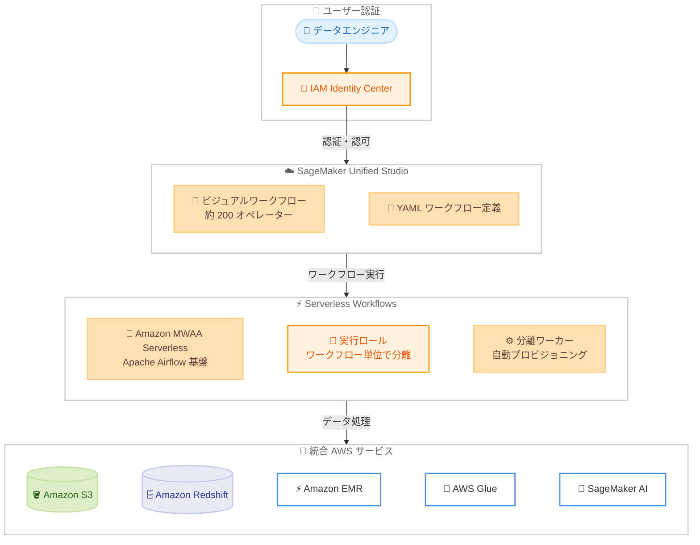

# Amazon SageMaker Unified Studio - Identity Center ドメインでのサーバーレスワークフロー対応

**リリース日**: 2026 年 4 月 7 日
**サービス**: Amazon SageMaker Unified Studio
**機能**: Serverless Workflows in Identity Center Domains

📊 [このアップデートのインフォグラフィックを見る](https://takech9203.github.io/aws-news-summary/20260407-amazon-sagemaker-serverless-workflows.html)

## 概要

Amazon SageMaker Unified Studio が Identity Center ドメインでサーバーレスワークフロー (Serverless Workflows) をサポートしました。これまで IAM ベースのドメインでのみ利用可能だったサーバーレスワークフローが、AWS IAM Identity Center を使用した認証基盤でも利用できるようになります。

サーバーレスワークフローは Amazon MWAA (Managed Workflows for Apache Airflow) Serverless を基盤としており、Apache Airflow のインフラストラクチャをプロビジョニング・管理することなく、データ処理タスクのオーケストレーションを実行できます。ワークフロー実行時にコンピューティングリソースが自動的にプロビジョニングされ、完了時に解放されるため、実際のワークフロー実行時間に対してのみ課金されます。

この機能は、組織全体の ID 管理に IAM Identity Center を採用している企業のデータエンジニアやデータサイエンティストを主な対象としています。

**アップデート前の課題**

- サーバーレスワークフローは IAM ベースのドメインでのみ利用可能であり、Identity Center ドメインのユーザーは利用できなかった
- Identity Center ドメインのユーザーがワークフローオーケストレーションを行うには、別途 Apache Airflow 環境を構築・管理する必要があった
- 組織で IAM Identity Center を標準認証基盤として採用している場合、SageMaker Unified Studio のワークフロー機能を十分に活用できなかった

**アップデート後の改善**

- Identity Center ドメインのユーザーもサーバーレスワークフローを直接利用可能になった
- Apache Airflow インフラストラクチャの構築・管理が不要になり、ワークフロー実行時間のみの従量課金で利用できる
- 約 200 のオペレーターを備えたビジュアルワークフローエクスペリエンスにより、S3、Redshift、EMR、Glue、SageMaker AI などの AWS サービスとの統合が容易になった

## アーキテクチャ図



IAM Identity Center で認証されたユーザーが SageMaker Unified Studio を通じてサーバーレスワークフローを実行し、各種 AWS サービスと連携するアーキテクチャを示しています。各ワークフローは専用の実行ロールと分離されたワーカーで動作します。

## サービスアップデートの詳細

### 主要機能

1. **Identity Center ドメインでのサーバーレスワークフロー**
   - これまで IAM ベースのドメイン限定だったサーバーレスワークフローが Identity Center ドメインでも利用可能に
   - 組織の SSO 基盤をそのまま活用してワークフローオーケストレーションを実行可能
   - IAM Identity Center の権限管理と統合された一貫したアクセス制御

2. **自動リソースプロビジョニング**
   - ワークフロー実行時にコンピューティングリソースが自動的にプロビジョニング
   - 完了時にリソースが自動的に解放される
   - 手動でのインフラ管理やキャパシティプランニングが不要

3. **ワークフローレベルのセキュリティ分離**
   - 各ワークフローは専用の実行ロール (Execution Role) で動作
   - 分離されたワーカーにより、ワークフロー間の干渉を防止
   - マルチテナント環境でも安全にワークフローを運用可能

4. **ビジュアルワークフローエクスペリエンス**
   - 約 200 のオペレーターをサポート
   - Amazon S3、Amazon Redshift、Amazon EMR、AWS Glue、Amazon SageMaker AI などの AWS サービスとのビルトイン統合
   - GUI ベースでワークフローを視覚的に構築可能

## 技術仕様

### サーバーレスワークフローの主要仕様

| 項目 | 詳細 |
|------|------|
| 基盤技術 | Amazon MWAA (Managed Workflows for Apache Airflow) Serverless |
| ワークフロー定義 | YAML ベースの定義ファイル |
| サポートオペレーター数 | 約 200 |
| リソース管理 | 自動プロビジョニング・自動解放 |
| セキュリティモデル | ワークフロー単位の実行ロールと分離ワーカー |
| 対応ドメインタイプ | IAM ベースドメイン、Identity Center ドメイン |

### 統合 AWS サービス

| サービス | 連携内容 |
|----------|----------|
| Amazon S3 | データの読み書き、ステージング |
| Amazon Redshift | データウェアハウスクエリの実行 |
| Amazon EMR | 大規模データ処理ジョブの実行 |
| AWS Glue | ETL ジョブの実行、データカタログ連携 |
| Amazon SageMaker AI | ML モデルのトレーニング・推論 |

## 設定方法

### 前提条件

1. SageMaker Unified Studio の Identity Center ドメインが設定済みであること
2. AWS IAM Identity Center が組織で有効化されていること
3. SageMaker Unified Studio がサポートされているリージョンを使用していること

### 手順

#### ステップ 1: SageMaker Unified Studio へのアクセス

IAM Identity Center の認証情報を使用して SageMaker Unified Studio にサインインします。Identity Center ドメインのユーザーとして認証されていることを確認してください。

#### ステップ 2: ワークフローの作成

SageMaker Unified Studio のワークフローセクションからサーバーレスワークフローを新規作成します。ビジュアルワークフローエクスペリエンスを使用して GUI で構築するか、YAML 定義ファイルを直接記述できます。

#### ステップ 3: ワークフローの実行

作成したワークフローを実行します。コンピューティングリソースは自動的にプロビジョニングされ、完了後に解放されます。実行ロールとワーカーはワークフロー単位で分離されるため、追加のセキュリティ設定は不要です。

## メリット

### ビジネス面

- **コスト最適化**: ワークフロー実行時間のみの従量課金で、アイドル時のコストが発生しない。事前のキャパシティプロビジョニングや最低料金も不要
- **組織全体の ID 管理統一**: IAM Identity Center を標準認証基盤として採用している組織でも、ワークフローオーケストレーション機能をフル活用可能
- **運用負荷の軽減**: Apache Airflow インフラストラクチャの構築・管理・パッチ適用が不要になり、データチームはビジネスロジックに集中可能

### 技術面

- **ワークフローレベルのセキュリティ**: 各ワークフローが専用の実行ロールと分離ワーカーで動作し、クロスワークフロー干渉を防止
- **自動スケーリング**: ワークフローの需要に応じてコンピューティングリソースが自動的にスケール
- **豊富なオペレーター**: 約 200 のオペレーターにより、多様な AWS サービスとの統合を GUI で容易に構築可能

## デメリット・制約事項

### 制限事項

- サーバーレスワークフローは SageMaker Unified Studio がサポートされているリージョンでのみ利用可能
- MWAA Serverless の制約やクォータが適用される
- カスタム Apache Airflow プラグインの利用に制限がある可能性がある

### 考慮すべき点

- 既存の IAM ベースドメインで運用中のワークフローがある場合、Identity Center ドメインへの移行計画が必要
- サーバーレスモデルでは実行ごとにリソースがプロビジョニングされるため、コールドスタートによる初回実行時のレイテンシが発生する可能性がある
- Identity Center の権限セットやアクセス許可の設計が、ワークフロー実行ロールとの整合性を持つように設計する必要がある

## ユースケース

### ユースケース 1: エンタープライズ組織でのデータパイプライン

**シナリオ**: 大規模組織で IAM Identity Center を SSO 基盤として採用しており、複数のデータチームがそれぞれのデータパイプラインを管理している。

**実装例**:
```yaml
# YAML ワークフロー定義
# S3 からデータを取得し、Glue で ETL 処理を行い、Redshift にロード
workflow:
  name: daily-etl-pipeline
  tasks:
    - operator: S3ListOperator
      bucket: raw-data-bucket
    - operator: GlueJobOperator
      job_name: transform-sales-data
    - operator: RedshiftDataOperator
      sql: "COPY sales FROM 's3://processed-data/'"
```

**効果**: 各チームが Identity Center の認証情報でワークフローを管理でき、インフラ管理なしにデータパイプラインを運用可能。チーム間のワークフロー分離も自動的に確保される。

### ユースケース 2: ML パイプラインのオーケストレーション

**シナリオ**: データサイエンスチームが定期的に ML モデルの再トレーニングと推論を実行しており、複数の AWS サービスにまたがるパイプラインを管理している。

**実装例**:
```yaml
# ML パイプラインのワークフロー定義
workflow:
  name: weekly-model-retrain
  tasks:
    - operator: S3DownloadOperator
      bucket: training-data
    - operator: SageMakerTrainingOperator
      training_config:
        instance_type: ml.m5.xlarge
    - operator: SageMakerEndpointOperator
      endpoint_name: prediction-endpoint
```

**効果**: ML パイプライン全体をサーバーレスで実行でき、トレーニング完了後に自動的にリソースが解放される。従量課金により、週次実行のパイプラインでもコストを最小限に抑えられる。

### ユースケース 3: マルチアカウント環境でのデータ処理

**シナリオ**: AWS Organizations と IAM Identity Center を使用してマルチアカウント環境を運用しており、各アカウントのデータを集約・分析するワークフローが必要。

**実装例**:
```yaml
# クロスアカウントデータ集約ワークフロー
workflow:
  name: cross-account-data-aggregation
  tasks:
    - operator: S3ListOperator
      bucket: account-a-data
    - operator: S3ListOperator
      bucket: account-b-data
    - operator: EMRServerlessOperator
      application_id: emr-app-001
      job_config:
        spark_submit: aggregate_job.py
```

**効果**: Identity Center の一元的な認証基盤を活用し、マルチアカウント環境でもセキュアにデータ集約パイプラインを運用可能。各ワークフローの分離により、アカウント間のデータ境界も維持される。

## 料金

サーバーレスワークフローは従量課金モデルで、ワークフロー実行時間に対してのみ課金されます。事前のプロビジョニングや最低料金は不要です。

料金は Amazon MWAA Serverless の料金体系に準じます。詳細な料金情報は以下のリンクを参照してください。

- [Amazon MWAA 料金ページ](https://aws.amazon.com/managed-workflows-for-apache-airflow/pricing/)

## 利用可能リージョン

SageMaker Unified Studio がサポートされているすべての AWS リージョンで利用可能です。SageMaker Unified Studio のリージョン対応状況については、公式ドキュメントを参照してください。

## 関連サービス・機能

- **Amazon MWAA (Managed Workflows for Apache Airflow)**: サーバーレスワークフローの基盤技術。Airflow 環境のマネージドサービス
- **AWS IAM Identity Center**: 組織全体のシングルサインオンと ID 管理を提供。本アップデートの認証基盤
- **Amazon SageMaker AI**: ML モデルのトレーニング・デプロイ。ワークフローのオペレーターとして統合
- **AWS Glue**: サーバーレス ETL サービス。ワークフロー内でのデータ変換処理に利用
- **Amazon EMR**: 大規模データ処理フレームワーク。ワークフローからの Spark/Hadoop ジョブ実行に利用

## 参考リンク

- 📊 [インフォグラフィック](https://takech9203.github.io/aws-news-summary/20260407-amazon-sagemaker-serverless-workflows.html)
- [公式発表 (What's New)](https://aws.amazon.com/about-aws/whats-new/2026/04/amazon-sagemaker-serverless-workflows/)
- [Serverless Workflows ドキュメント](https://docs.aws.amazon.com/sagemaker-unified-studio/latest/userguide/serverless-workflows.html)
- [Amazon MWAA 料金ページ](https://aws.amazon.com/managed-workflows-for-apache-airflow/pricing/)
- [Amazon SageMaker Unified Studio ドキュメント](https://docs.aws.amazon.com/sagemaker-unified-studio/latest/userguide/)

## まとめ

今回のアップデートにより、IAM Identity Center を認証基盤として採用している組織でも、SageMaker Unified Studio のサーバーレスワークフロー機能を利用できるようになりました。インフラ管理不要の従量課金モデルとワークフロー単位のセキュリティ分離により、エンタープライズ環境でのデータパイプライン運用が大幅に簡素化されます。Identity Center ドメインを使用している組織は、既存の認証基盤を活かしながらワークフローオーケストレーションの導入を検討することを推奨します。
