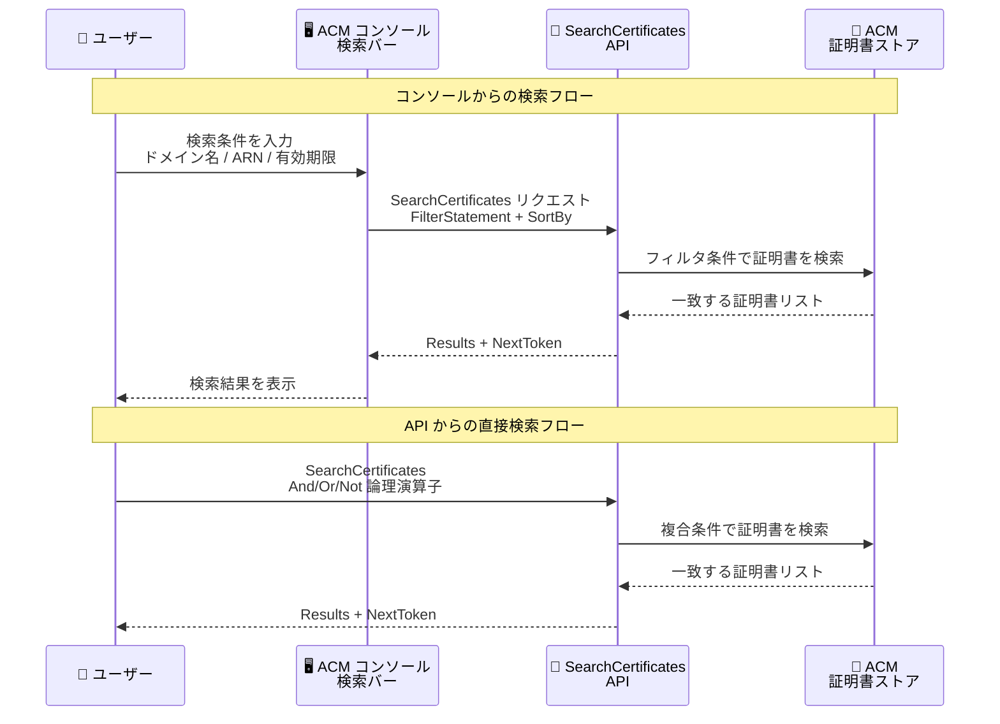

# AWS Certificate Manager - ネイティブ証明書検索機能

**リリース日**: 2026年4月7日
**サービス**: AWS Certificate Manager (ACM)
**機能**: SearchCertificates API およびコンソール検索バー

📊 [このアップデートのインフォグラフィックを見る](https://takech9203.github.io/aws-news-summary/20260407-aws-certificate-manager-search.html)

## 概要

AWS Certificate Manager (ACM) にネイティブの証明書検索機能が追加されました。コンソールに新しい検索バーが導入され、ドメイン名、証明書 ARN、証明書の有効期限などの複数のパラメータを使用して証明書を効率的に検索できるようになりました。また、プログラムによるアクセスを可能にする新しい SearchCertificates API も提供されています。

大規模な環境では数百から数千の証明書を管理するケースがあり、目的の証明書を迅速に特定することが運用上の重要な課題でした。今回のアップデートにより、コンソールと API の両方から柔軟な検索条件で証明書を見つけられるようになり、証明書管理の効率が大幅に向上します。この機能はすべてのパブリック AWS リージョン、AWS China リージョン、AWS GovCloud リージョンで利用可能です。

**アップデート前の課題**

- ACM コンソールでは証明書の一覧表示のみで、条件を指定した検索ができなかった
- 多数の証明書を管理する環境では、目的の証明書を見つけるために一覧をスクロールして手動で確認する必要があった
- API では ListCertificates による基本的なフィルタリングのみで、複雑な条件での検索に対応していなかった
- ドメイン名や有効期限など、複数の属性を組み合わせた検索ができなかった

**アップデート後の改善**

- コンソールの検索バーからドメイン名、証明書 ARN、有効期限などのパラメータで即座に証明書を検索可能になった
- 新しい SearchCertificates API により、And/Or/Not の論理演算子を使った複雑な検索条件を組み合わせたプログラマティックな検索が可能になった
- X.509 属性、ACM メタデータ、キーアルゴリズム、使用状況など多様なフィルタ条件に対応
- ソート機能により、作成日、有効期限、ステータスなど多数の基準で結果を並べ替え可能になった

## アーキテクチャ図



コンソールの検索バーと SearchCertificates API の両方から証明書を検索できます。API は論理演算子による複合条件の構築をサポートしており、柔軟な検索が可能です。

## サービスアップデートの詳細

### 主要機能

1. **コンソール検索バー**
   - ACM コンソールに統合された検索バーで直感的に証明書を検索可能
   - ドメイン名、証明書 ARN、証明書の有効期限などのパラメータに対応
   - 複数のパラメータを組み合わせた検索が可能

2. **SearchCertificates API**
   - プログラマティックな証明書検索を実現する新規 API
   - And、Or、Not の論理演算子をサポートし、再帰的に複合条件を構築可能
   - ページネーション対応 (MaxResults + NextToken)
   - 多様なソート基準とソート順序の指定が可能

3. **豊富なフィルタ条件**
   - X.509 属性フィルタ: CommonName、DNS 名、KeyAlgorithm、KeyUsage、ExtendedKeyUsage、SerialNumber、NotAfter、NotBefore
   - ACM メタデータフィルタ: Status、RenewalStatus、Type、InUse、Exported、ExportOption、ManagedBy、ValidationMethod
   - CertificateArn による直接指定
   - 文字列フィルタでは CONTAINS と EQUALS の比較演算子を使用可能

## 技術仕様

### フィルタパラメータ一覧

| カテゴリ | パラメータ | 説明 |
|----------|------------|------|
| X.509 属性 | CommonName | サブジェクトのコモンネーム (CONTAINS/EQUALS) |
| X.509 属性 | DnsName | SAN の DNS 名 (CONTAINS/EQUALS) |
| X.509 属性 | KeyAlgorithm | RSA_2048、EC_prime256v1 など |
| X.509 属性 | KeyUsage | DIGITAL_SIGNATURE、KEY_ENCIPHERMENT など |
| X.509 属性 | ExtendedKeyUsage | TLS_WEB_SERVER_AUTHENTICATION など |
| X.509 属性 | SerialNumber | 証明書のシリアル番号 |
| X.509 属性 | NotAfter / NotBefore | 有効期間の範囲指定 (Start/End) |
| ACM メタデータ | Status | ISSUED、EXPIRED、REVOKED など |
| ACM メタデータ | RenewalStatus | PENDING_AUTO_RENEWAL、SUCCESS など |
| ACM メタデータ | Type | IMPORTED、AMAZON_ISSUED、PRIVATE |
| ACM メタデータ | InUse / Exported | 使用中 / エクスポート済みかどうか |
| ACM メタデータ | ManagedBy | CLOUDFRONT |
| ACM メタデータ | ValidationMethod | EMAIL、DNS、HTTP |

### ソート可能な基準

| SortBy 値 | 説明 |
|------------|------|
| CREATED_AT | 作成日時 |
| NOT_AFTER | 有効期限 |
| STATUS | 証明書のステータス |
| RENEWAL_STATUS | 更新ステータス |
| KEY_ALGORITHM | キーアルゴリズム |
| TYPE | 証明書の種類 |
| CERTIFICATE_ARN | 証明書 ARN |
| COMMON_NAME | コモンネーム |
| IN_USE | 使用中かどうか |
| EXPORTED | エクスポート済みかどうか |

### API 変更履歴

| 日付 | サービス | 変更内容 |
|------|----------|----------|
| 2026/03/31 | [AWS Certificate Manager](https://awsapichanges.com/archive/changes/080f45-acm.html) | 1 new api method - SearchCertificates API の追加 |

### IAM ポリシー例

```json
{
    "Version": "2012-10-17",
    "Statement": [
        {
            "Effect": "Allow",
            "Action": "acm:SearchCertificates",
            "Resource": "*"
        }
    ]
}
```

## 設定方法

### 前提条件

1. AWS アカウントを所有していること
2. ACM に証明書が登録されていること
3. API を使用する場合は AWS CLI v2 または SDK がインストールされていること

### 手順

#### ステップ 1: コンソールでの検索

ACM コンソール (https://console.aws.amazon.com/acm/) にアクセスし、画面上部の検索バーにドメイン名や証明書 ARN を入力して検索を実行します。

#### ステップ 2: AWS CLI での検索

```bash
aws acm search-certificates \
  --filter-statement '{
    "Filter": {
      "X509AttributeFilter": {
        "Subject": {
          "CommonName": {
            "Value": "example.com",
            "ComparisonOperator": "CONTAINS"
          }
        }
      }
    }
  }' \
  --sort-by NOT_AFTER \
  --sort-order ASCENDING
```

ドメイン名に "example.com" を含む証明書を有効期限の昇順で検索します。有効期限が近い証明書を優先的に確認できます。

#### ステップ 3: 複合条件での検索

```bash
aws acm search-certificates \
  --filter-statement '{
    "And": [
      {
        "Filter": {
          "AcmCertificateMetadataFilter": {
            "Status": "ISSUED",
            "Type": "AMAZON_ISSUED"
          }
        }
      },
      {
        "Filter": {
          "X509AttributeFilter": {
            "KeyAlgorithm": "RSA_2048"
          }
        }
      }
    ]
  }' \
  --sort-by CREATED_AT \
  --sort-order DESCENDING
```

ステータスが ISSUED で、Amazon 発行かつ RSA_2048 キーアルゴリズムの証明書を作成日の降順で検索します。And 演算子を使用して複数の条件を組み合わせています。

#### ステップ 4: Python SDK での検索

```python
import boto3

client = boto3.client('acm')

response = client.search_certificates(
    FilterStatement={
        'And': [
            {
                'Filter': {
                    'AcmCertificateMetadataFilter': {
                        'Status': 'ISSUED',
                        'InUse': True
                    }
                }
            },
            {
                'Filter': {
                    'X509AttributeFilter': {
                        'NotAfter': {
                            'Start': datetime(2026, 4, 1),
                            'End': datetime(2026, 6, 30)
                        }
                    }
                }
            }
        ]
    },
    SortBy='NOT_AFTER',
    SortOrder='ASCENDING',
    MaxResults=50
)

for cert in response['Results']:
    arn = cert['CertificateArn']
    common_name = cert['X509Attributes']['Subject']['CommonName']
    not_after = cert['X509Attributes']['NotAfter']
    print(f"{common_name} - {arn} - Expires: {not_after}")
```

使用中かつ有効期限が 2026 年 4 月から 6 月の間にある証明書を検索し、有効期限が近い順に表示します。

## メリット

### ビジネス面

- **運用効率の向上**: 大量の証明書の中から目的の証明書を迅速に特定でき、証明書管理にかかる時間を大幅に削減
- **コンプライアンス対応の迅速化**: 有効期限が迫る証明書や特定のキーアルゴリズムを使用する証明書を即座にリストアップし、監査対応を効率化
- **インシデント対応の高速化**: 問題が発生した際に関連する証明書を即座に特定でき、障害対応時間を短縮

### 技術面

- **柔軟な検索条件**: And/Or/Not の論理演算子による複合条件の構築が可能で、高度な検索ニーズに対応
- **自動化との統合**: SearchCertificates API を活用して、証明書の棚卸しや期限管理の自動化ワークフローを構築可能
- **豊富なソート機能**: 18 種類のソート基準により、必要な観点で結果を整理して確認可能

## デメリット・制約事項

### 制限事項

- SearchCertificates API のスロットリング制限が適用される可能性がある (具体的なレート制限は公式ドキュメントを参照)
- 検索結果はページネーション対応のため、大量の結果を取得する場合は複数回の API 呼び出しが必要
- FilterStatement の再帰的な構造には深さの制限がある可能性がある

### 考慮すべき点

- 既存の ListCertificates API との使い分けを検討する必要がある (シンプルな一覧取得には ListCertificates が適している場合がある)
- IAM ポリシーで acm:SearchCertificates アクションの権限を適切に設定する必要がある
- 検索条件の構築に論理演算子を使用するため、複雑なクエリのテストと検証が推奨される

## ユースケース

### ユースケース 1: 有効期限が迫る証明書の一括確認

**シナリオ**: セキュリティチームが 90 日以内に期限切れとなる証明書を定期的に確認し、更新漏れを防止する。

**実装例**:
```bash
aws acm search-certificates \
  --filter-statement '{
    "And": [
      {
        "Filter": {
          "AcmCertificateMetadataFilter": {
            "Status": "ISSUED"
          }
        }
      },
      {
        "Filter": {
          "X509AttributeFilter": {
            "NotAfter": {
              "Start": "2026-04-07T00:00:00Z",
              "End": "2026-07-06T00:00:00Z"
            }
          }
        }
      }
    ]
  }' \
  --sort-by NOT_AFTER \
  --sort-order ASCENDING
```

**効果**: 更新が必要な証明書を有効期限順にリストアップし、計画的な証明書更新を実現できる。

### ユースケース 2: 特定ドメインの証明書管理

**シナリオ**: 複数のサブドメインを持つ大規模な Web アプリケーションで、特定のドメインに関連する証明書をすべて把握する。

**実装例**:
```bash
aws acm search-certificates \
  --filter-statement '{
    "Filter": {
      "X509AttributeFilter": {
        "SubjectAlternativeName": {
          "DnsName": {
            "Value": "example.com",
            "ComparisonOperator": "CONTAINS"
          }
        }
      }
    }
  }'
```

**効果**: ドメイン名の部分一致検索により、ワイルドカード証明書やサブドメイン証明書を含むすべての関連証明書を網羅的に把握できる。

### ユースケース 3: セキュリティ監査のための証明書棚卸し

**シナリオ**: セキュリティ監査に備え、インポートされた証明書のうち現在使用中でないものを特定してクリーンアップする。

**実装例**:
```python
import boto3

client = boto3.client('acm')

response = client.search_certificates(
    FilterStatement={
        'And': [
            {
                'Filter': {
                    'AcmCertificateMetadataFilter': {
                        'Type': 'IMPORTED',
                        'InUse': False
                    }
                }
            }
        ]
    },
    SortBy='CREATED_AT',
    SortOrder='ASCENDING'
)

for cert in response['Results']:
    print(f"未使用のインポート証明書: {cert['CertificateArn']}")
```

**効果**: 未使用のインポート証明書を特定し、不要な証明書の削除によるセキュリティポスチャの改善とコスト最適化を実現できる。

## 料金

SearchCertificates API の使用に追加料金はかかりません。ACM で発行するパブリック SSL/TLS 証明書は無料で提供されます。ACM Private CA を使用する場合は別途料金が発生します。

### 料金例

| 項目 | 料金 |
|------|------|
| ACM パブリック証明書 | 無料 |
| SearchCertificates API 呼び出し | 無料 (ACM 標準機能) |
| ACM Private CA | 月額 $400/CA |

## 利用可能リージョン

この機能はすべてのパブリック AWS リージョン、AWS China リージョン、AWS GovCloud (US) リージョンで利用可能です。

## 関連サービス・機能

- **AWS Certificate Manager Private CA**: プライベート証明書の発行と管理。SearchCertificates API で PRIVATE タイプの証明書も検索可能
- **Amazon CloudFront**: CloudFront で管理される証明書を ManagedBy フィルタで検索可能
- **Elastic Load Balancing**: ACM 証明書を使用する主要なサービスの 1 つ。InUse フィルタで ELB に関連付けられた証明書を確認可能
- **AWS Config**: 証明書のコンプライアンス状況の継続的な監視と組み合わせて使用可能

## 参考リンク

- 📊 [インフォグラフィック](https://takech9203.github.io/aws-news-summary/20260407-aws-certificate-manager-search.html)
- [公式発表 (What's New)](https://aws.amazon.com/about-aws/whats-new/2026/03/aws-certificate-manager-search/)
- [AWS Certificate Manager ドキュメント](https://docs.aws.amazon.com/acm/latest/userguide/)
- [AWS Certificate Manager 料金ページ](https://aws.amazon.com/certificate-manager/pricing/)
- [AWS Certificate Manager API リファレンス](https://docs.aws.amazon.com/acm/latest/APIReference/)

## まとめ

AWS Certificate Manager の新しい SearchCertificates API とコンソール検索バーにより、大規模な証明書環境での管理効率が大幅に向上します。論理演算子を使用した柔軟な検索条件の構築と豊富なソート機能により、有効期限管理、セキュリティ監査、インシデント対応などの運用タスクを迅速に実行できます。すべてのリージョンで追加料金なしに利用可能なため、ACM を使用しているすべてのお客様に即座に活用を推奨します。
