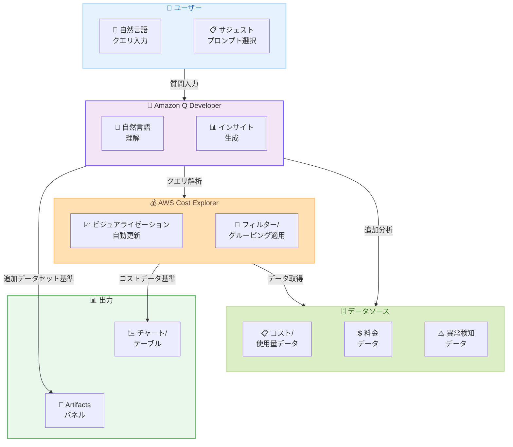

# AWS Cost Explorer - 自然言語クエリ機能

**リリース日**: 2026 年 4 月 7 日
**サービス**: AWS Cost Explorer
**機能**: Natural Language Query capabilities powered by Amazon Q

📊 [このアップデートのインフォグラフィックを見る](https://takech9203.github.io/aws-news-summary/20260407-aws-cost-explorer-natural-language-query.html)

## 概要

AWS Cost Explorer に Amazon Q Developer の生成 AI 機能が直接統合され、自然言語でコストと使用量データに関する質問ができるようになりました。従来のフィルターやグルーピングを手動で操作する代わりに、「今月のトップ支出サービスを表示して」といった自然言語の質問を入力するだけで、Amazon Q が詳細なインサイトを提供し、Cost Explorer が対応するビジュアライゼーションを自動更新します。

この機能により、コスト分析の迅速化、インサイト取得までの時間短縮、そしてすべてのチームメンバーへのコスト可視化のアクセシビリティ向上が実現されます。フォローアップの質問による会話的な分析も可能で、簡単なコストチェックから詳細な調査まで、ツールを切り替えることなくシームレスに進められます。本機能はすべての商用 AWS リージョンで追加料金なしで利用可能です。

**アップデート前の課題**

- Cost Explorer でのコスト分析には、フィルター、グルーピング、期間設定などを手動で操作する必要があり、複雑なクエリの作成に時間がかかっていた
- コスト分析にはある程度の Cost Explorer の操作知識が必要で、技術的な背景を持たないチームメンバーにとってアクセスしにくかった
- 複数の視点からコストを分析する場合、都度フィルターやビューを切り替える必要があり、調査の流れが中断されていた

**アップデート後の改善**

- 自然言語で質問するだけでコスト分析が可能になり、フィルターやグルーピングが自動的に適用される
- 事前に用意されたサジェストプロンプトにより、一般的なコスト質問をワンクリックで開始可能
- 会話形式のフォローアップ質問によりコンテキストを維持したまま深堀り分析が可能になり、ワークフローの中断が不要に

## アーキテクチャ図



ユーザーが自然言語で質問を入力すると、Amazon Q Developer がクエリを解析し、Cost Explorer のビジュアライゼーションを自動更新します。コストと使用量データに基づく分析はチャートやテーブルとして表示され、料金や異常検知など追加データセットに基づく分析は Amazon Q の Artifacts パネルに表示されます。

## サービスアップデートの詳細

### 主要機能

1. **サジェストプロンプト**
   - Cost Explorer 内に事前に用意された一般的なコスト質問が表示される
   - 「今月のトップ支出サービスを表示」などのよく使われるクエリをワンクリックで実行可能
   - コスト分析の開始点として初心者にも使いやすい設計

2. **カスタム質問 - Ask Question ボタン**
   - 新しい「Ask Question」ボタンからユーザー独自の質問を自由に入力可能
   - 自然言語で支出パターンを会話的に探索できる
   - Amazon Q が質問を解釈し、適切なフィルター、グルーピング、期間設定を自動的に適用

3. **自動ビジュアライゼーション更新**
   - コストと使用量データに基づく分析の場合、Cost Explorer のチャートとテーブルが自動更新される
   - 料金データや異常検知など追加データセットに基づくインサイトは、Amazon Q の新しい Artifacts パネルに表示される
   - 手動でのフィルター操作やビュー切り替えが不要

4. **会話的なフォローアップ**
   - フォローアップの質問により、フルコンテキストを維持したまま分析を継続可能
   - 簡単なコストチェックから詳細な調査まで、ワークフローを中断せずにシームレスに移行

## 技術仕様

### 機能仕様

| 項目 | 詳細 |
|------|------|
| クエリ入力方式 | 自然言語テキスト入力 |
| 対応言語 | 英語 (追加言語は未発表) |
| AI エンジン | Amazon Q Developer |
| ビジュアライゼーション | Cost Explorer チャート/テーブル + Amazon Q Artifacts パネル |
| データソース | コスト/使用量データ、料金データ、異常検知データ |
| 会話コンテキスト | フォローアップ質問でコンテキスト維持 |

### 対応データ範囲

| データタイプ | 表示先 |
|-------------|--------|
| コストと使用量データ | Cost Explorer のチャート/テーブル |
| 料金データ | Amazon Q Artifacts パネル |
| 異常検知データ | Amazon Q Artifacts パネル |

## 設定方法

### 前提条件

1. AWS マネジメントコンソールへのアクセス権限
2. AWS Cost Explorer の有効化 (AWS Billing コンソールから有効化)
3. Amazon Q Developer へのアクセス権限

### 手順

#### ステップ 1: Cost Explorer へアクセス

AWS マネジメントコンソールから Cost Explorer を開きます。自然言語クエリ機能は Cost Explorer のインターフェース内に統合されています。

#### ステップ 2: サジェストプロンプトまたはカスタム質問を使用

Cost Explorer 画面に表示されるサジェストプロンプトをクリックするか、「Ask Question」ボタンをクリックして独自の質問を自然言語で入力します。

#### ステップ 3: 結果の確認とフォローアップ

Amazon Q がインサイトを提供し、Cost Explorer のビジュアライゼーションが自動更新されます。さらに詳細な分析が必要な場合は、フォローアップの質問を入力してコンテキストを維持したまま分析を深堀りします。

## メリット

### ビジネス面

- **コスト可視化の民主化**: 技術的な知識がなくてもチームメンバー全員がコスト分析を実行でき、組織全体のコスト意識が向上する
- **分析時間の短縮**: 手動でのフィルター操作やビュー切り替えが不要になり、インサイト取得までの時間が大幅に短縮される
- **追加コストなし**: すべての商用リージョンで追加料金なしで利用可能であり、既存の Cost Explorer ユーザーは即座に活用できる

### 技術面

- **自動ビジュアライゼーション**: Amazon Q の分析結果に基づいて Cost Explorer のフィルター、グルーピング、チャートが自動的に設定されるため、設定ミスのリスクが低減する
- **コンテキスト保持型分析**: 会話的なインターフェースにより、複数のクエリを通じて分析コンテキストが維持され、一貫性のある深堀り分析が可能
- **複数データソースの統合分析**: コスト/使用量データだけでなく、料金データや異常検知データも含めた横断的な分析が単一インターフェースで実行可能

## デメリット・制約事項

### 制限事項

- 自然言語クエリの対応言語は現時点では英語が主であり、日本語を含む他言語での精度は確認が必要
- 生成 AI による回答のため、複雑なクエリや曖昧な質問に対する回答の精度には限界がある可能性がある
- Amazon Q Developer のサービス提供条件に準拠するため、データ処理に関するコンプライアンス要件の確認が必要

### 考慮すべき点

- 自然言語クエリの結果は参考情報として活用し、重要な意思決定には従来のフィルターベースの分析結果と照合することを推奨
- 組織内のコストデータへのアクセス権限は IAM ポリシーで適切に管理する必要がある

## ユースケース

### ユースケース 1: 月次コストレビュー

**シナリオ**: FinOps チームが月次のコストレビューを実施する際に、主要なコストドライバーを迅速に特定したい。

**実装例**:
```
質問: "Show me my top spending services for this month"
フォローアップ: "Compare this with last month's spending"
フォローアップ: "Which services had the largest cost increase?"
```

**効果**: 手動でのフィルター操作なしに、会話形式でコストの傾向を迅速に把握でき、レビュー時間を大幅に短縮できる。

### ユースケース 2: 異常コストの調査

**シナリオ**: 予期しないコスト増加のアラートを受け取ったエンジニアが、原因を特定したい。

**実装例**:
```
質問: "Show me any cost anomalies detected this week"
フォローアップ: "What resources are causing the increased EC2 spending?"
フォローアップ: "Show me the daily cost trend for this service over the past 30 days"
```

**効果**: 異常検知データとコストデータを組み合わせた分析が自然言語で可能になり、原因特定までの時間が短縮される。

### ユースケース 3: チーム間のコスト配分確認

**シナリオ**: プロジェクトマネージャーが各チームのコスト配分を確認し、予算超過がないかを確認したい。

**実装例**:
```
質問: "Show me costs grouped by team tag for the last quarter"
フォローアップ: "Which team exceeded their budget allocation?"
フォローアップ: "Break down the development team's costs by service"
```

**効果**: タグベースのコスト配分分析を技術的な知識なしに実行でき、プロジェクト管理の効率が向上する。

## 料金

本機能は追加料金なしで利用可能です。AWS Cost Explorer の既存料金体系が適用されます。

| 項目 | 料金 |
|------|------|
| 自然言語クエリ機能 | 無料 |
| Cost Explorer API | $0.01/リクエスト |

## 利用可能リージョン

すべての商用 AWS リージョンで利用可能です。AWS GovCloud や中国リージョンでの提供については現時点では未発表です。

## 関連サービス・機能

- **Amazon Q Developer**: Cost Explorer の自然言語クエリを支える生成 AI エンジン。コスト分析以外にもコード生成やトラブルシューティングなど幅広い開発者支援機能を提供
- **AWS Cost Anomaly Detection**: コストの異常を自動検知するサービス。自然言語クエリを通じて異常検知の結果を Artifacts パネルで確認可能
- **AWS Budgets**: 予算の設定と追跡を行うサービス。自然言語クエリによるコスト分析と組み合わせることで、より効果的な予算管理が可能

## 参考リンク

- 📊 [インフォグラフィック](https://takech9203.github.io/aws-news-summary/20260407-aws-cost-explorer-natural-language-query.html)
- [公式発表 (What's New)](https://aws.amazon.com/about-aws/whats-new/2026/04/aws-cost-explorer-natural-language-query/)
- [AWS Cost Explorer ドキュメント](https://docs.aws.amazon.com/cost-management/latest/userguide/ce-what-is.html)
- [AWS Cost Explorer 料金ページ](https://aws.amazon.com/aws-cost-management/aws-cost-explorer/pricing/)

## まとめ

AWS Cost Explorer への自然言語クエリ機能の統合は、コスト分析の民主化という観点で大きな前進です。Amazon Q Developer の生成 AI を活用することで、技術的な背景を持たないチームメンバーでも自然言語でコストデータを分析でき、組織全体のコスト最適化への参加障壁が大幅に低下します。すべての商用リージョンで追加料金なしで利用可能なため、既存の Cost Explorer ユーザーは今すぐ試用を開始することを推奨します。
