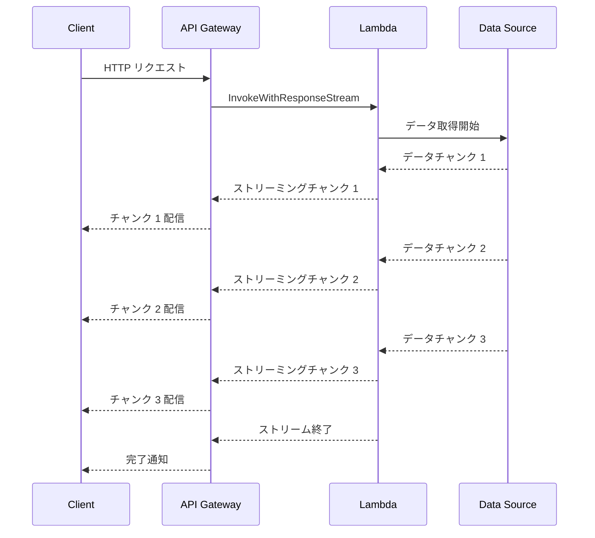

# AWS Lambda - レスポンスストリーミングが全商用リージョンに拡大

**リリース日**: 2026 年 4 月 7 日
**サービス**: AWS Lambda
**機能**: レスポンスストリーミング (Response Streaming)

## 概要

AWS Lambda のレスポンスストリーミングが、すべての商用 AWS リージョンで利用可能になりました。これにより、完全なリージョンパリティが実現され、世界中のどの商用リージョンでもレスポンスストリーミング機能を活用できるようになります。

レスポンスストリーミングは、`InvokeWithResponseStream` API を使用して、Lambda 関数のレスポンスペイロードを段階的にストリーミングする機能です。従来のバッファリング方式では、関数の実行が完全に終了するまでクライアントにレスポンスが返されませんでしたが、ストリーミングを使用することで、データが生成されるとすぐにクライアントに送信を開始できます。レスポンスペイロードはデフォルトで最大 200 MB までサポートされており、大規模なデータ転送にも対応可能です。

現在、Node.js マネージドランタイムとカスタムランタイムでレスポンスストリーミングがサポートされています。リアルタイムデータ処理、大規模レポート生成、生成 AI アプリケーションなど、段階的なレスポンスが求められるユースケースに最適です。

**アップデート前の課題**

- レスポンスストリーミングが一部の AWS リージョンでのみ利用可能で、グローバル展開に制約があった
- 特定のリージョンでストリーミングを使用できないため、アーキテクチャの一貫性を保つことが難しかった
- リージョン制約により、レイテンシーの最適化やデータレジデンシー要件を満たせない場合があった

**アップデート後の改善**

- すべての商用 AWS リージョンでレスポンスストリーミングが利用可能になり、完全なリージョンパリティが実現された
- グローバルに一貫したアーキテクチャでストリーミングアプリケーションを展開できるようになった
- ユーザーに最も近いリージョンでストリーミングを利用でき、レイテンシーの最適化が可能になった

## アーキテクチャ図



この図は、クライアントからのリクエストに対して Lambda 関数がレスポンスを段階的にストリーミングする流れを示しています。データソースからデータが取得されるたびに、即座にクライアントへチャンク単位で配信されます。

## サービスアップデートの詳細

### 主要機能

1. **InvokeWithResponseStream API**
   - Lambda 関数のレスポンスをストリーミング形式で返す API です
   - クライアントは関数の実行完了を待たずに、部分的なレスポンスを受信できます
   - Lambda 関数 URL と統合して、HTTP ストリーミングレスポンスを直接返すことも可能です

2. **大容量ペイロードサポート**
   - レスポンスペイロードはデフォルトで最大 200 MB まで対応しています
   - 従来のバッファリングモードの 6 MB 制限と比較して大幅に拡大されています
   - 大規模なデータセットやファイルの転送に適しています

3. **全商用リージョンでの利用可能性**
   - すべての商用 AWS リージョンで利用可能になりました
   - グローバルなアプリケーションで一貫したストリーミング体験を提供できます
   - マルチリージョンデプロイメントでの設計が簡素化されます

## 技術仕様

### サポート対象

| 項目 | 詳細 |
|------|------|
| API | `InvokeWithResponseStream` |
| 最大レスポンスサイズ | 200 MB (デフォルト) |
| サポートランタイム | Node.js マネージドランタイム、カスタムランタイム |
| 呼び出し方法 | Lambda 関数 URL、AWS SDK、AWS CLI |
| レスポンス形式 | チャンク転送エンコーディング |
| 利用可能リージョン | すべての商用 AWS リージョン |

### コード例 (Node.js)

```javascript
// Lambda 関数側 - レスポンスストリーミングのハンドラー
export const handler = awslambda.streamifyResponse(
  async (event, responseStream, context) => {
    // Content-Type を設定
    const metadata = {
      statusCode: 200,
      headers: {
        "Content-Type": "application/json",
        "Transfer-Encoding": "chunked"
      }
    };

    responseStream = awslambda.HttpResponseStream.from(
      responseStream,
      metadata
    );

    // データを段階的にストリーミング
    for (let i = 0; i < 10; i++) {
      responseStream.write(JSON.stringify({ chunk: i, data: `Processing ${i}...` }) + "\n");
      await new Promise(resolve => setTimeout(resolve, 500));
    }

    responseStream.end();
  }
);
```

### クライアント側の呼び出し例

```javascript
import { LambdaClient, InvokeWithResponseStreamCommand } from "@aws-sdk/client-lambda";

const client = new LambdaClient({ region: "ap-northeast-1" });

const command = new InvokeWithResponseStreamCommand({
  FunctionName: "my-streaming-function",
  Payload: JSON.stringify({ query: "example" })
});

const response = await client.send(command);

// ストリーミングレスポンスを処理
for await (const event of response.EventStream) {
  if (event.PayloadChunk) {
    const chunk = new TextDecoder().decode(event.PayloadChunk.Payload);
    console.log("Received chunk:", chunk);
  }
}
```

### API 変更履歴

現時点で今回のリージョン拡大に関連する新しい API の変更はありません。既存の `InvokeWithResponseStream` API が新たなリージョンで利用可能になったものです。

## 設定方法

### 前提条件

1. AWS アカウントを持っていること
2. Lambda 関数を作成する IAM 権限があること
3. Node.js マネージドランタイムまたはカスタムランタイムを使用していること
4. AWS CLI v2 または AWS SDK がインストールされていること

### 手順

#### ステップ 1: Lambda 関数の作成

```bash
# ストリーミング対応の Lambda 関数を作成
aws lambda create-function \
  --function-name my-streaming-function \
  --runtime nodejs20.x \
  --role arn:aws:iam::123456789012:role/lambda-execution-role \
  --handler index.handler \
  --zip-file fileb://function.zip \
  --region ap-northeast-1
```

Node.js ランタイムを使用して Lambda 関数を作成します。`--region` パラメータで任意の商用リージョンを指定できます。

#### ステップ 2: Lambda 関数 URL の作成 (オプション)

```bash
# 関数 URL を作成してストリーミングを有効化
aws lambda create-function-url-config \
  --function-name my-streaming-function \
  --auth-type AWS_IAM \
  --invoke-mode RESPONSE_STREAM \
  --region ap-northeast-1
```

Lambda 関数 URL を作成し、`--invoke-mode RESPONSE_STREAM` を指定してストリーミングモードを有効にします。

#### ステップ 3: ストリーミング呼び出しのテスト

```bash
# InvokeWithResponseStream API で呼び出し
aws lambda invoke-with-response-stream \
  --function-name my-streaming-function \
  --payload '{"key": "value"}' \
  --region ap-northeast-1 \
  output.json
```

`invoke-with-response-stream` コマンドを使用して、ストリーミングレスポンスが正しく返されることを確認します。

## メリット

### ビジネス面

- **ユーザー体験の向上**: レスポンスを段階的に配信することで、クライアントの体感待ち時間 (Time to First Byte) を短縮できます
- **グローバル展開の簡素化**: すべての商用リージョンで利用可能になったため、グローバルなアプリケーション設計が容易になります
- **大規模データ転送のコスト効率**: 200 MB までのペイロードをサポートし、別途ストレージサービスを介さずにデータを直接ストリーミングできます

### 技術面

- **低レイテンシー**: データが生成されるとすぐに配信を開始するため、Time to First Byte が大幅に短縮されます
- **メモリ効率**: 大きなレスポンスを一括でバッファリングする必要がなく、メモリ使用量を最適化できます
- **ペイロードサイズの拡大**: 従来のバッファリングモードの 6 MB から 200 MB に拡大され、より大規模なデータを扱えます
- **リージョンパリティ**: すべての商用リージョンで同一の機能を使用でき、マルチリージョン構成の設計が統一されます

## デメリット・制約事項

### 制限事項

- サポートされるランタイムは Node.js マネージドランタイムとカスタムランタイムに限定されています (Python、Java などのマネージドランタイムは非対応)
- レスポンスストリーミングは非同期呼び出しでは使用できません
- AWS GovCloud (US) および中国リージョンでの利用可能性は、今回のアナウンスの対象外です

### 考慮すべき点

- ストリーミングレスポンスではエラーハンドリングの方法が従来と異なり、ストリーム途中でのエラー処理を実装する必要があります
- API Gateway 経由で使用する場合、API Gateway のペイロード制限 (10 MB) が適用される場合があります。Lambda 関数 URL を使用することで 200 MB の上限を活用できます
- クライアント側でストリーミングレスポンスを処理するための実装が必要です

## ユースケース

### ユースケース 1: 生成 AI チャットアプリケーション

**シナリオ**: 生成 AI モデルの推論結果をリアルタイムでクライアントにストリーミングする

**実装例**:
```javascript
export const handler = awslambda.streamifyResponse(
  async (event, responseStream, context) => {
    const metadata = {
      statusCode: 200,
      headers: { "Content-Type": "text/event-stream" }
    };
    responseStream = awslambda.HttpResponseStream.from(responseStream, metadata);

    // AI モデルの推論結果をストリーミング
    const aiResponse = await invokeAIModel(event.prompt);
    for await (const token of aiResponse.tokens) {
      responseStream.write(`data: ${JSON.stringify({ token })}\n\n`);
    }

    responseStream.end();
  }
);
```

**効果**: ユーザーは AI の回答を一文字ずつリアルタイムで受信でき、体感待ち時間が大幅に短縮されます

### ユースケース 2: 大規模レポート生成

**シナリオ**: データベースから大量のデータを取得し、CSV や JSON 形式のレポートをストリーミングで配信する

**実装例**:
```javascript
export const handler = awslambda.streamifyResponse(
  async (event, responseStream, context) => {
    const metadata = {
      statusCode: 200,
      headers: {
        "Content-Type": "text/csv",
        "Content-Disposition": "attachment; filename=report.csv"
      }
    };
    responseStream = awslambda.HttpResponseStream.from(responseStream, metadata);

    // CSV ヘッダーを送信
    responseStream.write("id,name,value\n");

    // データベースからページネーションでデータを取得しストリーミング
    let lastKey = null;
    do {
      const result = await queryDatabase(lastKey);
      for (const item of result.items) {
        responseStream.write(`${item.id},${item.name},${item.value}\n`);
      }
      lastKey = result.lastKey;
    } while (lastKey);

    responseStream.end();
  }
);
```

**効果**: 200 MB までのレポートをストリーミングで配信でき、クライアントはダウンロードをすぐに開始できます

### ユースケース 3: リアルタイムダッシュボード

**シナリオ**: Server-Sent Events (SSE) を使用して、リアルタイムのメトリクスやステータス更新をクライアントに配信する

**実装例**:
```javascript
export const handler = awslambda.streamifyResponse(
  async (event, responseStream, context) => {
    const metadata = {
      statusCode: 200,
      headers: { "Content-Type": "text/event-stream" }
    };
    responseStream = awslambda.HttpResponseStream.from(responseStream, metadata);

    // メトリクスを定期的にストリーミング
    for (let i = 0; i < 60; i++) {
      const metrics = await fetchMetrics();
      responseStream.write(`data: ${JSON.stringify(metrics)}\n\n`);
      await new Promise(resolve => setTimeout(resolve, 1000));
    }

    responseStream.end();
  }
);
```

**効果**: WebSocket を使用せずに、サーバーレスアーキテクチャでリアルタイムのデータ配信が可能になります

## 料金

AWS Lambda のレスポンスストリーミングを使用する場合、通常の Lambda 料金に加えてストリーミングレスポンスのデータ転送料金が適用されます。

### 料金例

| 使用量 | 月額料金 (概算) |
|--------|------------------|
| 100 万リクエスト、128MB メモリ、平均 1 秒実行、平均 1MB ストリーミング | Lambda 実行: $2.10 + ストリーミング: $0.80 = $2.90 |
| 1,000 万リクエスト、256MB メモリ、平均 2 秒実行、平均 5MB ストリーミング | Lambda 実行: $41.70 + ストリーミング: $40.00 = $81.70 |

※ ストリーミングレスポンスの料金は、ストリーミングされたデータ量に基づいて 1 GB あたり約 $0.008 で課金されます (最初の 6 MB は無料)
※ AWS Lambda の無料利用枠 (月間 100 万リクエストと 40 万 GB-秒) が適用されます

## 利用可能リージョン

今回のアップデートにより、レスポンスストリーミングはすべての商用 AWS リージョンで利用可能になりました。これには以下のリージョンが含まれます。

- 米国: us-east-1, us-east-2, us-west-1, us-west-2
- 欧州: eu-west-1, eu-west-2, eu-west-3, eu-central-1, eu-central-2, eu-north-1, eu-south-1, eu-south-2
- アジアパシフィック: ap-northeast-1, ap-northeast-2, ap-northeast-3, ap-southeast-1, ap-southeast-2, ap-southeast-3, ap-southeast-4, ap-south-1, ap-south-2, ap-east-1
- その他: ca-central-1, ca-west-1, sa-east-1, me-south-1, me-central-1, af-south-1, il-central-1

## 関連サービス・機能

- **Lambda 関数 URL**: ストリーミングモード (`RESPONSE_STREAM`) を使用して、HTTP ストリーミングレスポンスを直接クライアントに返せます
- **Amazon API Gateway**: Lambda 関数と統合してストリーミング API を構築できます (ペイロードサイズの制限に注意)
- **Amazon CloudFront**: Lambda 関数 URL と組み合わせて、グローバルにストリーミングコンテンツを配信できます
- **Amazon Bedrock**: 生成 AI モデルの推論結果をストリーミングで返すアプリケーションを Lambda で構築できます
- **Amazon DynamoDB Streams**: DynamoDB の変更イベントをトリガーにストリーミングレスポンスを生成できます

## 参考リンク

- [公式発表 (What's New)](https://aws.amazon.com/about-aws/whats-new/2026/04/aws-lambda-response-streaming/)
- [ドキュメント - Lambda レスポンスストリーミング](https://docs.aws.amazon.com/lambda/latest/dg/configuration-response-streaming.html)
- [ドキュメント - Lambda 関数 URL](https://docs.aws.amazon.com/lambda/latest/dg/lambda-urls.html)
- [AWS Lambda 料金ページ](https://aws.amazon.com/lambda/pricing/)

## まとめ

AWS Lambda のレスポンスストリーミングがすべての商用 AWS リージョンに拡大されたことで、グローバルなアプリケーションでストリーミング機能を一貫して利用できるようになりました。生成 AI アプリケーション、大規模レポート生成、リアルタイムデータ配信など、段階的なレスポンスが求められるユースケースにおいて、Lambda 関数のストリーミングを活用することを推奨します。既に他のリージョンでストリーミングを利用している場合は、新たに利用可能になったリージョンへの展開を検討してください。
