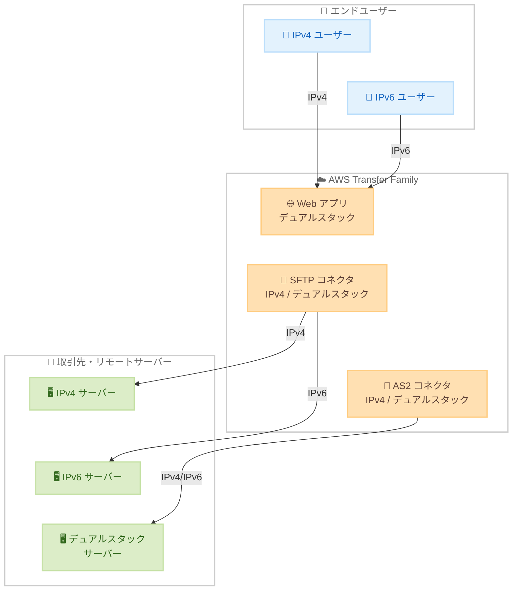

# AWS Transfer Family - コネクタと Web アプリの IPv6 サポート

**リリース日**: 2026 年 4 月 7 日
**サービス**: AWS Transfer Family
**機能**: SFTP コネクタ、AS2 コネクタ、Web アプリにおける IPv6 サポート

📊 [このアップデートのインフォグラフィックを見る](https://takech9203.github.io/aws-news-summary/20260407-aws-transfer-family-ipv6-connectors-web-apps.html)

## 概要

AWS Transfer Family は、SFTP コネクタ、AS2 コネクタ、および Transfer Family Web アプリにおける IPv6 サポートを発表しました。これにより、コネクタがリモートサーバーや取引先に IPv6 経由で接続できるようになり、エンドユーザーは IPv6 を使用して Transfer Family Web アプリにアクセスできるようになります。

IPv4 アドレスの枯渇が進む中、多くの組織が IPv6 への移行を進めています。今回のアップデートにより、IPv6 を採用した取引先との接続障壁が解消され、IPv6 ネイティブなネットワークやデバイスからのファイルのアップロード・ダウンロードが可能になります。デュアルスタックサポートにより、IPv4 と IPv6 の両方のシステムと通信でき、段階的な移行にも対応します。

このアップデートは、B2B ファイル転送やマネージドファイル転送を利用する企業にとって、ネットワークの近代化と IPv6 移行を円滑に進めるための重要な機能強化です。

**アップデート前の課題**

- Transfer Family のコネクタは IPv4 のみをサポートしており、IPv6 を採用した取引先との接続ができなかった
- IPv6 ネイティブなネットワークやデバイスから Transfer Family Web アプリにアクセスできなかった
- 取引先が IPv6 に移行する際に、Transfer Family 側で接続の互換性を維持する手段がなかった
- IPv4 アドレスの枯渇に伴うコスト増加に対応する選択肢が限られていた

**アップデート後の改善**

- SFTP コネクタおよび AS2 コネクタで IPv6 経由の接続が可能になり、IPv6 採用済みの取引先と通信可能に
- Transfer Family Web アプリが IPv6 アクセスをサポートし、IPv6 ネイティブ環境からのファイル操作が可能に
- デュアルスタック (IPv4/IPv6) をサポートし、両方のプロトコルに対応するシステムとの通信が可能に
- `IpAddressType` パラメータにより、コネクタごとに IPv4 のみまたはデュアルスタックを柔軟に選択可能に

## アーキテクチャ図



Transfer Family のコネクタと Web アプリがデュアルスタックに対応し、IPv4 と IPv6 の両方のネットワークからの接続を受け付けることで、取引先やエンドユーザーのネットワーク環境に依存しない柔軟な接続を実現します。

## サービスアップデートの詳細

### 主要機能

1. **SFTP コネクタの IPv6 サポート**
   - SFTP コネクタがリモート SFTP サーバーに IPv6 経由で接続可能に
   - `IpAddressType` パラメータで `IPV4` または `DUALSTACK` を選択
   - デュアルスタック設定により、IPv4 と IPv6 の両方のサーバーに接続可能

2. **AS2 コネクタの IPv6 サポート**
   - AS2 コネクタが取引先の AS2 エンドポイントに IPv6 経由で接続可能に
   - B2B データ交換における IPv6 移行をサポート
   - 既存の AS2 設定 (暗号化、署名、MDN など) はそのまま維持

3. **Transfer Family Web アプリの IPv6 サポート**
   - エンドユーザーが IPv6 ネットワークから Web アプリにアクセス可能に
   - IPv6 ネイティブなデバイスからのファイルアップロード・ダウンロードをサポート
   - デュアルスタックにより IPv4 ユーザーとの互換性も維持

## 技術仕様

### IpAddressType パラメータ

| 値 | 説明 |
|------|------|
| `IPV4` | IPv4 のみで通信 (デフォルト) |
| `DUALSTACK` | IPv4 と IPv6 の両方で通信可能 |

### 対応コンポーネント

| コンポーネント | IPv6 サポート | デュアルスタック | 用途 |
|----------------|---------------|-----------------|------|
| SFTP コネクタ | 対応 | 対応 | リモート SFTP サーバーへの接続 |
| AS2 コネクタ | 対応 | 対応 | 取引先 AS2 エンドポイントへの接続 |
| Web アプリ | 対応 | 対応 | エンドユーザーのファイル操作 |

### API 変更履歴

| 日付 | サービス | 変更内容 |
|------|----------|----------|
| 2026/04/06 | [AWS Transfer Family](https://awsapichanges.com/archive/changes/0bb499-transfer.html) | 3 updated api methods - コネクタに `IpAddressType` パラメータを追加 |

### 変更された API メソッド

| メソッド | 変更内容 |
|----------|----------|
| `CreateConnector` | `IpAddressType` パラメータを追加 (IPV4 / DUALSTACK) |
| `UpdateConnector` | `IpAddressType` パラメータを追加 (IPV4 / DUALSTACK) |
| `DescribeConnector` | レスポンスに `IpAddressType` フィールドを追加 |

### IAM ポリシー例

```json
{
  "Version": "2012-10-17",
  "Statement": [
    {
      "Effect": "Allow",
      "Action": [
        "transfer:CreateConnector",
        "transfer:UpdateConnector",
        "transfer:DescribeConnector"
      ],
      "Resource": "arn:aws:transfer:*:*:connector/*"
    }
  ]
}
```

## 設定方法

### 前提条件

1. AWS Transfer Family が利用可能なリージョンの AWS アカウント
2. 既存の SFTP コネクタまたは AS2 コネクタ (既存コネクタを更新する場合)
3. IPv6 対応のリモートサーバーまたは取引先エンドポイント
4. AWS CLI v2 の最新バージョン

### 手順

#### ステップ 1: デュアルスタック対応の SFTP コネクタを作成

```bash
aws transfer create-connector \
  --url "sftp://partner-sftp-server.example.com" \
  --access-role "arn:aws:iam::123456789012:role/TransferConnectorRole" \
  --sftp-config '{
    "UserSecretId": "arn:aws:secretsmanager:us-east-1:123456789012:secret:SFTPCredentials",
    "TrustedHostKeys": ["ssh-rsa AAAAB3..."]
  }' \
  --ip-address-type "DUALSTACK"
```

このコマンドは、IPv4 と IPv6 の両方で通信可能なデュアルスタック対応の SFTP コネクタを作成します。`--ip-address-type` に `DUALSTACK` を指定することで、IPv6 対応のリモートサーバーにも接続できます。

#### ステップ 2: 既存のコネクタをデュアルスタックに更新

```bash
aws transfer update-connector \
  --connector-id "c-1234567890abcdef0" \
  --ip-address-type "DUALSTACK"
```

このコマンドは、既存のコネクタの IP アドレスタイプをデュアルスタックに変更します。変更後、コネクタは IPv4 と IPv6 の両方のプロトコルでリモートサーバーに接続できるようになります。

#### ステップ 3: コネクタの設定を確認

```bash
aws transfer describe-connector \
  --connector-id "c-1234567890abcdef0"
```

このコマンドは、コネクタの現在の設定を確認します。レスポンスに含まれる `IpAddressType` フィールドで、現在の IP アドレスタイプ設定を確認できます。

## メリット

### ビジネス面

- **取引先との接続障壁の解消**: IPv6 に移行した取引先との通信が可能になり、ビジネスパートナーとの接続を維持
- **将来のネットワーク移行への対応**: IPv4 アドレスの枯渇に備え、段階的な IPv6 移行を実現
- **コスト最適化**: IPv4 アドレスの取得・維持に関するコストを削減する選択肢を提供

### 技術面

- **デュアルスタック対応**: IPv4 と IPv6 の両方をサポートし、既存のシステムとの互換性を維持しながら IPv6 を導入可能
- **既存設定との互換性**: コネクタのセキュリティ設定 (暗号化、署名、認証) はそのまま維持され、IP アドレスタイプのみ変更可能
- **柔軟な構成**: コネクタごとに IP アドレスタイプを個別に設定でき、段階的な移行が可能
- **Web アプリの IPv6 対応**: エンドユーザーのネットワーク環境に依存しないアクセスを実現

## デメリット・制約事項

### 制限事項

- IPv6 のみ (シングルスタック IPv6) のオプションは提供されておらず、`IPV4` または `DUALSTACK` の選択となる
- リモートサーバーや取引先が IPv6 に対応していない場合、デュアルスタック設定の効果は限定的
- Web アプリの IPv6 サポートの詳細な設定方法については、公式ドキュメントの更新を確認する必要がある

### 考慮すべき点

- デュアルスタックに変更する前に、リモートサーバーや取引先の IPv6 対応状況を確認すること
- VPC 環境でコネクタを使用している場合、VPC およびサブネットが IPv6 に対応していることを確認する必要がある
- セキュリティグループやネットワーク ACL で IPv6 トラフィックを適切に許可する設定が必要
- DNS 解決において、IPv6 アドレス (AAAA レコード) が正しく設定されていることを確認すること

## ユースケース

### ユースケース 1: IPv6 移行済み取引先との SFTP ファイル転送

**シナリオ**: 金融機関が取引先との間で日次のデータファイルを SFTP で交換しています。取引先が IPv6 に移行し、IPv4 接続を廃止する予定です。

**実装例**:
```bash
aws transfer create-connector \
  --url "sftp://partner-ipv6.example.com" \
  --access-role "arn:aws:iam::123456789012:role/TransferRole" \
  --sftp-config '{
    "UserSecretId": "arn:aws:secretsmanager:us-east-1:123456789012:secret:PartnerCreds",
    "TrustedHostKeys": ["ssh-rsa AAAAB3..."]
  }' \
  --ip-address-type "DUALSTACK"
```

**効果**: 取引先の IPv6 移行後も SFTP ファイル転送が中断されず、ビジネスの継続性を維持できます。

### ユースケース 2: IPv6 ネイティブ環境からの Web アプリアクセス

**シナリオ**: グローバル企業の社内ネットワークが IPv6 ネイティブに移行しており、従業員が Transfer Family Web アプリを使用してファイルをアップロード・ダウンロードする必要があります。

**実装例**:
1. Transfer Family Web アプリの IPv6 サポートを有効化
2. DNS で Web アプリのエンドポイントに AAAA レコードを設定
3. セキュリティグループで IPv6 のインバウンドトラフィックを許可

**効果**: IPv6 ネイティブ環境の従業員が追加の NAT やプロキシなしで直接 Web アプリにアクセスでき、ネットワーク構成を簡素化できます。

### ユースケース 3: 段階的な IPv6 移行

**シナリオ**: 物流企業が複数の取引先と AS2 でデータを交換しており、取引先ごとに IPv4/IPv6 の対応状況が異なります。

**実装例**:
```bash
# IPv6 対応済みの取引先向けコネクタをデュアルスタックに更新
aws transfer update-connector \
  --connector-id "c-partner-ipv6-ready" \
  --ip-address-type "DUALSTACK"

# まだ IPv4 のみの取引先向けコネクタはそのまま
aws transfer describe-connector \
  --connector-id "c-partner-ipv4-only"
```

**効果**: 取引先ごとの IPv6 対応状況に合わせて、コネクタの IP アドレスタイプを個別に管理でき、段階的な IPv6 移行を実現できます。

## 料金

AWS Transfer Family のコネクタの料金体系は従来と変わりません。IPv6 サポートの有効化に追加料金は発生しません。

- **コネクタ料金**: コネクタが有効化されている時間に対する時間単位の料金
- **メッセージ/ファイル転送料金**: 送受信されるメッセージ数・ファイル数に対する料金
- **データ転送料金**: 転送されるデータ量に対する標準的な AWS データ転送料金

詳細な料金については [AWS Transfer Family Pricing](https://aws.amazon.com/aws-transfer-family/pricing/) をご確認ください。

## 利用可能リージョン

AWS Transfer Family が提供されている大部分のリージョンで利用可能です。利用可能なリージョンの最新情報については、[AWS Transfer Family エンドポイントとクォータ](https://docs.aws.amazon.com/general/latest/gr/transfer-service.html)をご確認ください。

## 関連サービス・機能

- **AWS Transfer Family SFTP コネクタ**: リモート SFTP サーバーへのマネージド接続を提供
- **AWS Transfer Family AS2 コネクタ**: AS2 プロトコルによるセキュアな B2B データ交換
- **AWS Transfer Family Web アプリ**: ブラウザベースのファイル転送インターフェース
- **Amazon VPC**: IPv6 対応の VPC 環境でコネクタを使用する場合に関連
- **Amazon Route 53**: IPv6 エンドポイントの DNS 解決 (AAAA レコード)

## 参考リンク

- 📊 [インフォグラフィック](https://takech9203.github.io/aws-news-summary/20260407-aws-transfer-family-ipv6-connectors-web-apps.html)
- [公式発表 (What's New)](https://aws.amazon.com/about-aws/whats-new/2026/04/aws-transfer-family-ipv6-connectors-web-apps/)
- [AWS Transfer Family ドキュメント](https://docs.aws.amazon.com/transfer/latest/userguide/what-is-aws-transfer-family.html)
- [AWS Transfer Family 料金ページ](https://aws.amazon.com/aws-transfer-family/pricing/)

## まとめ

AWS Transfer Family の SFTP コネクタ、AS2 コネクタ、および Web アプリにおける IPv6 サポートにより、IPv6 に移行した取引先やネットワーク環境との接続が可能になりました。デュアルスタックサポートにより、IPv4 と IPv6 の両方のシステムとの互換性を維持しながら段階的な移行が実現できます。取引先の IPv6 移行状況を確認し、該当するコネクタの `IpAddressType` を `DUALSTACK` に更新することを検討してください。
