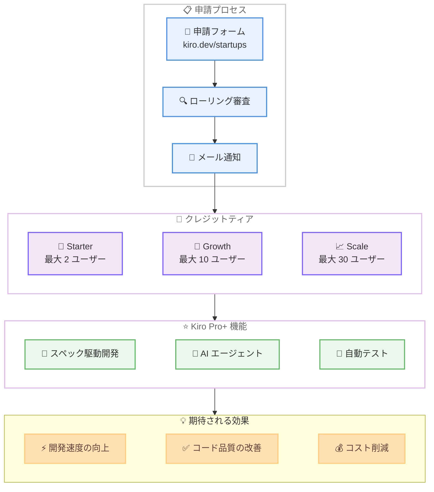

# Kiro - スタートアップクレジットプログラムの再開

**リリース日**: 2026 年 4 月 7 日
**サービス**: Kiro
**機能**: Kiro スタートアップクレジットプログラム

📊 [このアップデートのインフォグラフィックを見る](https://takech9203.github.io/aws-news-summary/20260407-kiro-startup-credits-program.html)

## 概要

Kiro は、スタートアップ向けのクレジットプログラムを再開しました。2025 年 12 月に初めて開始されたこのプログラムは、数千件の応募が殺到するほどの反響があり、アーリーステージのスタートアップが成長に応じてスケールできる開発者ツールへの強い需要を示しました。

本日より、対象となるスタートアップは最大 1 年分の Kiro Pro+ を無償で利用できるクレジットに申請可能です。Kiro Pro+ には、スペック駆動開発と高度な AI エージェント機能が含まれており、コストを気にすることなく開発を加速できます。プログラムはチームサイズに応じた 3 つのティア (Starter、Growth、Scale) で構成されており、最大 30 ユーザーまでの利用が可能です。

このプログラムはグローバルに展開されており、ほとんどの国から申請可能です。なお、既に AWS Activate クレジットを受給済みの場合は対象外となります。

**アップデート前の課題**

- アーリーステージのスタートアップにとって、AI 駆動の IDE ツールのコストが開発初期段階での導入障壁となっていた
- 前回のプログラムは需要過多により受付を停止しており、申請機会を逃したスタートアップが存在していた
- MVP からプロダクトマーケットフィットへ移行するフェーズで、開発ツールへの投資と限られた予算のバランスが課題だった

**アップデート後の改善**

- 対象スタートアップが最大 1 年分の Kiro Pro+ クレジットを無償で取得可能になった
- チームサイズに応じた 3 つのティア (最大 2、10、30 ユーザー) で柔軟にプログラムを利用できるようになった
- スペック駆動開発と AI エージェントによるドキュメント、テスト、コードレビューの自動化が無償で利用可能になった

## アーキテクチャ図



スタートアップが申請してからクレジットを取得し、Kiro Pro+ の機能を活用して開発効果を得るまでの全体フローを示しています。

## サービスアップデートの詳細

### プログラム概要

1. **クレジット内容**
   - 最大 1 年分の Kiro Pro+ 利用クレジットを無償で提供
   - クレジットは AWS アカウントに自動的に適用
   - スペック駆動開発および高度な AI エージェント機能を含む Kiro Pro+ の全機能が利用可能

2. **3 段階のティア構成**
   - **Starter ティア**: 最大 2 ユーザーまで利用可能。創業者やごく少人数のチーム向け
   - **Growth ティア**: 最大 10 ユーザーまで利用可能。成長フェーズのスタートアップ向け
   - **Scale ティア**: 最大 30 ユーザーまで利用可能。Series A 前後の拡大期のチーム向け

3. **審査プロセス**
   - ローリングベースで申請を受付・審査
   - 審査結果はメールで通知
   - ティアのユーザー上限を超過した場合や、Pro+ 以上のプランにアップグレードした場合は追加料金が発生する可能性あり

### 対象条件

1. **対象**
   - アーリーステージから Series A までのスタートアップ
   - グローバルで申請可能 (ほとんどの国に対応)

2. **対象外**
   - 既に AWS Activate クレジットを受給済みの組織

## 技術仕様

### Kiro Pro+ に含まれる機能

| 機能 | 詳細 |
|------|------|
| スペック駆動開発 | 要件定義からテスト済みコードの出力までを構造的に実行 |
| AI エージェント | ドキュメント作成、テスト生成、コードレビューの自動化 |
| IDE サポート | Kiro IDE でのフル機能利用 |
| CLI サポート | Kiro CLI でのエージェントワークフロー実行 |

### プログラムティア比較

| ティア | 最大ユーザー数 | 想定フェーズ |
|--------|---------------|-------------|
| Starter | 2 | 創業者・プレシード |
| Growth | 10 | シード・成長期 |
| Scale | 30 | Series A 前後 |

## 設定方法

### 前提条件

1. アーリーステージから Series A までのスタートアップであること
2. AWS Activate クレジットを受給していないこと
3. AWS アカウントを保有していること

### 手順

#### ステップ 1: 申請の提出

[kiro.dev/startups](https://kiro.dev/startups/) にアクセスし、申請フォームに必要事項を記入して送信します。チームサイズや事業内容に関する情報を入力します。

#### ステップ 2: 審査結果の確認

ローリングベースで審査が行われ、結果はメールで通知されます。承認された場合、適用されるティアとクレジット内容が案内されます。

#### ステップ 3: クレジットの利用開始

承認後、クレジットは自動的に AWS アカウントに適用されます。Kiro IDE または CLI からサインインすると、Kiro Pro+ の全機能が利用可能になります。

## メリット

### ビジネス面

- **開発コストの大幅削減**: 最大 1 年分の Kiro Pro+ が無償で利用できるため、初期フェーズのスタートアップが開発ツールへの投資を抑えながら高品質なコードを生産できる
- **開発期間の短縮**: ユーザー事例では、24-32 週間を見込んでいたプロジェクトが 5-7 週間で完了し、テスト作成・ドキュメント作成の時間を 60-70% 削減した報告がある
- **チームのスケーラビリティ**: 最大 30 ユーザーまで対応するティア構成により、チームの成長に合わせたプログラム利用が可能

### 技術面

- **スペック駆動開発の活用**: 要件定義を先に行うことでコード品質が向上し、手戻りを削減。プロンプトエンジニアリングに費やす時間を最小化
- **自動テストカバレッジの向上**: ユーザー事例では、Kiro 導入後に自動テストカバレッジが 60% 以上向上した報告がある
- **AI による Terraform コード生成**: ユーザー事例では、Terraform コード、ユニットテスト、Playwright オブジェクトモデルの 80% を AI で生成し、プラットフォームチームの週 8-12 時間を節約

## デメリット・制約事項

### 制限事項

- AWS Activate クレジットの受給済み組織は本プログラムの対象外
- ティアのユーザー上限を超過した場合、追加料金が発生する可能性がある
- Pro+ 以上のプランへのアップグレード時にも追加費用が発生する可能性がある
- クレジットの有効期間は最大 1 年間で、延長についての情報は公開されていない

### 考慮すべき点

- ローリングベースの審査であるため、申請から承認までの期間は明確に定められていない
- プログラムの利用規約 (Terms and Conditions) の確認が必要
- プログラム終了後の継続利用にはクレジットカード等による通常の支払いが必要になる

## ユースケース

### ユースケース 1: MVP 開発の加速

**シナリオ**: 2 名の創業者チームが、アイデアを最小限の実行可能なプロダクトとして迅速に構築したい。限られた予算の中で AI 駆動の開発ツールを活用し、開発期間を短縮する。

**実装例**:
```
Starter ティアに申請し、2 名の創業者がそれぞれ
Kiro Pro+ を利用する。スペック駆動開発で要件を
定義し、AI エージェントがテストとドキュメントを
自動生成。手動のテスト作成時間を 60-70% 削減。
```

**効果**: プロンプトエンジニアリングに時間を費やすことなく、要件定義から数分でテスト済みコードを出力でき、MVP 完成までの期間を大幅に短縮できる。

### ユースケース 2: Series A に向けた開発チームのスケールアップ

**シナリオ**: シードラウンドを完了し、10 名規模の開発チームを構築中のスタートアップ。プロダクトマーケットフィットに向けて高速な反復開発を行いたいが、開発ツールのコストを最適化する必要がある。

**実装例**:
```
Growth ティアに申請し、最大 10 名のエンジニアに
Kiro Pro+ を提供。AI エージェントによる
コードレビューの自動化でチーム全体の品質を維持
しながら、機能開発のスループットを向上させる。
```

**効果**: チームメンバー全員が AI 支援付きの開発環境を利用でき、コード品質とテストカバレッジを維持しながら開発速度を向上させられる。

### ユースケース 3: インフラストラクチャコードの効率化

**シナリオ**: クラウドインフラの構築と運用を行うプラットフォームチームが、Terraform コードやテストの作成に多くの時間を費やしている。AI による自動生成でインフラ開発を効率化したい。

**実装例**:
```
Scale ティアに申請し、プラットフォームチームと
アプリケーション開発チームの両方に Kiro Pro+ を
提供。Terraform コード、ユニットテスト、
Playwright オブジェクトモデルの生成に AI を活用。
MCP サーバーやエージェントの構築にも活用。
```

**効果**: Terraform コードの 80% を AI で生成し、プラットフォームチームの作業時間を週 8-12 時間削減。MCP サーバーとエージェントの構築も 80% AI 支援で実現。

## 料金

本プログラムにより、対象スタートアップは最大 1 年間 Kiro Pro+ を無償で利用できます。

### プログラム適用時の料金

| ティア | 最大ユーザー数 | 料金 |
|--------|---------------|------|
| Starter | 2 | 無償 (クレジット適用) |
| Growth | 10 | 無償 (クレジット適用) |
| Scale | 30 | 無償 (クレジット適用) |

※ ティアのユーザー上限を超過した場合や Pro+ 以上へのアップグレード時には追加費用が発生する場合があります。通常の Kiro Pro+ 料金については [Kiro 料金ページ](https://kiro.dev/pricing/) を参照してください。

## 利用可能リージョン

グローバル (ほとんどの国で申請可能)

## 関連サービス・機能

- **Kiro IDE**: AI 駆動のスペック駆動開発を実現するエージェント型 IDE。Pro+ クレジットで全機能を利用可能
- **Kiro CLI**: コマンドラインから AI エージェントワークフローを実行するインターフェース
- **Kiro Pro+**: スペック駆動開発と高度な AI エージェント機能を含む Kiro の上位プラン
- **AWS Activate**: AWS のスタートアップ向けプログラム。プロモーショナルクレジット、技術サポート、ビジネスリソースを提供。本プログラムとの併用は不可
- **Kiro コミュニティ (Discord)**: ビルダー同士の情報交換、ベストプラクティスの共有、技術サポートを提供するコミュニティ

## 参考リンク

- 📊 [インフォグラフィック](https://takech9203.github.io/aws-news-summary/20260407-kiro-startup-credits-program.html)
- [公式ブログ - We're bringing back the Kiro startup credits program](https://kiro.dev/blog/bringing-back-startup-credits)
- [スタートアッププログラム申請ページ](https://kiro.dev/startups/)
- [利用規約](https://kiro.dev/startups/terms)
- [Kiro 料金ページ](https://kiro.dev/pricing/)
- [AWS Activate](https://aws.amazon.com/activate/)
- [Kiro コミュニティ (Discord)](https://discord.gg/kirodotdev)

## まとめ

Kiro スタートアップクレジットプログラムの再開により、アーリーステージから Series A までのスタートアップが最大 1 年分の Kiro Pro+ を無償で利用できるようになりました。チームサイズに応じた 3 つのティア (最大 2、10、30 ユーザー) が用意されており、スペック駆動開発と AI エージェントによる開発自動化を活用して、開発速度の向上とコスト削減を両立できます。対象となるスタートアップは [kiro.dev/startups](https://kiro.dev/startups/) から申請を行い、早期に Kiro の導入を検討することを推奨します。
