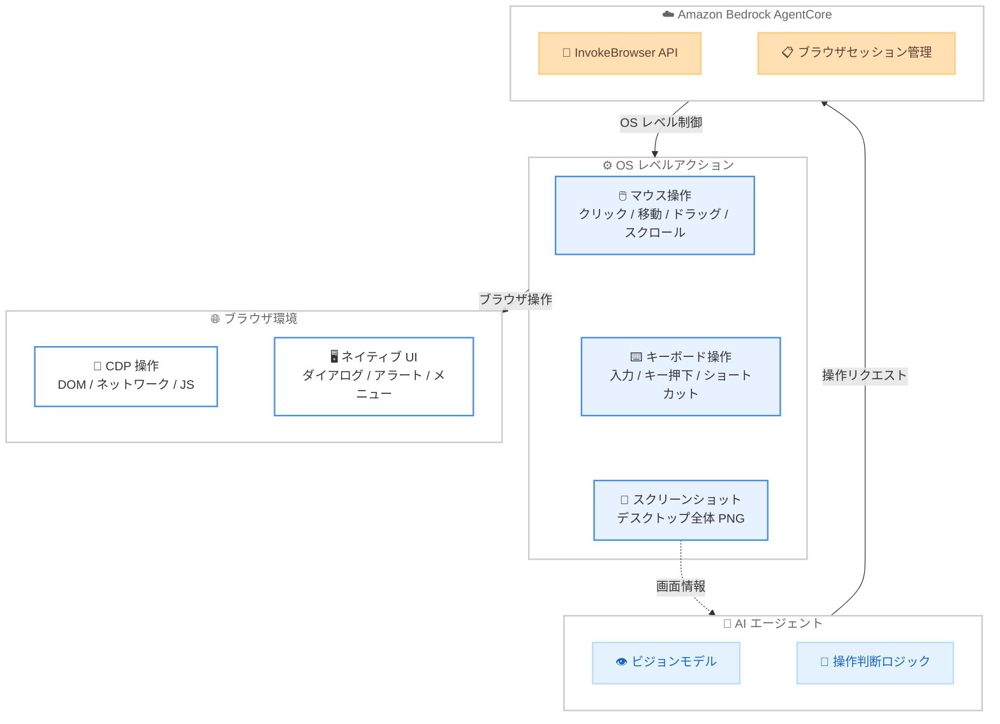

# Amazon Bedrock AgentCore Browser - OS レベルインタラクション機能の追加

**リリース日**: 2026 年 4 月 8 日
**サービス**: Amazon Bedrock AgentCore
**機能**: AgentCore Browser OS-level Interaction Capabilities

📊 [このアップデートのインフォグラフィックを見る](https://takech9203.github.io/aws-news-summary/20260408-agentcore-browser-os-actions.html)

## 概要

Amazon Bedrock AgentCore Browser に OS レベルのインタラクション機能が追加されました。これにより、Chrome DevTools Protocol (CDP) だけでは対応できなかったブラウザワークフローの自動化が可能になります。マウス操作、キーボード操作、デスクトップ全体のスクリーンショット取得など、OS レベルの座標系を活用した操作を API 経由で実行できます。

この機能強化は、印刷ダイアログやネイティブシステムアラート、右クリックメニューなど、CDP の制御範囲外にある UI 要素の操作が必要な自動化シナリオに対応します。新しい `InvokeBrowser` API を通じて、ブラウザビューポートを超えた OS レベルの座標での操作が可能になり、ビジョンベースの AI エージェントがブラウザ環境全体を把握しながら操作を実行できます。

主な対象ユーザーは、ブラウザ自動化テストの構築者、ドキュメント管理ワークフローの開発者、そしてビジョンベースの AI エージェントを構築する開発者です。

**アップデート前の課題**

- CDP のみでは印刷ダイアログ、ネイティブシステムアラート、ファイル選択ダイアログなど OS レベルの UI 要素を操作できなかった
- ブラウザビューポート外の要素に対するインタラクションが制限されていた
- 右クリックメニューやキーボードショートカット (Ctrl+A、Ctrl+P など) を含む複雑な UI 操作の自動化が困難だった

**アップデート後の改善**

- OS レベルの座標系でマウス操作 (クリック、移動、ドラッグ、スクロール) が可能になった
- キーボード操作 (テキスト入力、キー押下、ショートカット) を API 経由で実行できるようになった
- デスクトップ全体のスクリーンショットを取得でき、ビジョンベース AI エージェントがブラウザ環境全体を視覚的に把握可能になった

## アーキテクチャ図



AI エージェントが InvokeBrowser API を通じて OS レベルのアクションを実行し、スクリーンショットで画面状態を取得するフローを示しています。CDP では対応できないネイティブ UI 要素も OS レベル操作で制御可能です。

## サービスアップデートの詳細

### 主要機能

1. **マウス操作**
   - クリック操作: 左 / 右 / 中ボタン対応、クリック回数指定可能 (ダブルクリックなど)
   - マウス移動: 指定座標への移動
   - ドラッグ操作: 開始座標から終了座標へのドラッグ、ボタン種別指定可能
   - スクロール操作: 指定座標での水平 / 垂直スクロール (deltaX / deltaY)

2. **キーボード操作**
   - テキスト入力 (keyType): 文字列を直接入力
   - キー押下 (keyPress): 特定キーの押下、回数指定可能
   - キーボードショートカット (keyShortcut): Ctrl+A、Ctrl+P などの複合キー操作

3. **スクリーンショット取得**
   - デスクトップ全体の PNG 形式スクリーンショットを取得
   - ブラウザビューポートを超えた OS レベル座標での画面キャプチャ
   - ビジョンベース AI エージェントの画面認識に活用可能

## 技術仕様

### InvokeBrowser API

| 項目 | 詳細 |
|------|------|
| API 名 | `InvokeBrowser` |
| 必須パラメータ | `browserIdentifier`、`sessionId`、`action` |
| マウスボタン種別 | `LEFT`、`RIGHT`、`MIDDLE` |
| スクリーンショット形式 | `PNG` |
| レスポンス | 各アクションの `status` (`SUCCESS` / `FAILED`) とエラー情報 |

### API 変更履歴

| 日付 | サービス | 変更内容 |
|------|----------|----------|
| 2026/04/07 | [Amazon Bedrock AgentCore](https://awsapichanges.com/archive/changes/0db175-bedrock-agentcore.html) | 1 new api method - InvokeBrowser API 追加。OS レベルのマウス / キーボード操作およびスクリーンショット取得に対応 |

### API リクエスト例

```python
import boto3

client = boto3.client('bedrock-agentcore')

# マウスクリック操作
response = client.invoke_browser(
    browserIdentifier='my-browser',
    sessionId='session-123',
    action={
        'mouseClick': {
            'x': 500,
            'y': 300,
            'button': 'LEFT',
            'clickCount': 1
        }
    }
)

# キーボードショートカット操作
response = client.invoke_browser(
    browserIdentifier='my-browser',
    sessionId='session-123',
    action={
        'keyShortcut': {
            'keys': ['ctrl', 'p']
        }
    }
)

# スクリーンショット取得
response = client.invoke_browser(
    browserIdentifier='my-browser',
    sessionId='session-123',
    action={
        'screenshot': {
            'format': 'PNG'
        }
    }
)
screenshot_data = response['result']['screenshot']['data']
```

## 設定方法

### 前提条件

1. AWS アカウントで Amazon Bedrock AgentCore が有効化されていること
2. AgentCore Browser のブラウザセッションが作成済みであること
3. 適切な IAM ポリシーで `bedrock-agentcore:InvokeBrowser` アクションが許可されていること

### 手順

#### ステップ 1: IAM ポリシーの設定

```json
{
    "Version": "2012-10-17",
    "Statement": [
        {
            "Effect": "Allow",
            "Action": [
                "bedrock-agentcore:InvokeBrowser",
                "bedrock-agentcore:CreateSession",
                "bedrock-agentcore:ListSessions"
            ],
            "Resource": "*"
        }
    ]
}
```

InvokeBrowser API の実行に必要な IAM ポリシーを設定します。本番環境では Resource を特定のブラウザ ARN に制限することを推奨します。

#### ステップ 2: ブラウザセッションの作成と OS レベル操作の実行

```python
import boto3

client = boto3.client('bedrock-agentcore')

# スクリーンショットで画面状態を確認
screenshot_response = client.invoke_browser(
    browserIdentifier='my-browser',
    sessionId='session-123',
    action={
        'screenshot': {
            'format': 'PNG'
        }
    }
)

# 取得した画面情報を基にマウス操作を実行
click_response = client.invoke_browser(
    browserIdentifier='my-browser',
    sessionId='session-123',
    action={
        'mouseClick': {
            'x': 250,
            'y': 150,
            'button': 'LEFT',
            'clickCount': 1
        }
    }
)

# 操作結果のステータス確認
status = click_response['result']['mouseClick']['status']
print(f"Click status: {status}")
```

スクリーンショットで画面状態を確認した後、座標を指定してマウス操作を実行します。各操作のレスポンスで `SUCCESS` または `FAILED` のステータスが返されます。

## メリット

### ビジネス面

- **ブラウザ自動化の範囲拡大**: CDP だけでは対応できなかったネイティブダイアログやシステムアラートの操作が自動化可能になり、E2E テストのカバレッジが向上する
- **ドキュメント管理の効率化**: 印刷ダイアログの操作やファイルのダウンロード / アップロードなど、OS レベルの操作を含むワークフローを完全自動化できる
- **AI エージェントの実用性向上**: ビジョンベース AI エージェントがブラウザ環境全体を把握して操作できるため、より実用的な業務自動化が実現する

### 技術面

- **CDP の制約を解消**: ブラウザビューポート外やネイティブ UI 要素への操作が可能になり、自動化の技術的制約が大幅に緩和される
- **統合 API 設計**: マウス / キーボード / スクリーンショットの全操作が単一の `InvokeBrowser` API に統合されており、実装がシンプルになる
- **エラーハンドリング**: 各操作に対して個別の成功 / 失敗ステータスとエラー情報が返されるため、堅牢な自動化スクリプトを構築しやすい

## デメリット・制約事項

### 制限事項

- スクリーンショット形式は現時点で PNG のみ対応
- OS レベル操作のため、座標指定が必要であり、画面解像度やレイアウト変更の影響を受ける可能性がある
- 空のセッションは 1 日後に自動削除される

### 考慮すべき点

- OS レベルの座標系はブラウザのズームレベルや DPI 設定に依存するため、環境間での座標の一貫性に注意が必要
- ビジョンベース AI エージェントと組み合わせる場合、スクリーンショットの取得とアクション実行の間に画面状態が変化する可能性がある
- CDP ベースの操作と OS レベル操作を適切に使い分ける設計が重要

## ユースケース

### ユースケース 1: システムダイアログを含む自動テスト

**シナリオ**: Web アプリケーションの E2E テストにおいて、ファイルアップロードダイアログやブラウザの印刷ダイアログなど、CDP では操作できないネイティブダイアログの操作を自動化する。

**実装例**:
```python
# 印刷ボタンをクリック
client.invoke_browser(
    browserIdentifier='browser-1',
    sessionId='test-session',
    action={
        'mouseClick': {'x': 800, 'y': 50, 'button': 'LEFT', 'clickCount': 1}
    }
)

# Ctrl+P で印刷ダイアログを表示
client.invoke_browser(
    browserIdentifier='browser-1',
    sessionId='test-session',
    action={
        'keyShortcut': {'keys': ['ctrl', 'p']}
    }
)

# 印刷ダイアログの OK ボタンをクリック
client.invoke_browser(
    browserIdentifier='browser-1',
    sessionId='test-session',
    action={
        'keyPress': {'key': 'Enter', 'presses': 1}
    }
)
```

**効果**: ネイティブダイアログを含む完全な E2E テストの自動化が実現し、テストカバレッジが向上する。

### ユースケース 2: ドキュメント管理ワークフロー

**シナリオ**: Web ベースのドキュメント管理システムから、印刷やファイルダウンロードなどの OS レベル操作を含むドキュメント処理ワークフローを自動化する。

**実装例**:
```python
# ドキュメントを選択 (Ctrl+A)
client.invoke_browser(
    browserIdentifier='browser-1',
    sessionId='doc-session',
    action={
        'keyShortcut': {'keys': ['ctrl', 'a']}
    }
)

# 右クリックメニューを表示
client.invoke_browser(
    browserIdentifier='browser-1',
    sessionId='doc-session',
    action={
        'mouseClick': {'x': 400, 'y': 300, 'button': 'RIGHT', 'clickCount': 1}
    }
)

# メニュー項目をクリック
client.invoke_browser(
    browserIdentifier='browser-1',
    sessionId='doc-session',
    action={
        'mouseClick': {'x': 450, 'y': 350, 'button': 'LEFT', 'clickCount': 1}
    }
)
```

**効果**: 手動で行っていたドキュメント管理操作を完全に自動化し、処理時間の短縮と人的ミスの削減が実現する。

### ユースケース 3: ビジョンベース AI エージェント

**シナリオ**: AI モデルがスクリーンショットを解析して画面の状態を理解し、適切な操作を自律的に判断・実行するインテリジェントな自動化エージェントを構築する。

**実装例**:
```python
import base64

# 画面の現在の状態を取得
screenshot = client.invoke_browser(
    browserIdentifier='browser-1',
    sessionId='agent-session',
    action={
        'screenshot': {'format': 'PNG'}
    }
)

# スクリーンショットをビジョンモデルに送信して操作を判断
image_data = base64.b64encode(
    screenshot['result']['screenshot']['data']
).decode('utf-8')

# ビジョンモデルの判断結果に基づいて操作を実行
# 例: モデルが「座標 (320, 480) のボタンをクリック」と判断
client.invoke_browser(
    browserIdentifier='browser-1',
    sessionId='agent-session',
    action={
        'mouseClick': {'x': 320, 'y': 480, 'button': 'LEFT', 'clickCount': 1}
    }
)
```

**効果**: 固定的なスクリプトではなく、画面の状態に応じて適応的に操作を判断する AI エージェントにより、動的な UI 変更にも対応可能な堅牢な自動化が実現する。

## 料金

AgentCore Browser の料金は、ブラウザセッションの利用時間に基づく従量課金制です。OS レベルインタラクション機能は AgentCore Browser の既存料金に含まれており、追加料金は発生しません。

### 料金例

| 使用量 | 月額料金 (概算) |
|--------|------------------|
| セッション利用時間による | AgentCore Browser の標準料金に準拠 |

詳細な料金情報は [Amazon Bedrock AgentCore の料金ページ](https://aws.amazon.com/bedrock/agentcore/pricing/)を参照してください。

## 利用可能リージョン

以下の 14 リージョンで利用可能です。

| リージョン | リージョンコード |
|------------|------------------|
| 米国東部 (バージニア北部) | us-east-1 |
| 米国東部 (オハイオ) | us-east-2 |
| 米国西部 (オレゴン) | us-west-2 |
| 欧州 (フランクフルト) | eu-central-1 |
| 欧州 (アイルランド) | eu-west-1 |
| 欧州 (ロンドン) | eu-west-2 |
| 欧州 (パリ) | eu-west-3 |
| 欧州 (ストックホルム) | eu-north-1 |
| アジアパシフィック (ムンバイ) | ap-south-1 |
| アジアパシフィック (シンガポール) | ap-southeast-1 |
| アジアパシフィック (シドニー) | ap-southeast-2 |
| アジアパシフィック (東京) | ap-northeast-1 |
| アジアパシフィック (ソウル) | ap-northeast-2 |
| カナダ (中部) | ca-central-1 |

## 関連サービス・機能

- **Amazon Bedrock AgentCore**: AI エージェントの構築・デプロイ・管理を行うフルマネージドサービス。AgentCore Browser はその構成要素の 1 つ
- **Amazon Bedrock**: 基盤モデルへのアクセスを提供するサービス。ビジョンベース AI エージェントの推論エンジンとして連携
- **Chrome DevTools Protocol**: ブラウザの DOM 操作やネットワーク制御に使用される標準プロトコル。OS レベル操作と組み合わせて使用

## 参考リンク

- 📊 [インフォグラフィック](https://takech9203.github.io/aws-news-summary/20260408-agentcore-browser-os-actions.html)
- [公式発表 (What's New)](https://aws.amazon.com/about-aws/whats-new/2026/04/agentcore-browser-os-actions/)
- [AWS API Changes - InvokeBrowser API](https://awsapichanges.com/archive/changes/0db175-bedrock-agentcore.html)
- [Amazon Bedrock AgentCore ドキュメント](https://docs.aws.amazon.com/bedrock/latest/userguide/agentcore.html)
- [料金ページ](https://aws.amazon.com/bedrock/agentcore/pricing/)

## まとめ

Amazon Bedrock AgentCore Browser への OS レベルインタラクション機能の追加は、ブラウザ自動化の範囲を大幅に拡張する重要なアップデートです。CDP の制約を超えて、ネイティブダイアログやシステムアラートの操作が可能になることで、E2E テストやドキュメント管理ワークフロー、ビジョンベース AI エージェントなど、幅広いユースケースに対応できます。14 リージョンで即座に利用可能であり、既存の AgentCore Browser ユーザーは追加設定なしで新機能を活用できます。
