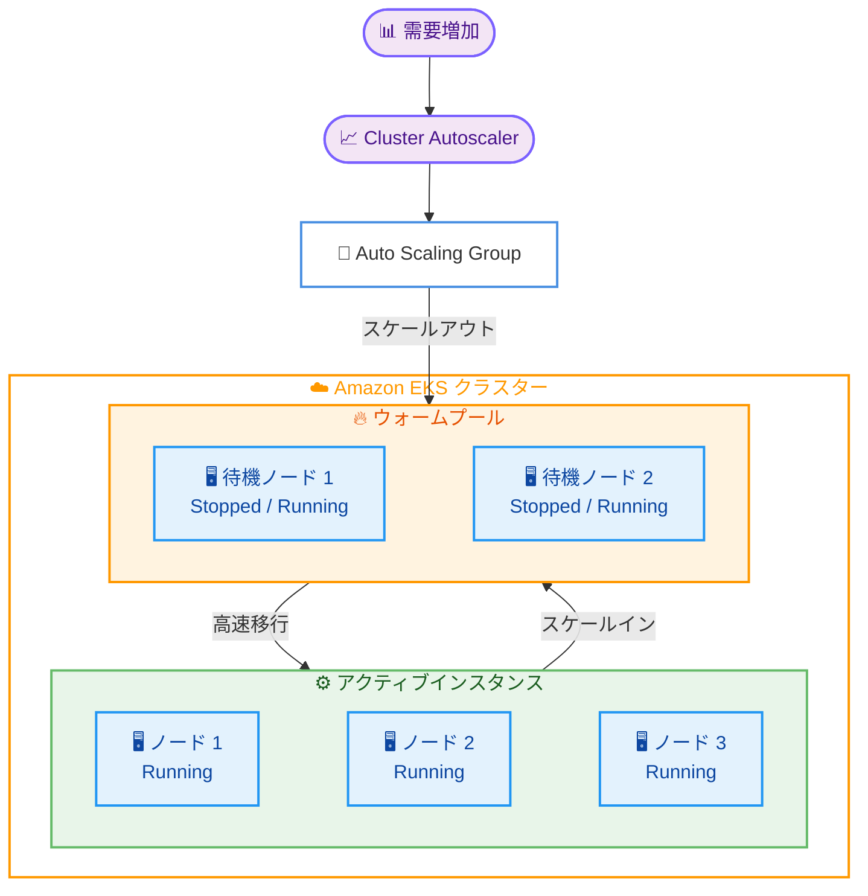

# Amazon EKS - マネージドノードグループの EC2 Auto Scaling ウォームプールサポート

**リリース日**: 2026 年 04 月 08 日
**サービス**: Amazon EKS (Elastic Kubernetes Service)
**機能**: マネージドノードグループの EC2 Auto Scaling ウォームプール

:bar_chart: [このアップデートのインフォグラフィックを見る](https://takech9203.github.io/aws-news-summary/20260408-amazon-eks-managed-node-groups-ec2-warm-pools.html)

## 概要

Amazon EKS マネージドノードグループが EC2 Auto Scaling ウォームプールをサポートしました。ウォームプールとは、事前に初期化された EC2 インスタンスを待機状態で保持する仕組みで、スケールアウト時のノードプロビジョニングレイテンシーを大幅に短縮できます。

この機能は、バーストトラフィックパターンを持つアプリケーション、時間に敏感なワークロード、複雑な初期化スクリプトやソフトウェア依存関係によりインスタンスの起動に時間がかかる環境に最適です。ウォームプールを有効にすると、OS の初期化、ユーザーデータの実行、ソフトウェアの設定が完了済みのインスタンスがプールに保持され、需要増加時にコールドスタートシーケンスを繰り返すことなく即座にアクティブサービスに移行します。

**アップデート前の課題**

- マネージドノードグループのスケールアウト時に、新しいインスタンスの起動から OS 初期化、ユーザーデータ実行、ソフトウェア設定まで全てのステップを実行する必要があり、ノード追加に数分以上かかることがあった
- バーストトラフィックに対応するため、常に余剰キャパシティを Running 状態で保持する必要がありコストが増大していた
- 複雑な初期化処理を持つワークロードでは、スケールアウトのレイテンシーが特に大きな問題となっていた

**アップデート後の改善**

- 事前初期化済みのインスタンスをウォームプールに保持することで、スケールアウト時のレイテンシーを大幅に短縮
- Stopped 状態でインスタンスを保持することで、Running 状態より低コストでウォームキャパシティを維持可能
- Cluster Autoscaler との連携が追加設定なしで動作し、既存のスケーリングワークフローにシームレスに統合

## アーキテクチャ図



この図は、EKS マネージドノードグループにおけるウォームプールの動作を示しています。需要増加時に Cluster Autoscaler が Auto Scaling Group にスケールアウトを要求すると、ウォームプール内の事前初期化済みインスタンスがアクティブインスタンスに高速移行します。

## サービスアップデートの詳細

### 主要機能

1. **ウォームプールによる事前初期化**
   - OS の初期化、ユーザーデータの実行、ソフトウェアの設定が完了済みのインスタンスをプールに保持
   - 需要増加時にコールドスタートシーケンスをスキップして高速にスケールアウト
   - プロビジョニングレイテンシーを大幅に短縮

2. **インスタンス状態の選択**
   - **Stopped**: インスタンスを停止状態で保持。コストが低いが、アクティブへの移行に時間がかかる
   - **Running**: インスタンスを実行状態で保持。コストは高いが、移行が最速

3. **スケールイン時の再利用**
   - スケールイン時にインスタンスを終了せずウォームプールに戻す再利用ポリシーを設定可能
   - インスタンスの再初期化コストを削減

4. **Cluster Autoscaler との統合**
   - 追加設定なしで Cluster Autoscaler と連携
   - 既存のスケーリングポリシーやメトリクスをそのまま利用可能

## 技術仕様

### ウォームプール設定オプション

| 項目 | 詳細 |
|------|------|
| インスタンス状態 | Stopped (低コスト、移行に時間がかかる) または Running (高コスト、高速移行) |
| 再利用ポリシー | スケールイン時にインスタンスをウォームプールに戻すかどうかを設定可能 |
| プールサイズ | Auto Scaling Group の設定に基づいてウォームプールのサイズを制御 |
| Cluster Autoscaler 連携 | 追加設定不要 |
| 対応ツール | EKS API、AWS CLI、EKS コンソール、CloudFormation |

### API 変更履歴

本アップデートに関連する API 変更は、調査時点では AWS API Changes フィードに記録されていませんでした。今後、EKS API に `WarmPoolConfiguration` 関連のパラメータが追加される可能性があります。

### ウォームプール設定例

```json
{
  "nodegroupName": "my-nodegroup",
  "scalingConfig": {
    "minSize": 2,
    "maxSize": 10,
    "desiredSize": 3
  },
  "warmPoolConfig": {
    "poolState": "Stopped",
    "maxGroupPreparedCapacity": 3,
    "instanceReusePolicy": {
      "reuseOnScaleIn": true
    }
  }
}
```

## 設定方法

### 前提条件

1. Amazon EKS クラスターが作成済みであること
2. マネージドノードグループが設定済みであること
3. AWS CLI v2 または EKS コンソールにアクセスできること

### 手順

#### ステップ 1: 既存のノードグループにウォームプールを有効化

```bash
# AWS CLI を使用してマネージドノードグループにウォームプールを設定
aws eks update-nodegroup-config \
    --cluster-name my-cluster \
    --nodegroup-name my-nodegroup \
    --scaling-config minSize=2,maxSize=10,desiredSize=3 \
    --region us-west-2
```

EKS コンソールまたは AWS CLI を使用して、既存のマネージドノードグループにウォームプールを有効化します。具体的なパラメータについては、最新の EKS ドキュメントを参照してください。

#### ステップ 2: ウォームプールの状態を確認

```bash
# ノードグループの詳細を確認
aws eks describe-nodegroup \
    --cluster-name my-cluster \
    --nodegroup-name my-nodegroup \
    --region us-west-2
```

このコマンドで、ノードグループの設定とウォームプールの状態を確認できます。

#### ステップ 3: CloudFormation テンプレートでの設定

```yaml
Resources:
  EKSNodeGroup:
    Type: AWS::EKS::Nodegroup
    Properties:
      ClusterName: my-cluster
      NodegroupName: my-nodegroup
      ScalingConfig:
        MinSize: 2
        MaxSize: 10
        DesiredSize: 3
      # ウォームプール設定は EKS ドキュメントの最新仕様を参照
```

CloudFormation を使用してインフラストラクチャをコードとして管理する場合、テンプレートにウォームプールの設定を含めることができます。

## メリット

### ビジネス面

- **応答時間の改善**: バーストトラフィック時のスケールアウトレイテンシーを短縮し、エンドユーザー体験を向上
- **コスト最適化**: Stopped 状態のインスタンスを使用することで、常時 Running で待機させるより低コストでウォームキャパシティを維持
- **運用の簡素化**: Cluster Autoscaler との自動連携により、追加の運用負荷なしでウォームプールを活用

### 技術面

- **プロビジョニングレイテンシーの削減**: 事前初期化済みインスタンスにより、コールドスタートの待ち時間を排除
- **柔軟な状態管理**: Stopped と Running の 2 つの状態から、コストとレイテンシーのバランスに応じて選択可能
- **スケールイン時の再利用**: インスタンスの再初期化を回避し、リソースの効率的な循環を実現

## デメリット・制約事項

### 制限事項

- ウォームプール内のインスタンスにも EC2 の料金が発生する (Stopped 状態でも EBS ボリューム料金が発生)
- 中国リージョンでは利用不可
- ウォームプールのサイズ管理を適切に行わないと、不要なコストが発生する可能性がある

### 考慮すべき点

- Stopped 状態から Running 状態への移行には、インスタンスの再起動時間がかかるため、完全にゼロレイテンシーではない
- ウォームプールのサイズは、予想されるバーストトラフィックの規模に基づいて適切に設定する必要がある
- Running 状態でウォームプールを維持すると、通常の EC2 インスタンス料金が発生するため、コストメリットを慎重に評価する必要がある

## ユースケース

### ユースケース 1: E コマースのフラッシュセール対応

**シナリオ**: E コマースサイトで定期的にフラッシュセールを実施しており、セール開始時に急激なトラフィック増加が発生する。通常のスケールアウトでは新しいノードのプロビジョニングに数分かかり、セール開始直後にリクエストが処理しきれない。

**実装例**:
```bash
# フラッシュセール用のノードグループにウォームプールを設定
# Stopped 状態で 5 台の事前初期化済みインスタンスを保持
aws eks update-nodegroup-config \
    --cluster-name ecommerce-cluster \
    --nodegroup-name flash-sale-nodes \
    --region ap-northeast-1
```

**効果**: セール開始時に事前初期化済みのインスタンスが即座にアクティブになり、コールドスタートによるレイテンシーを排除してスムーズなスケールアウトを実現。

### ユースケース 2: バッチ処理ワークロードの高速起動

**シナリオ**: 機械学習のトレーニングジョブを定期的に実行しており、GPU インスタンスの初期化に CUDA ドライバやライブラリのインストールが必要で、コールドスタートに 10 分以上かかる。

**実装例**:
```bash
# GPU ノードグループにウォームプールを設定
# Running 状態で最速の移行を実現
aws eks update-nodegroup-config \
    --cluster-name ml-cluster \
    --nodegroup-name gpu-nodes \
    --region us-east-1
```

**効果**: 事前に CUDA 環境が構築済みのインスタンスがウォームプールに待機しているため、トレーニングジョブの開始待ち時間を大幅に短縮。

### ユースケース 3: 営業時間に連動したスケーリング

**シナリオ**: SaaS アプリケーションで、営業時間帯にトラフィックが増加し、夜間は低下するパターンがある。毎朝のスケールアウト時に複雑な初期化処理が必要で、ユーザーの業務開始時に遅延が発生する。

**実装例**:
```bash
# スケールイン時にインスタンスを再利用する設定で
# 夜間にスケールインしたインスタンスをウォームプールに保持
aws eks update-nodegroup-config \
    --cluster-name saas-cluster \
    --nodegroup-name app-nodes \
    --region eu-west-1
```

**効果**: 夜間のスケールイン時にインスタンスをウォームプールに戻し、翌朝のスケールアウト時に再利用することで、毎日の初期化コストを削減し、業務開始時の遅延を解消。

## 料金

ウォームプール機能自体に追加料金はかかりませんが、ウォームプール内のインスタンスに対して以下の料金が発生します。

### 料金例

| インスタンス状態 | 月額料金 (概算) |
|------------------|-----------------|
| Stopped 状態 (m5.xlarge x 3 台、各 50GB EBS) | EBS ボリューム料金のみ: 約 $15/月 |
| Running 状態 (m5.xlarge x 3 台) | 通常の EC2 料金: 約 $420/月 |
| アクティブインスタンス (m5.xlarge x 5 台) | 通常の EC2 + EKS 料金 |

- **EKS コントロールプレーン**: クラスターあたり $0.10/時間
- **Stopped インスタンス**: EBS ボリュームの料金のみ (インスタンス料金は停止中は非課金)
- **Running インスタンス**: 通常の EC2 インスタンス料金が適用

詳細な料金情報については、[Amazon EKS 料金ページ](https://aws.amazon.com/eks/pricing/)および [Amazon EC2 料金ページ](https://aws.amazon.com/ec2/pricing/)を参照してください。

## 利用可能リージョン

Amazon EKS が利用可能な全ての AWS リージョンで提供されています。ただし、中国リージョンは除きます。

## 関連サービス・機能

- **EC2 Auto Scaling ウォームプール**: EKS マネージドノードグループの基盤となるウォームプール機能
- **Cluster Autoscaler**: Kubernetes のスケーリングコンポーネント。ウォームプールと追加設定なしで連携
- **Karpenter**: Kubernetes ノードのプロビジョニングを自動化するオープンソースツール。ウォームプールとは異なるアプローチでスケーリングを最適化
- **Amazon EKS マネージドノードグループ**: ウォームプールが統合される EKS のノード管理機能

## 参考リンク

- :bar_chart: [インフォグラフィック](https://takech9203.github.io/aws-news-summary/20260408-amazon-eks-managed-node-groups-ec2-warm-pools.html)
- [公式発表 (What's New)](https://aws.amazon.com/about-aws/whats-new/2026/04/amazon-eks-managed-node-groups-ec2-warm-pools/)
- [Amazon EKS マネージドノードグループ ドキュメント](https://docs.aws.amazon.com/eks/latest/userguide/managed-node-groups.html)
- [EC2 Auto Scaling ウォームプール ドキュメント](https://docs.aws.amazon.com/autoscaling/ec2/userguide/ec2-auto-scaling-warm-pools.html)
- [Amazon EKS 料金ページ](https://aws.amazon.com/eks/pricing/)

## まとめ

Amazon EKS マネージドノードグループの EC2 Auto Scaling ウォームプールサポートにより、事前初期化済みのインスタンスを保持してスケールアウト時のレイテンシーを大幅に短縮できるようになりました。Stopped と Running の 2 つの状態から選択でき、コストとパフォーマンスのバランスに応じた柔軟な運用が可能です。バーストトラフィック、複雑な初期化処理、時間に敏感なワークロードを持つ環境では、ウォームプールの導入を検討してください。
