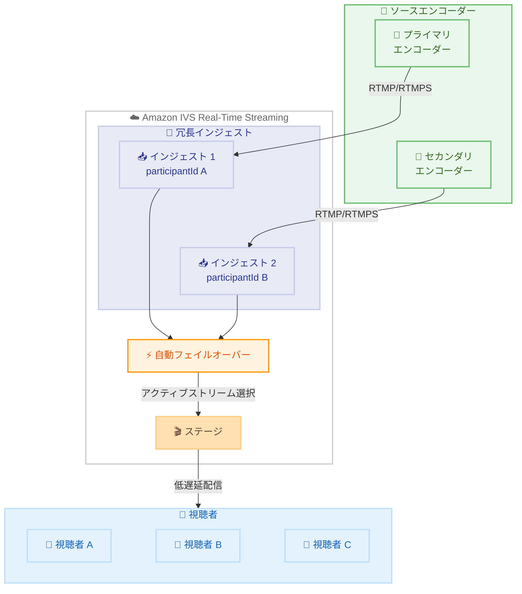

# Amazon IVS Real-Time Streaming - 冗長インジェスト

**リリース日**: 2026 年 04 月 08 日
**サービス**: Amazon Interactive Video Service (Amazon IVS)
**機能**: Redundant Ingest for Real-Time Streaming

📊 [このアップデートのインフォグラフィックを見る](https://takech9203.github.io/aws-news-summary/20260408-amazon-ivs-real-time-streaming-redundant-ingest.html)

## 概要

Amazon Interactive Video Service (Amazon IVS) Real-Time Streaming に冗長インジェスト機能が追加されました。この機能により、2 台のエンコーダーから同時にストリーミングを送信し、単一のステージに対して自動フェイルオーバーを実現できます。ソースエンコーダーの障害やファーストマイルネットワークの問題が発生しても、視聴者への配信を中断なく継続できます。

冗長インジェストは、ライブイベント、24 時間 365 日のライブストリーム、途切れない配信が不可欠なあらゆるシナリオに最適です。予期しない中断が発生した場合でも視聴者エンゲージメントを維持し、継続的なストリーミングを可能にします。

Amazon IVS は、低遅延またはリアルタイムの動画を世界中の視聴者に提供するために設計されたマネージドライブストリーミングソリューションです。

**アップデート前の課題**

- エンコーダーの障害やネットワーク問題が発生した場合、ライブストリームが中断されていた
- 単一エンコーダーに依存しており、単一障害点 (SPOF) が存在していた
- ファーストマイルネットワーク (エンコーダーから AWS までの経路) の障害に対する耐性がなかった
- 24 時間 365 日の連続配信においてエンコーダー障害時の手動切り替えが必要だった

**アップデート後の改善**

- 2 台のエンコーダーから同時にストリーミングを送信し、自動フェイルオーバーで配信の継続性を確保
- ソースエンコーダー障害時にもう一方のエンコーダーへ自動的に切り替わり、視聴者への影響を最小化
- ファーストマイルネットワーク障害に対する冗長性を確保し、配信の信頼性を向上
- API を通じた冗長インジェストの設定と管理が可能になり、プログラマティックな制御を実現

## アーキテクチャ図



2 台のエンコーダーからそれぞれ独立した RTMP/RTMPS ストリームを Amazon IVS の冗長インジェストに送信し、自動フェイルオーバーによりアクティブなストリームが選択されてステージを通じて視聴者に配信される流れを示しています。

## サービスアップデートの詳細

### 主要機能

1. **冗長インジェスト**
   - 2 台のエンコーダーから単一のステージに同時ストリーミングを送信可能
   - `redundantIngest` パラメータを `True` に設定することで有効化
   - 有効化時に `redundantIngestCredentials` として 2 つの participantId と streamKey のペアが生成

2. **自動フェイルオーバー**
   - プライマリエンコーダーの障害を自動検知し、セカンダリエンコーダーのストリームに切り替え
   - 視聴者側では切り替わりを意識せずにストリームを継続視聴可能
   - ファーストマイルネットワークの問題にも対応

3. **API による管理**
   - `CreateIngestConfiguration` および `UpdateIngestConfiguration` で冗長インジェストの設定が可能
   - `GetIngestConfiguration` で冗長インジェストの状態と認証情報を取得
   - `GetParticipant` および `ListParticipants` で冗長インジェストの状態を参照可能

## 技術仕様

### 冗長インジェストの構成

| 項目 | 詳細 |
|------|------|
| 対応プロトコル | RTMP / RTMPS |
| エンコーダー数 | 最大 2 台の同時ストリーミング |
| フェイルオーバー方式 | 自動 |
| 認証情報 | 2 セットの participantId + streamKey |
| 設定方法 | API (CreateIngestConfiguration / UpdateIngestConfiguration) |
| 対象 | Amazon IVS Real-Time Streaming ステージ |

### API 変更履歴

| 日付 | サービス | 変更内容 |
|------|----------|----------|
| 2026/04/08 | [Amazon Interactive Video Service RealTime](https://awsapichanges.com/archive/changes/d831a0-ivsrealtime.html) | 6 updated api methods - 冗長インジェストサポートの追加 |

### 更新された API メソッド

| メソッド | 変更内容 |
|----------|----------|
| `CreateIngestConfiguration` | リクエストに `redundantIngest` パラメータ追加、レスポンスに `redundantIngestCredentials` 追加 |
| `UpdateIngestConfiguration` | リクエストに `redundantIngest` パラメータ追加、レスポンスに `redundantIngestCredentials` 追加 |
| `GetIngestConfiguration` | レスポンスに `redundantIngest` と `redundantIngestCredentials` 追加 |
| `ListIngestConfigurations` | レスポンスに `redundantIngest` 追加 |
| `GetParticipant` | レスポンスに `redundantIngest` と `ingestConfigurationArn` 追加 |
| `ListParticipants` | レスポンスに `redundantIngest` と `ingestConfigurationArn` 追加 |

### 設定例

```python
import boto3

client = boto3.client('ivs-realtime')

# 冗長インジェストを有効にしたインジェスト設定の作成
response = client.create_ingest_configuration(
    name='my-redundant-ingest',
    stageArn='arn:aws:ivs:us-east-1:123456789012:stage/abcdefgh',
    userId='broadcaster-1',
    ingestProtocol='RTMPS',
    insecureIngest=False,
    redundantIngest=True,
    tags={
        'Environment': 'production'
    }
)

# レスポンスから 2 つの認証情報を取得
ingest_config = response['ingestConfiguration']
print(f"冗長インジェスト有効: {ingest_config['redundantIngest']}")

for i, cred in enumerate(ingest_config['redundantIngestCredentials']):
    print(f"エンコーダー {i+1}:")
    print(f"  participantId: {cred['participantId']}")
    print(f"  streamKey: {cred['streamKey']}")
```

## 設定方法

### 前提条件

1. Amazon IVS Real-Time Streaming のステージが作成済みであること
2. RTMP または RTMPS に対応したエンコーダーが 2 台用意されていること
3. AWS CLI v2 または対応する AWS SDK がインストールされていること

### 手順

#### ステップ 1: 冗長インジェスト設定の作成

```bash
aws ivs-realtime create-ingest-configuration \
  --name "my-redundant-stream" \
  --stage-arn "arn:aws:ivs:us-east-1:123456789012:stage/abcdefgh" \
  --ingest-protocol RTMPS \
  --redundant-ingest
```

冗長インジェストを有効にしたインジェスト設定を作成します。レスポンスに含まれる `redundantIngestCredentials` から 2 つのエンコーダー用の認証情報を取得します。

#### ステップ 2: エンコーダーの設定

レスポンスから取得した 2 つの `participantId` と `streamKey` のペアを、それぞれのエンコーダーに設定します。

```bash
# エンコーダー 1 の設定情報を確認
aws ivs-realtime get-ingest-configuration \
  --arn "arn:aws:ivs:us-east-1:123456789012:ingest-configuration/abcdefgh"
```

各エンコーダーに対して、取得した認証情報を使用して RTMP/RTMPS のストリーミング先を設定します。2 台のエンコーダーは同じコンテンツを同時に送信するよう構成してください。

#### ステップ 3: ストリーミングの開始と確認

```bash
# 参加者の状態を確認
aws ivs-realtime list-participants \
  --stage-arn "arn:aws:ivs:us-east-1:123456789012:stage/abcdefgh" \
  --session-id "session-id"
```

両方のエンコーダーからストリーミングを開始し、参加者の一覧で `redundantIngest` が `True` になっていることを確認します。2 つのストリームが正常にインジェストされていれば、自動フェイルオーバーが有効な状態です。

#### ステップ 4: 既存設定の更新

```bash
# 既存のインジェスト設定に冗長インジェストを追加
aws ivs-realtime update-ingest-configuration \
  --arn "arn:aws:ivs:us-east-1:123456789012:ingest-configuration/abcdefgh" \
  --redundant-ingest
```

既存のインジェスト設定に対して冗長インジェストを有効化する場合は、`UpdateIngestConfiguration` API を使用します。

## メリット

### ビジネス面

- **視聴者エンゲージメントの維持**: ストリーム中断による視聴者の離脱を防止し、広告収入やイベント視聴率を保護
- **サービス品質の向上**: 24 時間 365 日の連続配信でもダウンタイムのリスクを大幅に低減し、SLA の改善に貢献
- **ブランド信頼性の強化**: ライブイベントでの配信障害を防止し、プロフェッショナルな配信体験を提供

### 技術面

- **単一障害点の排除**: エンコーダーとファーストマイルネットワークの冗長化により、SPOF を解消
- **自動フェイルオーバー**: 障害検知と切り替えが自動化されており、運用者の手動介入が不要
- **API による統合管理**: プログラマティックに冗長インジェストの設定・監視が可能であり、既存のワークフローに組み込みやすい

## デメリット・制約事項

### 制限事項

- エンコーダー数は最大 2 台までであり、3 台以上の冗長化は対応していない
- RTMP / RTMPS プロトコルのみ対応しており、WHIP などの他のプロトコルでは利用不可
- 2 台のエンコーダーが同一のコンテンツを送信する必要があるため、エンコーダー側の同期設定が必要

### 考慮すべき点

- 冗長インジェストにより 2 つのストリームを送信するため、帯域幅の使用量が増加する
- 2 台のエンコーダーの設置・管理コストが追加で発生する
- 冗長インジェスト用の 2 つの認証情報の安全な管理が必要

## ユースケース

### ユースケース 1: 大規模ライブイベントの配信

**シナリオ**: スポーツ中継や音楽ライブなどの大規模イベントで、数万人規模の視聴者に途切れない配信を提供する必要がある

**実装例**:
```python
# 大規模イベント用の冗長インジェスト設定
response = client.create_ingest_configuration(
    name='live-event-2026',
    stageArn='arn:aws:ivs:us-east-1:123456789012:stage/event-stage',
    userId='main-broadcaster',
    ingestProtocol='RTMPS',
    redundantIngest=True,
    tags={
        'Event': 'live-concert-2026',
        'Priority': 'critical'
    }
)
```

**効果**: プライマリエンコーダーやネットワーク経路に障害が発生しても、セカンダリエンコーダーに自動切り替えされ、視聴者は中断を意識せずに視聴を継続できる

### ユースケース 2: 24 時間 365 日ニュースチャンネル

**シナリオ**: ニュースチャンネルが 24 時間 365 日のライブストリームを運用しており、エンコーダーのメンテナンスや障害時にもストリームを維持する必要がある

**実装例**:
```python
# 24/7 ストリーム用の冗長インジェスト設定
response = client.create_ingest_configuration(
    name='news-24-7-stream',
    stageArn='arn:aws:ivs:us-west-2:123456789012:stage/news-stage',
    userId='news-broadcast',
    ingestProtocol='RTMPS',
    redundantIngest=True,
    tags={
        'Channel': 'news-24-7',
        'Type': 'continuous'
    }
)
```

**効果**: エンコーダーの計画メンテナンス時にも配信を中断せず、セカンダリエンコーダーで配信を継続できるため、視聴者に影響のないメンテナンスが可能になる

### ユースケース 3: EC サイトのライブコマース配信

**シナリオ**: EC サイトがライブコマースイベントを開催し、配信中の商品販売に直接影響するため、ストリームの中断が売上損失に直結する

**実装例**:
```python
# ライブコマース用の冗長インジェスト設定
response = client.create_ingest_configuration(
    name='live-commerce-spring-sale',
    stageArn='arn:aws:ivs:ap-northeast-1:123456789012:stage/commerce-stage',
    userId='commerce-host',
    ingestProtocol='RTMPS',
    redundantIngest=True,
    tags={
        'Campaign': 'spring-sale-2026',
        'BusinessCritical': 'true'
    }
)
```

**効果**: ライブコマース配信中のストリーム中断を防止し、視聴者の離脱と売上損失のリスクを最小化。商品の購入機会を逃さない安定した配信環境を実現

## 料金

冗長インジェスト機能自体の追加料金についてはアナウンスに明記されていません。Amazon IVS Real-Time Streaming の料金は、ストリーミング時間と視聴者数に基づいて課金されます。冗長インジェストでは 2 つのストリームを同時に送信するため、インジェスト側の料金に影響がある可能性があります。

### 料金例

| 項目 | 料金 (us-east-1) |
|------|------------------|
| Real-Time Streaming ステージ | 配信時間と参加者数に基づく従量課金 |
| 動画入力 (SD) | $0.0080 / 分 |
| 動画入力 (HD) | $0.0160 / 分 |
| 動画出力 (SD) | $0.0080 / 分 |
| 動画出力 (HD) | $0.0160 / 分 |

最新の料金は [Amazon IVS の料金ページ](https://aws.amazon.com/ivs/pricing/)を確認してください。

## 利用可能リージョン

Amazon IVS Real-Time Streaming が利用可能な全リージョンで冗長インジェストをサポートしています。利用可能なリージョンの一覧は [AWS リージョンテーブル](https://aws.amazon.com/about-aws/global-infrastructure/regional-product-services/)で確認してください。

Amazon IVS Real-Time Streaming の主要な対応リージョンは以下の通りです。

- 米国東部 (バージニア北部): us-east-1
- 米国西部 (オレゴン): us-west-2
- アジアパシフィック (ソウル): ap-northeast-2
- アジアパシフィック (東京): ap-northeast-1
- アジアパシフィック (ムンバイ): ap-south-1
- 欧州 (フランクフルト): eu-central-1
- 欧州 (アイルランド): eu-west-1

## 関連サービス・機能

- **Amazon IVS Low-Latency Streaming**: 低遅延ストリーミングソリューション。Real-Time Streaming と異なるユースケースに対応
- **Amazon CloudFront**: IVS と連携してグローバルなコンテンツ配信を最適化
- **Amazon CloudWatch**: IVS のストリーミングメトリクスの監視とアラート設定に活用
- **AWS Elemental MediaLive**: より高度なライブエンコーディングが必要な場合の選択肢

## 参考リンク

- 📊 [インフォグラフィック](https://takech9203.github.io/aws-news-summary/20260408-amazon-ivs-real-time-streaming-redundant-ingest.html)
- [公式発表 (What's New)](https://aws.amazon.com/about-aws/whats-new/2026/04/amazon-ivs-real-time-streaming-redundant-ingest/)
- [Amazon IVS Real-Time Streaming ドキュメント](https://docs.aws.amazon.com/ivs/latest/RealTimeUserGuide/what-is.html)
- [Amazon IVS 料金ページ](https://aws.amazon.com/ivs/pricing/)
- [API 変更詳細](https://awsapichanges.com/archive/changes/d831a0-ivsrealtime.html)

## まとめ

Amazon IVS Real-Time Streaming の冗長インジェスト機能は、ライブストリーミング配信における単一障害点を解消する重要なアップデートです。2 台のエンコーダーからの同時ストリーミングと自動フェイルオーバーにより、エンコーダー障害やネットワーク問題が発生しても視聴者への配信を中断することなく継続できます。ライブイベント、24 時間 365 日配信、ライブコマースなど、配信の継続性がビジネスに直接影響するユースケースでは、冗長インジェストの導入を強く推奨します。
