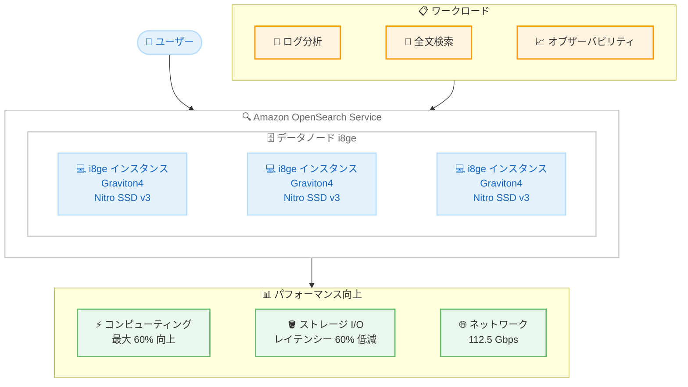

# Amazon OpenSearch Service - Graviton4 ベースの i8ge インスタンスをサポート

**リリース日**: 2026年04月08日
**サービス**: Amazon OpenSearch Service
**機能**: Graviton4 ベースの i8ge ストレージ最適化インスタンス

[このアップデートのインフォグラフィックを見る](https://takech9203.github.io/aws-news-summary/20260408-amazon-opensearch-service-supports-i8ge.html)

## 概要

AWS は 2026 年 4 月 8 日、Amazon OpenSearch Service において Graviton4 プロセッサーを搭載した最新世代のストレージ最適化インスタンスである i8ge インスタンスのサポートを発表しました。i8ge インスタンスは、前世代の Graviton2 ベースの Im4gn インスタンスと比較して、最大 60% 優れたコンピューティングパフォーマンスを提供します。

i8ge インスタンスは、第 3 世代 AWS Nitro SSD を搭載しており、TB あたりのリアルタイムストレージパフォーマンスが最大 55% 向上し、ストレージ I/O レイテンシーが最大 60% 低減、ストレージ I/O レイテンシーのばらつきが最大 75% 低減されています。最大 18xlarge サイズで 45 TB のインスタンスストレージと 112.5 Gbps のネットワーク帯域幅を提供し、これはストレージ最適化インスタンスの中で最も高い値です。

**アップデート前の課題**

- OpenSearch Service のストレージ最適化インスタンスとして Im4gn (Graviton2 ベース) を使用しており、コンピューティング性能に限界があった
- ストレージ I/O のレイテンシーとそのばらつきが大きく、リアルタイム検索や分析のパフォーマンスに影響を与えていた
- 大規模なデータセットに対するストレージスループットが制限されており、ストレージ最適化ワークロードでのネットワーク帯域幅も限られていた

**アップデート後の改善**

- Graviton4 プロセッサーにより、Im4gn と比較して最大 60% のコンピューティングパフォーマンス向上を実現
- 第 3 世代 AWS Nitro SSD により、TB あたりのストレージパフォーマンスが最大 55% 向上し、I/O レイテンシーが最大 60% 低減
- 最大 45 TB のインスタンスストレージと 112.5 Gbps のネットワーク帯域幅により、大規模なデータセットの処理が可能に

## アーキテクチャ図



この図は、Amazon OpenSearch Service における i8ge インスタンスの構成と、Graviton4 プロセッサーおよび第 3 世代 Nitro SSD による主要なパフォーマンス向上を示しています。

## サービスアップデートの詳細

### 主要機能

1. **Graviton4 プロセッサーによる高性能コンピューティング**
   - 前世代の Graviton2 ベース Im4gn インスタンスと比較して最大 60% 優れたコンピューティングパフォーマンス
   - 検索クエリの処理速度やインデックス作成速度の向上が期待される
   - エネルギー効率の改善により、同等の処理能力をより低い消費電力で実現

2. **第 3 世代 AWS Nitro SSD による高速ストレージ**
   - TB あたりのリアルタイムストレージパフォーマンスが最大 55% 向上
   - ストレージ I/O レイテンシーが最大 60% 低減
   - ストレージ I/O レイテンシーのばらつきが最大 75% 低減
   - より予測可能で安定したストレージパフォーマンスを提供

3. **大容量ストレージとネットワーク帯域幅**
   - 最大 18xlarge サイズで 45 TB のインスタンスストレージを提供
   - 112.5 Gbps のネットワーク帯域幅 (ストレージ最適化インスタンスの中で最大)
   - 大規模なデータセットに対するリアルタイム検索と分析に最適

4. **幅広い互換性**
   - すべての OpenSearch バージョンをサポート
   - Elasticsearch 7.9 および 7.10 をサポート
   - 既存の OpenSearch ドメインで利用可能

## 技術仕様

### i8ge インスタンスと Im4gn インスタンスの比較

| 項目 | i8ge | Im4gn |
|------|------|-------|
| プロセッサー | AWS Graviton4 | AWS Graviton2 |
| Nitro SSD 世代 | 第 3 世代 | 第 1 世代 |
| 最大インスタンスサイズ | 18xlarge | 16xlarge |
| 最大インスタンスストレージ | 45 TB | 30 TB |
| 最大ネットワーク帯域幅 | 112.5 Gbps | 100 Gbps |
| コンピューティング性能 | 基準 | i8ge と比較して最大 60% 低い |
| ストレージ I/O レイテンシー | 基準 | i8ge と比較して最大 60% 高い |
| ストレージ I/O ばらつき | 基準 | i8ge と比較して最大 75% 高い |

### パフォーマンス改善まとめ

| 指標 | Im4gn との比較 |
|------|---------------|
| コンピューティングパフォーマンス | 最大 60% 向上 |
| TB あたりのストレージパフォーマンス | 最大 55% 向上 |
| ストレージ I/O レイテンシー | 最大 60% 低減 |
| ストレージ I/O レイテンシーのばらつき | 最大 75% 低減 |

### 対応バージョン

| ソフトウェア | バージョン |
|-------------|-----------|
| OpenSearch | 全バージョン |
| Elasticsearch | 7.9、7.10 |

### API 変更履歴

本アップデートに関連する API 変更は、調査期間内で確認されませんでした。i8ge インスタンスタイプは、既存の OpenSearch Service API (CreateDomain、UpdateDomainConfig) の InstanceType パラメータで指定できます。

## 設定方法

### 前提条件

1. AWS アカウントと OpenSearch Service への適切な IAM 権限
2. 対象リージョン (米国東部、米国西部、欧州、アジアパシフィックの対応リージョン) へのアクセス
3. 既存の OpenSearch ドメインまたは新規ドメインの作成権限

### 手順

#### ステップ 1: 新規ドメインで i8ge インスタンスを使用

```bash
aws opensearch create-domain \
  --domain-name my-opensearch-domain \
  --engine-version OpenSearch_2.17 \
  --cluster-config \
    InstanceType=i8ge.2xlarge.search,InstanceCount=3 \
  --ebs-options EBSEnabled=false \
  --region us-east-1
```

このコマンドは、i8ge.2xlarge インスタンスを 3 ノード構成で新しい OpenSearch ドメインを作成します。i8ge インスタンスはインスタンスストレージを使用するため、EBS は無効に設定しています。

#### ステップ 2: 既存ドメインのインスタンスタイプを変更

```bash
aws opensearch update-domain-config \
  --domain-name my-existing-domain \
  --cluster-config \
    InstanceType=i8ge.4xlarge.search,InstanceCount=3 \
  --region us-east-1
```

このコマンドは、既存のドメインのインスタンスタイプを i8ge.4xlarge に変更します。Blue/Green デプロイメントにより、ダウンタイムなしでインスタンスタイプの変更が行われます。

#### ステップ 3: ドメインの状態を確認

```bash
aws opensearch describe-domain \
  --domain-name my-opensearch-domain \
  --query "DomainStatus.{Status:Processing,InstanceType:ClusterConfig.InstanceType,InstanceCount:ClusterConfig.InstanceCount}" \
  --region us-east-1
```

このコマンドは、ドメインの処理状態とインスタンスタイプの設定を確認します。Processing が false になれば変更が完了しています。

## メリット

### ビジネス面

- **コストパフォーマンスの向上**: Graviton4 プロセッサーによる高いコンピューティング効率とエネルギー効率により、同等のパフォーマンスをより低コストで実現可能
- **大規模データ対応**: 最大 45 TB のインスタンスストレージにより、大規模なログデータや検索インデックスを効率的に格納・検索可能
- **予測可能なパフォーマンス**: ストレージ I/O レイテンシーのばらつきが最大 75% 低減されることで、SLA の達成が容易に

### 技術面

- **高速なクエリ処理**: コンピューティングパフォーマンスの 60% 向上により、複雑な検索クエリやアグリゲーションの応答時間が改善
- **安定したストレージ性能**: 第 3 世代 Nitro SSD によるレイテンシーの低減とばらつきの削減で、一貫したパフォーマンスを実現
- **高帯域幅ネットワーク**: 112.5 Gbps のネットワーク帯域幅により、ノード間のデータレプリケーションやリカバリが高速化
- **シームレスな移行**: 既存の OpenSearch バージョンとの互換性により、アプリケーションの変更なしにインスタンスタイプの変更が可能

## デメリット・制約事項

### 制限事項

- 利用可能なリージョンが限定されている (10 リージョン)。東京リージョンは本アップデートの対象外
- EBS ボリュームは使用できず、インスタンスストレージのみを利用するため、ストレージ容量はインスタンスサイズに依存する
- インスタンスストレージはエフェメラルであるため、レプリケーションの設定が重要

### 考慮すべき点

- Im4gn インスタンスからの移行時には、Blue/Green デプロイメントによる移行が行われるが、データ量によっては時間がかかる場合がある
- i8ge インスタンスは大容量ストレージに最適化されているため、小規模なドメインではコスト効率が最適ではない可能性がある
- Graviton4 (Arm ベース) プロセッサーを使用するため、カスタムプラグインが Arm アーキテクチャに対応していることを確認する必要がある

## ユースケース

### ユースケース 1: 大規模ログ分析基盤

**シナリオ**: 大規模な Web サービスを運営する企業が、数十 TB のアクセスログとアプリケーションログをリアルタイムで検索・分析したい

**実装例**:
```bash
aws opensearch create-domain \
  --domain-name log-analytics \
  --engine-version OpenSearch_2.17 \
  --cluster-config \
    InstanceType=i8ge.12xlarge.search,InstanceCount=6,DedicatedMasterEnabled=true,DedicatedMasterType=r7g.2xlarge.search,DedicatedMasterCount=3 \
  --ebs-options EBSEnabled=false \
  --region us-east-1
```

**効果**: 45 TB のインスタンスストレージとストレージ I/O レイテンシーの 60% 低減により、大量のログデータに対するリアルタイム検索の応答速度が大幅に向上

### ユースケース 2: オブザーバビリティプラットフォーム

**シナリオ**: マイクロサービスアーキテクチャを採用する企業が、OpenSearch をバックエンドとしたオブザーバビリティ基盤でメトリクス、トレース、ログを統合管理したい

**実装例**:
```bash
aws opensearch create-domain \
  --domain-name observability-platform \
  --engine-version OpenSearch_2.17 \
  --cluster-config \
    InstanceType=i8ge.4xlarge.search,InstanceCount=9,ZoneAwarenessEnabled=true,ZoneAwarenessConfig="{AvailabilityZoneCount=3}" \
  --ebs-options EBSEnabled=false \
  --region eu-central-1
```

**効果**: 安定したストレージパフォーマンスにより、リアルタイムのダッシュボード表示やアラート検出のレイテンシーが改善され、障害の迅速な検知と対応が可能に

### ユースケース 3: E コマース検索エンジン

**シナリオ**: E コマースプラットフォームが、数百万の商品カタログに対するリアルタイム検索を高速化し、ユーザー体験を向上させたい

**実装例**:
```bash
aws opensearch create-domain \
  --domain-name product-search \
  --engine-version OpenSearch_2.17 \
  --cluster-config \
    InstanceType=i8ge.2xlarge.search,InstanceCount=6,ZoneAwarenessEnabled=true,ZoneAwarenessConfig="{AvailabilityZoneCount=3}" \
  --ebs-options EBSEnabled=false \
  --region us-west-2
```

**効果**: コンピューティングパフォーマンスの 60% 向上とストレージ I/O の最適化により、検索クエリのレスポンスタイムが短縮され、コンバージョン率の向上に寄与

## 料金

i8ge インスタンスの料金は、インスタンスサイズとリージョンによって異なります。ストレージ最適化インスタンスであるため、インスタンスストレージが含まれており、追加の EBS ボリューム料金は発生しません。詳細な料金については、[Amazon OpenSearch Service の料金ページ](https://aws.amazon.com/opensearch-service/pricing/)をご確認ください。

### 料金例

| インスタンスタイプ | 用途 | 月額料金 (概算) |
|-------------------|------|----------------|
| i8ge.2xlarge.search | 中規模ドメイン | リージョンにより異なる |
| i8ge.4xlarge.search | 大規模ログ分析 | リージョンにより異なる |
| i8ge.18xlarge.search | 超大規模データセット | リージョンにより異なる |

**注**: 料金は変更される可能性があります。Graviton ベースのインスタンスは、同等の x86 ベースインスタンスと比較して一般的にコスト効率が高い傾向にあります。最新の料金については公式料金ページをご確認ください。

## 利用可能リージョン

i8ge インスタンスは、以下のリージョンで利用可能です。

**北米**:
- 米国東部 (バージニア北部) - us-east-1
- 米国東部 (オハイオ) - us-east-2
- 米国西部 (オレゴン) - us-west-2

**欧州**:
- 欧州 (フランクフルト) - eu-central-1
- 欧州 (アイルランド) - eu-west-1
- 欧州 (ストックホルム) - eu-north-1

**アジアパシフィック**:
- アジアパシフィック (マレーシア) - ap-southeast-5
- アジアパシフィック (ムンバイ) - ap-south-1
- アジアパシフィック (シンガポール) - ap-southeast-1
- アジアパシフィック (シドニー) - ap-southeast-2

## 関連サービス・機能

- **Amazon OpenSearch Serverless**: サーバーレスで OpenSearch を利用する場合の代替オプション。インスタンス管理が不要
- **Amazon OpenSearch Ingestion**: OpenSearch へのデータ取り込みパイプライン。i8ge インスタンスと組み合わせて高速なデータ取り込みを実現
- **AWS Graviton**: i8ge インスタンスが搭載する Graviton4 プロセッサーの基盤技術。Arm ベースの高効率コンピューティング
- **Amazon CloudWatch**: OpenSearch ドメインのパフォーマンスメトリクスを監視し、i8ge インスタンスへの移行効果を測定

## 参考リンク

- [インフォグラフィック](https://takech9203.github.io/aws-news-summary/20260408-amazon-opensearch-service-supports-i8ge.html)
- [公式発表 (What's New)](https://aws.amazon.com/about-aws/whats-new/2026/4/amazon-opensearch-service-supports-i8ge/)
- [Amazon OpenSearch Service ドキュメント](https://docs.aws.amazon.com/opensearch-service/)
- [Amazon OpenSearch Service 料金ページ](https://aws.amazon.com/opensearch-service/pricing/)
- [AWS Graviton プロセッサー](https://aws.amazon.com/ec2/graviton/)

## まとめ

Amazon OpenSearch Service における i8ge インスタンスのサポートにより、Graviton4 プロセッサーと第 3 世代 Nitro SSD の組み合わせで、ストレージ最適化ワークロードのパフォーマンスが大幅に向上しました。コンピューティング性能の最大 60% 向上、ストレージ I/O レイテンシーの最大 60% 低減、レイテンシーばらつきの最大 75% 低減により、大規模なログ分析、オブザーバビリティ、全文検索といったユースケースで顕著な効果が期待されます。現在 Im4gn インスタンスを使用しているお客様は、i8ge インスタンスへの移行を検討し、パフォーマンスとコスト効率の向上を実現してください。
