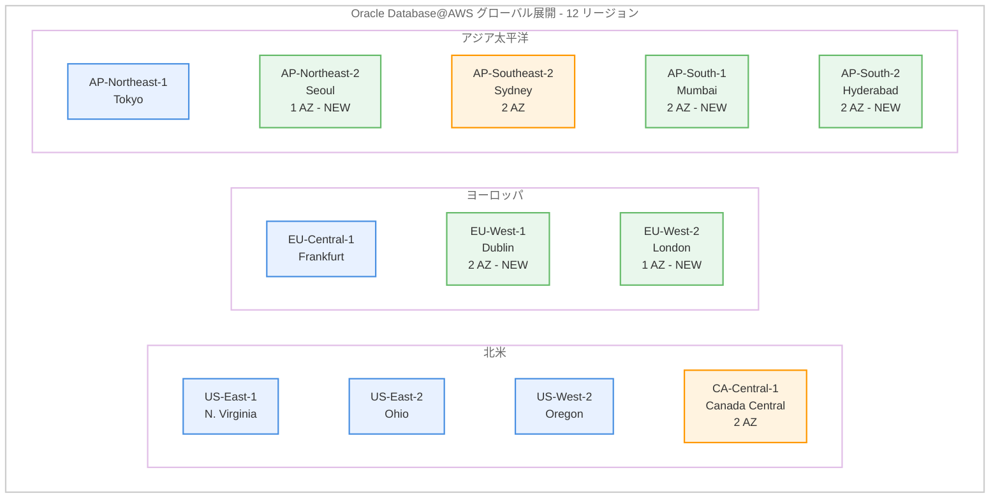

# Oracle Database@AWS - 12 AWS リージョンでの提供

**リリース日**: 2026 年 4 月 8 日
**サービス**: Oracle Database@AWS
**機能**: 5 つの追加リージョンでの一般提供開始および既存リージョンの AZ 拡張

## 概要

Oracle Database@AWS が新たに 5 つの AWS リージョンで一般提供を開始し、合計 12 リージョンで利用可能になりました。今回追加されたリージョンは、EU-West-1 (ダブリン)、EU-West-2 (ロンドン)、AP-South-1 (ムンバイ)、AP-South-2 (ハイデラバード)、AP-Northeast-2 (ソウル) です。

Oracle Database@AWS は、AWS データセンター内で Oracle Cloud Infrastructure (OCI) が管理する Oracle Exadata システムへのアクセスを提供するサービスです。ヨーロッパおよびアジア太平洋地域でデータレジデンシー要件を持つお客様が、オンプレミスの Oracle Exadata および Oracle RAC アプリケーションを AWS に移行できるようになりました。また、CA-Central-1 (カナダ中部) と AP-Southeast-2 (シドニー) では 2 AZ 対応に拡張され、高可用性が強化されています。

**アップデート前の課題**

- ロンドン、ムンバイ、ハイデラバード、ソウルでは Oracle Database@AWS が利用できなかった
- ヨーロッパ西部およびアジア太平洋地域の多くの国でデータレジデンシー要件を満たせなかった
- カナダ中部とシドニーは 1 AZ のみで、高可用性構成に制限があった

**アップデート後の改善**

- 合計 12 リージョンに拡大し、グローバルなカバレッジが大幅に向上
- イギリス、インド、韓国でのデータレジデンシー要件に対応可能に
- カナダ中部とシドニーが 2 AZ 対応となり、マルチ AZ 構成による高可用性を実現

## アーキテクチャ図



この図は Oracle Database@AWS の 12 リージョン展開を示しています。緑色が今回新規追加されたリージョン、オレンジ色が AZ 拡張されたリージョン、青色が既存リージョンです。

## サービスアップデートの詳細

### 主要機能

1. **5 つの新規リージョンでの一般提供**
   - EU-West-1 (ダブリン): 2 AZ で提供
   - EU-West-2 (ロンドン): 1 AZ で提供
   - AP-South-1 (ムンバイ): 2 AZ で提供
   - AP-South-2 (ハイデラバード): 2 AZ で提供
   - AP-Northeast-2 (ソウル): 1 AZ で提供

2. **既存リージョンの AZ 拡張**
   - CA-Central-1 (カナダ中部): 1 AZ から 2 AZ に拡張
   - AP-Southeast-2 (シドニー): 1 AZ から 2 AZ に拡張
   - 2 AZ 構成により高可用性 (HA) が強化

3. **OCI 管理の Oracle Exadata システム**
   - AWS データセンター内で Oracle Exadata を実行
   - Oracle RAC アプリケーションの移行をサポート
   - AWS KMS、CloudWatch、IAM などの AWS サービスとの統合

## 技術仕様

### リージョンおよび AZ 構成

| リージョン | リージョンコード | AZ 数 | 状態 |
|-----------|----------------|--------|------|
| US East (N. Virginia) | us-east-1 | - | 既存 |
| US West (Oregon) | us-west-2 | - | 既存 |
| US East (Ohio) | us-east-2 | - | 既存 |
| Canada (Central) | ca-central-1 | 2 AZ | AZ 拡張 |
| Europe (Frankfurt) | eu-central-1 | - | 既存 |
| Europe (Dublin) | eu-west-1 | 2 AZ | 新規追加 |
| Europe (London) | eu-west-2 | 1 AZ | 新規追加 |
| Asia Pacific (Tokyo) | ap-northeast-1 | - | 既存 |
| Asia Pacific (Sydney) | ap-southeast-2 | 2 AZ | AZ 拡張 |
| Asia Pacific (Mumbai) | ap-south-1 | 2 AZ | 新規追加 |
| Asia Pacific (Hyderabad) | ap-south-2 | 2 AZ | 新規追加 |
| Asia Pacific (Seoul) | ap-northeast-2 | 1 AZ | 新規追加 |

### API 変更履歴

今回のアップデートに伴う直接的な API 変更はありません。既存の API とコンソール操作が新規リージョンでも利用可能になりました。

## 設定方法

### 前提条件

1. AWS アカウント
2. AWS Marketplace を通じた Oracle からのプライベートオファー
3. 対象リージョンへのアクセス権限

### 手順

#### ステップ 1: AWS Marketplace からオファーを取得

[AWS Marketplace の Oracle Database@AWS ページ](https://aws.amazon.com/marketplace/pp/prodview-qks5dl3hr7nfw) にアクセスし、Oracle からのプライベートオファーをリクエストします。

#### ステップ 2: ODB ネットワークの作成

AWS マネジメントコンソールで Oracle Database@AWS に移動し、対象リージョンを選択して ODB ネットワークを作成します。

```bash
# 例: ムンバイリージョンで Exadata インフラストラクチャを作成
aws odb create-exadata-infrastructure \
  --display-name my-exadata-infra \
  --shape Exadata.X11M \
  --compute-count 2 \
  --storage-count 3 \
  --region ap-south-1
```

このコマンドは、ムンバイリージョンで Exadata インフラストラクチャを作成します。

#### ステップ 3: ODB ピアリング接続と VM クラスターの作成

ODB ネットワークと既存の VPC 間のピアリング接続を作成し、Exadata VM クラスターまたは Autonomous VM クラスターを構成します。

```bash
# Exadata VM クラスターの作成例
aws odb create-cloud-vm-cluster \
  --display-name my-vm-cluster \
  --exadata-infrastructure-id <infrastructure-id> \
  --cpu-core-count 4 \
  --region ap-south-1
```

このコマンドは、指定した Exadata インフラストラクチャ上に VM クラスターを作成し、Oracle Database の実行環境を構築します。

## メリット

### ビジネス面

- **グローバルカバレッジの拡大**: 12 リージョンへの拡張により、ヨーロッパ、アジア太平洋地域のお客様がデータレジデンシー要件を満たしながら Oracle Exadata を利用可能
- **インド市場への対応**: ムンバイとハイデラバードの 2 リージョンでインドのデータローカライゼーション要件に対応
- **移行の加速**: イギリス、韓国のお客様がオンプレミスの Oracle Exadata/RAC を最小限の変更で AWS に移行可能

### 技術面

- **高可用性の強化**: カナダ中部とシドニーの 2 AZ 拡張、およびダブリン、ムンバイ、ハイデラバードの 2 AZ 提供により、マルチ AZ 構成が可能
- **低レイテンシー**: AWS データセンター内に配置されているため、AWS アプリケーションとの低レイテンシー通信を実現
- **AWS サービス統合**: KMS、CloudWatch、IAM、CloudTrail、EventBridge などとのネイティブ統合

## デメリット・制約事項

### 制限事項

- ロンドンとソウルは 1 AZ のみでの提供開始のため、マルチ AZ 構成は利用不可
- AWS Marketplace を通じた Oracle からのプライベートオファーが必要であり、即時利用は不可
- Oracle のライセンスと料金が別途適用される

### 考慮すべき点

- Oracle Database@AWS は OCI が管理するインフラストラクチャであるため、一部の管理操作は OCI コンソールを使用する場合がある
- ODB ピアリング接続の設定が必要であり、ネットワーク構成の事前計画が重要
- 1 AZ リージョンから 2 AZ リージョンへの拡張タイムラインは未発表のため、HA 要件が厳しい場合は 2 AZ リージョンを選択することを推奨

## ユースケース

### ユースケース 1: イギリスの金融機関の Oracle 環境移行

**シナリオ**: イギリスに本社を置く金融機関が、FCA 規制に基づきデータを英国内に保持する必要がある。現在オンプレミスで Oracle Exadata を運用しており、クラウドへの移行を検討している。

**実装例**:
1. AWS Marketplace から Oracle のプライベートオファーをリクエスト
2. EU-West-2 (ロンドン) で ODB ネットワークと Exadata インフラストラクチャを構成
3. オンプレミスの Exadata データベースをロンドンリージョンの Oracle Database@AWS に移行

**効果**: 英国のデータレジデンシー要件を満たしながら、AWS サービスとの統合によるモニタリング、暗号化、ガバナンスの強化を実現します。

### ユースケース 2: インド企業のマルチリージョン展開

**シナリオ**: インドの大規模 IT 企業が、RBI のデータローカライゼーション要件に対応しながら、災害復旧 (DR) 構成を構築したい。

**実装例**:
1. AP-South-1 (ムンバイ) をプライマリリージョンとして構成 (2 AZ)
2. AP-South-2 (ハイデラバード) を DR リージョンとして構成 (2 AZ)
3. 両リージョン間でレプリケーションを設定

**効果**: インド国内の 2 リージョンでプライマリと DR を構成することで、データローカライゼーション要件を満たしつつ、高い可用性と災害復旧能力を確保します。

### ユースケース 3: 韓国企業のクラウド移行

**シナリオ**: 韓国の製造業企業が、基幹業務システムで使用している Oracle RAC データベースをオンプレミスからクラウドに移行したい。データは韓国国内に保持する必要がある。

**実装例**:
1. AP-Northeast-2 (ソウル) に Oracle Database@AWS を構成
2. Oracle RAC を同等の環境にマイグレーション
3. AWS CloudWatch でパフォーマンスモニタリングを設定

**効果**: 韓国国内にデータを保持しながら、Oracle RAC の高可用性とスケーラビリティを維持。インフラストラクチャ管理の負荷を OCI に委任し、運用効率を向上させます。

## 料金

Oracle Database@AWS の料金は Oracle のライセンスおよびインフラストラクチャ料金と、AWS サービスの利用料金で構成されます。

| 項目 | 詳細 |
|------|------|
| Oracle Database@AWS | AWS Marketplace を通じた Oracle のプライベートオファーに基づく |
| AWS KMS | KMS キーの使用に対する標準料金 |
| Amazon CloudWatch | メトリクスとログの標準料金 |
| データ転送 | AWS 標準のデータ転送料金 |

詳細な料金については、[AWS Marketplace の Oracle Database@AWS ページ](https://aws.amazon.com/marketplace/pp/prodview-qks5dl3hr7nfw) および Oracle の営業担当にお問い合わせください。

## 利用可能リージョン

Oracle Database@AWS は、今回のアップデートにより合計 12 の AWS リージョンで利用可能です。

- US East (N. Virginia) - us-east-1
- US West (Oregon) - us-west-2
- US East (Ohio) - us-east-2
- Canada (Central) - ca-central-1 (2 AZ に拡張)
- Europe (Frankfurt) - eu-central-1
- **Europe (Dublin) - eu-west-1** (今回追加、2 AZ)
- **Europe (London) - eu-west-2** (今回追加、1 AZ)
- Asia Pacific (Tokyo) - ap-northeast-1
- Asia Pacific (Sydney) - ap-southeast-2 (2 AZ に拡張)
- **Asia Pacific (Mumbai) - ap-south-1** (今回追加、2 AZ)
- **Asia Pacific (Hyderabad) - ap-south-2** (今回追加、2 AZ)
- **Asia Pacific (Seoul) - ap-northeast-2** (今回追加、1 AZ)

## 関連サービス・機能

- **AWS Marketplace**: Oracle Database@AWS のプライベートオファーの購入プラットフォーム
- **AWS Key Management Service (KMS)**: Oracle Database@AWS のデータ暗号化に使用
- **Amazon CloudWatch**: データベースのパフォーマンスモニタリング
- **AWS CloudFormation**: Oracle Database@AWS インフラストラクチャのコード化
- **Amazon Redshift**: Oracle Database@AWS からの zero-ETL 統合による分析
- **Amazon VPC Lattice**: AWS サービスへの簡素化されたネットワーク接続

## 参考リンク

- [公式発表 (What's New)](https://aws.amazon.com/about-aws/whats-new/2026/04/oracle-database-aws-available-twelve-regions/)
- [Oracle Database@AWS 概要](https://aws.amazon.com/marketplace/featured-seller/oracle)
- [Oracle Database@AWS ドキュメント](https://docs.aws.amazon.com/odb/latest/UserGuide/getting-started.html)
- [AWS Marketplace - Oracle Database@AWS](https://aws.amazon.com/marketplace/pp/prodview-qks5dl3hr7nfw)
- [ブログ - Oracle Database@AWS の紹介](https://aws.amazon.com/blogs/aws/introducing-oracle-databaseaws-for-simplified-oracle-exadata-migrations-to-the-aws-cloud/)

## まとめ

Oracle Database@AWS が 5 つの新規リージョン (ダブリン、ロンドン、ムンバイ、ハイデラバード、ソウル) で一般提供を開始し、合計 12 リージョンに拡大しました。加えて、カナダ中部とシドニーが 2 AZ 対応に拡張され、高可用性構成が可能になりました。ヨーロッパおよびアジア太平洋地域でデータレジデンシー要件を持つお客様は、[AWS Marketplace](https://aws.amazon.com/marketplace/pp/prodview-qks5dl3hr7nfw) から Oracle のプライベートオファーをリクエストして、新規リージョンでの利用を開始することをお勧めします。
