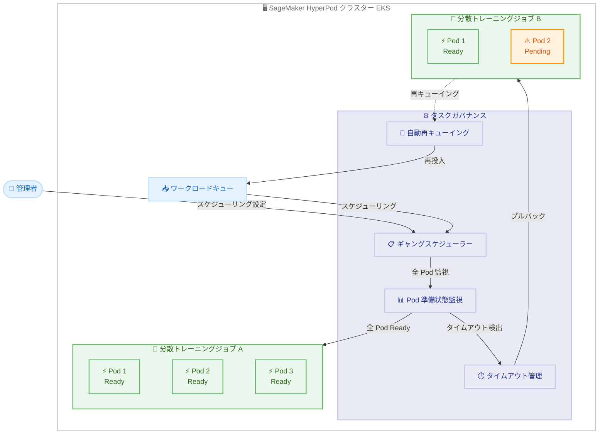

# Amazon SageMaker HyperPod - 分散トレーニング向けギャングスケジューリング

**リリース日**: 2026 年 04 月 08 日
**サービス**: Amazon SageMaker HyperPod
**機能**: Gang Scheduling for Distributed Training Workloads

📊 [このアップデートのインフォグラフィックを見る](https://takech9203.github.io/aws-news-summary/20260408-sagemaker-hyperpod-gang-scheduling.html)

## 概要

Amazon SageMaker HyperPod のタスクガバナンスにギャングスケジューリング機能が追加されました。ギャングスケジューリングは、分散トレーニングジョブに必要なすべての Pod がトレーニング開始前に準備完了であることを保証する仕組みです。これにより、部分的なジョブ実行によるコンピューティングリソースの浪費や、リソース待ちによるデッドロックを防止できます。

EKS オーケストレータを使用する HyperPod クラスター上で分散 AI/ML トレーニングジョブを実行するデータサイエンティストは、複数の Pod がノード間で連携し Pod 間通信を行う必要があります。一部の Pod が起動しても他の Pod が起動しない場合、ジョブが進行せずにリソースを占有し続け、他のワークロードをブロックしてコストが増大する問題がありました。ギャングスケジューリングはこの課題を解決します。

管理者は HyperPod コンソールから、Pod の準備待機時間、ノード障害時の対応、ビジークラスターでのデッドロック回避のためのワークロード逐次投入、リトライスケジューリングなどの設定を調整できます。

**アップデート前の課題**

- 分散トレーニングジョブで一部の Pod のみが起動し、残りの Pod がリソース待ちになると、起動済み Pod がリソースを占有したまま進行できなかった
- 部分的に起動したジョブが他のワークロードをブロックし、クラスター全体の効率が低下していた
- 複数のジョブが同時にリソースを確保しようとした際にデッドロックが発生する可能性があった
- ジョブの手動監視と再投入が必要であり、運用負荷が高かった

**アップデート後の改善**

- すべての Pod が準備完了になるまでトレーニングを開始しないことで、部分実行によるリソース浪費を防止
- 設定時間内に全 Pod が準備できない場合、ワークロードを自動的にプルバックし再キューイング
- ワークロードの逐次投入設定により、ビジークラスターでのデッドロックを回避
- リトライスケジューリングの自動化により、手動介入なしでジョブを再実行

## アーキテクチャ図



ギャングスケジューラーが分散トレーニングジョブの全 Pod の準備状態を監視し、全 Pod が Ready になったジョブ A のみトレーニングを開始する一方、タイムアウト内に全 Pod が揃わなかったジョブ B はプルバックされ自動的に再キューイングされる流れを示しています。

## サービスアップデートの詳細

### 主要機能

1. **ギャングスケジューリング**
   - 分散トレーニングジョブに必要なすべての Pod が準備完了になるまでトレーニング開始を保留
   - Pod 間通信が必要なワークロードにおいて、部分的な実行によるリソース浪費を防止
   - ワークロード内の全 Pod を一括で監視し、整合性のあるスケジューリングを実現

2. **自動プルバックと再キューイング**
   - 設定されたタイムアウト内にすべての Pod が準備完了にならない場合、ワークロードを自動的にプルバック
   - プルバックされたワークロードは自動的にキューに再投入され、手動介入なしでリトライ
   - リソースの解放により、他のワークロードの実行を妨げない

3. **管理者向け設定オプション**
   - Pod 準備待機時間: すべての Pod が Ready になるまでの待機時間を設定
   - ノード障害対応: ノード障害発生時の挙動を制御
   - 逐次投入モード: ビジークラスターでデッドロックを防止するためワークロードを 1 つずつ投入
   - リトライスケジューリング: 再キューイング後のリトライ動作を設定

## 技術仕様

### ギャングスケジューリングの仕組み

| 項目 | 詳細 |
|------|------|
| 対象オーケストレータ | Amazon EKS |
| スケジューリング単位 | ワークロード内の全 Pod |
| タイムアウト動作 | ワークロードのプルバックと自動再キューイング |
| デッドロック防止 | ワークロードの逐次投入オプション |
| ノード障害対応 | 設定可能なフェイルオーバー動作 |
| 設定インターフェース | HyperPod コンソール |

### 設定パラメータ

| パラメータ | 説明 | ユースケース |
|-----------|------|-------------|
| Pod 準備待機時間 | 全 Pod が Ready になるまでの最大待機時間 | 大規模ジョブで Pod 起動に時間がかかる場合の調整 |
| ノード障害ハンドリング | ノード障害時のワークロード処理方法 | ノード障害頻度の高い環境での耐障害性向上 |
| 逐次投入 | ワークロードを 1 つずつ投入するモード | リソースが逼迫したクラスターでのデッドロック防止 |
| リトライスケジューリング | プルバック後のリトライ間隔と回数の制御 | ジョブの優先度に応じたリトライ戦略の最適化 |

### API 変更履歴

直近 7 日間で確認された [SageMaker](https://awsapichanges.com/archive/changes/?title=SageMaker) 関連の API 変更はありませんでした。ギャングスケジューリング機能は HyperPod コンソールからの設定が中心であり、今後 API が追加される可能性があります。

| 日付 | サービス | 変更内容 |
|------|----------|----------|
| - | - | 直近 7 日間に SageMaker 関連の API 変更なし |

### IAM ポリシー例

```json
{
  "Version": "2012-10-17",
  "Statement": [
    {
      "Effect": "Allow",
      "Action": [
        "sagemaker:UpdateCluster",
        "sagemaker:DescribeCluster",
        "sagemaker:ListClusters",
        "sagemaker:UpdateComputeQuota",
        "sagemaker:DescribeComputeQuota",
        "sagemaker:ListComputeQuotas"
      ],
      "Resource": "arn:aws:sagemaker:*:*:cluster/*"
    }
  ]
}
```

上記は、HyperPod クラスターのギャングスケジューリング設定を管理するために必要と想定される IAM 権限の例です。実際の権限要件については、公式ドキュメントを確認してください。

## 設定方法

### 前提条件

1. Amazon SageMaker HyperPod クラスターが EKS オーケストレータで構成されていること
2. タスクガバナンスが有効化されていること
3. 分散トレーニングジョブが複数の Pod を使用するよう構成されていること

### 手順

#### ステップ 1: HyperPod コンソールでギャングスケジューリングを有効化

HyperPod コンソールにアクセスし、対象クラスターのタスクガバナンス設定画面からギャングスケジューリングを有効化します。Pod 準備待機時間やノード障害対応などのパラメータを環境に応じて設定します。

#### ステップ 2: Pod 準備待機時間の設定

```bash
# クラスターの現在の設定を確認
aws sagemaker describe-cluster \
  --cluster-name my-hyperpod-cluster
```

Pod の準備待機時間を、ジョブの規模やノード数に応じて適切な値に設定します。大規模な分散トレーニングジョブでは、Pod の起動に時間がかかるため、十分な待機時間を確保することが重要です。

#### ステップ 3: デッドロック防止の設定

ビジークラスターでは、逐次投入モードを有効にしてデッドロックを防止します。これにより、ワークロードが 1 つずつスケジューリングされ、複数のジョブが同時にリソースを確保しようとする競合を回避できます。

#### ステップ 4: 動作確認

```bash
# クラスターのワークロード状態を確認
aws sagemaker list-clusters \
  --query "ClusterSummaries[?ClusterName=='my-hyperpod-cluster']"
```

分散トレーニングジョブを投入し、全 Pod が揃ってからトレーニングが開始されること、およびタイムアウト時にプルバックと再キューイングが正しく動作することを確認します。

## メリット

### ビジネス面

- **コスト削減**: 部分的なジョブ実行によるリソース浪費を防止し、コンピューティングコストを最適化
- **運用効率の向上**: ジョブの手動監視と再投入が不要になり、管理者の運用負荷を大幅に軽減
- **プロジェクト推進の加速**: デッドロックやリソース待ちによるジョブ遅延を削減し、トレーニングのスループットを向上

### 技術面

- **リソース利用率の最適化**: 進行不能なジョブがリソースを占有し続ける状況を排除し、クラスター全体の効率を改善
- **デッドロック防止**: 逐次投入モードにより、複数ジョブ間のリソース競合によるデッドロックを回避
- **自動復旧**: プルバックと再キューイングの自動化により、一時的なリソース不足からの自動復旧を実現

## デメリット・制約事項

### 制限事項

- EKS オーケストレータを使用する HyperPod クラスターのみが対象であり、Slurm オーケストレータでは利用不可
- ギャングスケジューリングにより、リソースが十分でない場合はジョブの開始が遅延する可能性がある
- 逐次投入モードを有効にすると、ジョブのスループットが低下する場合がある

### 考慮すべき点

- Pod 準備待機時間を短く設定しすぎると、正常な起動プロセス中にプルバックが頻発する可能性がある
- 待機時間を長く設定しすぎると、障害発生時のリソース解放が遅れる可能性がある
- クラスターの規模やワークロードの特性に応じて、パラメータのチューニングが必要

## ユースケース

### ユースケース 1: 大規模言語モデルの分散トレーニング

**シナリオ**: 数百の GPU を使用する大規模言語モデルのトレーニングにおいて、数十の Pod が複数ノードにまたがって連携する必要がある

**実装例**:
```
ギャングスケジューリング設定:
- Pod 準備待機時間: 600 秒
- ノード障害対応: ワークロードプルバック
- 逐次投入: 有効
- リトライ: 自動、最大 3 回
```

**効果**: すべての Pod が揃ってからトレーニングを開始することで、数百 GPU 規模の部分実行によるコスト浪費を防止。ノード障害時も自動的にプルバックして再キューイングされるため、手動介入なしでトレーニングを再開可能

### ユースケース 2: マルチテナントクラスターでのリソース競合防止

**シナリオ**: 複数チームが共有する HyperPod クラスターで、複数の分散トレーニングジョブが同時にリソースを確保しようとしてデッドロックが発生する

**実装例**:
```
ギャングスケジューリング設定:
- Pod 準備待機時間: 300 秒
- 逐次投入: 有効
- リトライ: 自動、エクスポネンシャルバックオフ
```

**効果**: ワークロードの逐次投入により、ジョブ A が全 Pod を確保してから次のジョブ B のスケジューリングを開始。リソース競合によるデッドロックを根本的に防止

### ユースケース 3: GPU クラスターの高可用性運用

**シナリオ**: ノード障害が散発的に発生する大規模 GPU クラスターにおいて、障害ノード上の Pod が起動できずジョブが停滞する

**実装例**:
```
ギャングスケジューリング設定:
- Pod 準備待機時間: 180 秒
- ノード障害対応: 即時プルバック
- リトライ: 自動、最大 5 回
```

**効果**: ノード障害により全 Pod が揃わない場合は迅速にプルバックしてリソースを解放。自動リトライにより、正常なノードで再スケジューリングされトレーニングを継続

## 料金

ギャングスケジューリング機能自体の追加料金は発生しません。SageMaker HyperPod の料金は、クラスターで使用するインスタンスタイプと実行時間に基づいて課金されます。ギャングスケジューリングにより部分実行によるリソース浪費が削減されるため、実質的なコスト効率が向上します。

### 料金例

| インスタンスタイプ | オンデマンド料金 (1 時間あたり、us-east-1) |
|--------------------|--------------------------------------------|
| ml.p4d.24xlarge (A100 GPU x8) | $32.77 |
| ml.p5.48xlarge (H100 GPU x8) | $98.32 |
| ml.trn1.32xlarge (Trainium x16) | $21.50 |

最新の料金は [SageMaker の料金ページ](https://aws.amazon.com/sagemaker/pricing/)を確認してください。

## 利用可能リージョン

以下の AWS リージョンで利用可能です。

- 米国東部 (バージニア北部): us-east-1
- 米国東部 (オハイオ): us-east-2
- 米国西部 (北カリフォルニア): us-west-1
- 米国西部 (オレゴン): us-west-2
- アジアパシフィック (ムンバイ): ap-south-1
- アジアパシフィック (シンガポール): ap-southeast-1
- アジアパシフィック (シドニー): ap-southeast-2
- アジアパシフィック (東京): ap-northeast-1
- アジアパシフィック (ジャカルタ): ap-southeast-3
- 欧州 (フランクフルト): eu-central-1
- 欧州 (アイルランド): eu-west-1
- 欧州 (ロンドン): eu-west-2
- 欧州 (ストックホルム): eu-north-1
- 欧州 (スペイン): eu-south-2
- 南米 (サンパウロ): sa-east-1

## 関連サービス・機能

- **Amazon SageMaker HyperPod タスクガバナンス**: ギャングスケジューリングの基盤となるタスク管理・リソースガバナンス機能
- **Amazon EKS**: HyperPod クラスターのオーケストレーション基盤として必要
- **SageMaker HyperPod アイドルリソース共有**: ギャングスケジューリングと組み合わせることで、リソース利用効率とスケジューリング効率の両方を最適化
- **Amazon CloudWatch**: ジョブのスケジューリング状況やプルバック回数のモニタリングに活用可能

## 参考リンク

- 📊 [インフォグラフィック](https://takech9203.github.io/aws-news-summary/20260408-sagemaker-hyperpod-gang-scheduling.html)
- [公式発表 (What's New)](https://aws.amazon.com/about-aws/whats-new/2026/04/sagemaker-hyperpod-gang-scheduling/)
- [SageMaker HyperPod ドキュメント](https://docs.aws.amazon.com/sagemaker/latest/dg/sagemaker-hyperpod.html)
- [SageMaker 料金ページ](https://aws.amazon.com/sagemaker/pricing/)

## まとめ

Amazon SageMaker HyperPod のギャングスケジューリング機能は、分散トレーニングワークロードにおける部分実行によるリソース浪費とデッドロックの問題を解決する重要なアップデートです。すべての Pod が準備完了になるまでトレーニングを開始せず、タイムアウト時には自動的にプルバックと再キューイングを行うことで、クラスターリソースの効率的な活用と運用の自動化を実現します。大規模な分散 AI/ML トレーニングを実行している環境では、ワークロードの規模に応じた Pod 準備待機時間の設定と、逐次投入モードの活用を検討することを推奨します。
