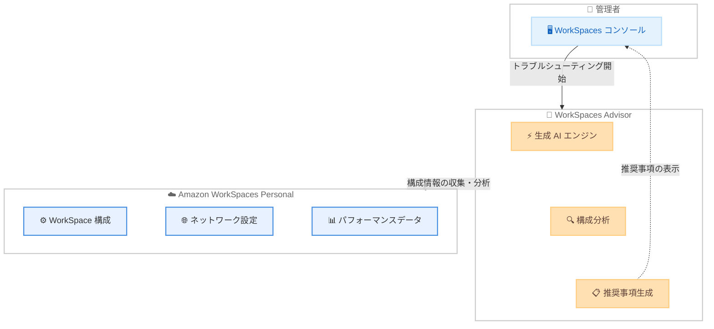

# Amazon WorkSpaces Advisor - AI を活用したトラブルシューティング機能

**リリース日**: 2026 年 4 月 8 日
**サービス**: Amazon WorkSpaces
**機能**: Amazon WorkSpaces Advisor

📊 [このアップデートのインフォグラフィックを見る](https://takech9203.github.io/aws-news-summary/20260408-workspaces-advisor-ai-troubleshooting.html)

## 概要

Amazon WorkSpaces Advisor が新たにリリースされました。これは生成 AI を活用したトラブルシューティングツールであり、Amazon WorkSpaces Personal の管理者が問題を迅速に診断・解決することを支援します。WorkSpace の構成を自動的に分析し、問題を特定し、サービスの復旧やパフォーマンスの最適化に向けた具体的な推奨事項を提供します。

従来、WorkSpaces 環境で問題が発生した際には、管理者が手動でログの確認、構成の検証、ネットワーク設定の調査などを行う必要がありました。WorkSpaces Advisor は、これらの調査プロセスを AI によって自動化し、管理者の作業負荷を軽減します。AI が構成情報を包括的に分析することで、人間が見落としがちな問題の根本原因を特定し、対処可能な推奨事項を提示します。

主な対象ユーザーは、Amazon WorkSpaces Personal を運用する IT 管理者、仮想デスクトップインフラストラクチャ (VDI) の運用チーム、およびエンドユーザーサポートを担当するヘルプデスクチームです。

**アップデート前の課題**

- WorkSpaces の問題発生時に管理者が手動でログ、構成、ネットワーク設定などを逐一調査する必要があった
- 問題の根本原因を特定するまでに多くの時間と専門知識が必要で、ダウンタイムが長期化する傾向があった
- プロアクティブな問題検出が困難であり、エンドユーザーからの報告を受けてから対応を開始するリアクティブな運用が一般的だった

**アップデート後の改善**

- 生成 AI が WorkSpace の構成を自動的に分析し、問題の根本原因を迅速に特定できるようになった
- 具体的なアクション可能な推奨事項が提示されるため、問題解決までの時間が大幅に短縮された
- AI による継続的な分析により、プロアクティブなインフラストラクチャの維持管理が可能になった

## アーキテクチャ図

管理者が WorkSpaces コンソールから Advisor を起動すると、AI エンジンが WorkSpace の構成情報、ネットワーク設定、パフォーマンスデータを分析し、問題の特定と推奨事項の生成を行うフローを示しています。

## サービスアップデートの詳細

### 主要機能

1. **AI による構成分析**
   - WorkSpace の構成情報を生成 AI が自動的にスキャンし、潜在的な問題を検出する
   - ネットワーク設定、セキュリティグループ、ディレクトリサービス接続、ストレージ構成などを包括的に分析する
   - 構成のベストプラクティスとの差異を自動的に特定する

2. **問題の自動診断**
   - エンドユーザーが報告する接続問題、パフォーマンス低下、起動失敗などの一般的な問題を AI が診断する
   - 複数の構成要素を横断的に分析し、問題の根本原因を特定する
   - 類似の問題パターンに基づいて迅速に原因を絞り込む

3. **アクション可能な推奨事項**
   - 特定された問題に対して、具体的な修正手順を提示する
   - サービスの復旧に必要なアクションを優先度付きで推奨する
   - パフォーマンスの最適化に向けた改善提案を提供する

## 技術仕様

### 対応する WorkSpaces タイプ

| 項目 | 詳細 |
|------|------|
| 対象サービス | Amazon WorkSpaces Personal |
| アクセス方法 | Amazon WorkSpaces コンソール |
| AI 技術 | 生成 AI (Generative AI) |
| 分析対象 | WorkSpace 構成、ネットワーク設定、パフォーマンスメトリクス |

### API 変更履歴

直近 7 日間において、WorkSpaces に関連する API 変更は検出されませんでした。WorkSpaces Advisor はコンソールベースの機能として提供されています。

### トラブルシューティング対象の主な問題カテゴリ

| カテゴリ | 対象となる問題例 |
|----------|-----------------|
| 接続問題 | WorkSpace への接続失敗、タイムアウト、認証エラー |
| パフォーマンス | レスポンス遅延、画面描画の遅延、リソース不足 |
| 起動・停止 | WorkSpace の起動失敗、停止不能、再起動の問題 |
| 構成問題 | セキュリティグループの設定ミス、ディレクトリ接続の問題 |

## 設定方法

### 前提条件

1. AWS アカウントで Amazon WorkSpaces Personal が有効化されていること
2. WorkSpaces コンソールへのアクセス権限を持つ IAM ユーザーまたはロールが設定されていること
3. トラブルシューティング対象の WorkSpace が存在すること

### 手順

#### ステップ 1: WorkSpaces コンソールへのアクセス

AWS マネジメントコンソールにサインインし、Amazon WorkSpaces コンソールに移動します。WorkSpaces Advisor はコンソール内から直接アクセスできます。

#### ステップ 2: WorkSpaces Advisor の起動

WorkSpaces コンソール内で WorkSpaces Advisor にアクセスし、トラブルシューティングを開始します。対象の WorkSpace を選択すると、AI が自動的に構成の分析を開始します。

#### ステップ 3: 推奨事項の確認と対応

AI による分析が完了すると、検出された問題と推奨される対処方法が表示されます。推奨事項に従って構成の修正やサービスの復旧を行います。

## メリット

### ビジネス面

- **ダウンタイムの最小化**: AI による迅速な問題診断により、WorkSpaces のダウンタイムを短縮し、エンドユーザーの生産性への影響を最小限に抑えられる
- **運用コストの削減**: 手動での調査時間が大幅に削減されるため、管理者の作業効率が向上し、運用コストの削減につながる
- **エンドユーザー体験の向上**: プロアクティブな問題検出と迅速な解決により、仮想デスクトップのサービス品質が向上する

### 技術面

- **包括的な構成分析**: AI が複数の構成要素を横断的に分析するため、人間が見落としがちな問題の相関関係を発見できる
- **ベストプラクティスの自動適用**: 構成のベストプラクティスとの差異を自動的に検出し、最適な設定を推奨する
- **ナレッジの蓄積と活用**: 生成 AI が広範な問題パターンを学習しているため、一般的な問題から複雑な問題まで幅広く対応できる

## デメリット・制約事項

### 制限事項

- Amazon WorkSpaces Personal のみが対象であり、WorkSpaces Pools などの他の WorkSpaces タイプは対象外
- コンソールベースの機能であり、API や CLI からのプログラム的なアクセスは現時点で確認されていない
- AI の推奨事項は参考情報であり、すべての問題が自動的に解決されるわけではない

### 考慮すべき点

- AI の分析結果は構成情報に基づくものであり、ネットワーク経路上の外部要因による問題は検出対象外となる可能性がある
- 推奨事項を適用する前に、変更がほかの WorkSpace やサービスに影響を与えないか確認することが重要
- 生成 AI の推奨事項は補助的なものとして活用し、重要な構成変更については従来の検証プロセスも併用することを推奨する

## ユースケース

### ユースケース 1: WorkSpace 接続障害の迅速な解決

**シナリオ**: エンドユーザーから WorkSpace に接続できないという報告が複数件発生した。管理者は原因を特定するために、セキュリティグループ、ネットワーク ACL、ディレクトリサービスの状態など複数の設定を確認する必要がある。

**実装例**:
1. WorkSpaces コンソールで WorkSpaces Advisor にアクセスする
2. 対象の WorkSpace を選択してトラブルシューティングを開始する
3. AI が構成を分析し、「セキュリティグループのアウトバウンドルールで必要なポートがブロックされている」などの原因を特定する
4. 推奨される修正手順に従ってセキュリティグループを更新する

**効果**: 従来数時間を要していた調査が数分で完了し、エンドユーザーのダウンタイムを大幅に短縮できる。

### ユースケース 2: パフォーマンス低下の原因調査

**シナリオ**: 特定の WorkSpace グループでパフォーマンスの低下が報告されている。CPU やメモリの使用率、ネットワーク帯域幅、ストレージ I/O など、複数の要因を調査する必要がある。

**実装例**:
1. WorkSpaces Advisor でパフォーマンスが低下している WorkSpace を選択する
2. AI がリソース構成とパフォーマンスデータを分析する
3. 「現在のバンドルタイプではリソースが不足している」や「ストレージのスループットがボトルネックになっている」などの診断結果が表示される
4. 推奨されるバンドルタイプの変更やストレージ設定の最適化を実施する

**効果**: 問題の根本原因をデータに基づいて特定でき、適切なリソース配分によりパフォーマンスを改善できる。

### ユースケース 3: 大規模 VDI 環境のプロアクティブな管理

**シナリオ**: 数百台の WorkSpace を運用する企業において、問題が発生する前にインフラストラクチャの健全性を維持したい。定期的な構成の確認と最適化を効率的に行う必要がある。

**実装例**:
1. WorkSpaces Advisor を定期的に使用して全体的な構成の健全性を確認する
2. AI が潜在的な問題を事前に検出し、改善が必要な WorkSpace を特定する
3. 推奨事項に基づいて構成の最適化を計画的に実施する

**効果**: リアクティブな問題対応からプロアクティブなインフラストラクチャ管理に移行し、エンドユーザーへの影響を未然に防止できる。

## 料金

WorkSpaces Advisor は Amazon WorkSpaces コンソールの機能として提供されます。公式発表時点では WorkSpaces Advisor に対する追加料金に関する情報は明示されていません。詳細な料金情報は [Amazon WorkSpaces の料金ページ](https://aws.amazon.com/workspaces/pricing/)を参照してください。

## 利用可能リージョン

Amazon WorkSpaces Advisor は、Amazon WorkSpaces が提供されているすべての AWS 商用リージョンで利用可能です。主な対応リージョンは以下の通りです。

| リージョン | リージョンコード |
|------------|------------------|
| 米国東部 (バージニア北部) | us-east-1 |
| 米国西部 (オレゴン) | us-west-2 |
| 欧州 (フランクフルト) | eu-central-1 |
| 欧州 (アイルランド) | eu-west-1 |
| 欧州 (ロンドン) | eu-west-2 |
| アジアパシフィック (東京) | ap-northeast-1 |
| アジアパシフィック (シンガポール) | ap-southeast-1 |
| アジアパシフィック (シドニー) | ap-southeast-2 |
| アジアパシフィック (ソウル) | ap-northeast-2 |
| アジアパシフィック (ムンバイ) | ap-south-1 |
| カナダ (中部) | ca-central-1 |
| 南米 (サンパウロ) | sa-east-1 |
| アフリカ (ケープタウン) | af-south-1 |
| イスラエル (テルアビブ) | il-central-1 |

上記は Amazon WorkSpaces が提供されている主なリージョンです。WorkSpaces Advisor の利用可否は WorkSpaces コンソールで確認してください。

## 関連サービス・機能

- **Amazon WorkSpaces Personal**: 個人に割り当てられる永続的な仮想デスクトップサービス。WorkSpaces Advisor の直接的なトラブルシューティング対象
- **Amazon WorkSpaces Secure Browser**: Web ベースのリモートブラウジングサービス。WorkSpaces ファミリーの関連サービス
- **AWS Directory Service**: WorkSpaces のユーザー認証に使用されるディレクトリサービス。WorkSpaces の構成において重要な依存関係
- **Amazon CloudWatch**: WorkSpaces のモニタリングに使用されるサービス。パフォーマンスメトリクスの収集と監視に連携

## 参考リンク

- 📊 [インフォグラフィック](https://takech9203.github.io/aws-news-summary/20260408-workspaces-advisor-ai-troubleshooting.html)
- [公式発表 (What's New)](https://aws.amazon.com/about-aws/whats-new/2026/04/workspaces-advisor-ai-troubleshooting/)
- [Amazon WorkSpaces ドキュメント](https://docs.aws.amazon.com/workspaces/latest/adminguide/amazon-workspaces.html)
- [料金ページ](https://aws.amazon.com/workspaces/pricing/)

## まとめ

Amazon WorkSpaces Advisor は、生成 AI を活用して WorkSpaces Personal のトラブルシューティングを大幅に効率化する新機能です。管理者は AI による構成分析と具体的な推奨事項を活用することで、問題の診断時間を短縮し、エンドユーザーのダウンタイムを最小化できます。Amazon WorkSpaces が利用可能なすべての商用リージョンで即座に利用できるため、WorkSpaces を運用している管理者は WorkSpaces コンソールからすぐに活用を開始することを推奨します。
