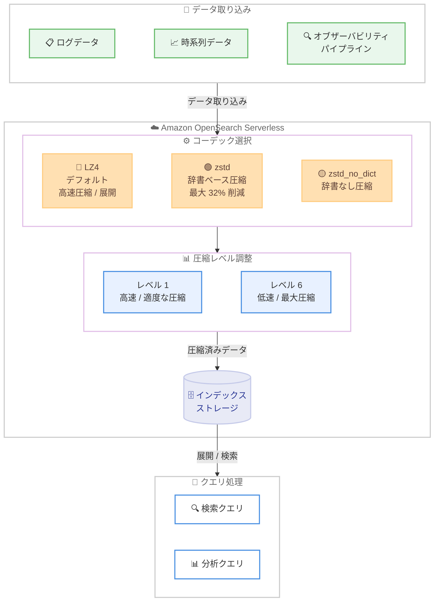

# Amazon OpenSearch Serverless - Zstandard (zstd) インデックス圧縮サポート

**リリース日**: 2026 年 04 月 09 日
**サービス**: Amazon OpenSearch Serverless
**機能**: Zstandard (zstd) コーデックによるインデックス圧縮

📊 [このアップデートのインフォグラフィックを見る](https://takech9203.github.io/aws-news-summary/20260409-amazon-opensearch-serverless-supports-zstandard-index-compression.html)

## 概要

AWS は 2026 年 4 月 9 日、Amazon OpenSearch Serverless において Zstandard (zstd) コーデックによるインデックス圧縮のサポートを発表しました。このアップデートにより、デフォルトの LZ4 コーデックと比較して最大 32% のインデックスサイズ削減が可能となり、データ集約型ワークロードのマネージドストレージコストを低減できます。

Zstandard 圧縮アルゴリズムは、`zstd` と `zstd_no_dict` の 2 つのモードで提供されます。圧縮レベルを調整することで、ストレージ効率とパフォーマンスのトレードオフを柔軟に制御できます。低い圧縮レベル (例: レベル 1) ではインデクシングスループットとクエリレイテンシーへの影響を最小限に抑えつつ有意なストレージ削減を実現し、高い圧縮レベル (例: レベル 6) ではインデクシング速度を犠牲にして圧縮率を最大化します。

大規模なログ分析、オブザーバビリティパイプライン、時系列ワークロードを Amazon OpenSearch Serverless で運用しているユーザーにとって、高いデータ量がストレージ効率を重要なコスト要因とする環境で最も大きなメリットが得られます。

**アップデート前の課題**

- Amazon OpenSearch Serverless ではデフォルトの LZ4 コーデックのみが使用可能で、インデックス圧縮方式を選択できなかった
- 大規模なログ分析や時系列ワークロードにおいて、インデックスサイズがストレージコストの主要因となっていた
- ストレージコストとクエリパフォーマンスのトレードオフを細かく制御する手段がなかった

**アップデート後の改善**

- Zstandard コーデックを選択することで、デフォルトの LZ4 と比較して最大 32% のインデックスサイズ削減が可能になった
- `zstd` と `zstd_no_dict` の 2 つのモードから用途に応じた圧縮方式を選択可能になった
- 圧縮レベルの調整により、ストレージ効率とインデクシングスループット / クエリレイテンシーのバランスを柔軟に制御可能になった

## アーキテクチャ図



この図は、Amazon OpenSearch Serverless における Zstandard 圧縮のデータフローを示しています。ログ、時系列、オブザーバビリティデータが取り込まれる際に、LZ4 / zstd / zstd_no_dict のコーデックを選択し、圧縮レベルを調整してインデックスストレージに保存されます。

## サービスアップデートの詳細

### 主要機能

1. **Zstandard コーデックサポート**
   - デフォルトの LZ4 コーデックに加え、Zstandard (zstd) コーデックによるインデックス圧縮が利用可能に
   - LZ4 と比較して最大 32% のインデックスサイズ削減を実現
   - データ集約型ワークロードにおけるマネージドストレージコストの低減に寄与

2. **2 つの圧縮モード**
   - **zstd**: 辞書ベースの Zstandard 圧縮。繰り返しパターンの多いデータに対して高い圧縮効率を発揮
   - **zstd_no_dict**: 辞書を使用しない Zstandard 圧縮。辞書構築のオーバーヘッドを回避しつつ Zstandard の圧縮効率を活用

3. **圧縮レベルの柔軟な調整**
   - 低い圧縮レベル (例: レベル 1): インデクシングスループットとクエリレイテンシーへの影響を最小限に抑えつつ、有意なストレージ削減を実現
   - 高い圧縮レベル (例: レベル 6): インデクシング速度は低下するが、圧縮率を最大化
   - ワークロードの特性に応じてストレージ効率とパフォーマンスのバランスを細かく制御可能

## 技術仕様

### 圧縮コーデック比較

| 項目 | LZ4 (デフォルト) | zstd | zstd_no_dict |
|------|------------------|------|--------------|
| 圧縮方式 | ブロック圧縮 | 辞書ベース Zstandard 圧縮 | 辞書なし Zstandard 圧縮 |
| インデックスサイズ削減 | 基準値 | 最大 32% 削減 | LZ4 より削減 |
| 圧縮速度 | 高速 | レベルに依存 | レベルに依存 |
| 展開速度 | 高速 | LZ4 に近い | LZ4 に近い |
| 推奨用途 | 汎用 / 低レイテンシー重視 | 大規模ログ / 時系列データ | 辞書構築オーバーヘッドを回避したい場合 |

### 圧縮レベルの特性

| 圧縮レベル | 圧縮率 | インデクシング速度 | クエリレイテンシー | 推奨シナリオ |
|-----------|--------|-------------------|-------------------|-------------|
| レベル 1 | 適度 | 高速 | 低影響 | リアルタイムログ取り込み |
| レベル 3 | 中程度 | 中程度 | 低~中影響 | バッチ取り込みとクエリの均衡 |
| レベル 6 | 最大 | 低速 | 中影響 | アーカイブ / コスト最適化重視 |

### API 変更履歴

本アップデートに関連する API 変更は、直近 7 日間の調査期間内で確認されませんでした。Zstandard コーデックの設定はインデックス作成時のマッピング設定を通じて行われます。

### インデックス設定

```json
{
  "settings": {
    "index": {
      "codec": "zstd",
      "codec.compression_level": 3
    }
  }
}
```

## 設定方法

### 前提条件

1. Amazon OpenSearch Serverless コレクションが作成済みであること
2. 適切な IAM ポリシーでコレクションへのアクセスが許可されていること
3. OpenSearch Serverless のデータアクセスポリシーが設定済みであること

### 手順

#### ステップ 1: Zstandard コーデックを使用したインデックスの作成

```bash
# zstd コーデック (レベル 3) でインデックスを作成
curl -X PUT "https://<collection-endpoint>/my-logs-index" \
  -H "Content-Type: application/json" \
  -d '{
    "settings": {
      "index": {
        "codec": "zstd",
        "codec.compression_level": 3
      }
    },
    "mappings": {
      "properties": {
        "@timestamp": { "type": "date" },
        "message": { "type": "text" },
        "level": { "type": "keyword" },
        "service": { "type": "keyword" }
      }
    }
  }'
```

このコマンドは、Zstandard 圧縮 (レベル 3) を適用した新しいインデックスを作成します。`codec` フィールドに `zstd` を指定し、`codec.compression_level` で圧縮レベルを設定します。

#### ステップ 2: zstd_no_dict モードでの作成

```bash
# zstd_no_dict コーデック (レベル 1) でインデックスを作成
curl -X PUT "https://<collection-endpoint>/my-timeseries-index" \
  -H "Content-Type: application/json" \
  -d '{
    "settings": {
      "index": {
        "codec": "zstd_no_dict",
        "codec.compression_level": 1
      }
    },
    "mappings": {
      "properties": {
        "@timestamp": { "type": "date" },
        "metric_name": { "type": "keyword" },
        "value": { "type": "double" }
      }
    }
  }'
```

このコマンドは、辞書なしの Zstandard 圧縮 (レベル 1) を適用したインデックスを作成します。辞書構築のオーバーヘッドを回避しつつ、LZ4 よりも高い圧縮率を得られます。

#### ステップ 3: インデックス設定の確認

```bash
# インデックスの圧縮設定を確認
curl -X GET "https://<collection-endpoint>/my-logs-index/_settings?pretty"
```

このコマンドは、作成したインデックスの設定を表示し、コーデックと圧縮レベルが正しく適用されていることを確認します。

## メリット

### ビジネス面

- **ストレージコストの削減**: LZ4 と比較して最大 32% のインデックスサイズ削減により、大規模データを扱うワークロードのマネージドストレージコストを大幅に低減
- **コスト最適化の柔軟性**: 圧縮レベルの調整により、ワークロードの特性に応じた最適なコストパフォーマンスを実現可能
- **TCO の改善**: 特にログ分析やオブザーバビリティなどのデータ集約型ワークロードにおいて、総所有コスト (TCO) の改善に直結

### 技術面

- **パフォーマンスとストレージのトレードオフ制御**: 圧縮レベルを柔軟に設定でき、ユースケースに応じた最適なバランスを選択可能
- **2 つの圧縮モード**: 辞書ベース (zstd) と辞書なし (zstd_no_dict) を選択でき、データ特性に応じた最適な圧縮方式を適用可能
- **既存ワークフローとの互換性**: インデックス作成時の設定変更のみで利用でき、既存のクエリやアプリケーションコードの変更は不要

## デメリット・制約事項

### 制限事項

- 圧縮コーデックはインデックス作成時に設定する必要があり、既存インデックスのコーデックを後から変更することはできない
- 高い圧縮レベルを選択した場合、インデクシングスループットが低下するため、リアルタイム取り込みが必要なワークロードでは注意が必要
- Zstandard 圧縮による展開処理がクエリレイテンシーに若干の影響を与える可能性がある

### 考慮すべき点

- 最適な圧縮レベルはデータの特性やワークロードパターンに依存するため、本番環境への適用前にベンチマークテストを実施することを推奨
- `zstd` と `zstd_no_dict` の選択にあたっては、データの繰り返しパターンの有無を考慮する必要がある。繰り返しパターンが多いデータでは `zstd` の辞書ベース圧縮がより効果的
- 圧縮率とパフォーマンスのトレードオフは圧縮レベルに依存するため、ワークロードの SLA 要件を踏まえた設定が重要

## ユースケース

### ユースケース 1: 大規模ログ分析のコスト最適化

**シナリオ**: マイクロサービスアーキテクチャを運用する企業で、1 日あたり数 TB のアプリケーションログを Amazon OpenSearch Serverless に取り込んでいる。ストレージコストが運用コストの大部分を占めており、クエリパフォーマンスを維持しつつコストを削減したい。

**実装例**:
```json
{
  "settings": {
    "index": {
      "codec": "zstd",
      "codec.compression_level": 3
    }
  },
  "mappings": {
    "properties": {
      "@timestamp": { "type": "date" },
      "message": { "type": "text" },
      "level": { "type": "keyword" },
      "service": { "type": "keyword" },
      "trace_id": { "type": "keyword" }
    }
  }
}
```

**効果**: ログデータは繰り返しパターンが多いため、zstd の辞書ベース圧縮により最大 32% のインデックスサイズ削減が期待できる。圧縮レベル 3 は圧縮率とインデクシング速度のバランスが良く、日次のログ取り込みにおいて十分なスループットを維持しつつストレージコストを大幅に削減できる。

### ユースケース 2: オブザーバビリティパイプラインの最適化

**シナリオ**: オブザーバビリティパイプラインで大量のメトリクスデータとトレースデータを収集・分析している。データ量の増加に伴いストレージコストが急増しており、特にアクセス頻度が低い過去データの圧縮を強化したい。

**実装例**:
```json
{
  "settings": {
    "index": {
      "codec": "zstd",
      "codec.compression_level": 6
    }
  },
  "mappings": {
    "properties": {
      "@timestamp": { "type": "date" },
      "metric_name": { "type": "keyword" },
      "value": { "type": "double" },
      "tags": { "type": "object" }
    }
  }
}
```

**効果**: 高い圧縮レベル (レベル 6) を適用することで、圧縮率を最大化してストレージコストを最小限に抑える。アクセス頻度が低い過去データに対しては、インデクシング速度の低下を許容しつつ最大限の圧縮効率を得ることで、長期保持コストを大幅に削減できる。

### ユースケース 3: 時系列データの効率的な保存

**シナリオ**: IoT デバイスからのセンサーデータを時系列として Amazon OpenSearch Serverless に格納している。データの取り込みは高頻度で行われるため、インデクシング速度を維持しつつストレージ効率を改善したい。

**実装例**:
```json
{
  "settings": {
    "index": {
      "codec": "zstd_no_dict",
      "codec.compression_level": 1
    }
  },
  "mappings": {
    "properties": {
      "@timestamp": { "type": "date" },
      "device_id": { "type": "keyword" },
      "temperature": { "type": "float" },
      "humidity": { "type": "float" },
      "pressure": { "type": "float" }
    }
  }
}
```

**効果**: `zstd_no_dict` モードのレベル 1 を使用することで、辞書構築のオーバーヘッドを回避しつつ LZ4 よりも高い圧縮率を実現。高頻度のデータ取り込みに必要なインデクシングスループットを維持しながら、ストレージ効率を改善できる。

## 料金

Zstandard コーデックの利用自体には追加料金は発生しません。Amazon OpenSearch Serverless の既存の料金体系が適用されます。

### 料金例

| コンポーネント | 料金体系 |
|---------------|----------|
| OpenSearch Compute Units (OCU) | コンピューティングリソースに基づく時間課金 |
| マネージドストレージ | 保存されたデータ量 (GB) に基づく月額課金 |

Zstandard 圧縮を適用することでインデックスサイズが削減されるため、マネージドストレージの課金対象となるデータ量が減少し、ストレージコストの直接的な削減につながります。詳細な料金については [Amazon OpenSearch Serverless の料金ページ](https://aws.amazon.com/opensearch-service/pricing/) をご確認ください。

## 利用可能リージョン

Zstandard コーデックサポートは、Amazon OpenSearch Serverless が利用可能な全ての AWS リージョンで本日より提供開始されています。

## 関連サービス・機能

- **Amazon OpenSearch Service (プロビジョンド)**: マネージド型の OpenSearch クラスター。プロビジョンドクラスターでも Zstandard 圧縮をサポート
- **Amazon OpenSearch Ingestion**: OpenSearch へのデータ取り込みパイプライン。Zstandard 圧縮されたインデックスへの効率的なデータ取り込みに利用可能
- **Amazon S3**: Zstandard 圧縮されたデータの長期アーカイブ先として活用可能
- **Amazon CloudWatch**: OpenSearch Serverless コレクションのモニタリングに使用。圧縮率やストレージ使用量の推移を監視可能

## 参考リンク

- 📊 [インフォグラフィック](https://takech9203.github.io/aws-news-summary/20260409-amazon-opensearch-serverless-supports-zstandard-index-compression.html)
- [公式発表 (What's New)](https://aws.amazon.com/about-aws/whats-new/2026/04/amazon-opensearch-serverless-supports-zstandard-index-compression/)
- [Amazon OpenSearch Serverless ドキュメント](https://docs.aws.amazon.com/opensearch-service/latest/developerguide/serverless.html)
- [Amazon OpenSearch Service 料金ページ](https://aws.amazon.com/opensearch-service/pricing/)

## まとめ

Amazon OpenSearch Serverless における Zstandard コーデックのサポートは、大規模なログ分析、オブザーバビリティ、時系列ワークロードを運用するユーザーにとって、ストレージコスト削減の有効な手段です。デフォルトの LZ4 と比較して最大 32% のインデックスサイズ削減が可能であり、`zstd` と `zstd_no_dict` の 2 つのモード、および柔軟な圧縮レベル調整により、パフォーマンスとコストの最適なバランスを実現できます。データ集約型ワークロードを運用しているチームは、まず低い圧縮レベルでベンチマークテストを実施し、段階的に最適な設定を見つけることを推奨します。
