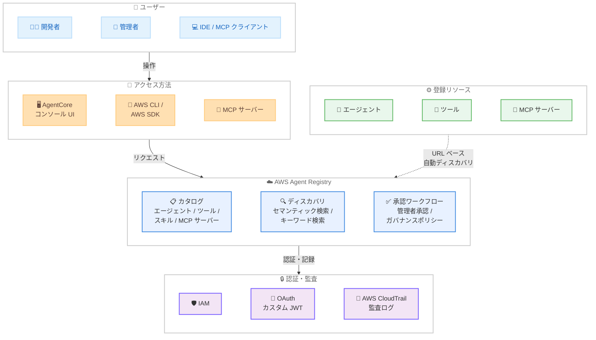

# Amazon Bedrock AgentCore - AWS Agent Registry のプレビュー提供開始

**リリース日**: 2026 年 4 月 9 日
**サービス**: Amazon Bedrock AgentCore
**機能**: AWS Agent Registry for centralized agent discovery and governance

📊 [このアップデートのインフォグラフィックを見る](https://takech9203.github.io/aws-news-summary/20260409-aws-agent-registry-in-agentcore-preview.html)

## 概要

AWS Agent Registry が Amazon Bedrock AgentCore を通じてプレビューとして提供開始されました。これは組織内のエージェント、ツール、スキル、MCP サーバー、カスタムリソースを一元管理するためのプライベートなガバナンス付きカタログおよびディスカバリレイヤーです。チームは自社の AI 環境全体を可視化し、既存のエージェントやツールを発見して再利用することで、重複した開発を回避できます。

Agent Registry は AgentCore コンソール UI、API (AWS CLI、AWS SDK)、または IDE から直接クエリや呼び出しが可能な MCP サーバーとしてアクセスできます。IAM および OAuth (カスタム JWT) ベースのアクセスをサポートしており、手動登録に加えて URL ベースのディスカバリ機能により、MCP サーバーやエージェントエンドポイントからツールスキーマや機能説明などのメタデータを自動取得できます。

主な対象ユーザーは、組織内で複数の AI エージェントやツールを構築・管理するプラットフォームチーム、AI ガバナンスを推進する管理者、および既存のエージェント資産を効率的に再利用したい開発者です。

**アップデート前の課題**

- 組織内で構築されたエージェント、ツール、MCP サーバーの一覧を把握する統一的な手段がなく、各チームが独自に同様の機能を重複開発していた
- エージェントやツールの登録・承認・公開に関するガバナンスワークフローが標準化されておらず、管理が属人化していた
- 開発者が必要なエージェントやツールを探す際に自然言語で検索する手段がなく、発見コストが高かった

**アップデート後の改善**

- 組織全体の AI 資産 (エージェント、ツール、スキル、MCP サーバー) を一元的に登録・管理し、完全な可視性が得られるようになった
- 承認ワークフローと既存のガバナンスポリシーとの統合により、エージェント公開前の品質管理とコンプライアンス確認が標準化された
- セマンティック検索とキーワード検索の両方に対応し、開発者はユースケースを自然言語で記述するだけで適切なエージェントやツールを発見できるようになった

## アーキテクチャ図



開発者や管理者がコンソール、CLI/SDK、MCP サーバー経由で Agent Registry にアクセスし、エージェントやツールの登録・検索・承認を行うフローを示しています。外部リソースは URL ベースの自動ディスカバリでメタデータが取得されます。

## サービスアップデートの詳細

### 主要機能

1. **一元カタログ管理**
   - エージェント、ツール、スキル、MCP サーバー、カスタムリソースを組織内のプライベートカタログに登録
   - 手動登録 (コンソールまたは API) と URL ベースの自動ディスカバリの 2 つの登録方法をサポート
   - URL ベースディスカバリでは、ライブの MCP サーバーやエージェントエンドポイントからツールスキーマや機能説明を自動取得

2. **セマンティック検索とキーワード検索**
   - ユースケースを自然言語で記述してエージェントやツールを検索可能
   - キーワード検索との併用で、名称や属性による正確な検索にも対応
   - 開発者は必要な機能を持つ既存リソースを素早く発見し、重複開発を回避

3. **承認ワークフローとガバナンス**
   - リソースが検索可能になる前に管理者による承認プロセスを経由
   - 既存の承認ワークフローへのプラグインが可能で、組織固有のガバナンスポリシーを適用
   - AWS CloudTrail による全レジストリアクセスおよび管理操作の完全な監査証跡

4. **柔軟なアクセス方法**
   - AgentCore コンソール UI でのブラウザベースの操作
   - AWS CLI / AWS SDK によるプログラマティックアクセス
   - MCP サーバーとして IDE から直接クエリ・呼び出しが可能

5. **マルチ認証サポート**
   - IAM ベースのアクセス制御
   - OAuth (カスタム JWT) ベースのアクセス制御
   - 組織の既存認証基盤との柔軟な統合

## 技術仕様

### リソース登録方法

| 登録方法 | 詳細 |
|----------|------|
| 手動登録 (コンソール) | AgentCore コンソール UI からリソース情報を入力して登録 |
| 手動登録 (API) | AWS CLI / SDK を使用してプログラマティックに登録 |
| URL ベースディスカバリ | MCP サーバーやエージェントエンドポイントの URL を指定し、メタデータを自動取得 |

### 検索機能

| 検索タイプ | 詳細 |
|------------|------|
| セマンティック検索 | ユースケースの自然言語記述によるエージェント・ツールの発見 |
| キーワード検索 | 名称、属性、タグなどによる正確な検索 |

### 認証方式

| 認証方式 | 詳細 |
|----------|------|
| IAM | AWS Identity and Access Management による標準的なアクセス制御 |
| OAuth | カスタム JWT ベースの認証。外部 IdP との統合に対応 |

### API 変更履歴

| 日付 | サービス | 変更内容 |
|------|----------|----------|
| 2026/04/07 | [Amazon Bedrock AgentCore](https://awsapichanges.com/archive/changes/0db175-bedrock-agentcore.html) | 1 new api method - InvokeBrowser API 追加 (関連する AgentCore 機能拡張) |

### MCP サーバーとしてのアクセス例

```json
{
    "mcpServers": {
        "aws-agent-registry": {
            "command": "aws",
            "args": [
                "bedrock-agentcore",
                "mcp-server",
                "--registry"
            ]
        }
    }
}
```

## 設定方法

### 前提条件

1. AWS アカウントで Amazon Bedrock AgentCore が有効化されていること
2. Agent Registry のプレビューアクセスが付与されていること
3. 適切な IAM ポリシーで Agent Registry 関連のアクションが許可されていること

### 手順

#### ステップ 1: IAM ポリシーの設定

```json
{
    "Version": "2012-10-17",
    "Statement": [
        {
            "Effect": "Allow",
            "Action": [
                "bedrock-agentcore:RegisterResource",
                "bedrock-agentcore:SearchRegistry",
                "bedrock-agentcore:ApproveResource",
                "bedrock-agentcore:ListRegistryResources"
            ],
            "Resource": "*"
        }
    ]
}
```

Agent Registry の操作に必要な IAM ポリシーを設定します。管理者には承認関連のアクション、開発者には検索・参照関連のアクションを付与することを推奨します。

#### ステップ 2: リソースの登録

```bash
# AWS CLI を使用したエージェントの手動登録
aws bedrock-agentcore register-resource \
    --resource-type AGENT \
    --name "customer-support-agent" \
    --description "Customer support automation agent with FAQ handling" \
    --metadata '{"team": "support", "version": "1.0"}'
```

エージェントやツールを Agent Registry に登録します。`resource-type` でリソースの種別を指定し、`description` にユースケースを記述することでセマンティック検索の精度が向上します。

#### ステップ 3: URL ベースの自動ディスカバリ

```bash
# MCP サーバーの URL を指定して自動ディスカバリ
aws bedrock-agentcore discover-resource \
    --endpoint-url "https://mcp-server.example.com" \
    --resource-type MCP_SERVER
```

ライブの MCP サーバーやエージェントエンドポイントの URL を指定すると、ツールスキーマや機能説明などのメタデータが自動的に取得され、レジストリに登録されます。

#### ステップ 4: リソースの検索

```bash
# セマンティック検索で関連エージェントを発見
aws bedrock-agentcore search-registry \
    --query "customer support FAQ handling" \
    --search-type SEMANTIC
```

自然言語でユースケースを記述し、関連するエージェントやツールを検索します。セマンティック検索により、完全一致でなくても意味的に関連するリソースが検索結果に含まれます。

## メリット

### ビジネス面

- **重複開発の回避**: 既存のエージェントやツールを容易に発見できるため、類似機能の重複開発によるコスト増加を防止できる
- **AI ガバナンスの強化**: 承認ワークフローと CloudTrail 監査ログにより、組織内の AI 資産の管理とコンプライアンスを確実に実施できる
- **チーム間連携の促進**: 他チームが構築したエージェントやツールを発見・再利用でき、組織全体の AI 活用の成熟度を加速できる

### 技術面

- **MCP サーバーとしての統合**: IDE から直接レジストリをクエリ・呼び出しでき、開発ワークフローにシームレスに組み込める
- **自動メタデータ取得**: URL ベースディスカバリにより、MCP サーバーやエージェントエンドポイントのスキーマ情報を手動入力なしで取得できる
- **柔軟な認証基盤**: IAM と OAuth の両方をサポートし、組織の既存認証基盤に合わせた統合が可能

## デメリット・制約事項

### 制限事項

- 現在はプレビュー段階であり、本番ワークロードへの適用は推奨されない
- 利用可能リージョンが 5 リージョンに限定されている
- プレビュー段階のため、API や機能が一般提供 (GA) 時に変更される可能性がある

### 考慮すべき点

- 組織内のエージェント・ツール資産の棚卸しと登録作業の初期コストが必要
- 承認ワークフローの設計と既存ガバナンスプロセスとの統合には組織横断的な調整が求められる
- セマンティック検索の精度はリソース登録時の説明文の品質に依存するため、記述ルールの標準化が望ましい

## ユースケース

### ユースケース 1: エンタープライズ AI プラットフォーム管理

**シナリオ**: 大規模企業で複数のチームがそれぞれ AI エージェントやツールを構築しており、プラットフォームチームが組織全体の AI 資産を一元管理したい場合。

**実装例**:
```bash
# 各チームのエージェントを一括登録
aws bedrock-agentcore discover-resource \
    --endpoint-url "https://team-a-mcp.internal.example.com" \
    --resource-type MCP_SERVER

aws bedrock-agentcore discover-resource \
    --endpoint-url "https://team-b-agent.internal.example.com" \
    --resource-type AGENT

# 全登録リソースの一覧取得
aws bedrock-agentcore list-registry-resources \
    --status APPROVED
```

**効果**: 組織全体の AI 資産の完全な可視性が得られ、重複投資の発見と再利用機会の特定が可能になる。

### ユースケース 2: 開発者の生産性向上

**シナリオ**: 新しい AI エージェントの開発時に、既存のツールやスキルを IDE から直接検索・再利用し、開発速度を向上させたい場合。

**実装例**:
```json
{
    "mcpServers": {
        "aws-agent-registry": {
            "command": "aws",
            "args": [
                "bedrock-agentcore",
                "mcp-server",
                "--registry"
            ]
        }
    }
}
```

**効果**: 開発者は IDE を離れることなく組織内の既存エージェントやツールを検索・呼び出しでき、既存資産を活用した迅速な開発が可能になる。

### ユースケース 3: コンプライアンスとガバナンスの自動化

**シナリオ**: 金融や医療などの規制産業で、AI エージェントの本番デプロイ前にセキュリティレビューとコンプライアンス承認を必須とするワークフローを構築する場合。

**実装例**:
```bash
# リソースの登録 (承認待ち状態)
aws bedrock-agentcore register-resource \
    --resource-type AGENT \
    --name "financial-advisor-agent" \
    --description "Investment recommendation agent for retail banking" \
    --metadata '{"compliance-review": "required", "data-classification": "confidential"}'

# 管理者による承認
aws bedrock-agentcore approve-resource \
    --resource-id "agent-12345" \
    --approval-notes "Security review completed. Approved for production."
```

**効果**: AI エージェントの公開に承認プロセスが強制され、CloudTrail による監査証跡と組み合わせて規制要件への準拠を証明できる。

## 料金

Agent Registry はプレビュー段階であり、プレビュー期間中の料金体系は公式に発表されていません。Amazon Bedrock AgentCore の料金体系に準拠する形で提供される見込みです。

### 料金例

| 使用量 | 月額料金 (概算) |
|--------|------------------|
| プレビュー期間中 | 料金の詳細は公式発表を参照 |

詳細な料金情報は [Amazon Bedrock AgentCore の料金ページ](https://aws.amazon.com/bedrock/agentcore/pricing/)を参照してください。

## 利用可能リージョン

以下の 5 リージョンで利用可能です (AgentCore が利用可能なリージョン)。

| リージョン | リージョンコード |
|------------|------------------|
| 米国西部 (オレゴン) | us-west-2 |
| 米国東部 (バージニア北部) | us-east-1 |
| アジアパシフィック (東京) | ap-northeast-1 |
| アジアパシフィック (シドニー) | ap-southeast-2 |
| 欧州 (アイルランド) | eu-west-1 |

## 関連サービス・機能

- **Amazon Bedrock AgentCore**: AI エージェントの構築・デプロイ・管理を行うフルマネージドサービス。Agent Registry は AgentCore の構成要素として提供される
- **Amazon Bedrock**: 基盤モデルへのアクセスを提供するサービス。Agent Registry で管理されるエージェントの推論基盤として連携
- **AWS CloudTrail**: Agent Registry へのアクセスおよび管理操作の監査ログを提供し、コンプライアンスとセキュリティ監視を支援
- **AWS IAM**: Agent Registry のアクセス制御を担う認証・認可サービス。OAuth との併用も可能
- **MCP (Model Context Protocol)**: Agent Registry が MCP サーバーとして機能し、IDE からの直接アクセスや MCP サーバーの自動ディスカバリに対応

## 参考リンク

- 📊 [インフォグラフィック](https://takech9203.github.io/aws-news-summary/20260409-aws-agent-registry-in-agentcore-preview.html)
- [公式発表 (What's New)](https://aws.amazon.com/about-aws/whats-new/2026/04/aws-agent-registry-in-agentcore-preview/)
- [Amazon Bedrock AgentCore ドキュメント](https://docs.aws.amazon.com/bedrock/latest/userguide/agentcore.html)
- [料金ページ](https://aws.amazon.com/bedrock/agentcore/pricing/)

## まとめ

AWS Agent Registry は、組織内の AI エージェント・ツール資産を一元管理し、重複開発の回避とガバナンスの強化を実現する重要なサービスです。セマンティック検索による直感的なリソース発見、承認ワークフローによるガバナンス、MCP サーバーとしての IDE 統合など、エンタープライズ規模での AI 活用に不可欠な機能を備えています。プレビュー段階ではありますが、5 リージョンで利用可能であり、AI エージェントの管理と再利用を組織的に推進するための第一歩として評価・検証を開始することを推奨します。
