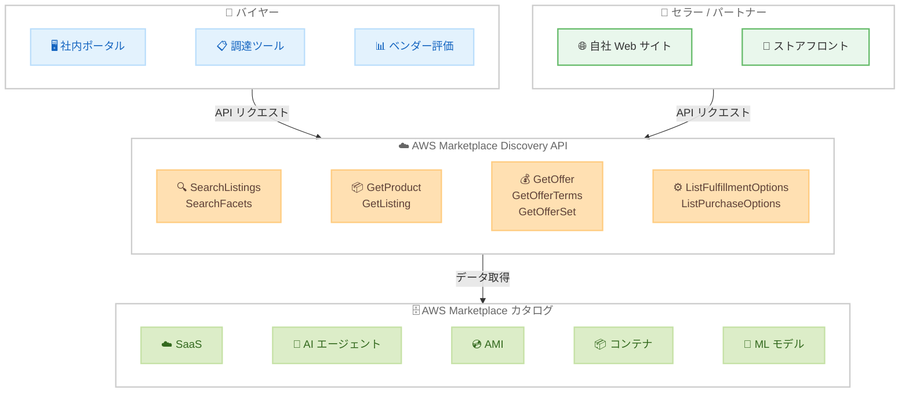

# AWS Marketplace - Discovery API

**リリース日**: 2026 年 4 月 9 日
**サービス**: AWS Marketplace
**機能**: Discovery API

📊 [このアップデートのインフォグラフィックを見る](https://takech9203.github.io/aws-news-summary/20260409-aws-marketplace-discovery-api.html)

## 概要

AWS Marketplace が Discovery API を発表しました。この API により、AWS Marketplace カタログ内の製品情報や価格情報にプログラムからアクセスできるようになります。対象となる製品タイプは SaaS、AI エージェントおよびツール、AMI、コンテナ、機械学習モデルなど、Marketplace で提供される幅広いカテゴリをカバーしています。

バイヤーは Discovery API を使用して、カタログデータを社内ポータルに組み込んだり、調達ツールに最新の価格情報やオファー条件を統合したり、ベンダー評価ワークフローを効率化したりできます。セラーやチャネルパートナーは、製品リスティング、パブリック価格、プライベートオファーの詳細を自社の Web サイトやストアフロントに直接表示でき、顧客がパートナーエクスペリエンスから離れることなく製品の閲覧、比較、購入に進むことが可能になります。

API は製品説明、カテゴリ、パブリックおよびプライベートオファーの価格、オファー条件へのアクセスを提供し、組織が AWS Marketplace を通じてソフトウェアを発見・調達する方法に合わせたカスタムエクスペリエンスを構築できます。

**アップデート前の課題**

- AWS Marketplace のカタログデータにプログラムからアクセスする統一的な手段がなく、手動でコンソールを参照する必要があった
- 社内の調達ポータルや評価ツールに Marketplace の最新価格情報をリアルタイムで統合することが困難だった
- セラーやチャネルパートナーが自社サイトに Marketplace の製品リスティングやプライベートオファー情報を組み込むための標準的な API が存在しなかった

**アップデート後の改善**

- 9 つの新しい API メソッドにより、製品検索、リスティング取得、オファー詳細、価格条件、フルフィルメントオプションなどにプログラムからアクセスが可能になった
- バイヤーは社内ツールに Marketplace データを統合し、調達ワークフローを自動化できるようになった
- セラーやパートナーは自社のストアフロントに Marketplace カタログ情報を直接埋め込み、シームレスな購入体験を提供できるようになった

## アーキテクチャ図



バイヤーとセラー / パートナーが Discovery API を通じて AWS Marketplace カタログにアクセスするフローを示しています。9 つの API メソッドを介して、製品検索からオファー条件の取得まで幅広いカタログデータへのアクセスが可能です。

## サービスアップデートの詳細

### 主要機能

1. **カタログ検索**
   - `SearchListings`: テキスト検索とフィルタリングにより Marketplace のリスティングを検索。カスタマー評価、カテゴリ、パブリッシャー、フルフィルメントタイプ、価格モデルなどでフィルタリング可能
   - `SearchFacets`: 検索結果のファセット (カテゴリ別件数、価格モデル別件数など) を取得し、フィルタリング UI の構築に活用可能
   - ソート順は `RELEVANCE` (関連度) と `AVERAGE_CUSTOMER_RATING` (平均評価) に対応

2. **製品詳細の取得**
   - `GetProduct`: 製品 ID を指定して製品説明、カテゴリ、ハイライト、プロモーションメディア、サポート情報などの詳細を取得
   - `GetListing`: リスティング ID を指定してリスティングの完全な情報 (価格モデル、バッジ、レビューサマリ、ユースケースなど) を取得
   - `ListFulfillmentOptions`: 製品 ID を指定して AMI、SaaS、コンテナ、Helm、EKS Add-on、SageMaker モデルなど各フルフィルメントタイプの詳細を取得

3. **オファーと価格情報**
   - `GetOffer`: オファー ID を指定してオファーの詳細 (価格モデル、セラー情報、有効期間、バッジなど) を取得
   - `GetOfferTerms`: オファーの価格条件 (使用量ベース、固定前払い、設定可能な前払い、無料トライアル、契約条件、支払いスケジュールなど) を取得
   - `GetOfferSet`: オファーセットの詳細を取得し、関連する製品とオファーの構成を把握

4. **購入オプションの一覧**
   - `ListPurchaseOptions`: 製品 ID、セラー ID、購入オプションタイプ、可視性スコープ、利用可否ステータスなどでフィルタリングした購入オプションを一覧表示
   - パブリックオファーとプライベートオファーの両方に対応
   - オファーおよびオファーセットの関連エンティティ情報を含む

## 技術仕様

### API メソッド一覧

| メソッド名 | 用途 | 主なパラメータ |
|------------|------|----------------|
| `SearchListings` | リスティング検索 | `searchText`、`filters`、`sortBy`、`maxResults` |
| `SearchFacets` | ファセット取得 | `searchText`、`filters`、`facetTypes` |
| `GetProduct` | 製品詳細取得 | `productId` |
| `GetListing` | リスティング詳細取得 | `listingId` |
| `GetOffer` | オファー詳細取得 | `offerId` |
| `GetOfferTerms` | オファー条件取得 | `offerId`、`maxResults` |
| `GetOfferSet` | オファーセット取得 | `offerSetId` |
| `ListFulfillmentOptions` | フルフィルメントオプション一覧 | `productId`、`maxResults` |
| `ListPurchaseOptions` | 購入オプション一覧 | `filters`、`maxResults` |

### サポートされるフィルタタイプ

| フィルタカテゴリ | 利用可能な値 |
|------------------|--------------|
| 検索フィルタ | `MIN_AVERAGE_CUSTOMER_RATING`、`MAX_AVERAGE_CUSTOMER_RATING`、`CATEGORY`、`PUBLISHER`、`FULFILLMENT_OPTION_TYPE`、`PRICING_MODEL`、`PRICING_UNIT`、`DEPLOYED_ON_AWS`、`NUMBER_OF_PRODUCTS` |
| 購入オプションフィルタ | `PRODUCT_ID`、`SELLER_OF_RECORD_PROFILE_ID`、`PURCHASE_OPTION_TYPE`、`VISIBILITY_SCOPE`、`AVAILABILITY_STATUS` |
| 価格モデル | `USAGE`、`CONTRACT`、`BYOL`、`FREE` |
| フルフィルメントタイプ | `AMAZON_MACHINE_IMAGE`、`API`、`CLOUDFORMATION_TEMPLATE`、`CONTAINER`、`HELM`、`EKS_ADD_ON`、`EC2_IMAGE_BUILDER_COMPONENT`、`DATA_EXCHANGE`、`PROFESSIONAL_SERVICES`、`SAAS`、`SAGEMAKER_ALGORITHM`、`SAGEMAKER_MODEL` |

### API 変更履歴

| 日付 | サービス | 変更内容 |
|------|----------|----------|
| 2026/04/08 | [AWS Marketplace Discovery](https://awsapichanges.com/archive/changes/d831a0-discovery-marketplace.html) | 9 new api methods - SearchListings、SearchFacets、GetProduct、GetListing、GetOffer、GetOfferTerms、GetOfferSet、ListFulfillmentOptions、ListPurchaseOptions |

### IAM ポリシー例

```json
{
    "Version": "2012-10-17",
    "Statement": [
        {
            "Effect": "Allow",
            "Action": [
                "discovery-marketplace:SearchListings",
                "discovery-marketplace:SearchFacets",
                "discovery-marketplace:GetProduct",
                "discovery-marketplace:GetListing",
                "discovery-marketplace:GetOffer",
                "discovery-marketplace:GetOfferTerms",
                "discovery-marketplace:GetOfferSet",
                "discovery-marketplace:ListFulfillmentOptions",
                "discovery-marketplace:ListPurchaseOptions"
            ],
            "Resource": "*"
        }
    ]
}
```

## 設定方法

### 前提条件

1. AWS アカウントを保有していること
2. AWS SDK (Boto3 など) がインストールされていること
3. IAM ユーザーまたはロールに Discovery API の実行権限が付与されていること

### 手順

#### ステップ 1: IAM 権限の設定

```bash
aws iam create-policy \
    --policy-name MarketplaceDiscoveryAPIAccess \
    --policy-document '{
        "Version": "2012-10-17",
        "Statement": [
            {
                "Effect": "Allow",
                "Action": "discovery-marketplace:*",
                "Resource": "*"
            }
        ]
    }'
```

Discovery API へのアクセスに必要な IAM ポリシーを作成します。本番環境では必要なアクションのみに権限を絞ることを推奨します。

#### ステップ 2: Marketplace のリスティングを検索

```python
import boto3

client = boto3.client('discovery-marketplace', region_name='us-east-1')

# テキスト検索でリスティングを検索
response = client.search_listings(
    searchText='machine learning',
    filters=[
        {
            'filterType': 'PRICING_MODEL',
            'filterValues': ['USAGE']
        }
    ],
    sortBy='RELEVANCE',
    maxResults=10
)

for listing in response['listingSummaries']:
    print(f"Name: {listing['listingName']}")
    print(f"Publisher: {listing['publisher']['displayName']}")
    print(f"Description: {listing['shortDescription']}")
    print("---")
```

`SearchListings` API を使用して、テキスト検索とフィルタリングにより Marketplace のリスティングを検索します。

#### ステップ 3: 製品の詳細情報とオファー条件を取得

```python
# 製品の詳細を取得
product = client.get_product(productId='prod-1234567890')
print(f"Product: {product['productName']}")
print(f"Description: {product['longDescription']}")

# オファーの詳細を取得
offer = client.get_offer(offerId='offer-1234567890')
print(f"Offer: {offer['offerName']}")
print(f"Pricing Model: {offer['pricingModel']['displayName']}")

# オファー条件を取得
terms = client.get_offer_terms(offerId='offer-1234567890')
for term in terms['offerTerms']:
    if 'usageBasedPricingTerm' in term:
        pricing = term['usageBasedPricingTerm']
        print(f"Currency: {pricing['currencyCode']}")
        for rate_card in pricing['rateCards']:
            for item in rate_card['rateCard']:
                print(f"  {item['displayName']}: {item['price']} / {item['unit']}")
```

`GetProduct` で製品詳細を取得し、`GetOffer` と `GetOfferTerms` でオファーの価格条件を確認します。

## メリット

### ビジネス面

- **調達プロセスの効率化**: カタログデータを社内ポータルや調達システムに統合することで、手動での Marketplace 検索・比較作業を削減し、ベンダー評価から購入決定までの時間を短縮できる
- **パートナーエクスペリエンスの向上**: セラーやチャネルパートナーが自社サイトに Marketplace の製品情報と価格を直接表示できるため、顧客が離脱することなくシームレスな購入体験を提供できる
- **データ駆動の意思決定**: プログラムから取得した最新の価格情報やオファー条件を分析・比較することで、より正確で迅速なソフトウェア調達の意思決定が可能になる

### 技術面

- **包括的な API 設計**: 9 つの API メソッドにより、検索、製品詳細、オファー条件、フルフィルメントオプション、購入オプションなどカタログの全領域をカバーしており、柔軟なカスタム統合が構築可能
- **豊富なフィルタリング機能**: カテゴリ、価格モデル、パブリッシャー、フルフィルメントタイプ、カスタマー評価など多彩なフィルタにより、精度の高い検索結果を取得できる
- **AWS SDK 対応**: 標準の AWS SDK を通じてアクセスでき、既存の AWS インフラストラクチャや認証メカニズムとの統合が容易

## デメリット・制約事項

### 制限事項

- 利用可能リージョンが US East (N. Virginia)、US West (Oregon)、Europe (Ireland) の 3 リージョンに限定されている
- API は読み取り専用であり、製品のサブスクリプションや購入処理の実行には対応していない
- ページネーションの `maxResults` パラメータによるレスポンスサイズの制限がある

### 考慮すべき点

- カタログデータのキャッシュ戦略を設計し、API 呼び出しの頻度とデータの鮮度のバランスを考慮する必要がある
- プライベートオファーの情報にアクセスするには、適切な IAM 権限とアカウント間の関連付けが必要になる場合がある
- API のレートリミットやスロットリングポリシーを確認し、大量リクエストを行う場合はバックオフ戦略を実装する必要がある

## ユースケース

### ユースケース 1: 社内ソフトウェアカタログポータル

**シナリオ**: 大規模な組織で、承認済みの AWS Marketplace 製品を社内ポータルに統合し、従業員がセルフサービスでソフトウェアを検索・比較・リクエストできる仕組みを構築する。

**実装例**:
```python
import boto3

client = boto3.client('discovery-marketplace', region_name='us-east-1')

# カテゴリ別にソフトウェアを検索
response = client.search_listings(
    searchText='security',
    filters=[
        {
            'filterType': 'CATEGORY',
            'filterValues': ['Security']
        },
        {
            'filterType': 'DEPLOYED_ON_AWS',
            'filterValues': ['DEPLOYED']
        }
    ],
    sortBy='AVERAGE_CUSTOMER_RATING',
    sortOrder='DESCENDING',
    maxResults=20
)

# ファセットを取得してフィルタリング UI を構築
facets = client.search_facets(
    searchText='security',
    facetTypes=['CATEGORY', 'PRICING_MODEL', 'FULFILLMENT_OPTION_TYPE']
)

for facet_type, values in facets['listingFacets'].items():
    print(f"\n{facet_type}:")
    for v in values:
        print(f"  {v['displayName']}: {v['count']} 件")
```

**効果**: 従業員が IT 部門を介さずに承認済みソフトウェアを自律的に検索・比較できるようになり、調達リードタイムが大幅に短縮される。

### ユースケース 2: チャネルパートナーのストアフロント統合

**シナリオ**: AWS パートナーが自社の Web サイトに AWS Marketplace の製品リスティングとプライベートオファー情報を埋め込み、顧客が自社サイト内で製品の閲覧から購入検討まで完結できるエクスペリエンスを構築する。

**実装例**:
```python
import boto3

client = boto3.client('discovery-marketplace', region_name='us-east-1')

# パートナーの製品リスティングを取得
listings = client.search_listings(
    filters=[
        {
            'filterType': 'PUBLISHER',
            'filterValues': ['partner-profile-id']
        }
    ],
    maxResults=50
)

# 各リスティングの詳細と購入オプションを取得
for listing in listings['listingSummaries']:
    detail = client.get_listing(listingId=listing['listingId'])

    # 購入オプションを一覧表示
    for entity in detail.get('associatedEntities', []):
        if 'product' in entity:
            options = client.list_purchase_options(
                filters=[
                    {
                        'filterType': 'PRODUCT_ID',
                        'filterValues': [entity['product']['productId']]
                    }
                ]
            )
            for opt in options['purchaseOptions']:
                print(f"  Option: {opt['purchaseOptionName']}")
                print(f"  Type: {opt['purchaseOptionType']}")
```

**効果**: 顧客がパートナーサイトから離脱することなく Marketplace 製品の詳細と価格を確認でき、コンバージョン率の向上とパートナーエクスペリエンスの差別化が実現する。

### ユースケース 3: 自動化された調達ワークフロー

**シナリオ**: エンタープライズの調達チームが、ベンダー評価プロセスにおいて複数の AWS Marketplace 製品の価格条件を自動的に比較・分析するワークフローを構築する。

**実装例**:
```python
import boto3

client = boto3.client('discovery-marketplace', region_name='us-east-1')

# 候補製品のオファー条件を一括取得して比較
candidate_offer_ids = ['offer-aaa', 'offer-bbb', 'offer-ccc']
comparison_data = []

for offer_id in candidate_offer_ids:
    offer = client.get_offer(offerId=offer_id)
    terms = client.get_offer_terms(offerId=offer_id)

    offer_summary = {
        'name': offer['offerName'],
        'pricing_model': offer['pricingModel']['pricingModelType'],
        'seller': offer['sellerOfRecord']['displayName'],
        'terms': []
    }

    for term in terms['offerTerms']:
        if 'usageBasedPricingTerm' in term:
            pricing = term['usageBasedPricingTerm']
            offer_summary['terms'].append({
                'type': 'usage_based',
                'currency': pricing['currencyCode'],
                'rates': [
                    {
                        'name': r['displayName'],
                        'price': r['price'],
                        'unit': r['unit']
                    }
                    for rc in pricing['rateCards']
                    for r in rc['rateCard']
                ]
            })

    comparison_data.append(offer_summary)

# 比較レポートを生成
for item in comparison_data:
    print(f"\n{item['name']} ({item['seller']})")
    print(f"  Pricing Model: {item['pricing_model']}")
    for term in item['terms']:
        for rate in term.get('rates', []):
            print(f"  {rate['name']}: {rate['price']} / {rate['unit']}")
```

**効果**: 手動での価格比較作業が不要になり、複数ベンダーのオファー条件を一貫した基準で自動比較することで、調達の透明性と効率性が向上する。

## 料金

Discovery API の料金に関する詳細は、公式発表時点では明示されていません。AWS Marketplace の標準的な API 利用料金に準拠する可能性があります。最新の料金情報については AWS Marketplace の料金ページを参照してください。

### 料金例

| 項目 | 詳細 |
|------|------|
| API 利用料金 | 公式発表時点で未公開。AWS Marketplace 料金ページで確認が必要 |
| Marketplace 製品の購入費用 | 各製品の価格条件に従い、Discovery API 自体の利用とは別途発生 |

## 利用可能リージョン

以下の 3 リージョンで利用可能です。

| リージョン | リージョンコード |
|------------|------------------|
| 米国東部 (バージニア北部) | us-east-1 |
| 米国西部 (オレゴン) | us-west-2 |
| 欧州 (アイルランド) | eu-west-1 |

## 関連サービス・機能

- **AWS Marketplace Catalog API**: カタログのエンティティ管理 (製品やオファーの作成・更新) を行う API。Discovery API は読み取り専用のアクセスに特化している点で補完的な関係にある
- **AWS Marketplace Agreement API**: Marketplace の契約情報を管理する API。Discovery API で取得したオファー情報と連携して、契約管理ワークフローを構築可能
- **AWS Marketplace Private Marketplace**: 組織で承認済みの製品カタログを管理する機能。Discovery API と組み合わせて、承認済み製品の検索・表示を自動化できる

## 参考リンク

- 📊 [インフォグラフィック](https://takech9203.github.io/aws-news-summary/20260409-aws-marketplace-discovery-api.html)
- [公式発表 (What's New)](https://aws.amazon.com/about-aws/whats-new/2026/04/aws-marketplace-discovery-api/)
- [AWS Marketplace Discovery API リファレンス](https://docs.aws.amazon.com/marketplace-discovery/latest/api-reference/)
- [AWS API Changes - Discovery API](https://awsapichanges.com/archive/changes/d831a0-discovery-marketplace.html)
- [AWS Marketplace ドキュメント](https://docs.aws.amazon.com/marketplace/)

## まとめ

AWS Marketplace Discovery API は、Marketplace カタログへのプログラマティックアクセスを実現する重要な新機能です。9 つの API メソッドにより、製品検索からオファー条件の取得まで包括的なカタログデータへのアクセスが可能になり、バイヤーの調達効率化とセラー / パートナーのカスタムストアフロント構築を支援します。まずは IAM 権限を設定し、AWS SDK を通じて API を呼び出すことで利用を開始できます。
