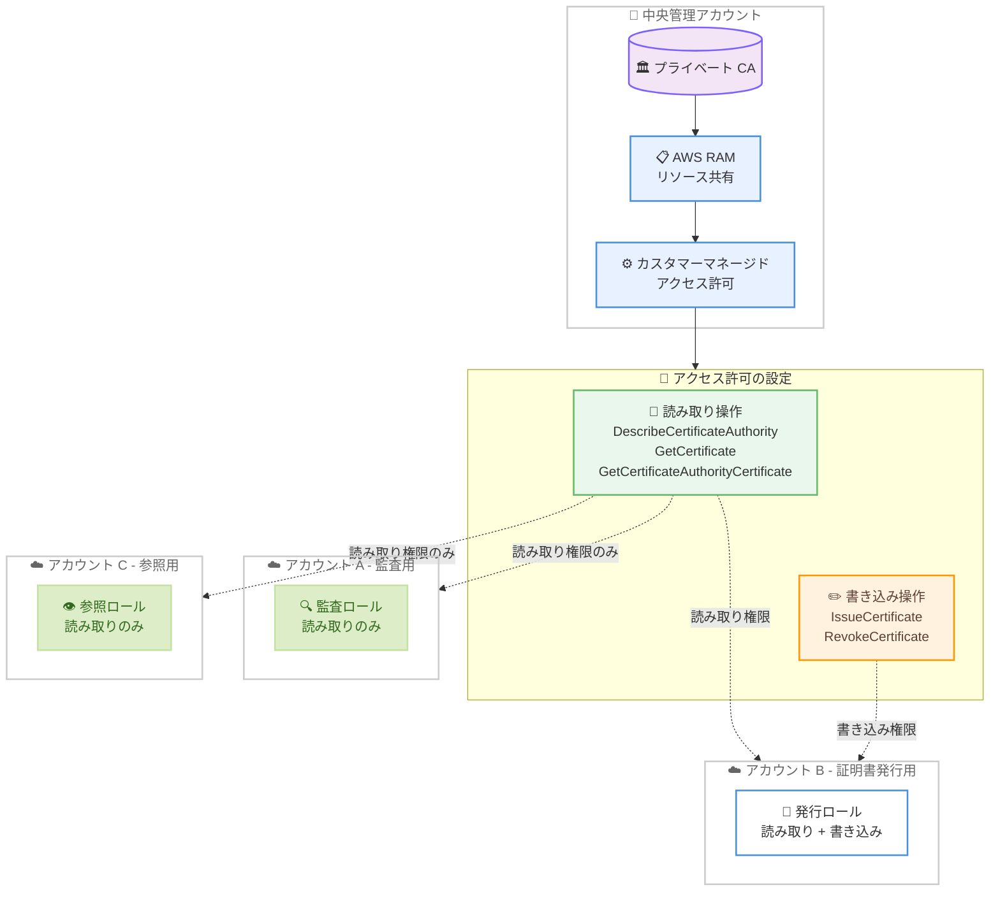

# AWS Private CA - AWS RAM カスタマーマネージドアクセス許可のサポート

**リリース日**: 2026 年 4 月 9 日
**サービス**: AWS Private Certificate Authority (AWS Private CA)
**機能**: Customer managed permissions for cross-account sharing via AWS RAM

📊 [このアップデートのインフォグラフィックを見る](https://takech9203.github.io/aws-news-summary/20260409-aws-private-ca-customer-managed-permissions.html)

## 概要

AWS Private Certificate Authority (AWS Private CA) が AWS Resource Access Manager (AWS RAM) のカスタマーマネージドアクセス許可をサポートしました。これにより、CA をクロスアカウントで共有する際に、許可する API オペレーションを個別に選択できるようになり、各利用アカウントに必要最小限の権限のみを付与する最小権限の原則に基づいたアクセス制御が可能になります。

AWS Private CA では、PKI (公開鍵基盤) を一元管理するために AWS RAM を使用して CA を複数のアカウント間で共有できます。従来は AWS マネージドアクセス許可のみが利用可能で、あらかじめ定義されたアクションのセットしか選択できず、クロスアカウントの証明書発行者は特定の証明書テンプレートに制限されていました。今回のアップデートにより、読み取り操作と書き込み操作を個別に選択して各利用アカウントや組織単位 (OU) に合わせたアクセス権限を構成でき、さらに証明書テンプレートの制限も解除されます。

主な対象ユーザーは、マルチアカウント環境で PKI を一元管理するセキュリティチーム、最小権限の原則を徹底する必要があるコンプライアンス担当者、および複数アカウントから証明書を発行する必要がある開発運用チームです。

**アップデート前の課題**

- AWS マネージドアクセス許可のみが利用可能で、あらかじめ定義されたアクションセットからしか選択できなかった
- クロスアカウントで証明書を発行する際、特定の証明書テンプレートに制限されていた
- 読み取り操作のみが必要なアカウントにも書き込み権限が含まれるなど、過剰な権限付与を避けることが困難だった

**アップデート後の改善**

- カスタマーマネージドアクセス許可により、読み取り操作 (DescribeCertificateAuthority、GetCertificate、GetCertificateAuthorityCertificate) と書き込み操作 (IssueCertificate、RevokeCertificate) を個別に選択可能になった
- クロスアカウントの証明書発行者が特定の証明書テンプレートに制限されなくなった
- 各利用アカウントや OU ごとに必要最小限の API オペレーションのみを許可する、きめ細かなアクセス制御が可能になった

## アーキテクチャ図



中央管理アカウントのプライベート CA を AWS RAM 経由で複数アカウントと共有する構成を示しています。カスタマーマネージドアクセス許可により、監査用アカウントには読み取りのみ、証明書発行用アカウントには読み取り + 書き込みといった、用途に応じたきめ細かな権限付与が可能です。

## サービスアップデートの詳細

### 主要機能

1. **カスタマーマネージドアクセス許可**
   - AWS RAM でリソース共有を作成する際に、許可する AWS Private CA API オペレーションを個別に選択可能
   - 読み取り操作と書き込み操作を組み合わせて、各利用アカウントの要件に合わせたカスタムアクセス許可を作成
   - AWS マネージドアクセス許可と並行して利用可能で、既存の共有設定への影響はなし

2. **読み取り操作の個別選択**
   - `DescribeCertificateAuthority`: CA の設定情報と状態を取得
   - `GetCertificate`: 発行済み証明書を取得
   - `GetCertificateAuthorityCertificate`: CA 証明書と証明書チェーンを取得

3. **書き込み操作の個別選択**
   - `IssueCertificate`: CA から新しい証明書を発行
   - `RevokeCertificate`: 発行済み証明書を失効

4. **証明書テンプレート制限の解除**
   - カスタマーマネージドアクセス許可を使用した場合、クロスアカウントの証明書発行者は特定の証明書テンプレートに制限されない
   - 利用アカウント側で任意のテンプレートを使用した証明書発行が可能

## 技術仕様

### AWS マネージドアクセス許可とカスタマーマネージドアクセス許可の比較

| 項目 | AWS マネージドアクセス許可 | カスタマーマネージドアクセス許可 |
|------|---------------------------|-------------------------------|
| アクション選択 | あらかじめ定義されたセットのみ | 個別の API オペレーションを自由に選択 |
| 証明書テンプレート制限 | 特定テンプレートに制限される | 制限なし |
| カスタマイズ性 | 低い | 高い |
| 管理負荷 | AWS が管理 | お客様が管理 |
| 最小権限の実現 | 制限あり | 容易に実現可能 |

### 選択可能な API オペレーション

| 操作カテゴリ | API オペレーション | 説明 |
|-------------|-------------------|------|
| 読み取り | DescribeCertificateAuthority | CA の設定情報と状態の取得 |
| 読み取り | GetCertificate | 発行済み証明書の取得 |
| 読み取り | GetCertificateAuthorityCertificate | CA 証明書と証明書チェーンの取得 |
| 書き込み | IssueCertificate | 証明書の発行 |
| 書き込み | RevokeCertificate | 証明書の失効 |

### API 変更履歴

今回のアップデートに直接関連する API 変更は、直近の AWS API Changes フィードでは確認されませんでした。カスタマーマネージドアクセス許可は AWS RAM 側の機能として提供されるため、AWS Private CA の API 自体に変更はありません。

### カスタマーマネージドアクセス許可の設定例

```json
{
    "name": "PrivateCA-ReadOnly-Permission",
    "resourceType": "acm-pca:CertificateAuthority",
    "policyTemplate": {
        "version": "1",
        "actions": [
            "acm-pca:DescribeCertificateAuthority",
            "acm-pca:GetCertificate",
            "acm-pca:GetCertificateAuthorityCertificate"
        ]
    }
}
```

## 設定方法

### 前提条件

1. 中央管理アカウントに AWS Private CA がセットアップ済みであること
2. AWS RAM が利用可能なリージョンであること
3. IAM ユーザーまたはロールに AWS RAM のリソース共有作成権限があること

### 手順

#### ステップ 1: カスタマーマネージドアクセス許可の作成

```bash
# 読み取り専用のカスタマーマネージドアクセス許可を作成
aws ram create-permission \
    --name "PrivateCA-ReadOnly" \
    --resource-type "acm-pca:CertificateAuthority" \
    --policy-template '{
        "version": "1",
        "actions": [
            "acm-pca:DescribeCertificateAuthority",
            "acm-pca:GetCertificate",
            "acm-pca:GetCertificateAuthorityCertificate"
        ]
    }'
```

AWS RAM で新しいカスタマーマネージドアクセス許可を作成します。この例では読み取り操作のみを許可するアクセス許可を定義しています。

#### ステップ 2: 証明書発行用のカスタマーマネージドアクセス許可の作成

```bash
# 読み取り + 書き込みのカスタマーマネージドアクセス許可を作成
aws ram create-permission \
    --name "PrivateCA-ReadWrite" \
    --resource-type "acm-pca:CertificateAuthority" \
    --policy-template '{
        "version": "1",
        "actions": [
            "acm-pca:DescribeCertificateAuthority",
            "acm-pca:GetCertificate",
            "acm-pca:GetCertificateAuthorityCertificate",
            "acm-pca:IssueCertificate",
            "acm-pca:RevokeCertificate"
        ]
    }'
```

証明書の発行と失効が必要なアカウント向けに、読み取り操作と書き込み操作の両方を含むアクセス許可を作成します。

#### ステップ 3: リソース共有の作成とアクセス許可の関連付け

```bash
# リソース共有を作成し、カスタマーマネージドアクセス許可を使用
aws ram create-resource-share \
    --name "PrivateCA-AuditShare" \
    --resource-arns "arn:aws:acm-pca:ap-northeast-1:123456789012:certificate-authority/abc-1234-def-5678" \
    --principals "123456789013" \
    --permission-arns "arn:aws:ram::123456789012:permission/PrivateCA-ReadOnly"
```

CA リソースを指定のアカウントと共有し、先ほど作成したカスタマーマネージドアクセス許可を関連付けます。監査用アカウントには読み取り専用のアクセス許可を、証明書発行用アカウントには読み取り + 書き込みのアクセス許可を割り当てることで、最小権限を実現します。

## メリット

### ビジネス面

- **セキュリティ体制の強化**: 各アカウントに必要最小限の権限のみを付与することで、最小権限の原則を徹底し、過剰な権限による意図しない操作のリスクを低減
- **コンプライアンス準拠の容易化**: 監査において「なぜその権限が付与されているか」を明確に説明でき、規制要件への準拠を実証しやすくなる
- **PKI 運用コストの削減**: 権限を細かく制御できることで、アカウントごとに個別の CA を作成する必要がなくなり、PKI の一元管理をより安全に推進できる

### 技術面

- **きめ細かなアクセス制御**: 5 つの API オペレーションを個別に選択でき、読み取り専用、読み取り + 発行、読み取り + 失効など、用途に応じた権限構成が可能
- **証明書テンプレート制限の解除**: カスタマーマネージドアクセス許可を使用した場合、クロスアカウント発行者はテンプレートの制限を受けず、柔軟な証明書発行が可能
- **既存環境との共存**: AWS マネージドアクセス許可と併用できるため、既存の共有設定に影響を与えることなく段階的に移行可能

## デメリット・制約事項

### 制限事項

- カスタマーマネージドアクセス許可はお客様自身が作成・管理する必要があり、AWS マネージドアクセス許可と比較して管理負荷が増加する
- 権限設計を誤ると、必要な操作がブロックされるリスクがあるため、事前の権限設計とテストが重要
- AWS RAM のカスタマーマネージドアクセス許可に関する AWS RAM のクォータ (制限) が適用される

### 考慮すべき点

- 既存の AWS マネージドアクセス許可からカスタマーマネージドアクセス許可への移行は計画的に実施する必要がある
- 複数のアクセス許可パターンが増えると管理が複雑化するため、命名規則とドキュメント化の標準を策定することを推奨
- Organizations の OU 単位での共有時は、OU に属するすべてのアカウントに同一のアクセス許可が適用される点に留意が必要

## ユースケース

### ユースケース 1: マルチアカウント環境での監査と発行の分離

**シナリオ**: セキュリティチームが管理する中央アカウントで CA を運用し、監査チームには証明書の参照のみ、開発チームには証明書の発行のみを許可したい場合。

**実装例**:
```bash
# 監査チーム用: 読み取り専用アクセス
aws ram create-permission \
    --name "PrivateCA-AuditReadOnly" \
    --resource-type "acm-pca:CertificateAuthority" \
    --policy-template '{
        "version": "1",
        "actions": [
            "acm-pca:DescribeCertificateAuthority",
            "acm-pca:GetCertificate",
            "acm-pca:GetCertificateAuthorityCertificate"
        ]
    }'

# 開発チーム用: 発行権限付きアクセス
aws ram create-permission \
    --name "PrivateCA-DevIssue" \
    --resource-type "acm-pca:CertificateAuthority" \
    --policy-template '{
        "version": "1",
        "actions": [
            "acm-pca:DescribeCertificateAuthority",
            "acm-pca:GetCertificate",
            "acm-pca:GetCertificateAuthorityCertificate",
            "acm-pca:IssueCertificate"
        ]
    }'
```

**効果**: 監査チームは証明書発行の能力を持たず、開発チームは証明書の失効ができないため、各チームの責務に合致した最小権限の原則が徹底される。

### ユースケース 2: 組織単位ごとの段階的な権限付与

**シナリオ**: AWS Organizations の OU 構成に合わせて、本番環境 OU には発行 + 失効権限、ステージング環境 OU には発行のみ、開発環境 OU には読み取りのみを付与したい場合。

**実装例**:
```bash
# 本番環境 OU 向け: フル権限
aws ram create-resource-share \
    --name "PrivateCA-Production" \
    --resource-arns "arn:aws:acm-pca:ap-northeast-1:123456789012:certificate-authority/abc-1234" \
    --principals "arn:aws:organizations::123456789012:ou/o-example/ou-prod-1234" \
    --permission-arns "arn:aws:ram::123456789012:permission/PrivateCA-ReadWrite"

# 開発環境 OU 向け: 読み取りのみ
aws ram create-resource-share \
    --name "PrivateCA-Development" \
    --resource-arns "arn:aws:acm-pca:ap-northeast-1:123456789012:certificate-authority/abc-1234" \
    --principals "arn:aws:organizations::123456789012:ou/o-example/ou-dev-5678" \
    --permission-arns "arn:aws:ram::123456789012:permission/PrivateCA-ReadOnly"
```

**効果**: 環境ごとのリスクレベルに応じた権限付与が実現でき、開発環境からの誤った証明書発行や本番証明書の意図しない失効を防止できる。

### ユースケース 3: 証明書テンプレート制限なしのクロスアカウント発行

**シナリオ**: アプリケーションチームが独自のカスタム証明書テンプレートを使用してクロスアカウントで証明書を発行する必要がある場合。従来の AWS マネージドアクセス許可ではテンプレートが制限されていた。

**実装例**:
```bash
# カスタマーマネージドアクセス許可でテンプレート制限なしの発行権限を付与
aws ram create-permission \
    --name "PrivateCA-FlexibleIssue" \
    --resource-type "acm-pca:CertificateAuthority" \
    --policy-template '{
        "version": "1",
        "actions": [
            "acm-pca:DescribeCertificateAuthority",
            "acm-pca:GetCertificate",
            "acm-pca:IssueCertificate"
        ]
    }'
```

**効果**: アプリケーションチームは任意の証明書テンプレートを使用でき、カスタムの証明書プロファイル (例: 短い有効期限、特定の拡張キー使用法) を自由に適用できる。

## 料金

AWS Private CA のカスタマーマネージドアクセス許可の利用に追加料金は発生しません。AWS Private CA の既存の料金体系が適用されます。

### 料金例

| 項目 | 月額料金 (概算) |
|------|------------------|
| プライベート CA 運用 (汎用モード) | $400/月/CA |
| プライベート CA 運用 (有効期間の短い証明書モード) | $50/月/CA |
| 証明書発行 (1 - 1,000 枚/月) | $0.75/枚 |
| 証明書発行 (1,001 - 10,000 枚/月) | $0.35/枚 |
| AWS RAM リソース共有 | 追加料金なし |

詳細な料金情報は [AWS Private CA の料金ページ](https://aws.amazon.com/private-ca/pricing/)を参照してください。

## 利用可能リージョン

AWS Private CA と AWS RAM の両方が利用可能なすべての AWS リージョンで利用できます。東京リージョン (ap-northeast-1) を含む主要リージョンで利用可能です。

## 関連サービス・機能

- **AWS Resource Access Manager (AWS RAM)**: リソースのクロスアカウント共有を実現するサービス。カスタマーマネージドアクセス許可はこの RAM の機能として提供される
- **AWS Private Certificate Authority (AWS Private CA)**: プライベート証明書の発行と管理を行うマネージドサービス。今回のアップデートの対象サービス
- **AWS Certificate Manager (ACM)**: パブリック証明書とプライベート証明書の管理を行うサービス。AWS Private CA と連携してプライベート証明書のプロビジョニングを自動化
- **AWS Organizations**: マルチアカウント管理サービス。AWS RAM と連携して OU 単位でのリソース共有に対応
- **AWS IAM**: アクセス制御サービス。AWS RAM のカスタマーマネージドアクセス許可と組み合わせて、多層的なアクセス制御を実現

## 参考リンク

- 📊 [インフォグラフィック](https://takech9203.github.io/aws-news-summary/20260409-aws-private-ca-customer-managed-permissions.html)
- [公式発表 (What's New)](https://aws.amazon.com/about-aws/whats-new/2026/04/aws-private-ca-customer-managed-permissions/)
- [AWS Private CA ドキュメント](https://docs.aws.amazon.com/privateca/latest/userguide/)
- [AWS RAM カスタマーマネージドアクセス許可ドキュメント](https://docs.aws.amazon.com/ram/latest/userguide/security-ram-permissions.html)
- [料金ページ](https://aws.amazon.com/private-ca/pricing/)

## まとめ

AWS Private CA がカスタマーマネージドアクセス許可をサポートしたことで、マルチアカウント環境における PKI のクロスアカウント共有で最小権限の原則を徹底できるようになりました。読み取り操作と書き込み操作を個別に選択でき、証明書テンプレートの制限も解除されるため、各利用アカウントの役割に応じたきめ細かなアクセス制御が実現します。既存の AWS マネージドアクセス許可と併用できるため、まずは新規の共有設定からカスタマーマネージドアクセス許可を導入し、段階的に移行を進めることを推奨します。
